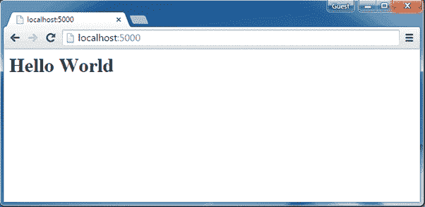
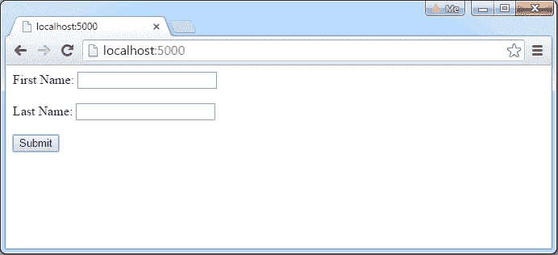
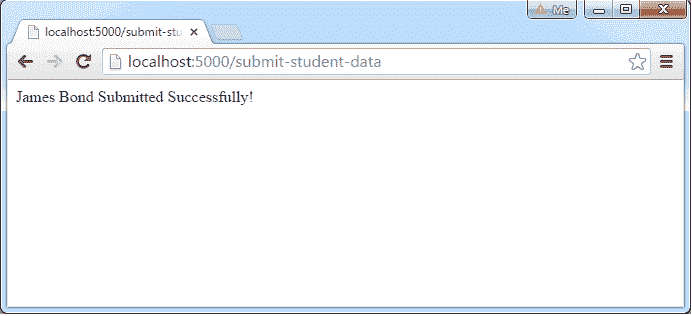

# 网络应用

> 哎哎哎:# t0]https://www . tutorial connector . com/nodejs/expressjs-web-application

在本节中，您将学习如何使用 Express.js 创建 web 应用

通过为应用配置路由，Express.js 提供了一种创建 web 服务器和为不同的 HTTP 请求呈现 HTML 页面的简单方法。

## 网络服务器

首先，导入 Express.js 模块，创建如下所示的 web 服务器。

app.js: Express.js Web Server 

```
var express = require('express');
var app = express();

// define routes here..

var server = app.listen(5000, function () {
    console.log('Node server is running..');
}); 
```

在上面的例子中，我们使用 require()函数导入了 Express.js 模块。快速模块返回一个函数。该函数返回一个可用于配置 Express 应用(上例中的 app)的对象。

app 对象包括路由 HTTP 请求、配置中间件、呈现 HTML 视图和注册模板引擎的方法。

函数的作用是:在指定的主机和端口上创建 Node.js 网络服务器。它和 Node 的 http 是一样的。Server.listen()方法。

使用`node app.js`命令运行上述示例，并将浏览器指向 *http://localhost:5000* 。它将显示**无法获取/** ，因为我们尚未配置任何路由。

## 配置路由

使用应用对象定义应用的不同路线。app 对象包括 get()，post()，put()和 delete()方法，分别为 HTTP GET，POST，PUT 和 DELETE 请求定义路由。

下面的示例演示了如何为 HTTP 请求配置路由。

Example: Configure Routes in Express.js 

```
var express = require('express');
var app = express();

app.get('/', function (req, res) {
    res.send('<html><body><h1>Hello World</h1></body></html>');
});

app.post('/submit-data', function (req, res) {
    res.send('POST Request');
});

app.put('/update-data', function (req, res) {
    res.send('PUT Request');
});

app.delete('/delete-data', function (req, res) {
    res.send('DELETE Request');
});

var server = app.listen(5000, function () {
    console.log('Node server is running..');
}); 
```

在上例中，app.get()、app.post()、app.put()和 app.delete()方法分别为 HTTP GET、post、put、delete 定义了路由。第一个参数是将在基本网址之后开始的路线的路径。回调函数包括[请求](https://expressjs.com/4x/api.html#req)和[响应](https://expressjs.com/4x/api.html#res)对象，它们将在每个请求上执行。

使用`node server.js`命令运行上面的例子，将浏览器指向 *http://localhost:5000* ，会看到下面的结果。

[](../../Content/images/nodejs/expressjs-webapp1.png)

Express.js Web Application


## 处理开机自检请求

在这里，您将学习如何处理 HTTP POST 请求并从提交的表单中获取数据。

首先，在应用的根文件夹中创建 Index.html 文件，并在其中编写以下 HTML 代码。

Example: Configure Routes in Express.js 

```
<!DOCTYPE html>

<html xmlns="http://www.w3.org/1999/xhtml">
<head>
    <meta charset="utf-8" />
    <title></title>
</head>
<body>
    <form action="/submit-student-data" method="post">
        First Name: <input name="firstName" type="text" /> <br />
        Last Name: <input name="lastName" type="text" /> <br />
        <input type="submit" />
    </form>
</body>
</html> 
```

### 正文分析器

要处理 Express.js 版本 4 及以上的 HTTP POST 请求，需要安装名为 [body-parser](https://github.com/expressjs/body-parser) 的中间件模块。中间件以前是 Express.js 的一部分，但是现在您必须单独安装它。

这个主体解析器模块解析使用 HTTP POST 请求提交的 JSON、缓冲区、字符串和 url 编码的数据。使用 NPM 安装主体解析器，如下所示。

<samp>npm install body-parser --save</samp>

现在，导入 body-parser 并获取 POST 请求数据，如下所示。

app.js: Handle POST Route in Express.js 

```
var express = require('express');
var app = express();

var bodyParser = require("body-parser");
app.use(bodyParser.urlencoded({ extended: false }));

app.get('/', function (req, res) {
    res.sendFile('index.html');
});

app.post('/submit-student-data', function (req, res) {
    var name = req.body.firstName + ' ' + req.body.lastName;

    res.send(name + ' Submitted Successfully!');
});

var server = app.listen(5000, function () {
    console.log('Node server is running..');
}); 
```

在上面的例子中，可以使用 req.body 访问 POST 数据。req.body 是一个对象，它包含每个提交表单的属性。Index.html 包含名字和姓氏输入类型，因此您可以使用 req.body.firstName 和 req.body.lastName 访问它。

现在，使用`node server.js`命令运行上面的示例，将浏览器指向 *http://localhost:5000* 并查看以下结果。

[](../../Content/images/nodejs/expressjs-post-request1.png)

HTML Form to submit POST request


填写上例中的名和姓，点击**提交**。例如，在“名字”文本框中输入“詹姆斯”，在“姓氏”文本框中输入“邦德”，然后单击提交按钮。将显示以下结果。

[](../../Content/images/nodejs/expressjs-post-data.png)

Response from POST request


这就是如何使用 Express.js 处理 HTTP 请求的方法****