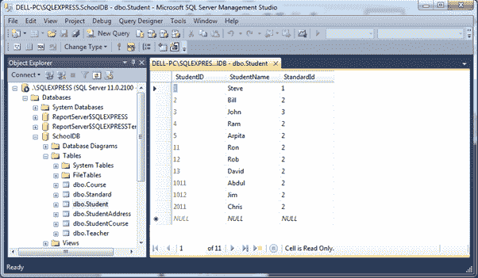
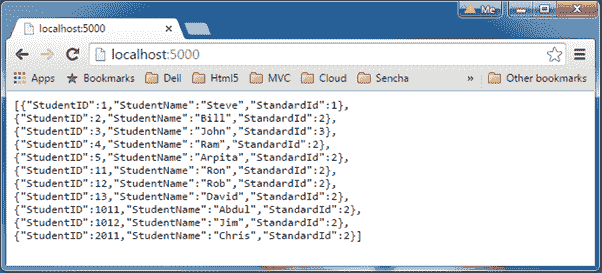

# 在 NodeJS 中访问 SQL Server

> 原文：<https://www.tutorialsteacher.com/nodejs/access-sql-server-in-nodejs>

本节学习如何使用 Express.js 在 Node.js 应用中访问关系数据库 MS SQL Server 2012。

为了访问 MS SQL 数据库，我们需要为其安装驱动程序。在 NPM，有许多驱动程序可用于 SQL server。我们这里将使用 [mssql](https://www.npmjs.com/package/mssql) 驱动程序。

# 安装驱动程序

使用 npm 命令安装 mssql 驱动程序，在命令提示符下选择 **`npm install mssql`** 。这将在 Node.js 应用的 node_modules 文件夹中添加 mssql 模块文件夹。本教程使用 mssql v2.3.1，这是截至目前的最新版本。

安装驱动程序后，我们就可以访问 MS SQL server 数据库了。我们将连接到一个本地的 SQLExpress 数据库服务器，并从如下所示的 SchoolDB 数据库的 Student 表中获取所有记录。

[](../../Content/images/nodejs/nodejs-sqlserver2.png)

Database Table


现在，创建 server.js 并编写以下代码。

Server.js 

```
var express = require('express');
var app = express();

app.get('/', function (req, res) {

    var sql = require("mssql");

    // config for your database
    var config = {
        user: 'sa',
        password: 'mypassword',
        server: 'localhost', 
        database: 'SchoolDB' 
    };

    // connect to your database
    sql.connect(config, function (err) {

        if (err) console.log(err);

        // create Request object
        var request = new sql.Request();

        // query to the database and get the records
        request.query('select * from Student', function (err, recordset) {

            if (err) console.log(err)

            // send records as a response
            res.send(recordset);

        });
    });
});

var server = app.listen(5000, function () {
    console.log('Server is running..');
}); 
```

在上面的例子中，我们已经导入了 mssql 模块，并调用了 connect()方法来连接我们的 SchoolDB 数据库。我们已经传递了配置对象，其中包括数据库信息，如用户名，密码，数据库服务器和数据库名称。成功连接数据库后，使用 sql.request 对象对任何数据库表执行查询并获取记录。

使用`node server.js`命令运行上述示例，并将浏览器指向 *http://localhost:5000* ，它显示学生表中所有学生的数组。

[](../../Content/images/nodejs/nodejs-sqlserver3.png)

Access SQL Server from Node.js


因此，您可以使用 MS SQL 模块访问 MS SQL Server 数据库并执行查询。访问 [npm 文档](https://www.npmjs.com/package/mssql)了解更多关于 mssql 的信息。

下一节学习如何在 Node.js 中访问 MongoDB。*