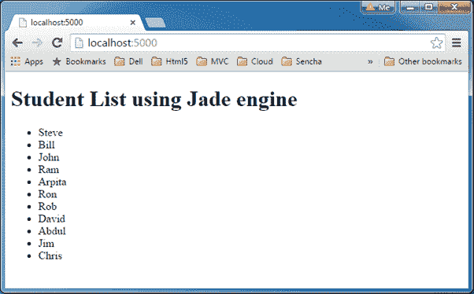

# 玉石模板引擎

> 原文:[https://www . tutorial stearn . com/nodejs/jade-template-engine](https://www.tutorialsteacher.com/nodejs/jade-template-engine)

在本节中，您将学习如何使用 Express.js 在 Node.js 应用程序中使用 Jade 模板引擎

[Jade](http://jade-lang.com/) 是 Node.js 的模板引擎，Jade 语法简单易学。它使用空白和缩进作为语法的一部分。

使用 NPM 将 jade 安装到您的项目中，如下所示。

<samp>npm install jade</samp>

玉石模板一定要写在里面。翡翠档案。以及所有。jade 文件必须放在 Node.js 应用程序根文件夹中的**视图**文件夹中。

*Note:**By default Express.js searches all the views in the views folder under the root folder, which can be set to another folder using views property in express e.g. app.set('views','MyViews').* *下面是一个简单的玉石模板。

Example: Simple Jade Template<button class="copy-btn pull-right" title="Copy example code">*Copy*</button> *```
doctype html
html
    head
        title Jade Page
    body
        h1 This page is produced by Jade engine
        p some paragraph here.. 
```

上面的例子将产生以下 html。

Example: HTML Generated from Above Example<button class="copy-btn pull-right" title="Copy example code">*Copy*</button> *```
<!DOCTYPE html>
<html>
<head>
    <title>Jade Page</title>
</head>
<body>
    <h1>This page is produced by Jade engine</h1>
    <p>some paragraph here..</p>
</body>
</html>
```

Note: Please be careful while giving spaces and indentation in Jade. A small mistake can change the output.

访问[jade-lang.com](http://jade-lang.com/)详细了解 jade 语法规则。

让我们看看如何在 express.js 中使用 jade 引擎并呈现 HTML。

# 带有 Express.js 的玉引擎

Express.js 可以与任何模板引擎一起使用。在这里，我们将使用不同的 Jade 模板来动态创建 HTML 页面。

为了在 Express.js 中使用 jade，在视图文件夹中创建 sample.jade 文件，并在其中写入以下 Jade 模板。

Sample.jade<button class="copy-btn pull-right" title="Copy example code">*Copy*</button> *```
doctype html
html
    head
        title Jade Page
    body
        h1 This page is produced by Jade engine
        p some paragraph here.. 
```

现在，使用 Express.js 编写下面的代码来渲染上面的 Jade 模板

server.js<button class="copy-btn pull-right" title="Copy example code">*Copy*</button> *```
var express = require('express');
var app = express();

//set view engine
app.set("view engine","jade")

app.get('/', function (req, res) {

    res.render('sample');

});

var server = app.listen(5000, function () {
    console.log('Node server is running..');
}); 
```

在上面的例子中可以看到，首先我们导入 express 模块，然后使用 app.set()方法设置视图引擎。set()方法设置“视图引擎”，这是 Express.js. 中的[应用程序设置](https://expressjs.com/4x/api.html#app.settings.table)属性之一。在主页的 HTTP Get 请求中，它使用 res.render()方法从 view 文件夹中呈现 sample.jade。

*Note:**If you don't set view engine in Express.js then the extension of template must be specified explicitly to res.render() method e.g. res.render('view.jade', data);* *让我们看一个复杂的例子。在前一节中，我们学习了如何访问 SQL server 数据库。所以，让我们从 SQL Server 中获取所有学生的数据，并使用 jade 模板进行渲染。

首先，在**视图**文件夹中创建 StudentList.jade 文件，并在其中写入以下模板。

StudentList.jade<button class="copy-btn pull-right" title="Copy example code">*Copy*</button> *```
doctype html
html
head
title=title
body
    h1 Student List using Jade engine

    ul
        each item in studentList
            li=item.StudentName 
```

在上面的玉石模板中，它使用每个循环动态生成所有的

*   . Now, present the above template in the homepage request, as shown below.server.js<button class="copy-btn pull-right" title="Copy example code">*Copy*</button> *```
var express = require('express');
var app = express();

app.set("view engine","jade")

app.get('/', function (req, res) {

    var sql = require("mssql");

    var config = {
        user: 'sa',
        password: 'sjkaria',
        server: 'localhost',
        database: 'SchoolDB' 
    };

    sql.connect(config, function (err) {

        if (err) console.log(err);

        var request = new sql.Request();

        request.query('select * from Student', function (err, recordset) {

            if (err) 
                console.log(err)
            else
                res.render('StudentList', { studentList: recordset });

        });
    });
}); 
```

在上面的例子中，我们将记录集数组作为一个对象传递给 jade 模板。Jade 引擎将处理 HTML 模板和指定数组并呈现结果。

使用`node server.js`命令运行上述示例，并将浏览器指向 *http://localhost:5000* ，您将获得以下结果。

<figure>[](../../Content/images/nodejs/jade-example.png)

<figcaption>Example</figcaption>

</figure>

访问[玉语参考](http://jade-lang.com/reference/)了解更多玉语语法。********