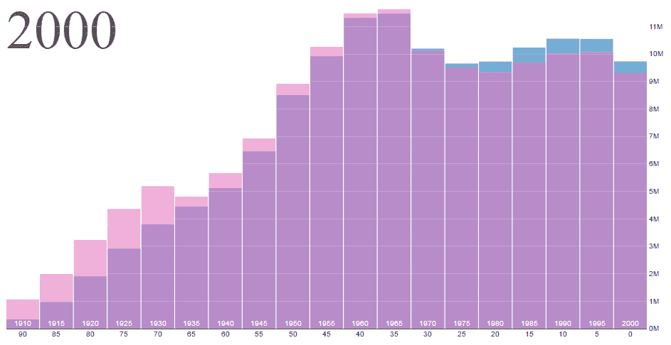
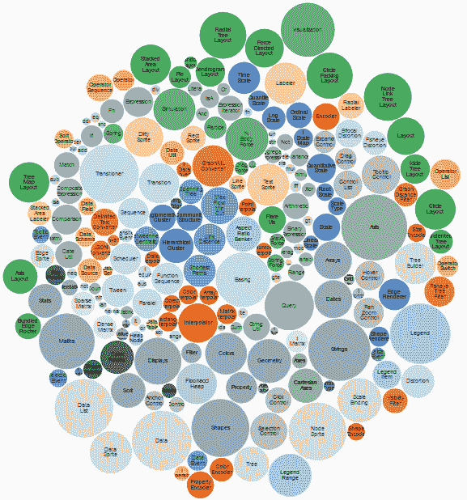
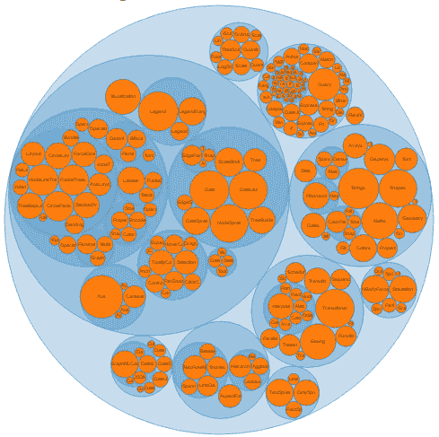
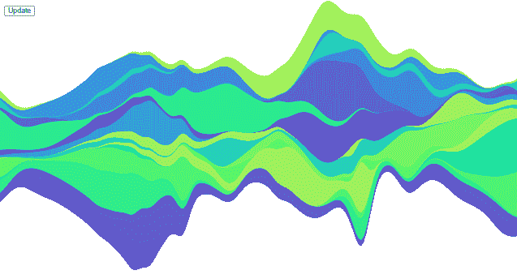

# 什么是 D3？

> 原文：<https://www.tutorialsteacher.com/d3js/what-is-d3js>

D3 代表**数据驱动文档**。这是一个由迈克·博斯托克开发的开源 JavaScript 库，使用 SVG、HTML 和 CSS 在网络浏览器<u>中创建<u>自定义交互数据可视化</u>。</u>

随着今天大量数据的产生，传递这些信息变得越来越困难。数据的可视化表示是传达有意义信息的最有效手段，D3 为创建这些数据可视化提供了极大的便利和灵活性。它是动态的，直观的，需要最少的努力。

它在概念上类似于 [Protovis](https://github.com/mbostock/protovis) ，但是虽然 Protovis 用于静态可视化，但 D3 更侧重于交互、转换和变换。

官方网站:[d3js.org](https://d3js.org)T2】

D3 源代码:[https://github.com/d3/d3](https://github.com/d3/d3)

## D3 特性

*   **使用 Web 标准:** D3 是一个非常强大的可视化工具，可以创建交互式数据可视化。它利用现代 Web 标准:SVG、HTML 和 CSS 来创建数据可视化。
*   **数据驱动:** D3 为数据驱动。它可以使用静态数据或从远程服务器获取不同格式的数据，如数组、对象、CSV、JSON、XML 等。创建不同类型的图表。
*   **DOM 操作:** D3 允许您基于数据操作文档对象模型(DOM)。
*   **数据驱动元素:**它使您的数据能够动态生成元素并将样式应用于元素，无论是表格、图形还是任何其他 HTML 元素和/或元素组。
*   **动态属性:** D3 为其大部分功能提供了动态属性的灵活性。属性可以被指定为数据的函数。这意味着你的数据可以驱动你的风格和属性。
*   **可视化类型:**对于 D3，没有标准的可视化格式。但是它可以让你创建任何东西，从 HTML 表格到饼图，从图表和条形图到地理空间地图。
*   **自定义可视化:**由于 D3 与 Web 标准一起工作，它使您能够完全控制您的可视化功能。
*   **转换:** D3 提供转换()功能。这是非常强大的，因为在内部，D3 计算出在你的值之间插值的逻辑，并找到间歇状态。
*   **交互和动画:** D3 为动画提供了强大的支持，具有持续时间()、延迟()和轻松()等功能。从一种状态到另一种状态的动画是快速的，并且对用户交互做出响应。

## D3 的优点

*   D3.js 是一个 Javascript 库。因此，它可以与您选择的任何 JS 框架一起使用，如 Angular.js、React.js 或 Ember.js。
*   D3 侧重于数据，因此它是数据可视化最合适和最专业的工具。
*   D3 是开源的。因此，您可以使用源代码并添加自己的功能。
*   它与 Web 标准一起工作，因此除了浏览器之外，您不需要任何其他技术或插件来使用 D3。
*   D3 使用像 HTML、CSS 和 SVG 这样的 Web 标准，在 D3 上工作不需要新的学习或调试工具。
*   D3 不提供任何特定的功能，因此它让您可以完全控制您的可视化，以您想要的方式定制它。这使它比其他流行的工具(如 Tableau 或 QlikView)更具优势。
*   因为 D3 是轻量级的，并且直接与 Web 标准一起工作，所以它非常快，并且可以很好地处理大型数据集。

## D3 的力量:几个可视化的例子

### 条形图

### 泡泡图

### 圆形包装

### 流图

更多可视化示例，请访问 [D3 图库](https://github.com/d3/d3/wiki/Gallery)。