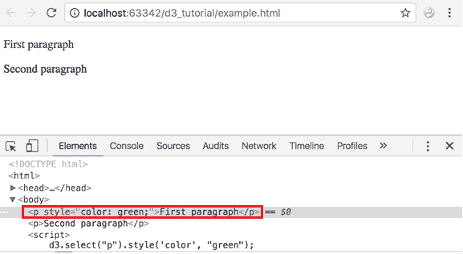
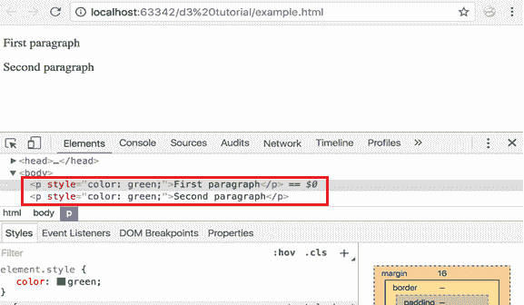
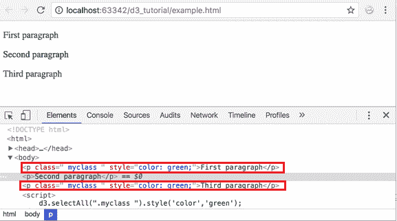
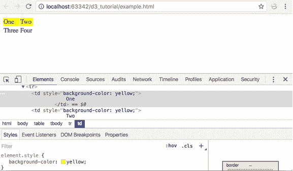

# 使用 D3 选择 DOM 元素

> 原文:[https://www . tutorial stearn . com/d3js/select-DOM-element-using-d3js](https://www.tutorialsteacher.com/d3js/select-dom-element-using-d3js)

D3 允许我们操作 HTML 文档中的 DOM 元素，为此，我们首先需要选择一个特定的元素或一组元素，然后使用各种 D3 方法来操作这些元素。

在本章中，我们将学习使用 D3.js 方法选择 DOM 元素。在下一章中，我们将学习如何操作 DOM 元素。

## 全局 d3 对象

在前一章中，我们了解到我们需要将 D3 库 d3.min.js 包含到我们的 HTML 页面中。这定义了一个全局 JavaScript 对象 d3，它包含了所有重要的开始方法，就像 jQuery 包含一个名为 jQuery(或$)的全局对象一样。

## DOM 选择

在操作 DOM 元素之前，我们需要使用以下方法获取 DOM 元素的引用。

| 方法 | 描述 |
| --- | --- |
| [D3 . select(CSS-selector)](#d3.select)T2】 | 基于指定的 css 选择器返回 HTML 文档中的第一个匹配元素 |
| [d3 .选择所有(css 选择器)](#d3.selectall)T2】 | 基于指定的 css 选择器返回 HTML 文档中所有匹配的元素 |

让我们说明两者的用法。

## d3.select()

d3.select()方法根据指定的 css-elector 返回 HTML 文档中的第一个元素。

### 按名称选择元素

下面的示例演示了使用 d3.select 通过标记名选择第一个匹配的元素。

Example: d3.select()

```
<p>First paragraph</p>
<p>Second paragraph</p>

<script>
    d3.select("p").style("color", "green");
</script>
```

在上例中，`d3.select("p")`首先返回`<p>`元素，然后，`.style("color","green")`方法将颜色属性设置为绿色。当您在浏览器上运行此程序时，它的外观如下:

<figure>[](../../Content/images/d3js/d3js-dom1.png)</figure>

你可以在上面的结果中看到，第一段现在已经被涂成绿色。

### 按标识选择元素

d3.select()方法也可以用来获取具有指定 id 的元素，如下所示。

Example: Select Element by Id

```
<p id="p1">First paragraph</p>
<p id="p2">Second paragraph</p>

<script>
    d3.select("#p2").style("color", "green");
</script>
```

如上例所示，`d3.select("#p2")`选择 id 为 p2 的 `<p>`元素，并使用绿色。style()方法。

因此，您可以使用 d3.select()方法选择第一个匹配元素。了解可以在[www.w3.org](https://www.w3.org/TR/css3-selectors)上与 D3 一起使用的不同类型的 CSS 选择器。

## d3.选择全部（）

d3.selectAll()方法根据指定的 CSS 选择器返回 HTML 文档中所有匹配的元素。

以下示例按标记名选择所有元素。

Example: Select All Elements by Name

```
<p>First paragraph</p>
<p>Second paragraph</p>
<script>
    d3.selectAll("p").style("color", "green");
</script>
```

在上例中，`d3.selectAll("p")`返回所有 `<p>`元素，`.style("color","green")`使其字体颜色为绿色。当您在浏览器上运行此程序时，它的外观如下:

<figure>[](../../Content/images/d3js/d3js-dom3.png)</figure>

从上面的结果可以看出，它对所有`<p>`元素应用了样式属性。

### 按 CSS 类名选择所有元素

下面的例子演示了如何通过 CSS 类名选择元素。

Example: Select All Elements by CSS Class Name

```
<style>
    .myclass{
        color:'red'
    }
</style>
<p class="myclass ">First paragraph</p>
<p>Second paragraph</p>
<p class="myclass ">Third paragraph</p>

<script>
    d3.selectAll(".myclass ").style('color','green');
</script>
```

在上例中，`d3.selectAll(".myclass")`将返回 css 类为“myclass”的所有元素。然后`.style()`方法用值颜色设置样式属性:绿色。

<figure>[](../../Content/images/d3js/d3js-dom4.png)</figure>

在上面的例子中，第一个和第三个`<p>`元素被涂成绿色，因为两者都包含“myClass”。

### 选择嵌套元素

select()和 selectAll()方法可用于选择嵌套元素，如下所示。

Example: Select Nested Elements

```
<table>
<tr>
    <td>
        One
    </td>
    <td>
        Two
    </td>
</tr>
<tr>
    <td>
        Three
    </td>
    <td>
        Four
    </td>
</tr>
</table>

<script>
    d3.select("tr").selectAll("td").style('background-color','yellow');
</script> 
```

<figure>[](../../Content/images/d3js/d3js-dom5.png)</figure>

在上例中，`d3.select("tr")`返回第一个匹配的`<tr>`元素，然后`selectAll("td")`方法返回该`<tr>`内所有匹配的 `<td>`元素。最后，`.style()`方法对这些`<td>`应用黄色背景色。 调用 select()方法后立即调用 selectAll()方法调用[方法链接](/d3js/method-chaining-in-d3js "Method chaining in D3")。

因此，您可以使用 d3.select 和 d3.selectAll 方法根据指定的标准选择匹配的 DOM 元素。选择 DOM 后，在下一章学习如何操作 DOM 元素。