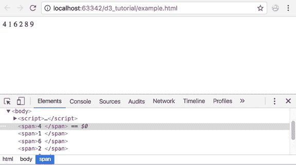
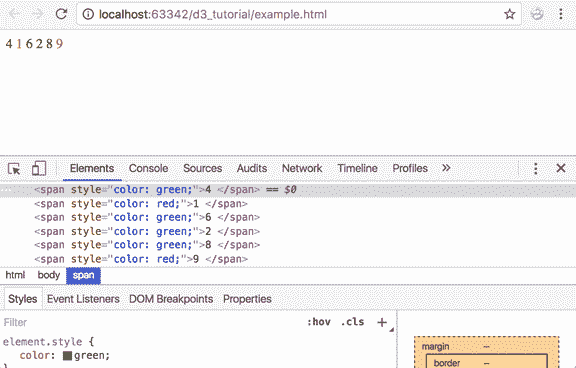
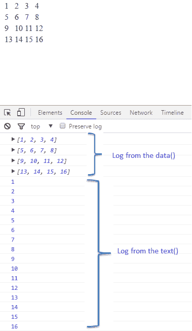
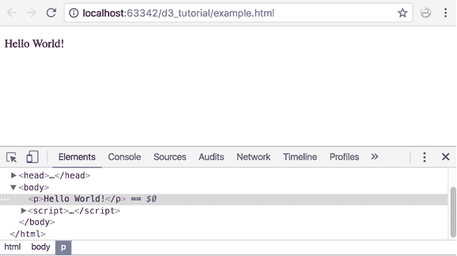

# D3 中的数据绑定

> 原文：<https://www.tutorialsteacher.com/d3js/data-binding-in-d3js>

在本章中，您将学习如何将数据绑定到 DOM 元素，并基于您的数据创建新元素。

D3 包括以下数据绑定的重要方法。

| 方法 | 描述 |
| --- | --- |
| [数据()](#data) | 将数据连接到选定的元素 |
| [进入()](#enter)T2】 | 为缺少的元素创建带有占位符引用的选择 |
| [退出()](#exit) | 移除节点并将它们添加到退出选择中，稍后可以从 DOM 中移除 |
| [日期()](#datum) | 将数据注入选定的元素，而不计算联接。 |

## 数据()

D3 是数据驱动的。data()函数用于将指定的数据数组连接到选定的 DOM 元素，并返回更新的选择。D3 处理不同类型的数据，如数组、CSV、TSV、JSON、XML 等。

您可以将两种类型的值传递给 data()函数，一种是值数组(数字或对象)，另一种是数据的[函数](/d3js/function-of-data-in-d3js)。

下面的示例演示了如何使用 data()函数将数据作为数组连接到现有的 DOM 元素中。

Example: Join Data to Existing Element

```js
<p>D3 Tutorials</p>

<script>
        var myData = ["Hello World!"];

        var p = d3.select("body")
            .selectAll("p")
            .data(myData)
            .text(function (d) {
                return d;
            });
</script> 
```

在上面的例子中，我们有一个段落元素`<p>D3 Tutorials</p>`。我们已经创建了一个名为“我的数据”的数据数组，其中有一个字符串“Hello World”，我们希望将其绑定到`<p>`元素。

它是这样工作的:

`d3.select("body")`选择 HTML 正文元素。

`.selectAll("p")`返回段落元素。由于只有一个段落元素，这将返回一个带有一个 `<p>`元素对象的选择。

`.data(myData)`-data()函数然后将我们的数据数组‘myData’绑定到从上一个选择返回的选择。由于我们的选择只有一个 p 元素，data()函数会将数据数组中的第一个值绑定到`<p>`元素。

`.text(function(d, i) { return d; });`这个文本函数将数据作为文本添加到我们的每个选择元素中。每个数组值作为第一个参数(d)传递给文本函数。在这种情况下，段落元素“D3 教程”中的现有文本将被替换为第一个数组值“Hello World”。

请记住，您需要将数组传递给 data()函数。如果您提供一个常量值，它不会做任何事情。

Example: data()

```js
<p> </p>
<script>
    var myData = 100;

        var p = d3.select("body")
                .selectAll("p")
                .data(myData)
                .text(function (d, i) {
                    return d;
                });
</script> 
```

上面的示例不会显示任何内容，因为 data()函数需要一个数组。

下面的示例演示如何将数据连接到多个元素。

Example: Join Data to Multiple Elements

```js
<p> </p>
<p> </p>
<p> </p>
<script>
    var myData = ["Hello World!", "Hello D3","Hello JavaScript"];

        var p = d3.select("body")
                .selectAll("p")
                .data(myData)
                .text(function (d, i) {
                    return d;
                });
</script> 
```

上述示例将在浏览器中显示以下结果。

在上例中，HTML 包含三个`<p>`元素，数据数组 myData 也包含三个值。因此，data()将三个数据值分别连接到三个选定的 `<p>`元素，text()函数将该数据值显示为文本。我们再来看一个例子。

Example: Data Binding

```js
<body>
    <p>D3 Tutorials </p>

    <script>
        var myData = [1, 2, 3, 4, 5];

         var p = d3.select("body")
                   .selectAll("p")
                   .data(myData)
                   .text(function (d, i) {
                        return d;
                    });
    </script>
</body> 
```

在上面的例子中，我们用[1，2，3，4，5]替换了我们的数据数组。就像前面的例子一样，我们从正文中选择所有的段落元素。然后，我们将数据绑定到所选内容，并将数据作为文本添加到段落选择中。注意文本“D3 教程”是如何被数据数组`<p>1</p>`中的第一个元素替换的。

但是剩下的数据元素呢？当我们使用`.selectAll("p")`选择段落元素时，它只返回选择中的一个元素，因为我们在 DOM 中只有一个段落元素。因此，当我们将数据绑定到段落选择时，只有第一个数据元素绑定到一个可用的段落元素。数组中的其余数据元素被忽略，因为没有其他`<p>`元素。

为了处理这样的场景，我们不知道数据集中的数据元素和 DOM 元素的数量，d3 提供了 enter()函数。

让我们看看如何使用 enter()函数来处理未知数据。

## 输入()

在上面的示例中，我们已经看到 data()函数将一对一映射连接到选择元素(节点)和数组值。但是，如果元素(节点)的数量和数据值不匹配怎么办？在这种情况下，我们无法仅使用 select()和 selectAll()来获取选择，因为如果 html 代码不存在，它们返回的元素可能比数据集少，或者根本没有选择。

enter()方法动态创建对应于数据值数量的占位符引用。enter()的输出可以被馈送到 append()方法，append()将创建页面上没有对应的 DOM 元素的 DOM 元素。

如果我们不使用 enter()会发生什么？D3 将简单地更新现有的节点，就像我们在前面的例子中看到的那样。如果没有可用于绑定数据的现有节点，就不会有任何更新。

在下面的示例中，我们的数组中有 6 个数据值。因此，enter()将创建六个引用占位符，append 将创建六个 span 元素。

Example: enter() Method

```js
<body>
<script>
    var data = [4, 1, 6, 2, 8, 9];
    var body = d3.select("body")
                .selectAll("span")
                .data(data)
                .enter()
                .append("span")
                .text(function(d) { return d + " "; });
</script>
</body> 
```



Data Binding to DOM


就像我们前面的例子一样，我们取了一个数据数组[4，1，6，2，8，9]。

让我们看看我们的程序是做什么的:

`d3.select("body")`
此语句选择 HTML 正文。

`.selectAll("span")`
此时，体内没有跨度元素。所以这将返回一个空数组。

`.data(data)`
我们向 data()函数提供我们的数据数组。因为我们的数组有六个元素，所以之后的代码将对数组中的每个元素运行六次。

`.enter()`
enter()函数检查与我们的五个数组元素对应的`<span>`元素。因为它找不到任何元素，所以它会为五个元素中的每一个元素创建一个跨度。

`.append("span")`
这将把上面创建的跨度追加到主体元素中。

`.text(function(d) { return d + " "; });`
最后，我们的文本函数将数据数组中的每个数字作为文本添加到我们的每个跨度选择中，并将其打印到屏幕上！

让我们将程序提升到下一个层次，如果数字是偶数，则添加逻辑将数字涂成绿色，如果数字是奇数，则涂成红色。

Example: Change Text Color

```js
<body>
<script>
    var data = [4, 1, 6, 2, 8, 9];
    var body = d3.select("body")
                 .selectAll("span")
                 .data(data)
                 .enter().append("span")
                 .style('color', function(d) {
                     if (d % 2 === 0) {
                         return "green";
                     } else {
                         return "red";
                     }
                 })
                 .text(function(d) { return d + " "; });
</script>
</body> 
```



Data Binding to DOM


我们在这里添加的是 style()函数，其中包含我们的逻辑:

```js
.style('color', function(d) {
            if (d % 2 === 0) {
                return "green";
            } else {
                return "red";
            }
        }); 
```

在这里，我们基于我们的逻辑来设计我们的元素。对于每个数据元素，逻辑运行以确定该元素是偶数还是奇数，并根据结果返回一种颜色。

如 data()一节所述，如果先前的选择返回多个组(使用多个 select 方法)，则可以为 data()函数指定一个函数，而不是数组。该功能将对选择中的每个组执行。考虑以下二维矩阵的例子。

Example: Data Binding

```js
<body>
    <script>
        var matrix = [
                        [1, 2, 3, 4],
                        [5, 6, 7, 8],
                        [9, 10, 11, 12],
                        [13, 14, 15, 16]
                    ];

        var tr = d3.select("body")
            .append("table")  // adds <table>
            .selectAll("tr")  // selects all <tr>
            .data(matrix)      // joins matrix array 
            .enter()           // create placeholders for each row in the array
            .append("tr");// create <tr> in each placeholder

        var td = tr.selectAll("td")
            .data(function (d) {    // joins inner array of each row
                console.log(d);
                return d;
            })
            .enter()    // create placeholders for each element in an inner array
            .append("td") // creates <td> in each placeholder
            .text(function (d) {
                console.log(d);
                return d; // add value of each inner array as a text in <td>
            });
    </script>
</body> 
```



Data Binding


可以看到，在选择`td`后，我们在数据()中指定了一个函数作为参数。`tr.selectAll("td")`为每个`tr`的选择返回多个`td`，从而形成多个`<tr><td></td></tr>`组。 如结果所示，`console.log(d)`返回二维数组中的第一个元素，即数组中的一行。`text(function(d))`中的参数 d 代表从前面的 data()函数返回的一行中的单个元素。

这是 D3 的一个基本示例，展示了 D3 如何处理数据以及如何处理数据。在未来的章节中，我们将广泛使用这些函数，因为我们会看到更多的例子来深入理解 D3。

## 出口()

enter()用于添加新的引用节点，exit 用于移除节点。

在下面的代码中，所有 p 元素都将被删除。使用 exit()，元素进入退出阶段。这意味着所有退出的元素都存储在某个不可见的地方，准备在给出命令时移除。且该命令被删除()。remove()将从 DOM 中移除所有“已退出”的节点。

Example: exit() Method

```js
<body>
    <p>D3 Tutorials</p>
    <p></p>
    <p></p>
    <script>

    var myData = ["Hello World!"];

    var p = d3.select("body")
                .selectAll("p")
                .data(myData)
                .text(function (d, i) {
                    return d;
                })
                .exit()
                .remove();
    </script>
</body> 
```



Data Binding to DOM


在上面的例子中，HTML 包含三个

元素，而数据数组只包含一个数据值。所以。退出()。移除()移除了额外的`<p>`元素。

## 基准()

datum()函数用于不需要更新的静态可视化。它将数据直接绑定到元素。

Example: datum() Method

```js
<body>
    <p>D3 Tutorials</p>
    <script>

    d3.select("body")
        .select("p")
        .datum(100)
        .text(function (d, i) {
            return d;
        });
    </script>
</body> 
```

访问 D3 文档的[连接数据](https://github.com/d3/d3-selection/blob/master/README.md#joining-data)部分，了解更多关于数据连接的信息。

在下一章中，学习如何从文件加载不同类型的数据。