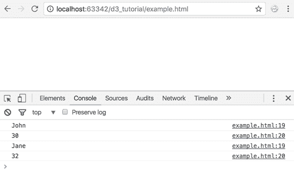
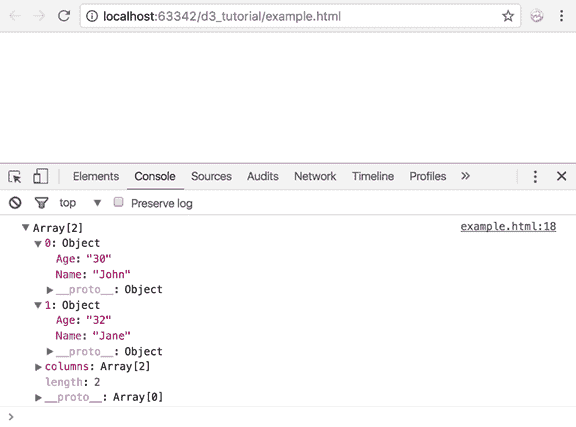
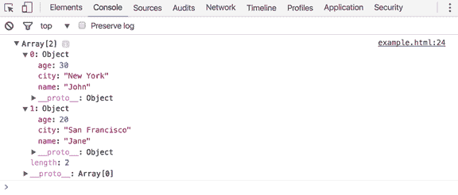
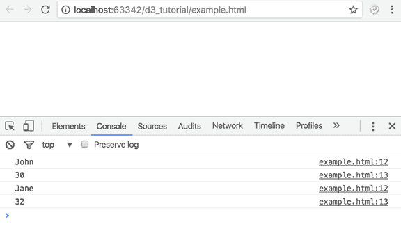
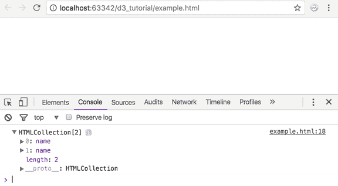
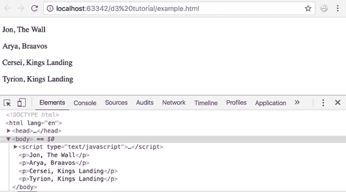

# D3 中的数据加载

> 原文:[https://www . tutorial stearner . com/d3js/loading-data-from-in-file-d3js](https://www.tutorialsteacher.com/d3js/loading-data-from-file-in-d3js)

在前几节中，我们已经处理了存储在局部变量中的数据。在本章中，我们将学习从不同类型的文件中加载数据，并将其绑定到 DOM 元素。

D3 可以处理本地变量或外部文件中定义的不同类型的数据。

D3 提供了以下方法从外部文件加载不同类型的数据。

| 方法 | 描述 |
| --- | --- |
| [d3.csv()](#d3.csv) | 将 http 请求发送到指定的 url 进行加载。csv 文件或数据，并使用解析的 csv 数据对象执行回调函数。 |
| [d3.json()](#d3.json) | 将 http 请求发送到指定的 url 进行加载。json 文件或数据，并用解析后的 json 数据对象执行回调函数。 |
| [d3.tsv()](#d3.tsv) | 向指定的 url 发送 http 请求以加载. tsv 文件或数据，并使用解析后的 tsv 数据对象执行回调函数。 |
| [d3.xml()](#d3.xml) | 向指定的 url 发送 http 请求以加载。并使用解析的 xml 数据对象执行回调函数。 |

## d3.csv()

我们可以使用 d3.csv()方法加载 csv 文件或 csv 数据。

Signature:

```
d3.csv(url[, row, callback]);

```

第一个参数是。将返回 csv 数据的 csv 文件、webapi 或 webservice。第二个可选参数是转换函数，它允许我们更改表示。第三个可选参数是回调函数，一旦。加载 csv 文件/数据。它将解析的数据对象作为参数传递给回调函数。

让我们看看如何加载存储在名为“employee.csv”的文件中的以下 CSV 数据。

employee.csv

```
Name, Age
John, 30
Jane, 32
```

将 employee.csv 文件复制到项目根文件夹的数据文件夹中，并在`<script>`标签中写入以下代码。

Example: Loading CSV Data

```
<script>
d3.csv("/data/employees.csv", function(data) {
    for (var i = 0; i < data.length; i++) {
        console.log(data[i].Name);
        console.log(data[i].Age);
    }
});
</script> 
```

在浏览器中运行上述示例，打开开发人员工具，然后单击控制台选项卡，您将看到以下结果。

<figure>[](../../Content/images/d3js/loading-csv-data.png)

<figcaption>Loading CSV Data</figcaption>

</figure>

从上面的示例代码中可以看到，D3 函数 d3.csv()将文件名作为输入，处理该文件并将数据加载到对象数组中。请注意，csv 文件的第一行不会被打印。这是因为第一行被视为列名，其余行被视为数据。d3 加载的数据对象使用这些列名作为对象的属性，因此被转换为对象键。

用简单的 console.log()语句替换 for 循环，打印数据对象。

```
d3.csv("/data/employees.csv", function(data) {
    console.log(data);
}); 
```

现在检查控制台上的打印对象。你看到了什么？

<figure>[](../../Content/images/d3js/loading-csv-data2.png)</figure>

d3.csv()将数据作为对象返回。此对象是从 csv 文件加载的对象数组，其中每个对象代表 csv 文件的一行。

以上`d3.csv("/data/employees.csv", function(data) { }`相当于以下。

```
d3.csv("/data/employees.csv")
  .get(function(data) {
        console.log(data);
  }); 
```

您可以使用 d3.request()方法来代替 d3.csv，如下所示。

```
d3.request("/data/employees.csv")
  .mimeType("text/csv")
  .response(function (xhr) { return d3.csvParse(xhr.responseText); })
  .get(function(data) {
      console.log(data);
  }); 
```

使用行参数转换数据的表示形式。例如，下面的代码将名称改为大写。

```
d3.csv("/data/employees.csv")
  .row(function(d) {
        return {
            age: d.age,
            name: d.name.toUpperCase() // converting name to upper case 
        }; 
   })
  .get(function(data) {
      console.log(data);
  }); 
```

## d3.json

JSON 数据可以是单个对象，也可以是 JSON 对象的数组。

Example: JSON Object

```
var nameObj = {
    "name": "John",
    "age": 30,
    "city": "New York"
}; 
```

Example: JSON Array

```
var nameArray = [{
    "name": "John",
    "age": 30,
    "city": "New York"
},
{
    "name": "Jane",
    "age": 20,
    "city": "San Francisco"
}]; 
```

JSON 的工作方式类似于 CSV。d3.json()将一个 json 文件作为输入，并将其转换为一个对象数组。

Signature:

```
d3.json(url, callback);

```

第一个参数是。json 文件和第二个参数是一个回调函数，将被执行一次。json 文件已加载。它将解析的数据对象作为参数传递给回调函数。

我们来看一个例子。在项目根文件夹的数据文件夹中创建一个示例文件“users.json”，并将下面的 json 粘贴到其中。

users.json

```
[{
    "name": "John",
    "age": 30,
    "city": "New York"
},
{
    "name": "Jane",
    "age": 20,
    "city": "San Francisco"
}]; 
```

现在，使用如下所示的`d3.json()`加载上面的 JSON 文件。

```
d3.json("/data/users.json", function(data) {
    console.log(data);
}); 
```

您应该会在开发人员控制台中看到以下输出:

<figure>[](../../Content/images/d3js/loading-json-data.png)</figure>

正如您在上面的结果中看到的，D3 创建了一个具有名称、城市和年龄属性的对象数组。这使得我们可以轻松处理数据。

## d3.tsv

Signature:

```
d3.tsv(url, callback);

```

D3 的 tsv()方法将. tsv 文件作为输入 url，并在解析 TSV 文件后返回一个数据对象。

存储在员工中的 TSV 数据。

employees.tsv

```
Name    Age
John    30
Jane    32
```

现在，加载上面的 TSV 文件，并使用如下所示的`d3.tsv()`解析数据。

Example: Load tsv Data

```
d3.tsv("/data/employees.tsv", function(data) {
    for (var i = 0; i < data.length; i++) {
        console.log(data[i].Name);
        console.log(data[i].Age);
    }
}); 
```

上面的示例将在开发人员控制台中显示以下输出。

<figure>[](../../Content/images/d3js/loading-tsv-data.png)</figure>

## d3.xml

Signature:

```
d3.xml(url, callback);

```

d3.xml()方法获取 xml 文件的 url 并返回一个 xml 对象。

下面是 employees.xml 文件中的一个示例 XML。

employees.xml

```
<?xml version="1.0" encoding="UTF-8"?>
<root>
<row>
    <Name>John</Name>
    <Age>30</Age>
</row>
<row>
    <Name>Jane</Name>
    <Age>32</Age>
</row>
</root>
```

Example: Load XML Data

```
d3.xml("/data/employees.xml", function(data) {
        console.log(data);
}); 
```

您可以解析和遍历上面的 XML，如下所示。

```
d3.xml("\data\employees.xml", function(data) {
        console.log(xml.documentElement.getElementsByTagName("Name", "));
}); 
```

这将为您提供所有标签名为“名称”的标签。

<figure>[](../../Content/images/d3js/loading-xml-data.png)</figure>

## 绑定加载的数据

一旦我们加载了数据，我们就有了可以使用的数据对象。对于本教程，我们将使用存储在名为“users.json”的文件中的 JSON 数据。

users.json

```
[{
    "name": "Jon",
    "age": 30,
    "location": "The Wall"
},
{
    "name": "Arya",
    "age": 12,
    "location": "Braavos"
},
{
    "name": "Cersei",
    "age": 42,
    "location": "Kings Landing"
},
{
    "name": "Tyrion",
    "age": 40,
    "location": "Kings Landing "
}] 
```

它是个人对象的数组，每个对象包含一个姓名、年龄和位置。让我们使用`d3.json()`方法加载上面的 json 数据，并用 DOM 元素绑定。

Example: Load and Bind JSON Data

```
d3.json("/data/users.json", function(error, data) {

    d3.select("body")
        .selectAll("p")
        .data(data)
        .enter()
        .append("p")
        .text(function(d) {
            return d.name + ", " + d.location;
        });

}); 
```

运行上述代码时，您将在浏览器中看到以下结果。

<figure>[](../../Content/images/d3js/bind-loaded-data.png)</figure>

让我们来看看这段代码。

`d3.json("/data/users.json", function(error, data) {`
我们的项目有一个名为“users.json”的文件。我们使用 d3.json()加载了 这个文件。d3.json()方法返回了一个格式化的数据对象。它还返回了一个参数“错误”。我们将很快看到这一点。

`d3.select("body")` 一旦我们有了数据对象，我们就想把内容输出到我们的页面。我们要在哪里添加它？没错-身体元素。所以，我们选择身体元素。D3 返回选择，我们可以使用[方法链接](/d3js/method-chaining-in-d3js)将其传递给下一个方法。

`.selectAll("p")`
我们选择将数据输出为段落。你可以使用 div，跨度，列表，任何你喜欢的。我们想要四个< p > 元素，因为这是我们数据的大小。现在，D3 将在页面上寻找< p >元素。它查找所有 < p >元素，并将引用发送到链中的下一个方法。但是哇哦！我们没有，是吗？先别慌。D3 很聪明。继续读。

`.data(data)`
现在我们需要绑定我们的数据。所以我们将我们的数据对象提供给 D3 的 data()函数。data()函数将数据值从数据集传递给链中的下一个方法。

`.enter()`
输入()函数接收来自数据()的值。在我们的例子中，有四个值。但是由于我们还没有对应于这些数据值的 < p >元素的引用，enter()返回新元素的空占位符引用。

`.append("p")`
我们现在有了对我们元素的引用。append()方法将这些元素添加到 DOM 中。

`.text(function(d) { return d.name + ", " + d.location; });`
最后还有正文()法。大多数 d3 函数接受函数作为参数。在我们的例子中，我们向 text 方法传递了一个匿名函数，该函数从我们的数据对象中返回名称和位置的串联。text()被调用，并用相应的数据值绑定到我们的每个页面元素。

## 错误处理

从外部源加载数据时，D3 返回一个名为“错误”的参数。您可以使用此参数来检查数据是否成功加载。

Example: Error Handing

```
d3.json("/data/users.json", function(error, data) {

    if (error) {
        return console.warn(error);
    }

    d3.select("body")
            .selectAll("p")
            .data(data)
            .enter()
            .append("p")
            .text(function(d) {
                return d.name + ", " + d.location;
            });
    }); 
```

如果加载数据时出现错误，就说数据格式不正确；D3 将返回一个错误对象。您可以检查错误，并在此基础上做出决定。

因此，您可以使用可用的 D3 方法从各种来源加载数据。