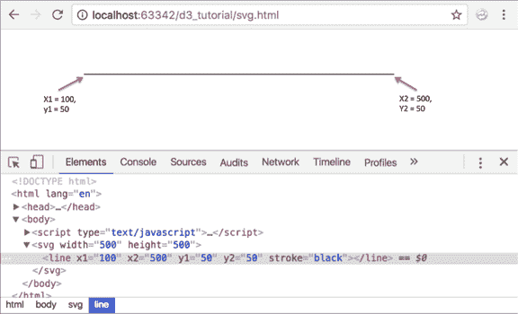
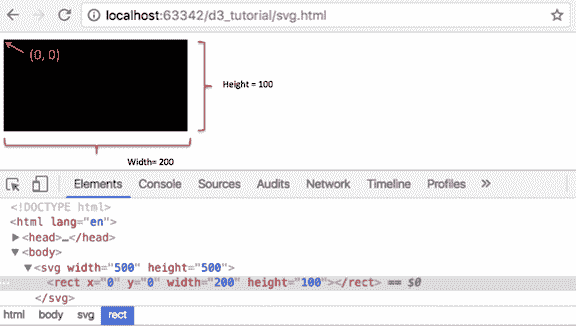
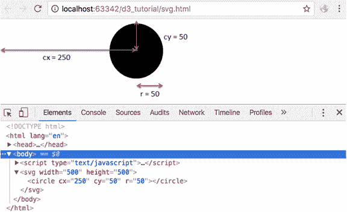
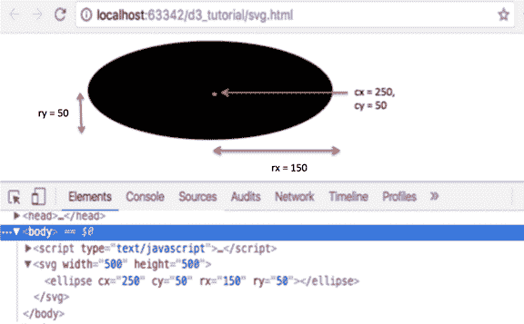
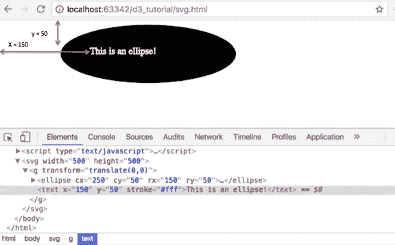
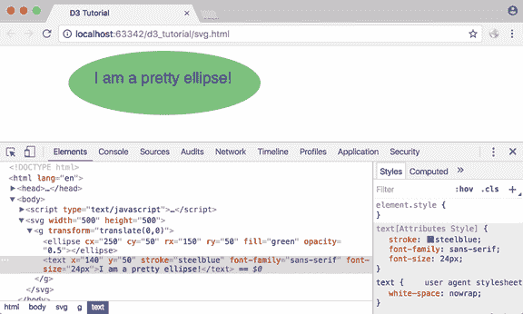

# 使用 D3 创建 SVG 元素

> 原文：<https://www.tutorialsteacher.com/d3js/create-svg-elements-in-d3js>

我们在[网络标准](/d3js/web-standards)一章中简要介绍了可伸缩矢量图形(SVG)。在本章中，我们将学习如何使用 D3 创建 SVG 元素。

SVG 提供了不同的形状，如直线、矩形、圆形、椭圆形等。因此，用支持向量机设计可视化给了你更多的灵活性和你能实现的能力。

## What is SVG？

*   SVG 是一种基于文本的图像。
*   SVG 在结构上类似于 HTML
*   SVG 位于 DOM 中
*   SVG 属性可以指定为属性
*   SVG 应该具有相对于原点(0，0)的绝对位置

完整的 SVG 规格可以在这里找到: [SVG 规格](https://www.w3.org/TR/SVG)

以下示例演示了 SVG 中的一个矩形。

Example: SVG Rectangle

```
<svg width="500" height="500">
    <rect x="0" y="0" width="200" height="200"></rect>
</svg>
```

我们这里有一个标签。把 SVG 想象成一张画布，在上面画画(不要和 HTML `<canvas>`混为一谈——那是不同的元素！). 需要为画布指定宽度和高度。你所有的 SVG 元素，像 `<rect>``<line>``<circle>``<text>`都会进入这个`<svg>`标签。

每个 SVG 元素都有自己的属性，包括几何和样式属性。所有属性都可以设置为属性，但是通常，我们提供几何属性作为属性，样式属性作为样式。由于 SVG 位于 DOM 中，我们可以像对 HTML 元素一样使用 attr()和 append()。

让我们了解可视化中一些最常用的 SVG 元素，以及如何使用 D3 库创建样式并将其应用于它们。

## 线条

一个 SVG 线元素由<line>标记表示。</line>

一条简单的线可以定义如下:

Example: Line in SVG

```
<line x1="100" y1="100" x2="500" y2="100" />
```

一条线的属性是:

*   x1:这是第一点的 x 坐标
*   y1:这是第一点的 y 坐标
*   x2:这是第二个点的 x 坐标
*   y2:这是第二点的 y 坐标

Example: SVG Line

```
<svg width="500" height="500">
    <line x1="100" y1="50" x2="500" y2="50" stroke="black"/>
</svg> 
```

如您所见，我们已经将 x1、x2、y1 和 y2 属性应用于线元素。此外，还有一个属性“描边”来指定线条颜色。这将如下所示:

[](../../Content/images/d3js/svg-line.png) 

SVG Line


在上一节中，我们学习了使用 D3 操纵 DOM 元素。使用相同的操作方法，我们可以用 D3 绘制 svg 线，如下所示。

Example: Draw SVG Line with D3

```
<body>
<script>
    var width = 500;
    var height = 500;

    //Create SVG element
    var svg = d3.select("body")
    .append("svg")
    .attr("width", width)
    .attr("height", height);

    //Create line element inside SVG
    svg.append("line")
       .attr("x1", 100)
       .attr("x2", 500)
       .attr("y1", 50)
       .attr("y2", 50)
       .attr("stroke", "black")
</script>
</body>
```

让我们理解上面的代码。

```
var width = 500;
var height = 500; 
```

我们为 SVG 的宽度和高度创建变量。最好将它们放在变量中，这样您就可以在一个地方更改它们，而不必遍历整个代码，以防您决定更改 SVG 的维度。

```
var svg = d3.select("body")
            .append("svg")
            .attr("width", width)
            .attr("height", height); 
```

接下来，我们选择主体元素，并将我们的 SVG 元素附加到它上面，并设置 SVG 的宽度和高度。我们将这个 svg 的引用存储在一个名为 SVG 的变量中，以便我们以后可以使用它。

```
 svg.append("line")
    .attr("x1", 100)
    .attr("x2", 500)
    .attr("y1", 50)
    .attr("y2", 50)
    .attr("stroke", "black") 
```

然后我们在我们的 SVG 中添加一个行元素，并使用 [attr()](/d3js/dom-manipulation-using-d3js#attr) 函数为它提供 x1、y1 x2、y2 和笔画属性。

在上面的例子中，我们得到了一条没有渐变的直线，因为我们为起点和终点指定了相同的 y 坐标。

使用同一条线，但使用不同的 y 坐标，我们可以得到一条带有渐变的线。

Example: SVG Line with Gradient

```
<svg width="500" height="500">
    <line x1="100" y1="50" x2="500" y2="250" stroke="black" />
</svg>
```

使用 D3，这可以如下进行:

Example: Draw SVG Line with D3

```
<body>
<script>
    var width = 500;
    var height = 500;

    //Create SVG element
    var svg = d3.select("body")
    .append("svg")
    .attr("width", width)
    .attr("height", height);

    //Create and append line
    svg.append("line")
            .attr("x1", 100)
            .attr("x2", 500)
            .attr("y1", 50)
            .attr("y2", 250)
            .attr("stroke", "black")
</script>
</body>
```

[](../../Content/images/d3js/svg-line-gradient.png) 

SVG Line


## 矩形

矩形由`<rect>`表示。

Example: Rectangle in SVG

```
<rect x="0" y="0" width="200" height="200"></rect>
```

矩形属性:

*   x:这是矩形左上角的 x 坐标
*   y:这是矩形左上角的 y 坐标
*   宽度:表示矩形的宽度
*   高度:这表示矩形的高度

Example: Rectangle in SVG

```
<svg width="500" height="500">
    <rect x="0" y="0" width="200" height="200"></rect>
</svg>
```

让我们用 D3 库创建 SVg 矩形。

Example: Draw SVG Rectangle with D3

```
<body>
<script>

    var width = 500;
    var height = 500;

    //Create SVG element
    var svg = d3.select("body")
            .append("svg")
            .attr("width", width)
            .attr("height", height);

    //Create and append rectangle element
    svg.append("rect")
            .attr("x", 0)
            .attr("y", 0)
            .attr("width", 200)
            .attr("height", 100)
</script>
</body>
```

上面矩形示例的输出如下所示。

[](../../Content/images/d3js/svg-rectangle.png) 

SVG Rectangle


在上面的例子中，在添加了 SVG 之后，我们添加了一个矩形元素`svg.append("rect")`，并指定了它相对于原点的 x 和 y 坐标，还指定了矩形的宽度和高度。默认颜色是黑色，因此您可以在 SVG 上看到一个黑色矩形。

## 圆

圆圈由`<circle>`标记表示。

Example: Circle in SVG

```
<circle cx="250" cy="25" r="25"/>
```

圆形属性:

*   cx:这是圆心的 x 坐标
*   cy:这是圆心的 y 坐标
*   这表示圆的半径

Example: SVG Circle

```
<svg width="500" height="500">
    <circle cx="250" cy="50" r="50"/>
</svg>
```

让我们用 D3 库创建一个 SVG 圆。

Example: Draw SVG Circle with D3

```
<body>
<script>
    var width = 500;
    var height = 500;

    //Create SVG element
    var svg = d3.select("body")
                .append("svg")
                .attr("width", width)
                .attr("height", height);

    //Append circle 
    svg.append("circle")
       .attr("cx", 250)
       .attr("cy", 50)
       .attr("r", 50)
</script>
</body>
```

上面圆圈示例的输出如下所示。

[](../../Content/images/d3js/svg-circle.png) 

SVG Circle


所以我们在这里做的是，在添加了 SVG 之后，我们附加了一个圆元素并指定了它的属性；圆心(cx & cy)和圆半径(r)的坐标。

## 椭圆

类似于`<circle>`元素，我们有一个用于创建椭圆的 SVG 元素。这由`<ellipse>`标记表示。

Example: SVG Ellipse

```
<svg width="500" height="500">
    <ellipse cx="250" cy="25" rx="100" ry="25"/>
</svg> 
```

但是，观察两个半径:rx 和 ry。椭圆有两个半径。

所以椭圆的属性是:

*   cx:这是圆心的 x 坐标
*   cy:这是圆心的 y 坐标
*   rx:这是圆的 x 半径
*   这是圆的半径

让我们在 D3 中创建椭圆。

Example: Draw SVG Ellipse with D3

```
<body>
<script>
    var width = 500;
    var height = 500;

    var svg = d3.select("body")
                .append("svg")
                .attr("width", width)
                .attr("height", height);

    svg.append("ellipse")
       .attr("cx", 250)
       .attr("cy", 50)
       .attr("rx", 150)
       .attr("ry", 50)
</script>
</body> 
```

上述椭圆示例的输出如下所示。

[](../../Content/images/d3js/svg-ellipse.png) 

SVG Ellipse


看看我们附加到我们的 SVG 的元素，`svg.append("ellipse")`。不像圆，我们给了它两个半径，rx 和 ry。

## 文本

正如我们在前面章节中看到的，SVG 在屏幕上有一个要包含的元素`<text>`。

Example: SVG Text

```
<svg width="500" height="500">
    <text x="250" y="25">Your text here</text>
</svg>
```

让我们使用下面的 D3 在椭圆上创建文本。

Example: Text on Ellipse

```
<body>
<script>
    var width = 500;
    var height = 500;

    //Create SVG element
    var svg = d3.select("body")
                .append("svg")
                .attr("width", width)
                .attr("height", height);

    //Create group element
    var g = svg.append("g")
               .attr("transform", function(d, i) {
                        return "translate(0,0)";
               });

    //Create and append ellipse element into group
    var ellipse = g.append("ellipse")
                   .attr("cx", 250)
                   .attr("cy", 50)
                   .attr("rx", 150)
                   .attr("ry", 50)
                   .append("text")

    //Create and append text element into group
    g.append("text")
     .attr("x", 150)
     .attr("y", 50)
     .attr("stroke", "#fff")
     .text("This is an ellipse!");
</script>
</body>
```

我们采用了上面相同的椭圆示例，并在椭圆中添加了文本。您可能会注意到，我们在这里引入了一个新的`<g>` 组元素。

当您想要将某些 SVG 元素组合在一起时，使用`<g>`元素。在我们的例子中，我们使用`<g>`来保持我们的`<ellipse>`和`<text>` 元素在一起。group 元素可以方便地应用转换，以便将转换应用到组的所有子元素。

我们已经给我们的文本添加了一个笔画属性，这样我们的文本在我们的黑色椭圆上是白色可见的，如下所示。

[](../../Content/images/d3js/svg-group.png) 

SVG Group


## 设置 SVG 元素的样式

您可能已经注意到，在上面的示例中，我们没有指定任何颜色。然而我们的元素被涂上了黑色。这是因为默认的 SVG 颜色是没有笔画的黑色填充。

| 样式属性 | 描述 |
| --- | --- |
| 充满 | 这是元素的填充颜色。它可以是颜色名称、十六进制值或 RGB 或 RGBA 值。 |
| 中风 | 这是笔画颜色。像上面的例子一样，我们可以为元素指定一种颜色。 |
| 笔画宽度 | 笔画宽度指定线条或边界的宽度。这是以像素为单位。 |
| 不透明 | 不透明度将指定不透明度/透明度数值。0 完全透明，1 完全不透明。 |
| 字体系列 | 对于文本元素，我们可以指定字体系列。这就像 CSS 一样工作。 |
| 字体大小 | 我们还可以指定文本元素的字体大小。 |

以上所有属性都可以直接应用，也可以使用 CSS 应用。

让我们重写我们的椭圆示例，并为椭圆和文本元素添加更多样式属性。

Example: Styling SVG Elements

```
<script>
    var width = 500;
    var height = 500;

    var svg = d3.select("body")
                .append("svg")
                .attr("width", width)
                .attr("height", height);

    var g = svg.append("g")
                .attr("transform", function(d, i) {
                        return "translate(0,0)";
                });

    var ellipse = g.append("ellipse")
                    .attr("cx", 250)
                    .attr("cy", 50)
                    .attr("rx", 150)
                    .attr("ry", 50)
                    .attr("fill", "green")
                    .attr("opacity", 0.5)

    g.append("text")
     .attr("x", 140)
     .attr("y", 50)
     .attr("stroke", "steelblue")
     .attr("font-family", "sans-serif")
     .attr("font-size", "24px")
     .text("I am a pretty ellipse!");
</script> 
```

上面例子的输出如下所示。

[](../../Content/images/d3js/svg-ellipse2.png) 

Styling SVG Elements


因此，我们可以使用 D3.js 创建 SVG 元素。