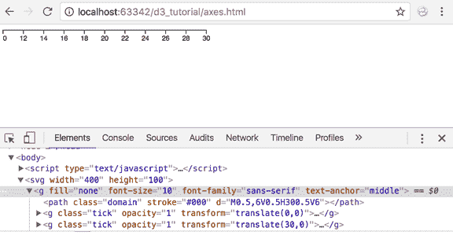
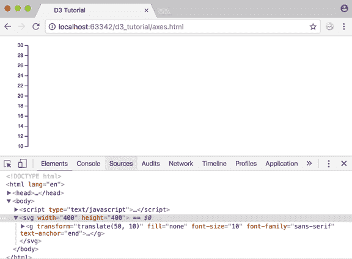
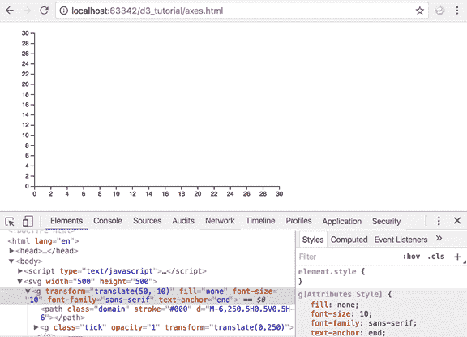

# D3 中的轴

> 原文:[https://www.tutorialsteacher.com/d3js/axes-in-d3](https://www.tutorialsteacher.com/d3js/axes-in-d3)

在前几章中，我们学习了音阶。在本章中，我们将学习在 D3 中使用比例创建轴。

轴呈现人类可读的刻度参考标记。图形有两个轴:水平轴或 x 轴和垂直轴或 y 轴。

D3 提供绘制轴的功能。轴由线、记号和标签组成。一个轴使用比例，所以每个轴都需要一个比例来使用。

D3 提供以下绘制轴的功能。

| 轴法 | 描述 |
| --- | --- |
| d3.axisTop() | 创建顶部水平轴。 |
| d3.axisRight() | 创建垂直的右向轴。 |
| D3 . axisborom() | 创建底部水平轴。 |
| d3.axisLeft() | 创建左垂直轴。 |

到目前为止，在我们的可视化中，我们还没有添加任何轴。让我们学习如何将 x 轴添加到图形中。

Example: x-axis in D3

```
<body>
<script>
    var width = 400,
        height = 100;

    var data = [10, 15, 20, 25, 30];

    // Append SVG 
    var svg = d3.select("body")
                .append("svg")
                .attr("width", width)
                .attr("height", height);

    // Create scale
    var scale = d3.scaleLinear()
                  .domain([d3.min(data), d3.max(data)])
                  .range([0, width - 100]);

    // Add scales to axis
    var x_axis = d3.axisBottom()
                   .scale(scale);

    //Append group and insert axis
    svg.append("g")
       .call(x_axis);

</script>
</body> 
```

上面的示例将显示以下结果。

<figure>[](../../Content/images/d3js/x-axes.png)

<figcaption>X Axes in D3</figcaption>

</figure>

让我们浏览一下上面的代码:

`var width = 400, height = 100;`像往常一样，我们定义了我们的 SVG 宽度和高度作为变量。

`var data = [10, 15, 20, 25, 30];`将我们的数据集定义为一个数组。

```
var svg = d3.select("body")
            .append("svg")
            .attr("width", width)
            .attr("height", height); 
```

接下来，我们创建我们的 SVG 元素并设置它的宽度和高度。

```
 var scale = d3.scaleLinear()
               .domain([d3.min(data), d3.max(data)])
               .range([0, width - 100]); 
```

我们创建一个线性比例，并指定我们的领域和范围。观察我们如何使用 d3.min 和 d3.max 函数从数据集获取最小值和最大值。最小值是 10，最大值是 30。

`.range([0,width-100])`指定范围[0，300]。因此，值 10 将被映射为 0，值 300 将被映射为 30。

```
 var x_axis = d3.axisBottom()
                .scale(scale); 
```

我们使用 d3.axisBottom 来创建我们的 x 轴，并为它提供我们之前定义的比例。

```
svg.append("g")
    .call(x_axis); 
```

最后，我们添加一个组元素并插入 x 轴。

同样，我们可以使用如下所示的`d3.axisLeft()`函数创建一个垂直轴。

Example: y-axis

```
<body>
<script>
    var width = 400, height = 400;

    var data = [10, 15, 20, 25, 30];
    var svg = d3.select("body")
                .append("svg")
                .attr("width", width)
                .attr("height", height);

    var scale = d3.scaleLinear()
                  .domain([d3.min(data), d3.max(data)])
                  .range([height/2, 0]);

    var y_axis = d3.axisLeft()
                  .scale(scale);

    svg.append("g")
       .attr("transform", "translate(50, 10)")
       .call(y_axis);

</script>
</body> 
```

这将在浏览器中绘制 y 轴，如下所示。

<figure>[](../../Content/images/d3js/y-axis.png)

<figcaption>Y-Axis in D3</figcaption>

</figure>

让我们理解上面的示例代码。

```
var scale = d3.scaleLinear()
             .domain([d3.min(data), d3.max(data)])
             .range([height/2, 0]); 
```

我们创建了一个线性比例，并使用数据指定了我们的领域和范围。我们使用 d3.min 和 d3.max 函数从数据集获取最小值和最大值。

```
var y_axis = d3.axisLeft()
            .scale(scale); 
```

我们使用 d3.axisLeft 来创建我们的 y 轴，并为它提供我们上面定义的比例。

```
svg.append("g")
   .attr("transform", "translate(50, 10)")
   .call(y_axis); 
```

最后，我们添加一个组元素并调用 y 轴函数。因此，y 轴的所有组件将被分组到 group 元素下。然后，我们应用平移变换，将 y 轴对齐原点右侧 50px，原点底部 10px。这确保了屏幕上更好的视觉表现。

*Note:**The d3.axisBottom() and d3.axisLeft() functions have been introduced in the latest version of D3 i.e. version 4\. Earlier versions used d3.svg.axis() with orient("left") and orient("bottom") for y-axis and x-axis respectively.* *让我们现在把两把斧子放在一起！

Example: Axes

```
<body>
<script>
var width = 400, height = 100;

var data = [10, 15, 20, 25, 30];
var svg = d3.select("body")
    .append("svg")
    .attr("width", width)
    .attr("height", height);

var xscale = d3.scaleLinear()
    .domain([0, d3.max(data)])
    .range([0, width - 100]);

var yscale = d3.scaleLinear()
        .domain([0, d3.max(data)])
        .range([height/2, 0]);

var x_axis = d3.axisBottom()
        .scale(xscale);

var y_axis = d3.axisLeft()
        .scale(yscale);

    svg.append("g")
       .attr("transform", "translate(50, 10)")
       .call(y_axis);

var xAxisTranslate = height/2 + 10;

    svg.append("g")
            .attr("transform", "translate(50, " + xAxisTranslate  +")")
            .call(x_axis)

</script>
</body> 
```

最大的产出是:

<figure>[](../../Content/images/d3js/axes-in-d3.png) 

<figcaption>X & Y Axes</figcaption>

</figure>

太好了。看起来很整洁。不是吗？

进一步阅读:D3 中的[轴](https://github.com/d3/d3-axis "d3-axis")

既然我们已经了解了比例和轴，让我们在下一章中创建一个带有比例和轴的条形图。*