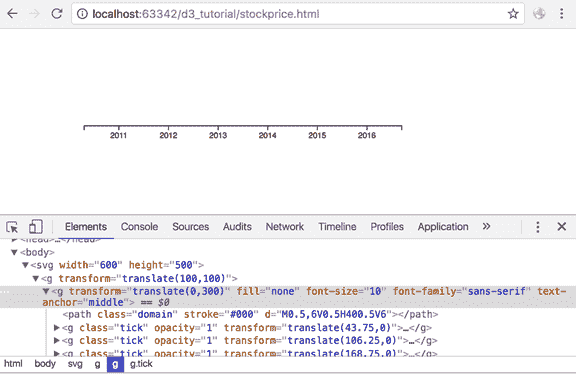
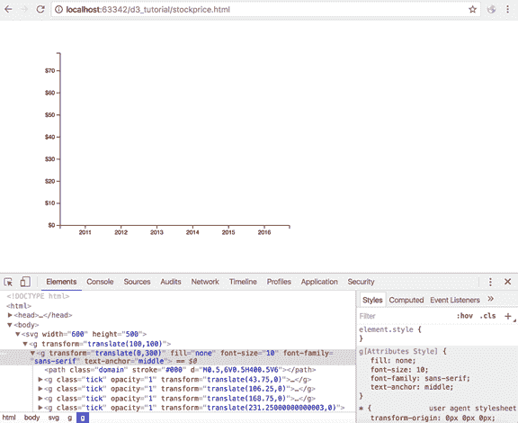
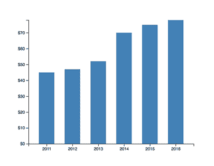
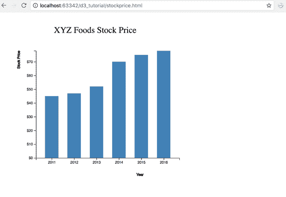

# 使用 D3 创建条形图

> 原文：<https://www.tutorialsteacher.com/d3js/create-bar-chart-using-d3js>

我们在前面的章节中学习了 SVG 图表、比例和坐标轴。在这里，我们将学习在 D3 中创建带有比例和轴的 SVG 条形图。

现在，让我们获取一个数据集，并创建一个条形图可视化。我们将绘制 2011 年至 2016 年期间虚拟公司 XYZ 食品的股票价值。以下 XYZ.csv 文件存储共享值:

XYZ.csv

```
 year,value
2011,45
2012,47
2013,52
2014,70
2015,75
2016,78
```

让我们使用上面存储 XYZ 股票价格值的 XYZ.csv 文件构建一个垂直条形图。

**第 1 步:**从创建 SVG 开始，定义条形图的比例，如下所示。

```
<body>
<svg width="600" height="500"></svg>
<script>

    var svg = d3.select("svg"),
        margin = 200,
        width = svg.attr("width") - margin,
        height = svg.attr("height") - margin;

    var xScale = d3.scaleBand().range ([0, width]).padding(0.4),
        yScale = d3.scaleLinear().range ([height, 0]);

    var g = svg.append("g")
               .attr("transform", "translate(" + 100 + "," + 100 + ")");

</script>
</body> 
```

让我们演练一下上面的代码:

```
var svg = d3.select("svg"),
margin = 200,
width = svg.attr("width") - margin,
height = svg.attr("height") - margin; 
```

我们创建了一个宽度为 600 像素、高度为 500 像素的 SVG 元素。

在我们的 D3 程序中，我们通过给 SVG 添加一些边距来调整 SVG 的宽度和高度。我们将这个值存储在一个名为 margin 的变量中，这样我们就可以随时在一个地方调整这个值。

接下来，我们定义 x 轴和 y 轴的比例。我们将不得不创建两个轴，所以我们需要有两个轴的两个比例。

`var xScale = d3.scaleBand().range ([0, width]).padding(0.4),`

上面的代码片段定义了 x 轴的比例。我们使用 d3.scaleBand()作为 x 轴。scaleBand()用于构造波段刻度。当我们的数据具有离散波段时，这很有用。在我们的案例中，这些是年份值- 2011 年、2012 年、2013 年等。我们需要为我们的比例函数提供一个域和范围。记住，域是输入，范围是输出。scaleBand()函数创建一个空域，我们可以在加载数据后指定它。波段的范围是 SVG 的宽度。此外，由于我们有离散的乐队，这将是很好的有一些空间或填充之间的酒吧。为此，我们在离散比例中添加了 0.4 的填充。您可以更改填充值来增加或减少小节之间的间距。

`yScale = d3.scaleLinear().range ([height, 0]);`

上面定义了 y 轴的线性标度，因为这个轴将显示我们的股票价格。因为这是垂直轴，这里的范围是 SVG 的高度。

`var g = svg.append("g").attr("transform", "translate(" + 100 + "," + 100 + ")");`

上面的代码在我们的 SVG 中添加了一个组元素。我们将把轴和条添加到组元素中。我们添加一个转换属性来定位我们的图，并留出一些空白。

**步骤 2:** 让我们从 CSV 文件中加载数据，并将轴添加到 SVG 中。

```
<body>
<svg width="600" height="500"></svg>
<script>

    var svg = d3.select("svg"),
        margin = 200,
        width = svg.attr("width") - margin,
        height = svg.attr("height") - margin;

    var xScale = d3.scaleBand().range ([0, width]).padding(0.4),
        yScale = d3.scaleLinear().range ([height, 0]);

    var g = svg.append("g")
               .attr("transform", "translate(" + 100 + "," + 100 + ")");

    d3.csv("XYZ.csv", function(error, data) {
        if (error) {
            throw error;
        }

        xScale.domain(data.map(function(d) { return d.year; }));
        yScale.domain([0, d3.max(data, function(d) { return d.value; })]);

        g.append("g")
         .attr("transform", "translate(0," + height + ")")
         .call(d3.axisBottom(xScale));

        g.append("g")
         .call(d3.axisLeft(yScale).tickFormat(function(d){
             return "$" + d;
         }).ticks(10))
         .append("text")
         .attr("y", 6)
         .attr("dy", "0.71em")
         .attr("text-anchor", "end")
         .text("value");
});
</script>
</body> 
```

让我们演练一下上面的代码:

```
d3.csv("XYZ.csv", function(error, data) {
    if (error) {
        throw error;
    }
}); 
```

此步骤使用 d3.csv()方法加载 XYZ.csv 文件。我们增加了错误处理，以防文件加载失败。

`xScale.domain(data.map(function(d) { return d.year; }));`

现在我们已经加载了数据，我们可以提供 x 和 y 尺度的域值。上面的代码提供了 x 轴。我们使用 data.map()将离散年份值映射到 x 比例。

`yScale.domain([0, d3.max(data, function(d) { return d.value; })]);`

我们使用 d3.max()函数输入 y 轴的域[0，max]值。

下面的代码将轴添加到 SVG 中。

```
g.append("g")
 .attr("transform", "translate(0," + height + ")")
 .call(d3.axisBottom(xScale)); 
```

我们添加另一个组元素，将我们的 x 轴分组到一个组元素下。然后，我们使用转换属性将我们的 x 轴向 SVG 的底部移动。然后我们使用`.call(d3.axisBottom(x))`在这个组元素上插入 x 轴。

这就是输出在这一点上的样子:

[](../../Content/images/d3js/bar-chart1.png)

接下来，我们要添加 y 轴。

`g.append("g") .call(d3.axisLeft(y)`

与 x 轴一样，我们添加另一个组元素来保存 y 轴及其组件。我们使用`.call(d3.axisLeft(y))`添加 y 轴。

```
.tickFormat(function(d){
                    return "$" + d;
                }).ticks(10)) 
```

由于我们的 y 轴描述了一个货币值，所以我们使用 tickFormat()方法格式化了刻度。我们还使用刻度(10)指定了希望 y 轴具有的刻度数。

让我们看看现在的输出:

[](../../Content/images/d3js/bar-chart2.png)

Bar Chart


好了，现在我们已经添加了两个轴。

**步骤 3:** 接下来，我们要创建与数据值对应的条。

由于这是一个垂直条形图，图表宽度将是固定的，条宽将根据数据集大小而变化。我们将通过将图表宽度除以数据集大小来计算条形宽度。

Example: Bar Chart in D3

```
<!doctype html>
<html>
<head>
    <style>
        .bar {
            fill: steelblue;
        }
    </style>
    <script src="https://d3js.org/d3.v4.min.js"></script>
</head>
<body>
<svg width="600" height="500"></svg>
<script>
var svg = d3.select("svg"),
            margin = 200,
            width = svg.attr("width") - margin,
            height = svg.attr("height") - margin

var xScale = d3.scaleBand().range([0, width]).padding(0.4),
            yScale = d3.scaleLinear().range([height, 0]);

var g = svg.append("g")
            .attr("transform", "translate(" + 100 + "," + 100 + ")");

    d3.csv("XYZ.csv", function(error, data) {
        if (error) {
            throw error;
        }

        xScale.domain(data.map(function(d) { return d.year; }));
        yScale.domain([0, d3.max(data, function(d) { return d.value; })]);

        g.append("g")
         .attr("transform", "translate(0," + height + ")")
         .call(d3.axisBottom(xScale));

        g.append("g")
         .call(d3.axisLeft(yScale).tickFormat(function(d){
             return "$" + d;
         }).ticks(10));

        g.selectAll(".bar")
         .data(data)
         .enter().append("rect")
         .attr("class", "bar")
         .attr("x", function(d) { return xScale(d.year); })
         .attr("y", function(d) { return yScale(d.value); })
         .attr("width", xScale.bandwidth())
         .attr("height", function(d) { return height - yScale(d.value); });
    });
</script>
</body>
</html>
```

让我们看看我们是如何添加这些条的:

```
g.selectAll(".bar")
 .data(data)
 .enter().append("rect") 
```

我们已经使用 SVG 矩形元素用我们的数据创建了动态条。

`.attr("class", "bar")`

我们还向矩形元素添加了一个类“bar”。

```
.bar {
        fill: steelblue;
    } 
```

接下来，我们需要指定每个条的 x 和 y 位置，并提供条的宽度和高度。

`.attr("x", function(d) { return x(d.year); })`

我们使用之前创建的 x 刻度，并从数据中传递年份值。x 刻度返回从指定范围到我们的刻度的相应 x 值。在这种情况下，它是 SVG 的宽度。

`.attr("y", function(d) { return y(d.value); })`

同样，我们将数据值传递给 y 刻度，并从 y 范围接收相应的 y 值。

`.attr("width", xScale.bandwidth())`

条形的宽度由 scaleBand()函数决定。因此，x-scale 返回从提供给 x-scale 的范围和填充计算出的带宽。

`.attr("height", function(d) { return height - yScale(d.value); });`

条形的高度将计算为高度-y 刻度(d 值)。这将是 SVG 的高度减去 y 标尺上相应的 y 值。请记住，这里的 y 值将是条的顶端，因为它是从原点计算的，原点在(0，0)。

现在的输出是:

[](../../Content/images/d3js/bar-chart3.png)

Bar Chart in D3.js


我们已经创建了数据驱动的可视化！

## 向条形图添加标签

要添加标签，我们需要在 SVG 中添加文本元素。我们需要 x 轴和 y 轴的标签。我们还可以给可视化添加一个标题。

对于可视化标题，让我们向 SVG 添加一个文本元素:

```
svg.append("text")
   .attr("transform", "translate(100,0)")
   .attr("x", 50)
   .attr("y", 50)
   .attr("font-size", "24px")
   .text("XYZ Foods Stock Price") 
```

对于 x 轴，将以下文本元素追加到 x 轴组元素中:

```
g.append("g")
 .attr("transform", "translate(0," + height + ")")
 .call(d3.axisBottom(xScale))
 .append("text")
 .attr("y", height - 250)
 .attr("x", width - 100)
 .attr("text-anchor", "end")
 .attr("stroke", "black")
 .text("Year"); 
```

对于 y 轴，将以下文本元素追加到 y 轴组元素中:

```
g.append("g")
 .call(d3.axisLeft(yScale)
 .tickFormat(function(d){
     return "$" + d;
 }).ticks(10))
 .append("text")
 .attr("transform", "rotate(-90)")
 .attr("y", 6)
 .attr("dy", "-5.1em")
 .attr("text-anchor", "end")
 .attr("stroke", "black")
 .text("Stock Price"); 
```

以下是完整的条形图示例代码。

Example: Bar Chart with Labels

```
<!doctype html>
<html>
<head>
    <style>
        .bar {
            fill: steelblue;
        }
    </style>
    <script src="https://d3js.org/d3.v4.min.js"></script>
<body>
<svg width="600" height="500"></svg>
<script>

    var svg = d3.select("svg"),
        margin = 200,
        width = svg.attr("width") - margin,
        height = svg.attr("height") - margin

    svg.append("text")
       .attr("transform", "translate(100,0)")
       .attr("x", 50)
       .attr("y", 50)
       .attr("font-size", "24px")
       .text("XYZ Foods Stock Price")

    var xScale = d3.scaleBand().range([0, width]).padding(0.4),
        yScale = d3.scaleLinear().range([height, 0]);

    var g = svg.append("g")
               .attr("transform", "translate(" + 100 + "," + 100 + ")");

    d3.csv("XYZ.csv", function(error, data) {
        if (error) {
            throw error;
        }

        xScale.domain(data.map(function(d) { return d.year; }));
        yScale.domain([0, d3.max(data, function(d) { return d.value; })]);

        g.append("g")
         .attr("transform", "translate(0," + height + ")")
         .call(d3.axisBottom(xScale))
         .append("text")
         .attr("y", height - 250)
         .attr("x", width - 100)
         .attr("text-anchor", "end")
         .attr("stroke", "black")
         .text("Year");

        g.append("g")
         .call(d3.axisLeft(yScale).tickFormat(function(d){
             return "$" + d;
         })
         .ticks(10))
         .append("text")
         .attr("transform", "rotate(-90)")
         .attr("y", 6)
         .attr("dy", "-5.1em")
         .attr("text-anchor", "end")
         .attr("stroke", "black")
         .text("Stock Price");

        g.selectAll(".bar")
         .data(data)
         .enter().append("rect")
         .attr("class", "bar")
         .attr("x", function(d) { return xScale(d.year); })
         .attr("y", function(d) { return yScale(d.value); })
         .attr("width", xScale.bandwidth())
         .attr("height", function(d) { return height - yScale(d.value); });
    });
</script>
</body>
</html> 
```

上面的代码将导致下面的条形图可视化。

[](../../Content/images/d3js/bar-chart-in-d3.png)

Bar Chart in D3.js


因此，我们可以使用 D3 创建一个条形图。