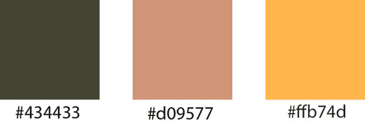
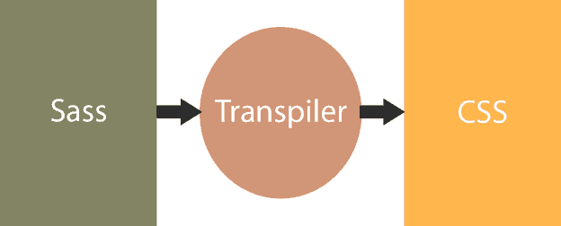

# 什么是萨斯？

> 原文:[https://www.tutorialsteacher.com/Sass/what-is-sass](https://www.tutorialsteacher.com/Sass/what-is-sass)

Sass(代表语法上很棒的样式表)是 CSS 的扩展。它并没有真正改变 CSS 能做什么，你不会突然能够使用 Adobe Photoshop 混合模式或任何东西——但是它让编写 CSS 变得容易得多。

Saas 包括各种功能，如变量、嵌套规则、混合、内联导入、操作颜色和其他值的内置函数，所有这些都具有完全与 CSS 兼容的语法。

官网:[http://sass-lang.com](http://sass-lang.com)T2】

## 为什么是萨斯？

自 1996 年被 W3C 首次采用以来，级联样式表(CSS)已经取得了长足的进步。web 开发人员不得不分割图像并使用不可维护的嵌套表进行布局的日子已经一去不复返了(这是一个很好的解脱)。但是 CSS3，虽然它对我们这些还记得功能有限和实现不稳定的糟糕旧时光的人来说很棒，但它还没有完全实现。

任何不平凡的网站仍然需要重复的代码和多个规则声明来支持多个浏览器。让我给你举个例子:你的客户为网站选择了一个简单的配色方案，有一种原色和两种色调:

<figure>[](../../Content/images/sass/color-example1.png)</figure>

这是基本的东西，对吗？但是你需要打多少次这些数字呢？在你编写的几乎每一个 CSS 规则中，你至少需要一个。(记住，每打一次东西，就有另一次犯错的机会。)

然后你可能需要计算出这些值的变化。快，比#434433 轻 20%的颜色的十六进制代码是什么？对于禁用的菜单项，您可能需要它。当设计者决定禁用值应该是 15%而不是 20%时，您需要再次进行计算，并在使用它的每个地方进行更改。CSS3 的功能可能比 CCS1 大几光年，但那只是丑陋、乏味，而且比素食主义者饮食的流行明星更难维护。

您可以这样写，而不是无数次地键入#434433，并在禁用值百分比发生变化时将#76785A 更改为#696B50:

Sass Example 

```
/*define a variable for the primary color*/
$primary : #434433;

/*use the lighten() function to determine the disabled value, and define it as a variable*/
$disabled: lighten($primary, 20%);

.menu-item {
   color: $primary; /* use primary variable */

.disabled-menu-item {
   color: $disabled;/* use disabled variable */
} 
```

现在如果原色改变了，你只能在一个地方改变它。如果设计者决定使用 15%而不是 20%作为禁用值，则不必重新计算，只需在一个地方进行更改。更好的是，由于 Sass 的工作方式(我们将在下一节中讨论)，您可以在一个文件中声明所有的变量(按照惯例，它是一个名为 _variables.scss 的文件)，并@将它们包含在您编写的每个样式表中，而不会导致额外的 http 调用。多甜蜜啊。

## 萨斯是如何工作的？

您不能将 Sass 代码直接发送到浏览器；它不知道该拿它怎么办。相反，您需要使用 Sass 预处理器将 Sass 代码翻译成标准 CSS，这一过程被称为*转换*。translation 非常像编译，但是它不是从人类可读的源代码翻译成机器可读的目标代码，而是从一种人类可读的语言翻译成另一种语言，在这种情况下是从 Sass 翻译成 CSS。您可能熟悉网络开发中使用的另一个 transpiler，Babel()，它将 ES2015 翻译成与下游浏览器兼容的 JavaScript。不同的语言，相同的过程。

不要担心在透明过程中到底发生了什么。这是我们这个行业中(极少数)能“奏效”的事情之一。你需要明白的是，你给 transpiler 一些 Sass 代码，你得到一些 CSS 代码回来。

<figure>[](../../Content/images/sass/sass-process.png)</figure>

从 Sass 到 CSS 的转换很容易。考虑以下 Sass 代码示例。

Sass: 

```
/*define a variable for the primary color*/
$primary : #434433;

/*use the lighten() function to determine the disabled value, and define it as a variable*/
$disabled: lighten($primary, 20%);

.menu-item {
   color: $primary;

.disabled-menu-item {
   color: $disabled;
} 
```

现在，Saas transpiler 将为上面的 Sass 代码生成以下 CSS。

CSS 

```
 .menu-item {
   color: #434433;

.disabled-menu-item {
   color: #76785A;
} 
```

如您所见，变量被 CSS 中的值替换。因此，Sass 使得为应用程序创建和维护 CSS 文件变得很容易。

下一章学习安装 Sass。***