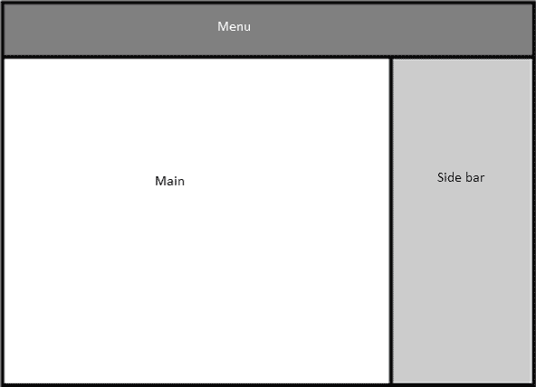

# SASS 语法

> 原文：<https://www.tutorialsteacher.com/sass/sass-syntax>

在我们编写任何 Sass 代码之前，让我们学习一下 Sass 语法的基础知识。

## SASS 文件类型

Sass transpiler 支持两种不同的文件类型:**。SASS**和**。scss** -每个都有自己的扩展和语法。在版本 3 之前，SASS 文件使用了**。sass** 扩展，并使用类似于 [haml](http://haml.info) 的缩进语法。在版本 3 中，SASS 推出了**。scss** 格式(“Sassy css”)，这更接近 CSS 本身。

虽然。仍然支持 sass 文件，我们将使用较新的。本教程中的 scss 格式。如果你对 [haml](http://haml.info) 感到满意，并想探索更古老的语法，学习[。sass 文档](http://sass-lang.com/documentation/file.INDENTED_SYNTAX.html)中的 Sass 语法。

甚至有一个 sass 实用程序可以从一种语法转换到另一种语法。只需在 Windows 或 Mac 上的命令提示符下使用`sass-convert`命令，如下所示:

使用以下命令进行转换。sass 到. SCS。

`sass-convert style.sass style.scss`

以下命令转换。SCS 到. sass。

`sass-convert style.scss style.sass`

## SCSS 语法

Sass 的 scss 语法的基本结构与 css 相同。您已经知道的关于如何编写 CSS 规则的所有内容仍然适用。事实上，您可以直接将 CSS 传递给 Sass transpiler，它将毫无问题地工作。

但是 Sass 确实在一些重要和有用的方面扩展了 CSS 语法。像往常一样，这些扩展没有给 CSS 增加任何新的功能，只是让它更容易编写，并且它们将被 transpiler 翻译成纯 CSS。我们将在本章的剩余部分研究重要的扩展。

### 内嵌注释

正如我们所看到的，Sass 支持标准的 CSS 语法，其中包括 CSS 注释语法:

SCSS: 

```sass
/* Text color for alert messages */
.alert { 
   color: red;
} 
```

但是 Sass 也支持内联注释，这对于记录规则中的单个属性非常有用:

SCSS: 

```sass
/* warning color pulse */
.warning {
   animation: warning-pulse 5s infinite; //pulses red to yellow
} 
```

Sass 处理使用`/* comment */`语法的传统 CSS 注释和使用`//`的内联注释的方式有一个重要的区别。

`/* */` CSS 注释原封不动地传递到输出文件，但是内嵌注释`//`被移除。 这实际上意味着你可以避免把 CSS 和 Sass 特有的注释混在一起，这样只会让阅读最终样式表的人感到困惑。

### 嵌套规则

许多网页被布置在不同风格的“区域”中。下图显示了一个常见的布局，包括一个菜单区域、一个侧栏和一个主要内容区域。



布局的主 html 页面通常使用带有 id 属性的 div 元素来设置。

在 CSS 中，您可以使用#id 来设置每个区域中元素的样式:

Example: CSS Rules 

```sass
#main {
    //#main general rules
    ...  
} 
#main p {
    //rules for <p> elements within main
    ...  
} 

#menu {
    //#menu general rules
    ...  
} 

#menu ul {
    //rules for <ul> elements within main
    ...
} 
```

Sass 提供了一个更简洁的解决方案:您可以嵌套选择器。您的代码可以如下所示:

SCSS: 

```sass
#main {
    //#main general rules
   p {...} //rules for <p> elements within main
   //more #main general rules
    ...
}

#menu {
    //#menu general rules
    ul {
        //rules for <ul> elements within main
        ...
    } 
} 
```

即使有一个这么简单的例子，你也可以看到 CSS 稍微干净一点，更容易阅读。该示例显示了#main 元素拆分的一般规则，p 规则将它们分开。这是完全有效的 Sass 语法，但这不是最佳实践——像这样拆分规则会使它们很容易被忽略。

### 父选择器

Sass 提供的嵌套选择器可以节省大量的键入，并澄清您的 CSS，但是有些情况是简单的嵌套无法处理的。

以 a:悬停伪选择器为例。`:hover`本身不是有效的 CSS(或 Sass)，所以不管它有多可读，你都不能写:

CSS: 

```sass
a {
   color: red;
   :hover: green; //this isn't valid
} 
```

进入 Sass 父选择器`&`。使用父选择器和 Sass 嵌套，您可以编写:

SCSS: 

```sass
a {
   color: red;
   &:hover: green;
} 
```

Sass transpiler 会将其转换为有效的 CSS:

CSS: 

```sass
a {
   color: red;
}

a:hover {
   color: green;
} 
```

Sass 父选择器可以在您通常键入选择器关键字的任何地方使用，但它必须在开头。也就是说，`&:active p {...}`会起作用，但是 `#main &p`不会。

但是因为父选择器在某些方面像简单的文本替换一样工作，所以使用它还有一个技巧。比方说，你有这样的 HTML:

Example: HTML 

```sass
<div id="main">
    <div id="main-header">

    </div>
</div>
```

使用父选择器，您可以使用父选择器来嵌套 CSS 规则:

SCSS: 

```sass
#main {
   ...// general rules for the #main div
   &-header {
      ...//rules for the #main-header div
   }
} 
```

### 嵌套属性

Sass 还提供了一个 CSS 扩展:嵌套属性，这将节省您的输入，并使您的代码更易读。有几组具有相同前缀的 CSS 属性，例如字体系列、字体大小和字体粗细或文本对齐、文本转换和文本溢出。Sass 允许您将它们视为嵌套规则:

SCSS: Nested Properties 

```sass
font: {
   family: serif;
   size: 30rem;
   weight: bold;
}

text: {
   align: center;
   transform: uppercase;
   overflow: hidden;
} 
```

Sass transpiler 会将这些嵌套规则扩展到普通 CSS 中:

CSS: 

```sass
font-family: serif;
font-size: 30rem;
font-weight: bold;

text-align: center;
text-transform: uppercase;
text-overflow: hidden; 
```

如果前缀本身就是一个规则，就像字体一样，您可以在左大括号之前设置该属性:

SCSS: 

```sass
font: serif {
   font-weight: bold;
} 
```

这种语法导致了稍微简洁的 CSS，但是牺牲了可读性。************