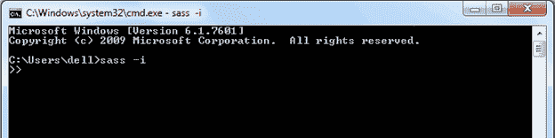

# SassScript

> 原文:[https://www.tutorialsteacher.com/sass/sass-script](https://www.tutorialsteacher.com/sass/sass-script)

到目前为止，我们已经将 Sass 视为一种更简洁、更易于阅读的 CSS 编写方式。但是萨斯 transpiler 可以做得更多。它不是一种完全成熟的编程语言，它缺少了一些我们期望从现代语言中得到的结构。但是，它确实提供了一些基本的脚本功能，包括算术运算符、控制指令流和一些非常方便的功能。

SassScript 是一个允许我们使用 Sass 表达式计算 CSS 选择器、属性或值的脚本。我们将在本章中查看表达式，并在接下来的几章中探索数据类型、SassScript 控制指令、操作和函数。所有这些都可以在 SassScript 中使用。

## 萨斯表达式

当你使用 SassScript 的时候，你仍然在写 CSS。您可以访问我们在“语法”一章中探讨的 CSS 扩展，但您仍将使用 CSS 规则的基本结构:

Syntax:

```
<selector> {
   <property>: <value>;
   <property>: <value>;
   ...
}

```

这不会改变。改变的是你可以用一个表情代替<selector>、<property>或者<value>。Sass 表达式是值和运算符的某种组合，Sass transpiler 将在输出最终 CSS 之前对其进行评估。</value></property></selector>

我们已经探讨过的变量是 SassScript 表达式的一个重要例子。当发送者看到以下代码时:

SCSS:<button class="copy-btn pull-right" title="Copy example code">*Copy*</button> 

```
$dark-green: #0f5a0c;

p {
   color: $dark-green;
} 
```

它计算变量`$dark-green`并替换结果，在本例中为#0f5a0c，在 CSS 中它输出:

CSS:<button class="copy-btn pull-right" title="Copy example code">*Copy*</button> 

```
p { 
   color: $0f5a0c;
} 
```

但是 SassScript 表达式可能比变量稍微复杂一点。它们可以包括如下所示的操作。(我们将在[运算符](/Sass/sass-operators)一章中详细探讨。)

SCSS:<button class="copy-btn pull-right" title="Copy example code">*Copy*</button> 

```
$text-size: 25px;

p {
   font-size: $text-size * 1.20;
} 
```

这个例子将计算变量`$text-size`和运算符*(乘法)，并输出以下 CSS:

CSS:<button class="copy-btn pull-right" title="Copy example code">*Copy*</button> 

```
p {
   font-size = 30px;
} 
```

您也可以使用 SassScript 提供的一个函数(我们将在[函数](/Sass/sass-functions)一章中探讨这些函数):

SCSS:<button class="copy-btn pull-right" title="Copy example code">*Copy*</button> 

```
p {
  font-color = rgb(135, 204, 166); 
} 
```

`rgb()` SassScript 函数根据提供的红绿蓝颜色生成十六进制颜色值，因此 transpiler 将输出:

CSS:<button class="copy-btn pull-right" title="Copy example code">*Copy*</button> 

```
p {
   font-color = #87cca6; 
} 
```

在每种情况下，transpiler 本质上都在做同样的事情:它计算表达式，该表达式可能包括任何组合的变量、运算符和函数，并输出简单的 CSS 值。

## 使用脚本解释器

当您使用 SassScript 时，能够执行表达式而不经过转换过程是很方便的。Sass 提供了一个命令行解释器，可在命令窗口中使用。

注意:在 Windows 上，确保使用安装 Ruby 时安装的命令窗口。

使用以下命令加载 Sass 解释器:

`sass -i`

您的命令提示符将从默认值(根据您使用的操作系统而有所不同)更改为> >。下面是 windows 平台下的一个 sass 解释器。

<figure>[](../../Content/images/sass/sass-interpreter.png)

<figcaption>Sass Interpreter</figcaption>

</figure>

现在，您可以键入任何表达式，结果将显示在窗口中。您甚至可以使用变量，但是解释器只会在一次会话中记住它们。如果关闭命令窗口，解释器下次将不会记住变量值。

为什么不输入本章的示例表达式来试试呢？记住，你只要输入表达式，不要输入 CSS，不要在末尾加分号。比如输入`rgb(135, 204, 166)`而不是 `font-color = rgb(135, 204, 166);`，这样不行。

在下一章中了解数据类型。******