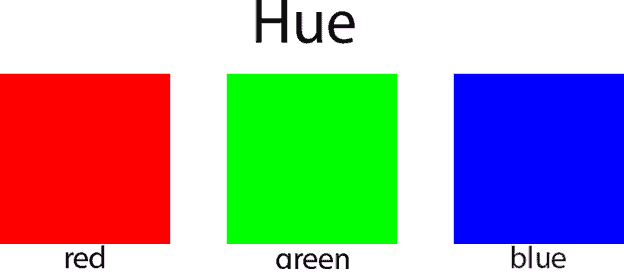
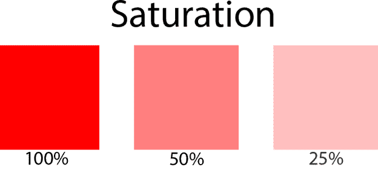
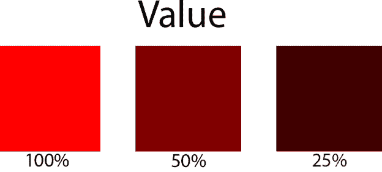
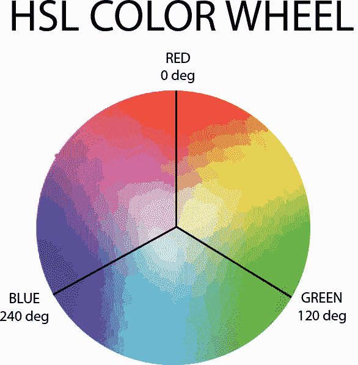
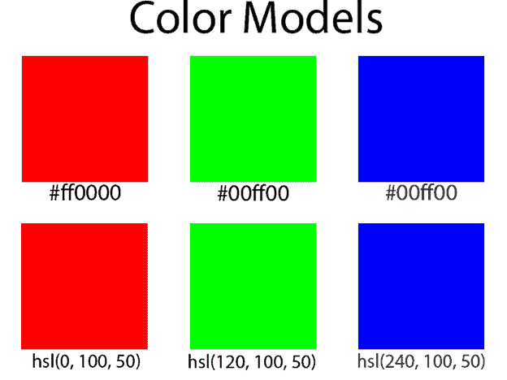
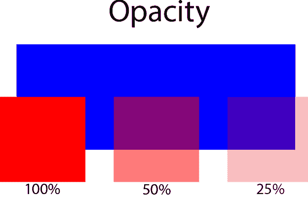

# 萨斯颜色函数

> 原文：<https://www.tutorialsteacher.com/sass/sass-color-functions>

在这一章中，我们将探索最后一组 Sass 函数，那些用于处理颜色的函数。Sass 颜色功能使使用数字颜色几乎像在调色板上混合颜料一样简单。它们不会取代你选择初始调色板时最喜欢的颜色工具，但是

## 颜色成分

在我们谈论萨斯颜色函数之前，让我们花一点时间来确保我们清楚他们操纵的颜色元素。传统的颜色理论将任何颜色分为三个部分:色调、饱和度和价值。

色相(有时称为“局部颜色”)一般是我们问“是什么颜色”时的意思-汽车是蓝色的，苹果是红色的:

饱和度是颜色中“多少”色调的量度——它是强度。想想日落时颜色会发生什么。颜色越纯，饱和度越高。

最后一个成分，价值，是衡量一种颜色的明度或暗度。想象一棵树，它的一些叶子在明亮的光线下，一些叶子在阴影中:

## 颜色模型

数字上，颜色表示为 RGB 或 HSL。(还有其他模型，包括 CMYK 和 LAB，但只有 RGB 和 HSL 与 Sass 开发相关。)

RGB 值是颜色中红色、绿色和蓝色数量的度量。每个分量都是介于 0(没有该颜色)和 255(所有该颜色)之间的值。RGB 颜色通常用十六进制表示:例如#00ff00 或#2abd35。

HSL 代表“色相、饱和度和明度”。你也可能会遇到 HSV(V 代表“价值”)和 HSB(B 代表“亮度”)车型。比如 Photoshop，使用的是 HSB。注意了。这不是一回事。

HSL 没有常规的表达方式。即使您不在 Sass 中工作，它们也通常表示为一个函数:

hsl(色调、饱和度、价值)

色调以色轮上的度数表示(纯红色为 0，纯绿色为 120，纯蓝色为 240)，而饱和度和值以百分比表示。

可以在显示器上显示的任何颜色(有些不能)都可以使用以下任一模型来表示:

当然，这个例子很简单。在 RGB 和 HSL 之间转换时，色调分量有时会变得有点难看。例如#ac4138 的色调为 4.65517 度。

数字色彩还有一个传统色彩理论中不存在的附加方面:不透明度。在 RGB 和 HSL 颜色模型中，不透明度通过 0 到 100%之间的 alpha 值表示，0 表示完全透明，100%表示完全不透明:

## 萨斯的色彩创造功能

现在我们知道了我们正在使用的颜色组件，让我们来看看 Sass 提供的功能。我们将从基于两种颜色模型之一创建颜色的函数开始。rgb()和 hsl()对于生成更简洁的 CSS 非常有用。现在所有现代浏览器都支持 rgba()和 hsla() CSS 函数，所以 Sass transpiler 将保持这些函数在 CSS 中的原样。

其余三个函数，灰度()、反转()和补码()基于现有颜色创建新颜色。如图所示，反转()将每个红色、绿色和蓝色值反转，补码()将颜色旋转 180 度，返回非常相似但不完全相同的结果。

| 功能 | 描述 | 例子 |
| --- | --- | --- |
| rgb(红色、绿色、蓝色) | 基于指定的十进制值或百分比创建不透明颜色 | rgb(173、64、56)

**结果:**
#ad4038 |
| rgb(50%、50%、100%)

**结果:**
【8080 ff】 |
| rgba(红色、绿色、蓝色、alpha) | 基于指定的十进制值或百分比值，以指定的不透明度创建颜色。 | rgba(172、65、56、0.5 )

**结果:**
rgba(172、65、56、0.5 ) |
| hsl(色调、饱和度、明度) | 基于指定的色调(以度为单位)、饱和度和亮度(以百分比为单位)创建不透明颜色 | hsl(4、51、45)

**成绩:**
#ad4038 |
| HSLA($色调，$饱和度，$明度，$alpha) | 基于指定的色调、饱和度和明度，以指定的不透明度创建颜色。 | hsla(4、51、45、50)

**结果:**
hsla(4、51、45、50) |
| 灰度(彩色) | 返回与$color 具有相同强度的灰色 | 灰度(#ad4038)

**结果:**
#737373 |
| 补码($color) | 返回一种颜色，该颜色具有相同的饱和度和值，但色调与$color 的色调相差 180 度。 | 补码(#ad4038)

**结果:**
#38a5ad |
| 反转(颜色) | 返回$color 的红色、绿色和蓝色分量的倒数。 | 反转(#ad4038)

**结果:**
#52bfc7 |

## Sass 中的组件提取函数

| 功能 | 描述 | 例子 |
| --- | --- | --- |
| 红色(彩色) | 返回$color 的红色部分。 | 红色(#ad4038)

**成绩:**
173 |
| 绿色(彩色) | 返回$color 的绿色部分。 | 绿色(#ad4038)

**结果:**
T7】64 |
| 蓝色(彩色) | 返回$color 的蓝色部分。 | 蓝色(#ad4038)

**成绩:**
T7】56 |
| 色调(($color) | 返回$color 的色调 | Hu(# ad 4038)
**【结果:**
【t410246 deg】 |
| 饱和度(颜色) | 返回$color 的色调 | 饱和度(#ad4038)

**结果:**
51.091% |
| 明度(颜色) | 返回$color 的色调 | 明度(#ad4038)

**结果:**
44.90196 & |
| alpha(颜色)不透明度(颜色) | 总是返回 1 | 阿尔法(#ad4038)

**结果:**
1 |

## 操纵颜色

该组中的所有功能都允许您以各种方式更改颜色。示例中使用的基色是#ad4038:

<svg height="60" width="200"><g transform="translate(0,0)"><text x="70" y="25" fill="#fff">#ad4038</text></g></svg>

| 功能 | 描述 | 例子 |
| --- | --- | --- |
| 混搭($color1，$color2，[$weight]) | 通过平均红色、绿色和蓝色分量来组合两种颜色。可选的$weight 参数确定第一种颜色包含多少(默认为 50%)。 | 混合(#ad4038、#0000ff、80)

**结果:**
<svg height="50" width="200"><g transform="translate(0,0)"><text x="70" y="25" fill="#fff"># 8a 3360</text></g></svg> |
| 调整-色调(颜色，$度) | 将$color 的色调旋转指定的度数 | 调整-色调(#ad4038，20)

**结果:**
<svg height="50" width="200"><g transform="translate(0,0)"><text x="70" y="25" fill="#fff"># ad 6738</text></g></svg> |
| 变浅(颜色，金额) | 以$amount 指定的百分比将指定的颜色变浅 | 减轻(#ad4038，20)

**结果:**
<svg height="50" width="200"><g transform="translate(0,0)"><text x="70" y="25" fill="#fff"># d37e 78</text></g></svg> |
| 加深(颜色，金额) | 以$amount 指定的百分比将指定的颜色变暗 | 变暗(#ad4038，20)

**结果:**
<svg height="50" width="200"><g transform="translate(0,0)"><text x="70" y="25" fill="#fff"># 60231 f</text></g></svg> |
| 饱和(颜色，数量) | 将指定颜色的饱和度增加以美元为单位指定的百分比 | 饱和(#ad4038，20)

**结果:**
<svg height="50" width="200"><g transform="translate(0,0)"><text x="70" y="25" fill="#fff"># c42c 21</text></g></svg> |
| 去饱和(颜色，金额) | 将指定颜色的饱和度降低以美元为单位指定的百分比 | 去饱和(#ad4038，20)

**结果:**
<svg height="50" width="200"><g transform="translate(0,0)"><text x="70" y="25" fill="#fff"># 96544 f</text></g></svg> |
| rgba(颜色，阿尔法) | 按照$alpha 中指定的百分比调整$color 的不透明度 | rgba(#ad4038，50)

**结果:**
<svg height="50" width="200"><g transform="translate(0,0)"><text x="40" y="25" fill="#fff">rgba(172，65，56，0.5)</text></g></svg> |
| 不透明(颜色，金额)淡入(颜色，金额) | 按$alpha 中指定的百分比增加$color 的不透明度 | 不透明(#ad4038，50)

**结果:**
<svg height="50" width="200"><g transform="translate(0,0)"><text x="40" y="25" fill="#fff">rgba(172，65，56，1)</text></g></svg> T21】 |
| 透明(颜色，金额)淡出(颜色，金额) | 将$color 的不透明度降低$alpha 中指定的百分比 | 透明化(#ad4038，50)

**结果:**
<svg height="50" width="200"><g transform="translate(0,0)"><text x="40" y="25" fill="#fff">rgba(172，65，56，0.5)</text></g></svg> T21】 |
| 调整-颜色($color，[$red]，[$green]，[$blue]，[$饱和度]，[$明度]，[$alpha]) | 通过一个或多个命名参数更改$color。 | 调整-颜色(#ad4038，$red: 10)

**结果:**
<svg height="50" width="200"><g transform="translate(0,0)"><text x="70" y="25" fill="#fff"># b 74038</text></g></svg> |
| 比例尺-颜色($color，[$red]，[$green]，[$blue]，[$饱和度]，[$明度]，[$alpha]) | 根据一个或多个命名参数中指定的数量调整$color。如果参数是正数，则调整将朝向该组件的最大值。如果是负的，则调整是朝向最小值的 | 比例尺-颜色(#ad4038，$红色:50%)

**结果:**
<svg height="50" width="200"><g transform="translate(0,0)"><text x="70" y="25" fill="#fff"># d 64038</text></g></svg> |
| 比例尺-颜色(#ad4038，$红:-50%)

**结果:**
<svg height="50" width="200"><g transform="translate(0,0)"><text x="70" y="25" fill="#fff"># 574038</text></g></svg> |
| 变色($color，[$red]，[$green]，[$blue]，[$饱和度]，[$明度]，[$alpha]) | 用一个或多个命名参数中指定的值替换$color 的组件。 | 变色(#ad4038，$red: 255)

**结果:**
<svg height="50" width="200"><g transform="translate(0,0)"><text x="70" y="25" fill="#fff"># ff 4038</text></g></svg> |