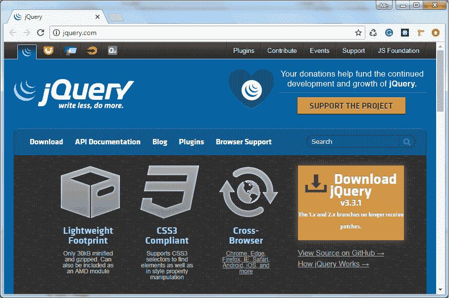
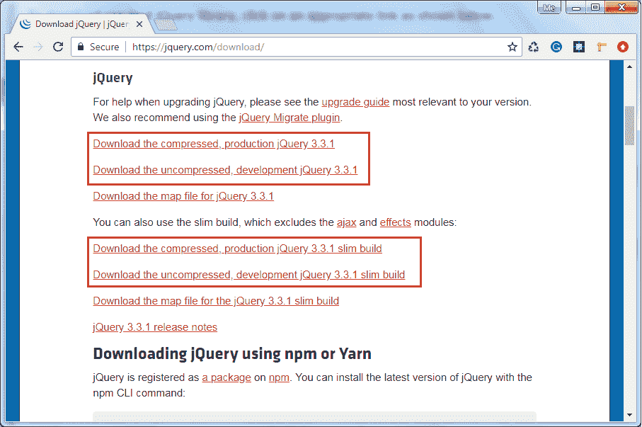
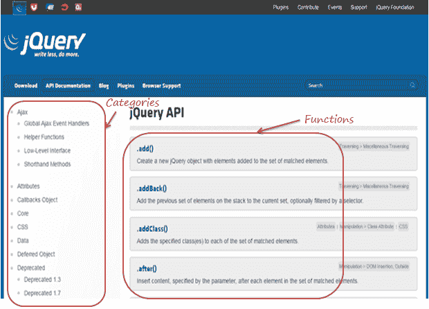

# jQuery 开发工具

> 原文：<https://www.tutorialsteacher.com/jquery/dev-env-setup-for-jquery>

与其他语言一样，jQuery 开发需要一个编辑器来编写 jQuery 代码和 jQuery 库。

## 编者ˌ编辑

您可以使用任何 JavaScript 编辑器编写 jQuery 代码，包括以下内容。

*   笔记本
*   可视化工作室
*   黯然失色
*   Aptana 工作室
*   超级编辑

支持 JavaScript 和 jQuery 函数的智能感知的编辑器将提高开发人员的工作效率。

## jQuery 库

要下载 jQuery 库，请前往[jquery.com](https://jquery.com/)。

[](../../Content/images/jquery/download-jquery.png) 

Download jQuery Library


如上图所示，点击下载 jQuery 链接或下载菜单。这将打开如下所示的下载页面。

[](../../Content/images/jquery/download-jquery-lib3.png) 

Download jQuery Latest Version


这里可以下载最新版本的 jQuery，此时已经是 v3.3 了，上图可以看到，可以下载 jQuery 库的压缩或未压缩版本。压缩版本应该在生产环境中使用，而非压缩版本应该在开发中使用。压缩版本通过消除额外的空白、换行符和缩短变量名和函数名来最小化库。所以，压缩版不可读。未压缩的库是一个可读的文件，在调试时很有用。

下载适当版本的 jQuery 库后，您可以通过在网页中引用它来使用它。请记住，jQuery 库最终是一个 JavaScript 文件。所以你可以像普通的 JavaScript 文件一样使用[脚本标签](/javascript/script-tag)包含它，如下所示。

Example: Refrence jQuery in an HTML page

```
<!DOCTYPE html>

<html>
<head>
    **<script src="~/Scripts/jquery-3.3.1.js"></script>** 
</head>
<body>
</body>
</html>
```

### 包含来自 CDN 的 jQuery 库

也可以从谷歌、微软、CDNJS、jsDelivr 等公共 CDN(内容交付网络)参考 jQuery 库。

Reference jQuery from CDN

```
<!DOCTYPE html>

<html>
<head>
    <script src="https://code.jquery.com/jquery-3.3.1.min.js"
        integrity="sha256-FgpCb/KJQlLNfOu91ta32o/NMZxltwRo8QtmkMRdAu8="
        crossorigin="anonymous">
    </script>
</head>
<body>
</body>
</html>
```

有时，这些债务抵押债券可能会因为某种原因而下跌。因此，如果 CDN 关闭，您需要一个从 web 服务器下载 jQuery 库的回退机制。

下面的例子展示了如何用后退包含来自 CDN 的 jQuery 库引用。

Example: Use CDN with Fallback

```
<!DOCTYPE html>

<html>
<head>
    <script src="https://code.jquery.com/jquery-3.3.1.min.js"
    integrity="sha256-FgpCb/KJQlLNfOu91ta32o/NMZxltwRo8QtmkMRdAu8="
    crossorigin="anonymous">
    </script>

    <script>
    // Fallback to loading jQuery from a local path if the CDN is unavailable
    (window.jQuery || document.write('<script src="~/scripts/jquery-3.3.1.min.js"></script>'));
    </script>
</head>
<body>
</body>
</html>
```

正如您在上面的代码示例中看到的，如果 jQuery 库被成功加载，那么它会将全局函数 jQuery()添加到 window 对象中。如果 window.jQuery 未定义或为空，这意味着 jQuery 库没有被加载，因此您必须从本地服务器路径下载库。

因此，通过这种方式，您可以在网页中下载并参考 jQuery 库。

## 查询API文档

jQuery 提供在线 API 文档。点击 jquery.com 的API文档或转到 api.jquery.com。您将看到如下所示的文档页面。

[](../../Content/images/jquery/jq-api-doc.png) 

jQuery Documentation


正如您在上面看到的，jQuery 特性的类别列在左侧。右侧部分显示了与当前所选类别相关的功能。点击一个函数，获取详细信息，并举例说明。

在设置了开发环境之后，让我们在下一节中看看 jQuery 语法的概述以及如何开始。

  Points to Remember :

1.  使用 JavaScript 编辑器和 jQuery 库设置 jQuery 开发环境。
2.  使用任何文本编辑器编写 jQuery 脚本，例如记事本、Visual Studio、Eclipse、Aptana studio 等。
3.  从[jQuery.com](jquery.com "jQuery Official Site")T2 下载合适版本的 jQuery
4.  使用