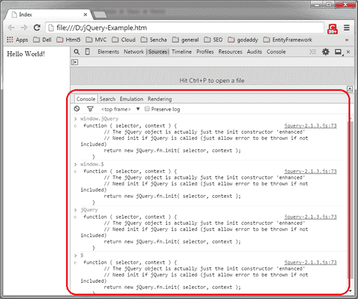
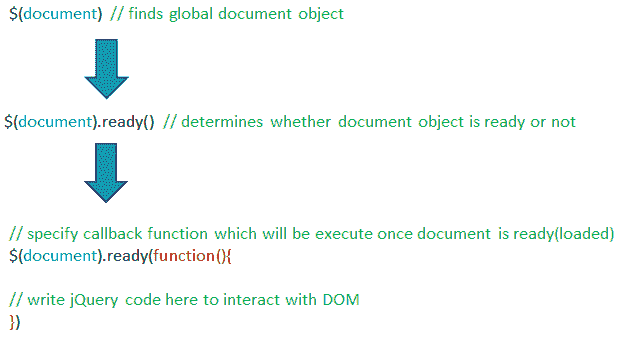

# 开始使用 jQuery

> 原文：<https://www.tutorialsteacher.com/jquery/start-using-jquery>

设置好环境并在网页中包含 jQuery 库的引用后，就该使用 jQuery 了。

## jQuery()函数

当您在浏览器中打开网页并成功加载 jQuery 库时，它会添加一个名为 **jQuery()** 的全局函数。全局范围意味着窗口的范围，因此可以像 window.jQuery()或 jQuery()一样在网页的任何地方调用全局 jQuery()函数。$是 jQuery 函数的别名，因此也可以使用$()作为 jQuery()的简称。

下图显示了 window.jQuery，window。chrome 开发者工具中的$、jQuery 和$函数。

 

jQuery, $ funtion


如上图所示，jQuery、window.jQuery、$和 window。$都一样。

`window.jQuery = window.$ = jQuery = $`

jQuery()(又名$)函数接受两个参数，选择器和上下文，如上图所示。

选择器参数可以是 CSS 样式选择器表达式，用于匹配文档中的一组元素。例如，如果您想对所有 div 元素做一些事情，那么使用$ function 来匹配所有 div 元素，如下所示。

Example: Selector Parameter

```js
jQuery('div')

//Or

window.jQuery('div')

//Or

$('div')

//Or

window.$('div')
```

在这里，您只需传递想要查找的元素的标签名称。jQuery(又名$)函数将返回一个指定为选择器的元素数组。在下一节中，您将了解更多关于选择器的信息。

jQuery()函数中的第二个参数是上下文。上下文参数可以是任何东西，可以是另一个 DOM 元素的引用，也可以是另一个 jQuery 选择器。jQuery 将从上下文中指定的元素开始搜索元素。如果您提供上下文参数，jQuery 选择器可能会执行得更快。但是，上下文参数是可选的。

## 编写 jQuery 代码

通常，jQuery 与 DOM 元素交互，并对它们执行一些操作。因此，我们需要检测 DOM ( [文档对象模型](https://www.w3.org/TR/WD-DOM/introduction.html))何时被完全加载，以便 jQuery 代码开始与 DOM 交互时没有任何错误。

比如我们想写《你好世界》！网页中的 div 标签。第一步是检查 DOM 何时被完全加载，这样我们就可以找到 div 元素，并向它写入“Hello World”。如果我们试图在 DOM 加载之前编写它，jQuery 可能找不到 div 元素，因为它可能在那时没有被构造(如果您在标签中编写 jQuery 脚本)。

jQuery API 包含内置函数 **ready()** ，检测特定元素是否就绪(加载)。这里，我们需要使用 ready()函数检查文档对象是否被加载，因为文档加载了整个 DOM 层次结构。当文档成功加载时，我们可以确定所有的 DOM 元素也已经成功加载。

为了检查是否加载了文档对象，需要使用如下所示的 jQuery 选择器函数来查找文档对象。(文档对象是浏览器中的全局对象，因此您也可以编写 window.document。)

Example: Find Document Object using jQuery Selector

```js
$(document)

//Or

$(window.document)

//Or

jQuery(document)

//Or

window.jQuery(document)
```

上面的代码将找到全局文档对象。现在，您需要使用如下所示的 ready 函数来查找它是否已加载(换句话说，是否就绪)。

`$(document).ready();`

Ready 函数将回调函数作为参数。一旦文档准备好，将调用这个回调函数。

Example: jQuery ready()

```js
$(document).ready(function() {

            // DOM is loaded by now...

            // Write jQuery code here...

});
```

现在，您可以在回调函数中开始使用 jQuery 安全地与 DOM 交互。

下图说明了这些步骤:

 

Steps to Check Document Loading


在编写任何 jQuery 代码之前，这是您需要编写的第一件事。为了安全地与 DOM 交互，您总是需要检查文档是否准备好了。

## window.onload 和$(文档)之间的差异。准备好的

  $(document).ready() doesn't wait for images to be loaded. It gets called as soon as DOM hierarchy is constructed fully.

`$(document).ready()`函数决定何时加载完整的 DOM 层次结构，而 window.onload 事件在加载整个窗口(包括 DOM、图像、css 和其他所需资源)时引发。DOM 在整个窗口加载之前加载。

Example: window.onload() vs $(document).ready()

```js
<!DOCTYPE html>

<html>
<head>
    <script
        src="https://cdnjs.cloudflare.com/ajax/libs/jquery/3.3.1/jquery.min.js">
    </script>
    <script>
        window.onload = function () {
            alert('window loaded');
        };

        $(document).ready(function () {
            alert('document loaded');
        });
    </script>
</head>
<body>
    <h1>Demo: window.onload() vs $(document).ready()</h1>
</body>
</html>
```

当您在浏览器中打开上述 html 文件时，会显示第一个警告“文档已加载”，然后显示第二个警告“窗口已加载”。因此，首先加载 DOM，然后是整个窗口。

  Points to Remember :

1.  jQuery 库在 jQuery 库加载成功后，增加了一个名为 **jQuery** 的全局函数。
2.  $是 jQuery 函数的简称。`$() = jQuery() = window.$() = window.jQuery()`
3.  $()/jQuery()是一个选择 DOM 元素的选择器函数。大多数时候你需要从$()函数开始。
4.  建议在 DOM 完全加载后使用 jQuery。使用 jQuery ready()函数确保 DOM 已完全加载。
5.  window.onload() & $(文档)。ready()不同。window.onload()在整个 html 文档加载了图像和其他资源时被 fired，而 jQuery ready()函数在加载了 DOM 层次结构而没有其他资源时被激发。