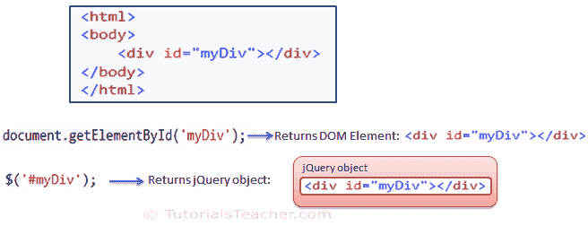

# jQuery 方法

> 原文:[https://www.tutorialsteacher.com/jquery/jquery-methods](https://www.tutorialsteacher.com/jquery/jquery-methods)

在上一节中，您已经了解了 jQuery 选择器。jQuery 选择器找到特定的 DOM 元素并用 jQuery 对象包装它们。例如，JavaScript 中的 document.getElementById()将返回 DOM 对象，而$(“# id”)将返回 jQuery 对象。下图说明了差异。

[](../../Content/images/jquery/jq-methods.png)

jQuery Methods


如上图所示，document.getElementById 函数返回 div 元素，而 jQuery 选择器返回 jQuery 对象，它是 div 元素的包装器。所以现在可以调用 jQuery 选择器返回的 jQuery 对象的 jQuery 方法。

jQuery 为不同的任务提供了不同的方法，例如操纵 DOM、事件、ajax 等。下表列出了不同类别的方法。

| 种类 | 描述 | Imp 方法 |
| --- | --- | --- |
| DOM 操作 | 这些方法以某种方式操作 DOM 元素，例如改变属性、样式属性、添加和移除元素等。 | ()之后、
追加()、
attr()、
之前()、
T4】更多.. |
| 横越 | 这些方法有助于从 DOM 元素导航到父子层次结构中的另一个元素，例如，查找指定元素的祖先、后代或同级元素。 | 子代()，
最接近()，
各()，
先()，
后()，
过滤()，
T15】父代()，
T16】姐弟()，
T17】更.. |
| 半铸钢ˌ钢性铸铁(Cast Semi-Steel) | 这些方法获取和设置元素的 css 相关属性。 | addClass()，
【CSS()，
【hasclass()，
【remove class()，
【togle class() [更多-什么](https://api.jquery.com/category/css/) |
| 属性 | 这些方法获取和设置元素的 DOM 属性。 | attr()，
html()，
【删除属性()，
【prop()， 【val()， [-什么](https://api.jquery.com/category/attributes/) |
| 事件 | 这些方法用于处理 DOM 或 JavaScript 事件。 | bind()，
blur()，
change()，
click()，
dblclick()，
focus()，
keyup()，
keydown()，
[more..](https://api.jquery.com/category/events/)T21】 |
| 效果 | 这些方法用于向元素添加动画。 | animate()，
fadeIn()，
fadeOut()，
hide()，
show()，
stop()，
[more..](https://api.jquery.com/category/effects/) |
| 规模 | 这些方法用于获取和设置各种属性的 CSS 维度。 | height()、‘t0’、‘T6’、‘t1’、‘T7’内部高度()、‘T2’、‘t8’内部宽度()、‘T3’’T9’’更多-好吧 T10 |
| 形式 | 这些方法和事件处理程序处理表单及其各种元素。 | 模模糊糊()，
变化()，
val()，
提交()，
T4】更多.. |
| 埃阿斯 | 这些方法允许使用 jQuery 的 Ajax 功能 | get()，
getJson()，
post()，
load()，
T4】more.. |
| 核心 | 这些方法是 jQuery API 中的核心方法。 | jQuery()，
holdReady()，
when()，
[more..](https://api.jquery.com/category/core/)T8】 |
| 数据 | 这些方法允许我们将任意数据与特定的 DOM 元素相关联。 | data()，
removeData()，
queue()，
【dequeue()，
【clear queue()， [更多-什么](https://api.jquery.com/category/data/) |
| 多方面的 | 这些方法在各种任务中很有用，例如遍历元素、转换为数组等。 | 各()，
指数()，
get()，
toArray()，
T4】更.. |
| 公用事业 | 实用方法有助于获取各种信息，如浏览器、函数、数组、窗口等。 | inArray()，
T8】isArray()，
T9】isFunction()，
T10】isNumeric()，
T11】isWindow()，
T12】isXmlDoc()，
T13】T6】更多.. |

下面的例子展示了如何使用一些 jQuery 方法来操作 DOM 元素。

Example: jQuery Methods

```
<!DOCTYPE html>

<html>
<head>
    <meta name="viewport" content="width=device-width" />
    <title>Index</title>
    <script type="text/javascript" src="~/Scripts/jquery-3.3.1.js"></script>
    <script type="">
        $(document).ready(function () {

            $('p').wrap('<div class="myCls">'); @* wrap all p with div *@
            $('#myDiv').hide(); @* hides div whose id is myDiv  *@
            $('span').attr(  @*sets style and width attribute on all span *@
                {
                    'style': 'border:solid',
                    'width': '100%'
                });
            $('p').append('This is p.'); @* append text to <p> *@

            $('span').before('<p>This is another p</p>'); @* insert <p> before span  *@

        });
    </script>
</head>

<body>
    <div id="myDiv"></div>
    <p></p>
    <span></span>
</body>
</html>
```

在接下来的部分中，学习 DOM 和 CSS 相关的方法。