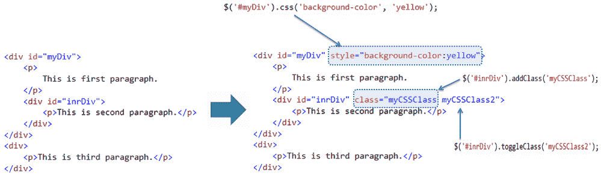

# 使用 jQuery 执行 CSS 操作


jQuery 库包括各种方法来操作样式属性和 DOM 元素的 CSS 类。

下表列出了用于样式和 css 操作的 jQuery 方法。

| jQuery 方法 | 描述 |
| --- | --- |
| css() | 获取或设置指定元素的样式属性。 |
| addClass() | 向指定的元素添加一个或多个类。 |
| hasClass() | 确定是否有任何指定的元素被分配给给定的 CSS 类。 |
| removeClass() | 从指定的元素中移除单个类、多个类或所有类。 |
| toggleclass() | 在向指定元素添加/移除类之间切换 |

下图显示了 jQuery 方法如何改变 DOM 元素的样式和 css 类。

[](../../Content/images/jquery/jq-css-manipulation.png)

jQuery Methods for Style & CSS Manipulation


让我们概述一下用于样式和 css 操作的重要 jQuery 方法。

## jQuery css()方法

jQuery css()方法获取或设置指定元素的样式属性。

Syntax:

```js
$('selector expression').css('style property name','value');

$('selector expression').css({
                                'style property name':'value',
                            });

```

指定一个选择器以获取要设置样式属性的元素的引用，然后使用样式属性名称和值参数调用 css()方法。您也可以通过传递带有“样式属性名称”:“值”的 JSON 对象来设置多个样式属性。

Example: jQuery css() Method

```js
$('#myDiv').css('background-color','yellow');
$('p').css({'background-color': 'red','width':'400px'});

$('#myDiv').css('background-color'); // returns rgb(255,255,0) for yellow color

<div id="myDiv">
    <p>This is first paragraph.</p>
</div>
<div>
    <p>This is second paragraph.</p>
</div>
<div >
    <p>This is third paragraph.</p>
</div>
```

在上例中，我们为所有

元素设置了#myDiv 的背景色和字体样式。同样，我们可以通过将属性名指定为第一个参数，使用 css()方法获取任何样式属性的值。

## jQuery addClass()方法

jQuery addClass()方法向指定的元素添加一个或多个 css 类。

Syntax:

```js
$('selector expression').addClass('css class name');

```

首先指定一个选择器来获取要设置 css 属性的元素的引用，然后使用一个或多个类名作为字符串参数调用 addClass()方法。多个类名必须用空格隔开。

Example: jQuery addClass() Method

```js
$('#myDiv').addClass('yellowDiv');
$('p').addClass('impPrg');

<div id="myDiv">
    <p>
        This is first paragraph.
    </p>
</div>
<div>
    <p>This is second paragraph.</p>
</div>
<div >
    <p>This is third paragraph.</p>
</div>
```

在上面的例子中，我们使用 addClass()方法设置了单个

元素(#myDiv)以及多个

元素的 css 类。

## jQuery toggleClass()方法

jQuery toggleClass()方法在向指定元素添加/移除类之间切换。

Syntax:

```js
$('selector expression').toggleClass('css class name');
```

指定一个选择器来获取要切换 css 类的元素的引用，然后使用 css 类名作为字符串参数调用 toggleClass()方法。

Example: jQuery toggleClass() Method

```js
$('#myDiv').toggleClass('redDiv');

<div id="myDiv" class="yellowDiv">
</div>
```

在上面的例子中，css 类 yellowDiv 将首先被添加到 Div 元素中，然后被移除。因此，css 类将被连续地添加或删除。

访问[操纵方法参考](/jquery/jquery-dom-methods-reference)了解 jQuery 中所有的 CSS 操纵方法。

  Points to Remember :

1.  jQuery CSS 方法允许您操作 CSS 类或 DOM 元素的样式属性。
2.  使用选择器获取元素的引用，然后调用 jQuery css 方法对其进行编辑。
3.  重要 DOM 操作方法:css()、addClass()、hasClass()、removeClass()、toggleclass()等。