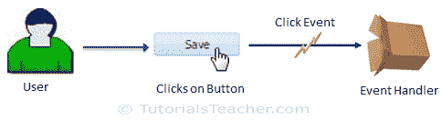
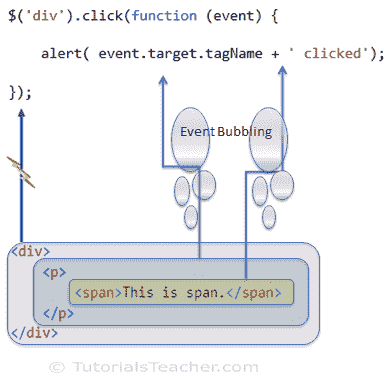

# jQuery 事件

> 原文：<https://www.tutorialsteacher.com/jquery/jquery-event>

在本节中，您将了解 jQuery 事件。

在大多数 web 应用中，用户做一些动作来执行操作。例如，用户点击保存按钮，将编辑后的数据保存在网页中。这里，点击按钮是用户的动作，它触发点击事件，点击事件处理程序(函数)保存数据。

[](../../Content/images/jquery/jquery-event.png)

Event


## jQuery 事件方法

jQuery 库提供了处理 DOM 事件的方法。大多数 jQuery 方法对应于本机 DOM 事件。

下表列出了所有 jQuery 方法和相应的 DOM 事件。

| 种类 | jQuery 方法 | DOM 事件 |
| --- | --- | --- |
| 表单事件 | 虚化 | onblur(声音) |
|  | 变化 | 昂哥 |
|  | 集中 | 得到焦点时 |
|  | 集中 | 聚焦 |
|  | 挑选 | onselect |
|  | 使服从 | 昂松宾 |
| 键盘事件 | 击键 | 叔叔家 |
|  | 键击器 | 按键 |
|  | 好好享受吧 | onkeyup |
|  | 集中注意力 |  |
| 鼠标事件 | 点击 | 单击事件 |
|  | dblclick(数据库点击) | ondblclick(点击鼠标) |
|  | 集中注意力 |  |
|  | 盘旋 |  |
|  | 老鼠洞 | 鼠标点下时 |
|  | 鼠标输入 | onmousement ter |
|  | 慕斯莱夫 | onmouseleave |
|  | 摩门教徒 | 鼠标移动 |
|  | 鼠标移出 | 你真大胆 |
|  | 鼠标悬停 | 鼠标悬停 |
|  | 老鼠！老鼠 | 是 mouseup |
|  | 触发器 |  |
| 浏览器事件 | 错误 | 不规则运算() |
|  | 调整大小 | 未调整大小 |
|  | 卷起 | 滚动时触发 |
| 文档加载 | 负荷 | 装载 |
|  | 准备好的 |  |
|  | 倾销 | 和他一起上传 |

## 事件处理

要使用 jQuery 方法处理 DOM 事件，首先使用 jQuery 选择器获取 DOM 元素的引用，并调用适当的 jQuery 事件方法。

下面的示例显示了如何处理按钮单击事件。

Example:Handle Button Click Event

```
$('#saveBtn').click(function () {
    alert('Save button clicked');
});

<input type="button" value="Save" id="saveBtn" />
```

在上面的例子中，我们首先使用 id 选择器获取一个‘Save’按钮的引用，然后调用 click 方法。我们将处理函数指定为回调函数，每当触发保存按钮的点击事件时都会调用该函数。

### 事件对象

jQuery 将一个[事件对象](https://api.jquery.com/category/events/event-object/)传递给每个事件处理函数。事件对象包括跨浏览器一致性的重要属性和方法，例如目标、页面、页面、相关目标等。

Example: jQuery Event Object

```
$('#saveBtn').click(function (eventObj) {
    alert('X =' + eventObj.pageX + ', Y =' + eventObj.pageY);
});

<input type="button" value="Save" id="saveBtn" />
```

### *事件处理程序中的这个*关键字

**事件处理程序中的这个**关键字表示引发事件的 DOM 元素。

Example: this in Event Handler

```
$(':button').click(function (eventObj) {
    alert(this.value + ' ' + this.type + ' clicked');
});

<input type="button" value="Save" id="saveBtn" />
<input type="button" value="Delete" id="delBtn" />
<input type="button" value="Clear" id="clearBtn" />
```

### 悬停事件

jQuery 为鼠标悬停事件提供了各种方法，例如鼠标进入、鼠标离开、鼠标移动、鼠标悬停、鼠标退出和鼠标向上。

Example: Hover Events

```
$('#myDiv').mouseenter(function (data) {
            $(this).css('background-color','green');
        });

$('#myDiv').mouseleave(function (data) {
            $(this).css('background-color','red');
        });

<div id="myDiv" style="width:100px;height:100px">
</div>
```

可以使用 **hover()** 方法，而不是分别处理 mouseenter 和 mouseleave 事件。

Example: hover() Method

```
$('#myDiv').hover(function () {
        $(this).css('background-color','green');         
    },
    function () {
        $(this).css('background-color','red');
    });

<div id="myDiv" style="width:100px;height:100px">
</div>
```

## 在()上使用事件绑定

jQuery 允许您使用上的**方法将一个或多个事件的事件处理程序附加到所选元素。**

在内部，所有的速记方法都使用 on()方法。on()方法为您提供了更大的事件绑定灵活性。

Syntax:

```
on(types, selector, data, fn )
```

*   类型=一个或多个以空格分隔的事件类型和可选命名空间
*   选择器=选择器字符串
*   Data =在事件中传递给处理程序的数据。
*   Fn =事件触发时要执行的功能。

Example: Event Binding using on

```
$('#saveBtn').on('click',function () {
    alert('Save Button clicked');
});

<input type="button" value="Save" id="saveBtn" />
```

您可以使用选择器来筛选触发事件的选定元素的后代。

Example: Event Binding using on

```
$('#myDiv').on('click',':button', function () {
    alert('Button clicked');
});

<div id="myDiv" >
    <input type="button" value="Save" id="saveBtn" />

    <input type="button" value="Add" id="addBtn" />
</div>

<input type="button" value="Delete" id="delBtn" />
```

在上面的例子中，我们指定了“:button”选择器。所以由 id 为 myDiv 的

标签中的按钮触发的点击事件，只会被处理。

## 绑定多个事件

您还可以指定由空格分隔的多个事件类型。

Example: Multiple Events Binding

```
$( 'myDiv' ).on('mouseenter mouseleave', function() {
    $(this).text('The mouse entered or left from the div' );
});

<div id="myDiv" style="width:100px;height:100px">
</div> 

```

### 将命名函数指定为事件处理程序

您可以创建单独的函数，并将其指定为处理程序。如果您希望对不同的事件或不同元素上的事件使用相同的处理程序，这将非常有用。

Example:Binding Named Function to Event

```
var mouseHandler = function() {
    alert( "The mouse entered" );
};

$('#myDiv').on('mouseenter', mouseHandler);

<div id="myDiv" style="width:100px;height:100px">
</div> 

```

方法上的 jQuery 是 live()和 delegate()方法的替换。

## 事件冒泡

下面的示例演示了 jQuery 中的事件冒泡。

Example:Event Bubbling

```
$('div').click(function (event) {
    alert( event.target.tagName + ' clicked');
});

<div>
    <p>
        <span>This is span.</span>
    </p>
</div>
```

在上面的例子中可以看到，我们已经在 jQuery 中处理了

因此，如果您点击 div，它将显示警报消息' DIV 点击'。但是，如果点击 span，即使我们没有处理的点击事件，仍然会弹出 SPAN 被点击的提示信息。这被称为事件冒泡。事件冒泡到 DOM 层次结构中的**文档** 级别，直到找到为止。

下图说明了事件冒泡。

](../../Content/images/jquery/jquery-event-bubbling.png)

jQuery Event Bubbling

</figure>

访问[事件方法参考](/jquery/jquery-event-reference)了解 jQuery 中所有的事件方法。

  Points to Remember :

1.  jQuery 事件方法允许您附加事件处理程序或激发本机 DOM 事件。
2.  使用选择器获取元素的引用，然后调用 jQuery 事件方法来激发它或附加事件处理程序。
3.  重要的 DOM 操作方法:click()、dblClick()、change()、submit()、keyup()、keydown()、mouseenter()、mouseleave()、hover()等。