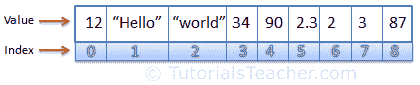

# JavaScript 数组

> 原文:[https://www . tutorial stearn . com/JavaScript/JavaScript-array](https://www.tutorialsteacher.com/javascript/javascript-array)

我们了解到一个变量只能保存一个值，例如`var i = 1`，我们只能给 I 赋值一个文字值，不能给一个变量 I 赋值多个文字值，为了克服这个问题，JavaScript 提供了一个数组。

数组是一种特殊类型的变量，它可以使用特殊的语法存储多个值。每个值都与从 0 开始的数字索引相关联。下图说明了数组如何存储值。

<figure>[](../../Content/images/js/js-array.png)

<figcaption>JavaScript Array</figcaption>

</figure>

## 数组初始化

JavaScript 中的数组可以通过两种方式定义和初始化:数组文本和数组构造函数语法。

## 数组文字

数组文字语法很简单。它采用由逗号分隔并包含在方括号中的值列表。

Syntax:

```
var <array-name> = [element0, element1, element2,... elementN];

```

下面的示例演示如何使用数组文本语法定义和初始化数组。

Example: Declare and Initialize JS Array

```
var stringArray = ["one", "two", "three"];

var numericArray = [1, 2, 3, 4];

var decimalArray = [1.1, 1.2, 1.3];

var booleanArray = [true, false, false, true];

var mixedArray = [1, "two", "three", 4]; 
```

JavaScript 数组可以存储不同数据类型多个元素。不需要在数组中存储相同数据类型的值。

## 数组构造器

您可以使用 **new** 关键字使用数组构造函数语法初始化数组。

数组构造函数有以下三种形式。

Syntax:

```
var arrayName = new Array();

var arrayName = new Array(Number length);

var arrayName = new Array(element1, element2, element3,... elementN);
```

正如您在上面的语法中看到的，可以使用 **new** 关键字初始化数组，就像初始化对象一样。

下面的示例显示了如何使用数组构造函数语法定义数组。

Example: Array Constructor Syntax

```
var stringArray = new Array();
stringArray[0] = "one";
stringArray[1] = "two";
stringArray[2] = "three";
stringArray[3] = "four";

var numericArray = new Array(3);
numericArray[0] = 1;
numericArray[1] = 2;
numericArray[2] = 3;

var mixedArray = new Array(1, "two", 3, "four"); 
```

请注意，数组只能有数字索引(键)。索引不能是字符串或任何其他数据类型。以下语法**不正确**。

Example: Incorrect Array Index

```
var stringArray = new Array();

stringArray["one"] = "one";
stringArray["two"] = "two";
stringArray["three"] = "three";
stringArray["four"] = "four"; 
```

## 访问数组元素

可以使用索引(键)访问数组元素(值)。使用数组名称在方括号中指定索引，以访问特定索引处的元素。请注意，在 JavaScript 中，数组的索引从零开始。

Example: Access Array Elements

```
var stringArray = new Array("one", "two", "three", "four");

stringArray[0]; // returns "one"
stringArray[1]; // returns "two"
stringArray[2]; // returns "three"
stringArray[3]; // returns "four"

var numericArray = [1, 2, 3, 4];
numericArray[0]; // returns 1
numericArray[1]; // returns 2
numericArray[2]; // returns 3
numericArray[3]; // returns 4 
```

## 数组属性

数组包含“length”属性，该属性返回数组中的元素数。

使用循环的**使用长度属性访问数组的所有元素。**

Example: Access Array using for Loop

```
var stringArray = new Array("one", "two", "three", "four");

for (var i = 0; i < stringArray.length ; i++) 
{
    stringArray[i];
} 
```

  Points to Remember :

1.  数组是一种特殊类型的变量，它使用特殊的语法存储多个值。
2.  可以使用数组文字或数组构造函数语法创建数组。
3.  数组文字语法:`var stringArray = ["one", "two", "three"];`
4.  数组构造函数语法:`var numericArray = new Array(3);`
5.  单个数组可以存储不同数据类型的值。
6.  可以使用从零开始的索引(键)来访问数组元素(值)。例如数组[0]。
7.  数组索引必须是数字。
8.  数组包括长度属性和对数组对象进行操作的各种方法。