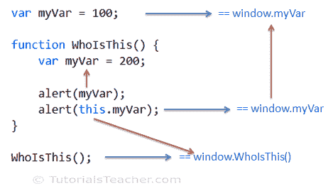

# JavaScript `this`关键字

> 原文：<https://www.tutorialsteacher.com/javascript/this-keyword-in-javascript>

`this`关键字是 JavaScript 中使用最广泛但又最令人困惑的关键字之一。在这里，你会了解到关于`this`关键字的一切。

`this`指向特定的对象。现在，对象是什么取决于如何调用包含“this”关键字的函数。

看下面的例子，猜猜结果会是什么？

```js
<script>
var myVar = 100;

function WhoIsThis() {
    var myVar = 200;

    alert(myVar); // 200
    alert(this.myVar); // 100
}

WhoIsThis(); // inferred as window.WhoIsThis()

var obj = new WhoIsThis();
alert(obj.myVar); 
</script> 
```

以下四个规则适用于`this`，以便知道该关键字引用了哪个对象。

1.  全球范围
2.  对象的方法
3.  调用()或 apply()方法
4.  bind()方法

## 全球范围

如果从全局范围调用包含“this”关键字的函数，则`this`将指向窗口对象。在这里了解全球和本地范围[。](/javascript/scope-in-javascript)

Example: this keyword

```js
<script>
var myVar = 100;

function WhoIsThis() {
    var myVar = 200;

    alert("myVar = " + myVar); // 200
    alert("this.myVar = " + this.myVar); // 100
}

WhoIsThis(); // inferred as window.WhoIsThis()
</script> 
```

在上例中，从全局范围调用了一个函数`WhoIsThis()`。全局范围是指在窗口对象的上下文中。我们可以随意称之为`window.WhoIsThis()`。所以在上例中，`WhoIsThis()`函数中的`this`关键字会引用窗口对象。 所以，`this.myVar`会回归 100。 但是，如果您访问`myVar`而没有`this`，那么它将引用在`WhoIsThis()`函数中定义的本地`myVar`变量。

下图说明了上述示例。

<figure>

<figcaption>this in JavaScript</figcaption>

</figure>

*Note:**In the strict mode, value of 'this' will be undefined in the global scope.* *这指向全局窗口对象，即使它在内部函数中使用。考虑下面的例子。

Example: this keyword inside inner function

```js
var myVar = 100;

function SomeFunction() {

    function WhoIsThis() {
        var myVar = 200;

        alert("myVar = " + myVar); // 200
        alert("this.myVar = " + this.myVar); // 100
    }

    WhoIsThis(); 
}

SomeFunction(); 
```

因此，如果在任何全局函数中使用“this ”,并且不使用点符号或使用`window.`来调用，则`this`将引用默认窗口对象的全局对象。

## 这个内部对象的方法

正如你在这里学到的[，你可以使用新的关键字创建一个函数的对象。因此，当你使用新的关键字创建一个函数的对象时，那么`this`将指向那个特定的对象。考虑下面的例子。](/javascript/new-keyword-in-javascript)

Example: this keyword

```js
var myVar = 100;

function WhoIsThis() {
    this.myVar = 200;
}
var obj1 = new WhoIsThis();

var obj2 = new WhoIsThis();
obj2.myVar = 300;

alert(obj1.myVar); // 200 
alert(obj2.myVar); // 300 
```

在上例中，`this`指向`obj1`实例的`obj1`，指向`obj2`实例的`obj2`。在 JavaScript 中，属性可以使用点标记法动态地附加到对象上。 因此，`myVar`将是两个实例的属性，并且每个实例都有一个单独的`myVar`副本。

现在看下面的例子。

Example: this keyword

```js
var myVar = 100;

function WhoIsThis() {
    this.myVar = 200;

    this.display = function(){
        var myVar = 300;

        alert("myVar = " + myVar); // 300
        alert("this.myVar = " + this.myVar);  // 200
    };
}
var obj = new WhoIsThis();

obj.display(); 
```

在上面的例子中，`obj`将有两个属性`myVar`和`display`，其中显示是一个函数表达式。所以，`this`内部显示()方法在调用`obj.display()`时指向`obj`。

`this`当使用对象文字创建对象时，行为方式相同，如下所示。

Example: this keyword

```js
var myVar = 100;

var obj = { 
            myVar : 300, 
	    whoIsThis: function(){
                        var myVar = 200;

                        alert(myVar); // 200
                        alert(this.myVar); // 300
	            }
};

obj.whoIsThis(); 
```

## 调用()并应用()

在 JavaScript 中，可以使用()运算符调用函数，也可以调用()和 apply()方法，如下所示。

Example: Function call

```js
function WhoIsThis() {
    alert('Hi');
}

WhoIsThis();
WhoIsThis.call();
WhoIsThis.apply(); 
```

在上面的例子中，WhoIsThis()，WhoIsThis.call()和 WhoIsThis.apply()以相同的方式执行一个函数。

调用()和 apply()的主要目的是在函数内部设置`this`的上下文，而不管该函数是在全局范围内调用还是作为对象的方法调用。

您可以在 call()和 apply()中将对象作为第一个参数传递，调用函数中的`this`应该指向该参数。

下面的示例演示了调用()& apply()。

Example: call() & apply()

```js
var myVar = 100;

function WhoIsThis() {

    alert(this.myVar);
}

var obj1 = { myVar : 200 , whoIsThis: WhoIsThis };

var obj2 = { myVar : 300 , whoIsThis: WhoIsThis };

WhoIsThis(); // 'this' will point to window object

WhoIsThis.call(obj1); // 'this' will point to obj1

WhoIsThis.apply(obj2); // 'this' will point to obj2

obj1.whoIsThis.call(window); // 'this' will point to window object

WhoIsThis.apply(obj2); // 'this' will point to obj2 
```

如您在上面的示例中所见，当使用()运算符(如 whoistiis())调用函数 whoistiis 时，函数内部的`this`遵循规则——引用窗口对象。但是，当使用 call()和 apply()方法调用 WhoIsThis 时，则`this`引用一个作为第一个参数传递的对象，而不管该函数是如何被调用的。

因此，当一个函数被调用为`WhoIsThis.call(obj1)`时，`this`将指向 obj1。同样，当一个函数像`WhoIsThis.apply(obj2)` 一样被调用时，`this`将指向 obj2

## 绑定()

绑定()方法是从 [ECMAScript](/articles/what-is-ecmascript) 5 开始引入的。它可用于在调用函数时将“this”的上下文设置为指定的对象。

bind()方法通常有助于为回调函数设置上下文。考虑下面的例子。

Example: bind()

```js
var myVar = 100;

function SomeFunction(callback)
{
    var myVar = 200;

    callback();
};

var obj = {
            myVar: 300,
            WhoIsThis : function() {
                alert("'this' points to " + this + ", myVar = " + this.myVar);
            }
      };

SomeFunction(obj.WhoIsThis); 
SomeFunction(obj.WhoIsThis.bind(obj)); 
```

在上面的例子中，当您将`obj.WhoIsThis`作为参数传递给 someffect()时，那么`this`指向全局窗口对象而不是 obj，因为`obj.WhoIsThis()`将由 JavaScript 引擎作为全局函数执行。您可以使用 bind()方法显式设置`this`值来解决这个问题。 因此，`SomeFunction(obj.WhoIsThis.bind(obj))`将通过指定`obj.WhoIsThis.bind(obj)`将`this`设置为`obj`。

## 优先

所以这 4 条规则适用于`this`关键字，以确定`this`指的是哪个对象。以下是优先顺序。

1.  绑定()
2.  调用()并应用()
3.  目标方法
4.  全球范围

那么，首先检查一个函数是否正在使用 bind()作为回调函数被调用？如果不是，那么检查是使用 call()调用函数还是使用 parmeter 应用()函数？如果不是，那么检查一个函数是否作为目标函数被调用？其他检查一个函数是否在全局范围内被调用，没有点符号或使用窗口对象。

因此，使用这些简单的规则来知道“this”在任何函数中指的是哪个对象。*