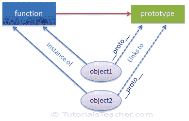

# JavaScript 中的原型

> 原文：<https://www.tutorialsteacher.com/javascript/prototype-in-javascript>

JavaScript 是一种动态语言。您可以随时向对象附加新属性，如下所示。

Example: Attach property to object

```js
function Student() {
    this.name = 'John';
    this.gender = 'Male';
}

var studObj1 = new Student();
studObj1.age = 15;
alert(studObj1.age); // 15

var studObj2 = new Student();
alert(studObj2.age); // undefined 
```

如您在上面的示例中所见，年龄属性附加到 studObj1 实例。但是，studObj2 实例将没有年龄属性，因为它仅在 studObj1 实例上定义。

那么，如果我们想在稍后阶段向一个将在所有实例间共享的函数添加新的属性，该怎么办呢？

答案是**原型**。

在 JavaScript 中，原型是一个默认情况下与每个函数和对象相关联的对象，其中函数的原型属性是可访问和可修改的，而对象的原型属性(又名属性)是不可见的。

默认情况下，每个函数都包含原型对象。

[](../../Content/images/oo-js/prototype-1.png) 

Prototype in JavaScript


原型对象是一种特殊类型的可枚举对象，它可以附加其他属性，这些属性将在其构造器的所有实例中共享。

因此，在上面的例子中使用一个函数的 prototype 属性，以便在如下所示的所有对象中使用 age 属性。

Example: prototype

```js
function Student() {
    this.name = 'John';
    this.gender = 'M';
}

Student.prototype.age = 15;

var studObj1 = new Student();
alert(studObj1.age); // 15

var studObj2 = new Student();
alert(studObj2.age); // 15 
```

使用文字语法或构造器语法用 new 关键字创建的每个对象都包含`__proto__`属性，该属性指向创建该对象的函数的原型对象。

[](../../Content/images/oo-js/prototype-2.png) 

Prototype in JavaScript


您可以在 chrome 或 firefox 的开发工具中调试和查看对象或函数的原型属性。考虑下面的例子。

Example: prototype

```js
function Student() {
    this.name = 'John';
    this.gender = 'M';
}

var studObj = new Student();

console.log(Student.prototype); // object
console.log(studObj.prototype); // undefined
console.log(studObj.__proto__); // object

console.log(typeof Student.prototype); // object
console.log(typeof studObj.__proto__); // object

console.log(Student.prototype === studObj.__proto__ ); // true 
```

正如你在上面的例子中看到的，函数的原型属性可以使用 <function-name>.prototype 来访问，但是一个对象(实例)并不公开原型属性，相反你可以使用`__proto__`来访问它。</function-name>

*Note:**The prototype property is special type of enumerable object which cannot be iterate using for..in or foreach loop.* *## 对象的原型

如前所述，对象的原型属性是不可见的。使用`Object.getPrototypeOf(obj)`方法代替`__proto__`访问原型对象。

Example: Object's prototype

```js
function Student() {
    this.name = 'John';
    this.gender = 'M';
}

var studObj = new Student();

Student.prototype.sayHi= function(){
    alert("Hi");
};

var studObj1 = new Student();
var proto = Object.getPrototypeOf(studObj1);  // returns Student's prototype object

alert(proto.constructor); // returns Student function 
```

原型对象包括以下属性和方法。

| 财产 | 描述 |
| --- | --- |
| 构造器 | 返回创建实例的函数。 |
| __ 原型 _ _ | 这是对象的不可见属性。它返回它链接到的函数的原型对象。 |

| 方法 | 描述 |
| --- | --- |
| hasOwnProperty() | 返回一个布尔值，该值指示对象是否包含指定属性作为该对象的直接属性，而不是通过原型链继承的。 |
| isportotypeof_) | 返回一个布尔值，指示指定的对象是否在调用此方法的对象的原型链中。 |
| propertyIsEnumerable() | 返回一个布尔值，该值指示指定的属性是否可枚举。 |
| toLocaleString() | 以本地格式返回字符串。 |
| toString() | 返回字符串。 |
| valueOf(值) | 返回指定对象的基元值。 |

Chrome 和 Firefox 将对象的原型表示为`__proto__`，这是一个公共链接，而在内部它引用为[[原型]]。互联网浏览器不包括`__proto__`。只有 IE 11 包含它。

`getPrototypeOf()`方法从 ECMAScript 5 开始标准化，从 IE 9 开始可用。

## 更改原型

如上所述，每个对象的原型都链接到函数的原型对象。如果你改变了函数的原型，那么只有新的对象会链接到改变的原型。所有其他现有对象仍将链接到旧的函数原型。下面的示例演示了这种情况。

Example: Changing Prototype

```js
function Student() {
    this.name = 'John';
    this.gender = 'M';
}

Student.prototype.age = 15;

var studObj1 = new Student();
alert('studObj1.age = ' + studObj1.age); // 15

var studObj2 = new Student();
alert('studObj2.age = ' + studObj2.age); // 15

Student.prototype = { age : 20 };

var studObj3 = new Student();
alert('studObj3.age = ' + studObj3.age); // 20

alert('studObj1.age = ' + studObj1.age); // 15
alert('studObj2.age = ' + studObj2.age); // 15 
```

## 原型的使用

JavaScript 引擎使用原型对象做两件事，1)查找对象的属性和方法 2)在 JavaScript 中实现继承。

```js
function Student() {
    this.name = 'John';
    this.gender = 'M';
}

Student.prototype.sayHi = function(){
    alert("Hi");
};

var studObj = new Student();
studObj.toString(); 
```

在上面的例子中，toString()方法没有在 Student 中定义，那么它是如何以及从哪里找到 toString()的呢？

在这里，原型进入画面。首先，JavaScript 引擎检查是否给 studObj 附加了 toString()方法？(可以在 JavaScript 中将一个新函数附加到一个实例上)。如果没有找到，那么它使用 studObj 的`__proto__`链接，该链接指向 Student 函数的原型对象。 如果在那里仍然找不到，那么它会进入层次结构，检查对象函数的原型对象，因为所有的对象都是从 JavaScript 中的对象派生出来的，并寻找 toString()方法。因此，它在 object 函数的原型对象中找到了 toString()方法，因此我们可以调用 studObj.toString()。

这样，prototype 对于所有对象(实例)只保留一个函数副本非常有用。

下图说明了上述场景。

[](../../Content/images/oo-js/prototype-3.png) 

Prototype in JavaScript


在下一节中，我们将学习如何使用原型实现继承。*