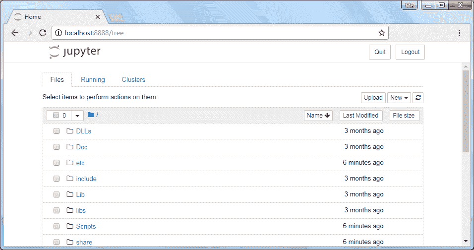
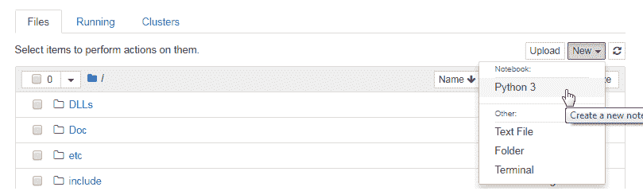
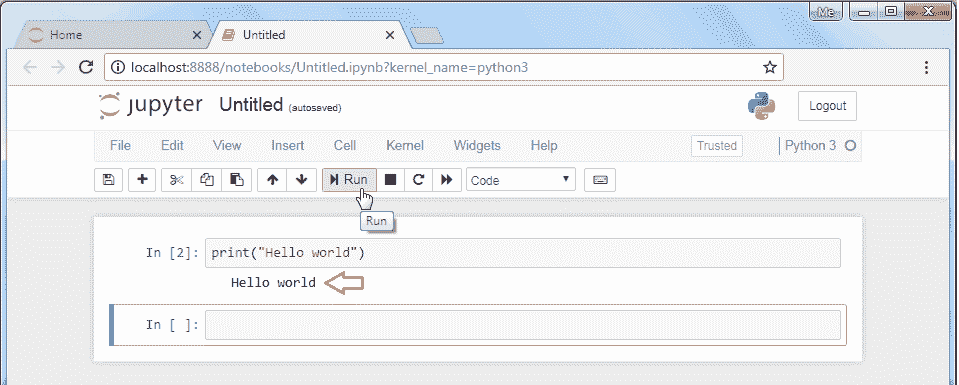
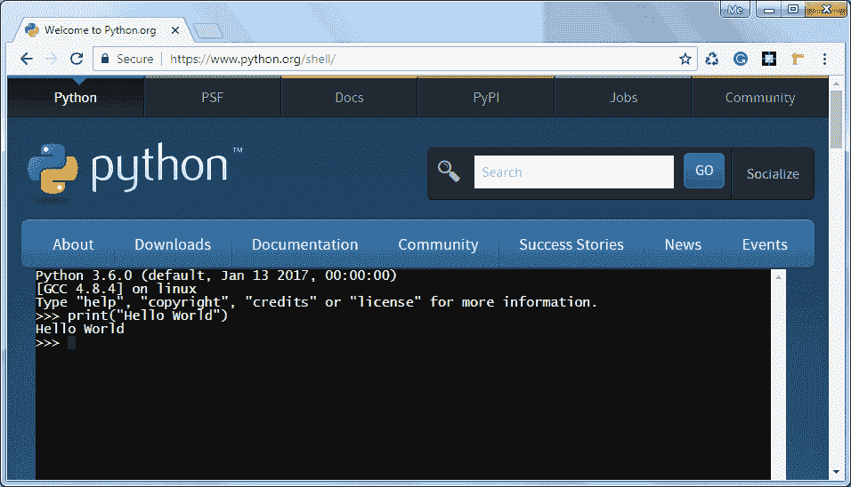
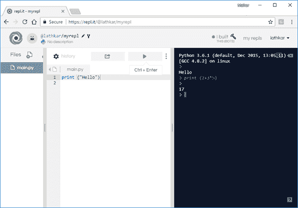

# Python IDEs

> 原文:[https://www.tutorialsteacher.com/python/python-ides](https://www.tutorialsteacher.com/python/python-ides)

Python 有许多免费的和商业的 ide。在这里，我们将学习如何使用一些开源编辑器来执行 Python 脚本或语句。

## Jupyter 笔记型电脑

Jupyter 笔记本是 IPython 外壳的基于浏览器的图形界面。它允许用户包括格式化文本、静态和动态可视化、数学方程、JavaScript 小部件等。以及 Python 代码。Jupyter 笔记本文档可以导出为 PDF、Python 脚本或 HTML。

默认情况下，IPython 内核驱动 Jupyter 笔记本应用程序。但是，它支持其他语言，如 Julia 和 R(Jupyter 代表 **JU** lia、 **PYT** hon 和 **R** )。

要安装 Jupyter，请使用 Python 软件附带的 pip 实用程序。

<samp>pip3 install jupyter</samp>

安装成功后，我们可以从命令提示符启动 Jupyter 编辑器，如下所示。

<samp>jupyter notebook</samp>

Jupyter Notebook 是一个客户端-服务器应用程序。服务器部署在本地主机的默认端口 8888 上，客户端在浏览器窗口中打开，如下所示:

<figure> 

<figcaption>Jupyter</figcaption>

</figure>

如您所见，Jupyter 将显示 Python 安装文件夹中的文件和文件夹。您可以从适当的文件夹中创建、打开和执行 python 脚本。从“新建”下拉菜单中选择 Python 3，开始一个新笔记本，如下所示:

<figure> 

<figcaption>New Python Script in Jupyter</figcaption>

</figure>

这将打开另一个窗口来输入 python 语句并运行它们，如下所示。

<figure> 

<figcaption>New Python Script in Jupyter</figcaption>

</figure>

接口类似于 IPython shell。然而，还有很多其他优势。

例如，您可以插入和删除单元格。单元格可以包含代码、标题或标记文本，用作文档。任何单元格中的代码都可以运行。另一个优点是，像 Matplotlib 这样的库生成的数据可视化可以内嵌。

笔记本以`.ipynb`扩展名保存。它可以导出为 HTML 或 PDF 格式，以便共享。

## Visual Studio 代码

[Visual Studio Code](https://code.visualstudio.com/) 是一个开源 IDE，用于在 Windows、Mac 和 Linux 平台上开发不同类型的应用程序。 你可以通过从 Visual Studio Marketplace 安装 [Python 扩展来开发 Python 3 应用程序。](https://marketplace.visualstudio.com/items?itemName=ms-python.python)

## 在线 Python 外壳

对于新手来说，安装 Python(或任何软件)可能有点令人生畏。幸运的是，在决定在本地机器上安装 Python 之前，有很多在线资源可以熟悉 Python 的语法、特性和哲学。

可以直接从官网-[https://www.python.org/shell](https://www.python.org/shell)上线 Python Shell。 Shell 终端显示一条 Python 提示`>>>`，前面可以写任何有效的 Python 表达式，按下“回车”即可执行。

<figure> 

<figcaption>Online Python Shell</figcaption>

</figure>

网上可以找到很多交互式 Python 环境外壳。他们基于 **REPL** (读取、评估、打印、循环)工作。使用 [https://repl.it](https://repl.it) 可以在交互模式和脚本模式下执行 Python。

<figure> 

<figcaption>Python - repl.it</figcaption>

</figure>

上图中的右栏是一个交互式外壳，而 Python 脚本可以在左窗格中输入和运行。

在下一章中学习 Python 的基本语法。