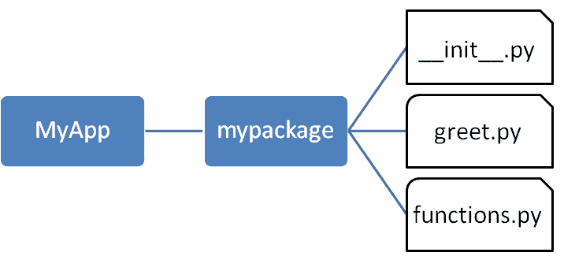

# Python 包

> 原文：<https://www.tutorialsteacher.com/python/python-package>

我们根据一些标准将大量文件组织在不同的文件夹和子文件夹中，这样我们就可以轻松地找到并管理它们。同样，Python 中的包将模块化方法的概念带到了下一个逻辑层次。众所周知，一个[模块](/python/python-module)可以包含多个对象，比如类、函数等。 一个包可以包含一个或多个相关模块。实际上，包实际上是一个包含一个或多个模块文件的文件夹。

让我们使用以下步骤创建一个名为 mypackage 的包:

*   创建一个名为`D:\MyApp`的新文件夹。
*   在`MyApp`内，创建一个名为‘my package’的子文件夹。
*   在 mypackage 文件夹中创建一个空的`__init__.py`文件。
*   使用支持 Python 的编辑器，如 IDLE，用以下代码创建模块 greet.py 和 functions.py:

greet.py 

```
def SayHello(name):
    print("Hello ", name) 
```

functions.py 

```
def sum(x,y):
    return x+y

def average(x,y):
    return (x+y)/2

def power(x,y):
    return x**y 
```

就这样。我们已经创建了名为 mypackage 的包。以下是文件夹结构:

[](../../Content/images/python/package.png) 

Package Folder Structure


## 从包中导入模块

现在，为了测试我们的包，将命令提示符导航到`MyApp`文件夹，并从那里调用 Python 提示符。

```
D:\MyApp>python
```

从 mypackage 包导入函数模块，并调用其 power()函数。

<samp>>>> from mypackage import functions
>>> functions.power(3,2)
9</samp>

还可以从包中的模块导入特定功能。

<samp>>>> from mypackage.functions import sum
>>> sum(10,20)
30
>>> average(10,12)
Traceback (most recent call last):
File "<pyshell#13>", line 1, in <module>
NameError: name 'average' is not defined</samp>

## __init__.py

包文件夹包含一个名为`__init__.py`的特殊文件，用于存储包的内容。它有两个目的:

1.  Python 解释器会将包含`__init__.py`文件的文件夹识别为包。
2.  `__init__.py`从要导入的模块中公开指定的资源。

一个空的`__init__.py`文件使得当这个包被导入时，上述模块的所有功能都可用。注意`__init__.py`对于文件夹被 Python 识别为包是必不可少的。您可以根据需要定义单个模块中的可用功能。

*Note:**We shall also create another Python script in the `MyApp` folder and import the mypackage package in it. It should be at the same level of the package to be imported.* *`__init__.py`文件通常保持为空。但是，它也可以用于从包文件夹中的模块中选择特定的功能，并使它们可用于导入。如下修改`__init__.py`:

__init__.py 

```
from .functions import average, power
from .greet import SayHello 
```

现在可以在解释器会话或另一个可执行脚本中导入指定的函数。

在`MyApp`文件夹中创建`test.py`来测试我的包。

test.py 

```
from mypackage import power, average, SayHello
SayHello()
x=power(3,2)
print("power(3,2) : ", x) 
```

请注意，功能`power()`和`SayHello()`是从包中导入的，而不是从它们各自的模块中导入的，如前所述。上述脚本的输出是:

<samp>D:\MyApp>python test.py
Hello world
power(3,2) : 9</samp>

## 全局安装包

一旦创建了一个包，就可以通过运行安装脚本来安装它以供系统范围使用。脚本从`setuptools`模块调用`setup()`函数。

让我们通过运行一个安装脚本来安装 mypackage，以便在系统范围内使用。

将以下代码保存为父文件夹`MyApp`中的 setup.py。脚本从 setuptools 模块调用`setup()`函数。`setup()`函数接受各种参数，如名称、版本、作者、依赖列表等。`zip_safe`参数定义包是以压缩模式还是常规模式安装。

Example: setup.py 

```
from setuptools import setup
setup(name='mypackage',
version='0.1',
description='Testing installation of Package',
url='#',
author='auth',
author_email='[[email protected]](/cdn-cgi/l/email-protection)',
license='MIT',
packages=['mypackage'],
zip_safe=False) 
```

现在执行以下命令，使用 [pip](/python/pip-in-python) 实用程序安装`mypackage`。 确保命令提示符在父文件夹中，在本例中为`D:\MyApp`。

<samp>D:\MyApp>pip install mypackage
Processing d:\MyApp
Installing collected packages: mypack
Running setup.py install for mypack ... done
Successfully installed mypackage-0.1</samp>

现在 mypackage 可以在系统范围内使用，并且可以在任何脚本或解释器中导入。

<samp>D:\>python
>>> import mypackage
>>>mypackage.average(10,20)
15.0
>>>mypackage.power(10,2)
100</samp>

您可能还想发布该包供公众使用。 [PyPI](https://pypi.org/) (代表 Python 包索引)是 Python 包的存储库。 访问[https://packaging.python.org/distributing](https://packaging.python.org/distributing)了解更多关于上传包到 PyPI 的流程。******