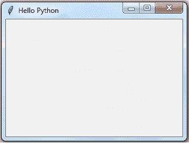
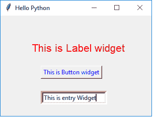
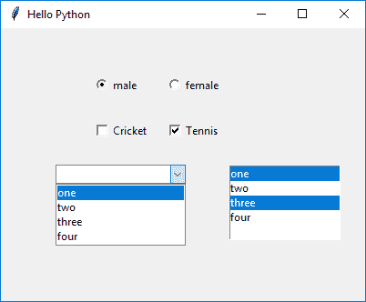
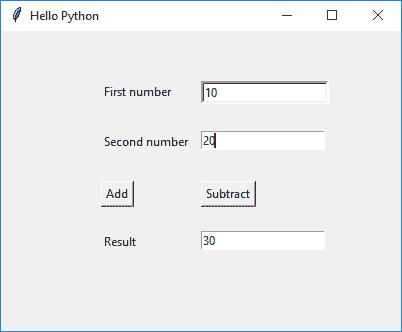

# 用 Python-Tkinter 创建用户界面

> 原文：<https://www.tutorialsteacher.com/python/create-gui-using-tkinter-python>

现代计算机应用是用户友好的。用户交互不仅限于基于控制台的输入/输出。由于高速处理器和强大的图形硬件，它们具有更符合人体工程学的图形用户界面。这些应用可以通过鼠标点击接收输入，并且可以使用户在单选按钮、下拉列表和其他图形用户界面元素(或小部件)的帮助下从备选方案中进行选择。

这些应用是使用各种可用的图形库之一开发的。图形库是一个软件工具包，它包含一组定义各种图形用户界面元素功能的类。这些图形库一般都是用 C/C++编写的。其中许多已经以可导入模块的形式移植到 Python 中。其中一些列举如下:

Tkinter 是 Fredrik Lundh 开发的 **Tcl-Tk GUI 工具包**的 Python 端口。该模块与所有平台的标准 Python 发行版捆绑在一起。

[PyQtis](https://www.riverbankcomputing.com/software/pyqt/download5) ，Qt 的 Python 接口，是非常流行的跨平台 GUI 框架。

[PyGTK](https://pypi.org/project/PyGTK/) 是将 Python 移植到另一个流行的名为 GTK 的 GUI 小部件工具包的模块。

[WxPython](https://pypi.org/project/wxPython/) 是另一个跨平台图形库 WxWidgets 的 Python 包装器。

本教程解释了在开发基于图形用户界面的 Python 程序时使用 Tkinter。

## 基本图形用户界面应用

图形用户界面元素及其功能在 Tkinter 模块中定义。下面的代码演示了创建用户界面的步骤。

```
from tkinter import *
window=Tk()
# add widgets here

window.title('Hello Python')
window.geometry("300x200+10+20")
window.mainloop() 
```

首先，导入 TKinter 模块。导入后，通过调用`Tk()`函数设置应用对象。 这将创建一个顶层窗口(根)，该窗口有一个带有标题栏的框架，带有最小化和关闭按钮的控制框，以及一个保存其他小部件的客户端区域。 方法`geometry()`定义框架左上角的宽度、高度和坐标如下(所有值以像素为单位):`window.geometry("widthxheight+XPOS+YPOS")` 然后应用对象通过调用`mainloop()`方法进入事件监听循环。 应用现在一直在等待在其中的元素上生成的任何事件。该事件可以是在文本字段中输入的文本、从下拉菜单或单选按钮中做出的选择、鼠标的单击/双击动作等。 应用的功能包括响应特定类型的事件执行适当的回调函数。我们将在本教程的后面讨论事件处理。单击标题栏上的关闭按钮时，事件循环将终止。 上述代码将创建以下窗口:

[](../../Content/images/python/window.png) 

Python-Tkinter Window


所有 Tkinter 小部件类都继承自小部件类。让我们添加最常用的小部件。

### 纽扣

可以使用按钮类创建按钮。Button 类构造器需要对主窗口和选项的引用。

签名:`Button(window, attributes)`

您可以设置以下重要属性来自定义按钮:

*   文本:按钮的标题
*   背景色
*   fg:前景色
*   字体:字体名称和大小
*   图像:代替文本显示
*   命令:单击时要调用的函数

Example: Button 

```
from tkinter import *
window=Tk()
btn=Button(window, text="This is Button widget", fg='blue')
btn.place(x=80, y=100)
window.title('Hello Python')
window.geometry("300x200+10+10")
window.mainloop() 
```

### 标签

可以使用标签类在 Python 的用户界面中创建标签。标签构造器需要顶层窗口对象和选项参数。选项参数类似于按钮对象。

下面在窗口中添加一个标签。

Example: Label 

```
from tkinter import *
window=Tk()
lbl=Label(window, text="This is Label widget", fg='red', font=("Helvetica", 16))
lbl.place(x=60, y=50)
window.title('Hello Python')
window.geometry("300x200+10+10")
window.mainloop() 
```

这里，标签的标题将使用 16 磅大小的 Helvetica 字体以红色显示。

### 进入

此小部件呈现一个单行文本框，用于接受用户输入。对于多行文本输入，使用文本小部件。除了已经提到的属性，Entry 类构造器接受以下内容:

*   bd:文本框的边框大小；默认值为 2 像素。
*   show:要将文本框转换为密码字段，请将 show 属性设置为“*”。

下面的代码添加了文本字段。

`txtfld=Entry(window, text="This is Entry Widget", bg='black',fg='white', bd=5)`

以下示例创建一个包含按钮、标签和输入字段的窗口。

Example: Create Widgets 

```
from tkinter import *
window=Tk()
btn=Button(window, text="This is Button widget", fg='blue')
btn.place(x=80, y=100)
lbl=Label(window, text="This is Label widget", fg='red', font=("Helvetica", 16))
lbl.place(x=60, y=50)
txtfld=Entry(window, text="This is Entry Widget", bd=5)
txtfld.place(x=80, y=150)
window.title('Hello Python')
window.geometry("300x200+10+10")
window.mainloop() 
```

以上示例将创建以下窗口。

[](../../Content/images/python/ui-widgets.png)

Create UI Widgets in Python-Tkinter


## 选择部件

**单选按钮:**该小部件显示一个具有开/关状态的切换按钮。可能有多个按钮，但在给定时间只有一个按钮会打开。

**检查按钮:**这也是一个切换按钮。标题前会出现一个矩形复选框。它的打开状态由框中的勾号显示，当它被点击到关闭时消失。

**组合框:**该类在 tkinterpackage 的 ttk 模块中定义。它填充集合数据类型的下拉数据，如元组或列表作为值参数。

**Listbox:** 与 Combobox 不同，这个小部件显示整个字符串项集合。用户可以选择一个或多个项目。

以下示例演示了带有选择小部件的窗口:单选按钮、检查按钮、列表框和组合框:

Example: Selection Widgets 

```
from tkinter import *
from tkinter.ttk import Combobox
window=Tk()
var = StringVar()
var.set("one")
data=("one", "two", "three", "four")
cb=Combobox(window, values=data)
cb.place(x=60, y=150)

lb=Listbox(window, height=5, selectmode='multiple')
for num in data:
    lb.insert(END,num)
lb.place(x=250, y=150)

v0=IntVar()
v0.set(1)
r1=Radiobutton(window, text="male", variable=v0,value=1)
r2=Radiobutton(window, text="female", variable=v0,value=2)
r1.place(x=100,y=50)
r2.place(x=180, y=50)

v1 = IntVar()
v2 = IntVar()
C1 = Checkbutton(window, text = "Cricket", variable = v1)
C2 = Checkbutton(window, text = "Tennis", variable = v2)
C1.place(x=100, y=100)
C2.place(x=180, y=100)

window.title('Hello Python')
window.geometry("400x300+10+10")
window.mainloop() 
```

[](../../Content/images/python/window2.png)

Create UI in Python-Tkinter


## 事件处理

事件是应用对象从各种图形用户界面小部件接收的通知，是用户交互的结果。应用对象在运行事件侦听循环时总是在预测事件。用户的动作包括鼠标按键点击或双击，当控件在文本框内时按下键盘键，某些元素获得或失去焦点等。

事件以<modifier-type-qualifier>格式表示为字符串。</modifier-type-qualifier>

许多事件被表示为限定词。类型定义事件的类。

下表显示了 Tkit 如何识别不同的事件:

| 事件 | 修饰语 | 类型 | 预选赛 | 行动 |
| --- | --- | --- | --- | --- |
|  |  | 纽扣 | one | 鼠标左键点击。 |
|  |  | 纽扣 | Two | 鼠标中键点击。 |
|  |  | 破坏 |  | 窗户被破坏了。 |
|  | 两倍 | 纽扣 | one | 双击第一个鼠标按钮 1。 |
|  | 进入 |  |  | 光标进入窗口。 |
|  |  | 揭露 |  | 窗户完全或部分暴露。 |
| <keypress-a></keypress-a> |  | 键击器 | a | 任何键都被按下。 |
| <keyrelease></keyrelease> |  | 按键释放 |  | 任何钥匙都被释放了。 |
| <leave></leave> |  | 离开 |  | 光标离开窗口。 |
|  |  |  | 打印 | 已按下打印键。 |
|  |  | 集中 |  | 小部件获得关注。 |
|  |  | 集中注意力 |  | widget losefocus。 |

一个事件应该向应用中的一个或多个图形用户界面小部件注册。如果不是，就会被忽略。在 Tkinter 中，有两种方法可以向小部件注册事件。第一种方法是使用`bind()`方法，第二种方法是使用小部件构造器中的命令参数。

### 绑定()方法

`bind()`方法将事件与回调函数相关联，以便在偶数发生时调用该函数。

Syntax:

```
Widget.bind(event, callback)

```

例如，要调用左键点击的`MyButtonClicked()`功能，请使用以下代码:

Example: Even Binding 

```
from tkinter import *
window=Tk()
btn = Button(window, text='OK')
btn.bind('<Button-1>', MyButtonClicked) 
```

事件对象由许多属性表征，例如源小部件、位置坐标、鼠标按钮数量和事件类型。如果需要，这些可以传递给回调函数。

### 命令参数

每个小部件主要响应特定的类型。例如，按钮是按钮事件的来源。所以，它是默认绑定到它的。许多小部件类的构造方法都有一个可选参数，叫做 command。此命令参数被设置为回调函数，每当绑定事件发生时将调用该函数。这个方法比`bind()`方法更方便。

`btn = Button(window, text='OK', command=myEventHandlerFunction)`

在下面给出的示例中，应用窗口有两个文本输入字段和另一个显示结果的字段。有两个按钮对象，标题为“加减”。用户需要在两个条目小部件中输入数字。它们的加法或减法显示在第三行。

第一个按钮(添加)使用命令参数进行配置。它的值是类中的`add()`方法。 第二个按钮使用`bind()`方法，用`sub()`方法注册左键点击。 两种方法都是通过 Entry 小部件的`get()`方法读取文本字段的内容，解析为数字，执行加减运算，并使用`insert()`方法在第三个文本字段中显示结果。

Example: 

```
from tkinter import *
class MyWindow:
    def __init__(self, win):
        self.lbl1=Label(win, text='First number')
        self.lbl2=Label(win, text='Second number')
        self.lbl3=Label(win, text='Result')
        self.t1=Entry(bd=3)
        self.t2=Entry()
        self.t3=Entry()
        self.btn1 = Button(win, text='Add')
        self.btn2=Button(win, text='Subtract')
        self.lbl1.place(x=100, y=50)
        self.t1.place(x=200, y=50)
        self.lbl2.place(x=100, y=100)
        self.t2.place(x=200, y=100)
        self.b1=Button(win, text='Add', command=self.add)
        self.b2=Button(win, text='Subtract')
        self.b2.bind('<Button-1>', self.sub)
        self.b1.place(x=100, y=150)
        self.b2.place(x=200, y=150)
        self.lbl3.place(x=100, y=200)
        self.t3.place(x=200, y=200)
    def add(self):
        self.t3.delete(0, 'end')
        num1=int(self.t1.get())
        num2=int(self.t2.get())
        result=num1+num2
        self.t3.insert(END, str(result))
    def sub(self, event):
        self.t3.delete(0, 'end')
        num1=int(self.t1.get())
        num2=int(self.t2.get())
        result=num1-num2
        self.t3.insert(END, str(result))

window=Tk()
mywin=MyWindow(window)
window.title('Hello Python')
window.geometry("400x300+10+10")
window.mainloop() 
```

上面的例子创建了下面的用户界面。

[](../../Content/images/python/window3.png) 

UI in Python-Tkinter


因此，您可以使用 Python 中的 TKinter 创建用户界面。******