# 在 Windows 上安装蒙古数据库服务器、蒙古数据库外壳、指南针

> 哎哎哎:# t0]https://www . tutorial reacher . com/mong odb/install-mong odb

在这里，您将学习如何在本地 Windows 机器上安装 MongoDB 服务器、MongoDB Shell 和指南针。

访问[www.mongodb.com](https://www.mongodb.com/)下载所需平台的 MongoDB 安装程序。

[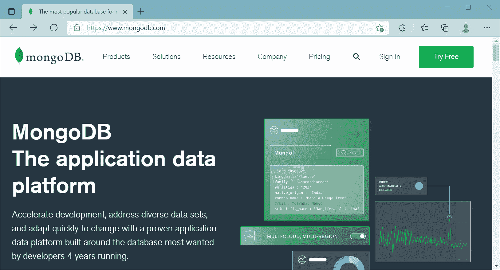](../../Content/images/mongodb/mongo-website.png)

MongoDB Official Website

在这里，我们将在本地 Windows 机器上安装一个免费的 MongoDB 数据库服务器。因此，点击产品菜单->社区服务器，如下所示。

MongoDB Community Edition

这将打开一个下载页面，您可以在其中选择版本、平台和包选项。在这里，我们将下载最新版本的 MongoDB、Windows 平台和 msi 文件作为一个包，如下所示。

Download MongoDB

单击下载按钮下载安装程序文件。

完全下载后，单击 msi 文件启动安装向导，如下所示。

[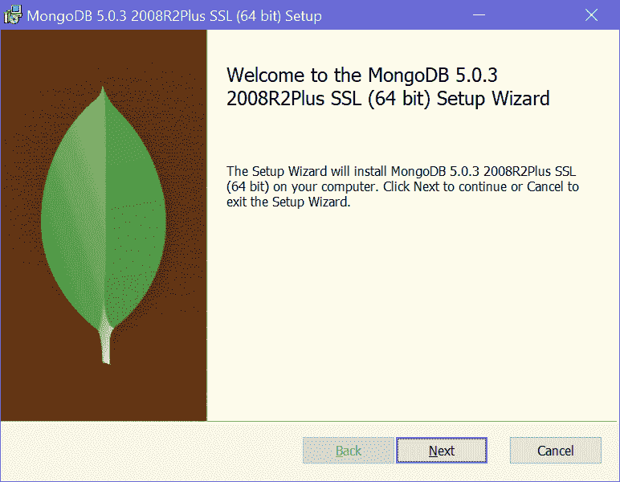](../../Content/images/mongodb/mongodb-installation1.png)

MongoDB Installation Wizard

单击“下一步”开始安装。

MongoDB Installation Wizard

选中“我接受许可协议中的条款”复选框，然后单击“下一步”。

[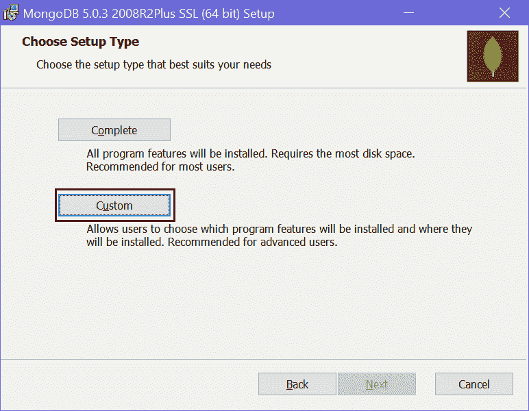](../../Content/images/mongodb/mongodb-installation3.png)

MongoDB Installation Wizard

在这里，您将有两个安装选项:完成和自定义。完整选项将安装所有功能。自定义选项允许您仅选择所需的功能。

您可以选择这两个选项中的任何一个。在这里，我们将选择自定义选项，只是为了向您展示它将安装的所有东西。因此，点击自定义选项，这将带您进入下一步，如下所示。

[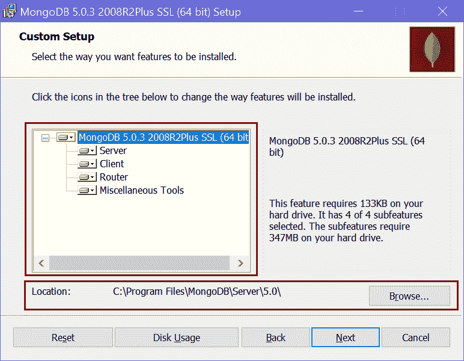](../../Content/images/mongodb/mongodb-installation4.png)

MongoDB Installation Wizard

在自定义设置页面中，展开 MongoDB 节点，查看将安装的所有功能。它将为 MongoDB 数据库安装服务器、客户端、路由器和其他工具。它还显示了 MongoDB 的安装位置。您可以更改它或保留默认位置，然后单击“下一步”。

单击下一步配置 MongoDB 服务，如下所示。

[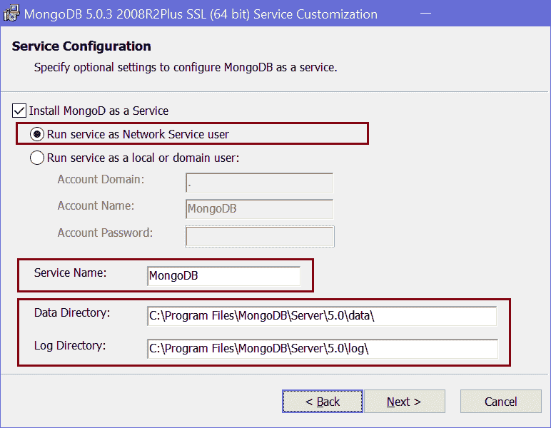](../../Content/images/mongodb/mongodb-installation5.png)

Configure MongoDB Service

MongoDB 服务器将作为服务安装在您的本地 Windows 机器上。如上所述，您可以选择以网络服务用户或本地或域用户的身份运行服务。我们将选择“作为网络服务用户运行服务”单选按钮。

您可以更改默认服务名称，但建议保留默认的“MongoDB”名称，以便于识别。

MongoDB 数据库将数据存储为本地计算机上的 BSON 文件。您可以更改数据文件和日志文件的默认存储位置。这里，我们将保留默认路径，并单击“下一步”按钮。

在下一页，选择“安装 MongoDB 指南针”复选框，然后单击“下一步”。MongoDB Compass 是 MongoDB 数据库的一个 GUI 工具，您可以在其中可视化地浏览数据、运行查询和优化性能。

[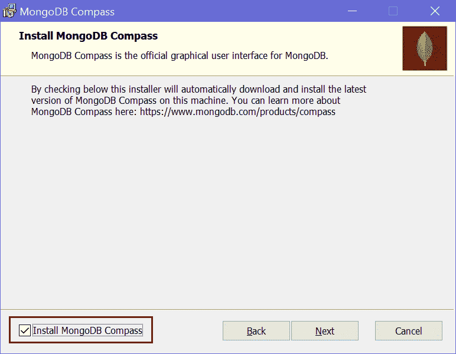](../../Content/images/mongodb/mongodb-installation6.png)

MongoDB Compass Installation

接下来，单击安装按钮开始安装。

[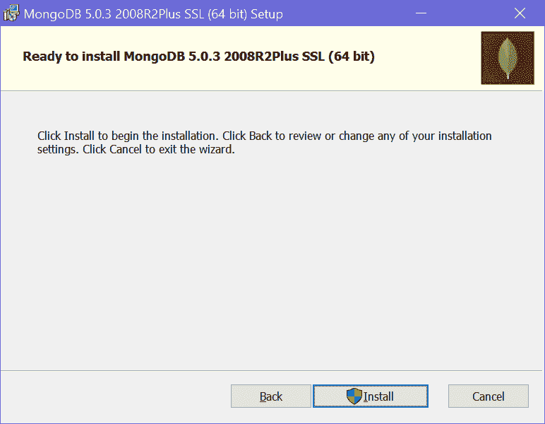](../../Content/images/mongodb/mongodb-installation7.png)

MongoDB Installation

安装需要几分钟时间。成功安装后，单击“完成”按钮关闭向导。

[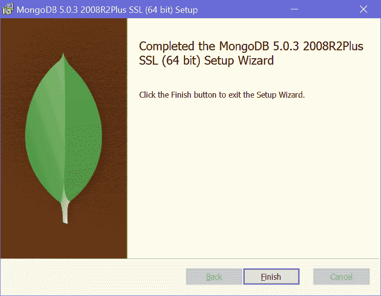](../../Content/images/mongodb/mongodb-installation9.png)

MongoDB Installation

它还会打开 MongoDB Compass，如下所示。

[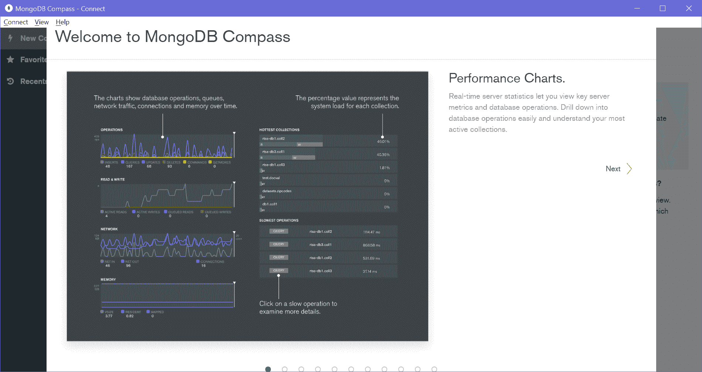](../../Content/images/mongodb/mongodb-compass.png)

MongoDB Compass

## 蒙古数据库服务器

我们安装了 MongoDB 作为网络服务。要查看这一点，请通过在窗口搜索框中搜索“服务”来打开服务，然后单击服务应用程序，如下所示。

[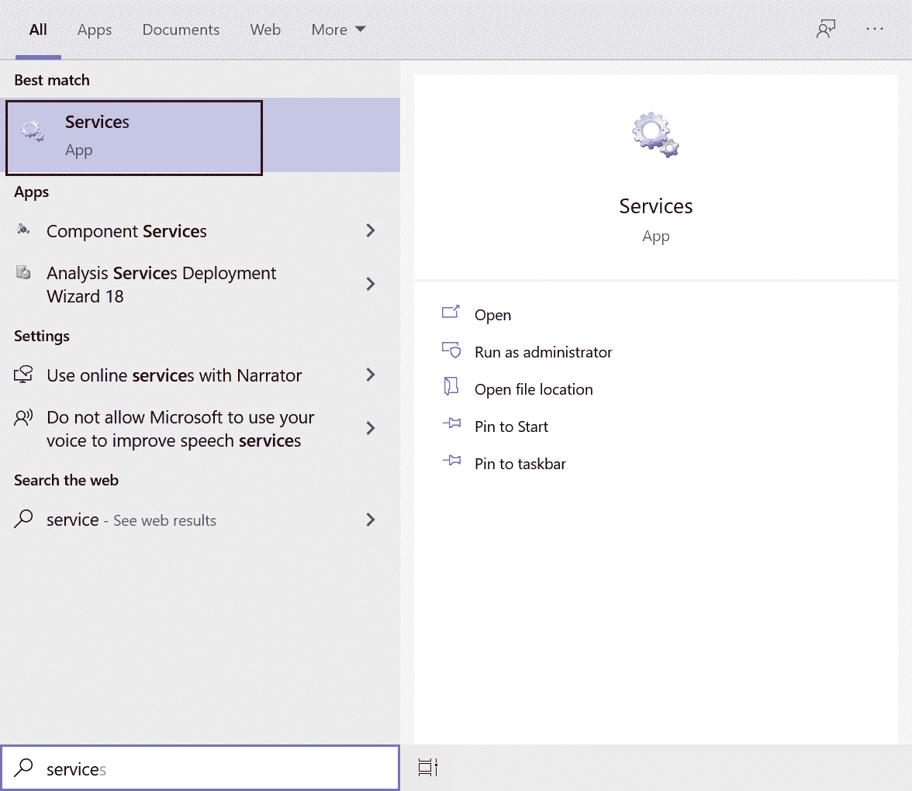](../../Content/images/mongodb/services.png)

MongoDB Service

在服务窗口中，导航到蒙古数据库服务器，如下所示。你会发现它已经启动并运行了。

MongoDB Service on Windows

现在，MongoDB 服务器服务已经在运行，您可以连接 MongoDB 客户端来连接这个 MongoDB 服务器并执行命令。

## 蒙戈布客户端

MongoDB 客户端可以是您的应用程序、MongoDB Shell、MongoDB Compass，或者任何想要将数据连接并存储到 MongoDB 服务器的东西。

在这里，我们已经安装了两个客户端，MongoDB Shell 和 MongoDB Compass。

转到安装 MongoDB 的路径。默认为“C:\程序文件\ MongoDB \服务器\5.0\bin”，如下所示。

[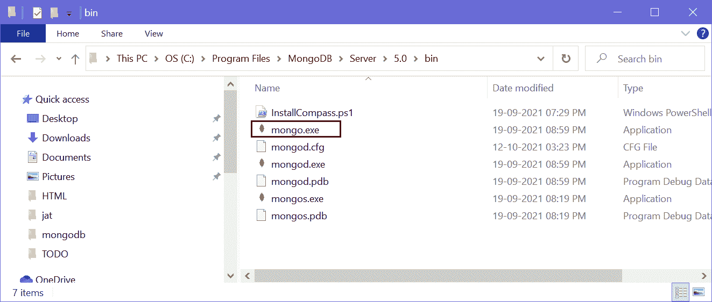](../../Content/images/mongodb/mongodb-folder.png)

MongoDB Installation Folder

在这里，你会发现 mongo.exe，也就是 MongoDB Shell。点击 mongo.exe 启动客户端，如下所示。

MongoDB Shell

您可以在这里执行命令。例如，编写“显示数据库”并按回车键显示它已经拥有的数据库，如下所示。

[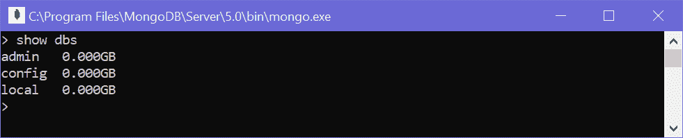](../../Content/images/mongodb/mongo-shell-2.png)

MongoDB Shell Command

因此，您可以安装 MongoDB 服务器、客户端(MongoDB Shell 和 Compass)和其他功能。