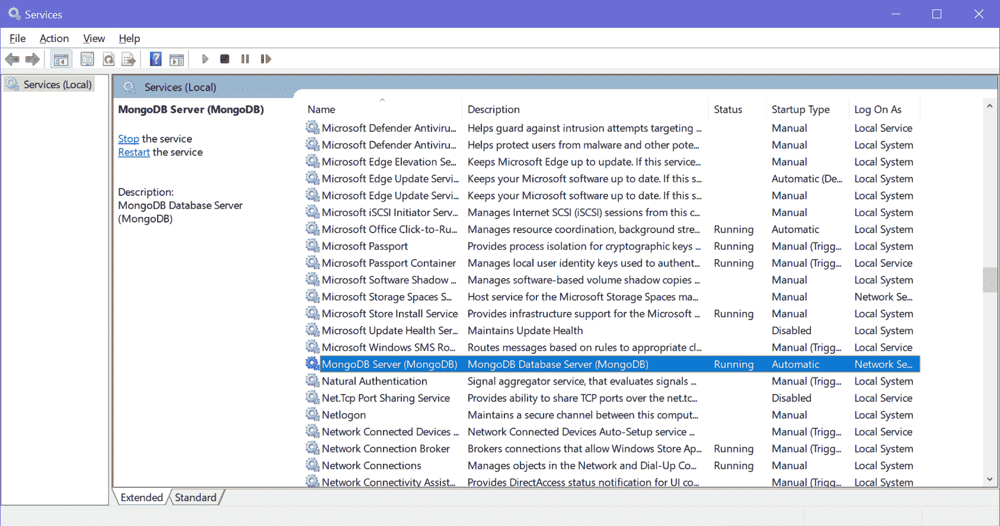
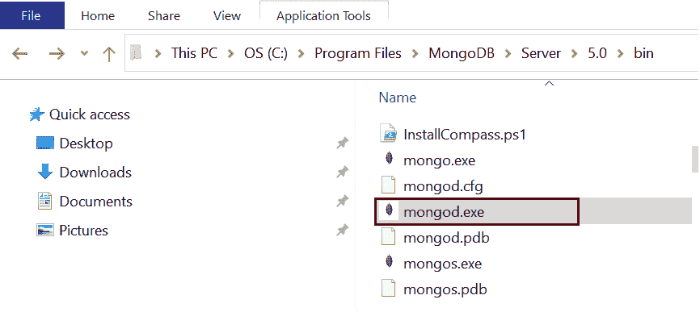
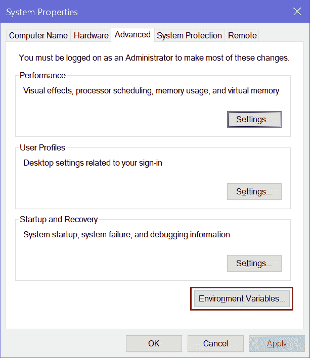
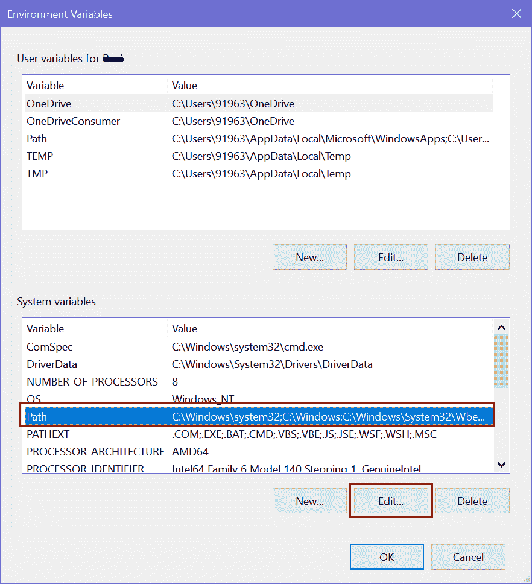
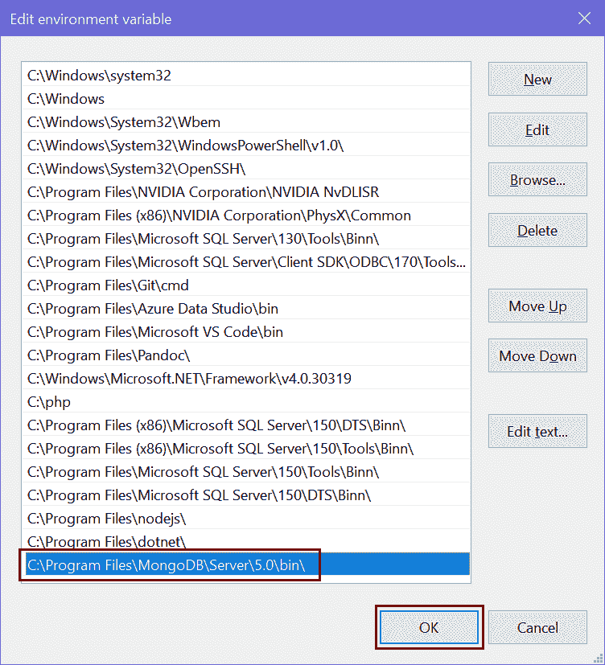
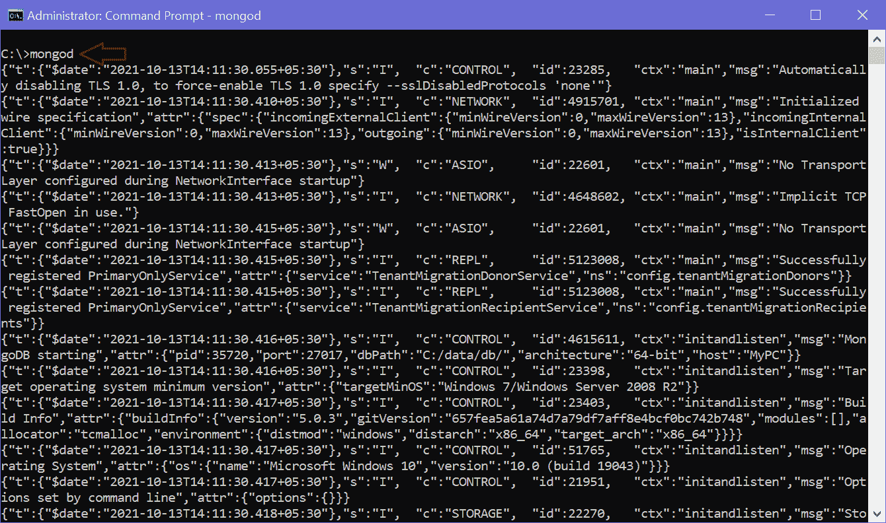
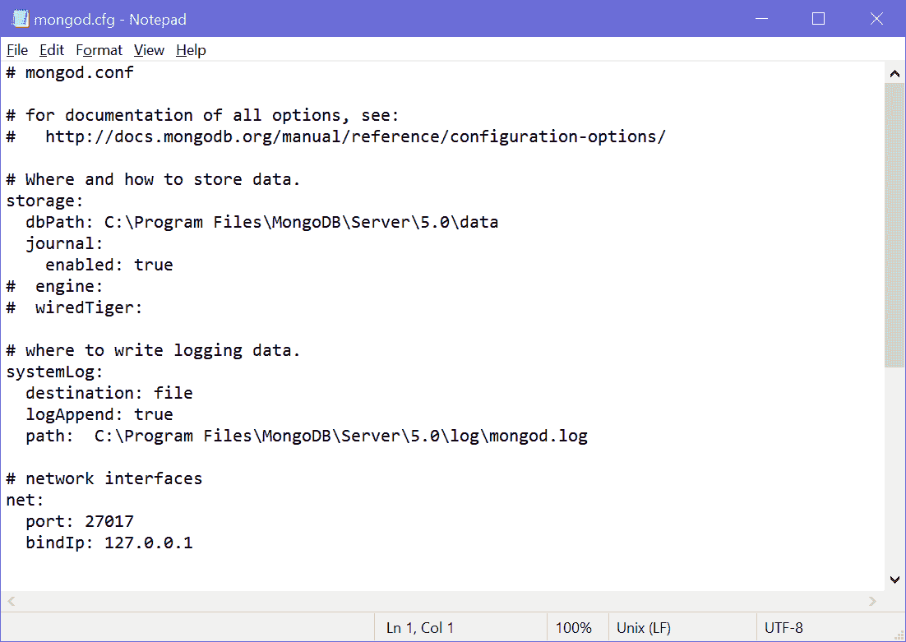

# 蒙古数据库服务器-蒙古，配置

> 哎哎哎:# t0]https://www . tutorial connector . com/mong odb/mong odb 服务器

在这里，您将了解什么是 MongoDB 服务器，如何手动运行它，以及如何为您的 MongoDB 服务器设置各种配置设置。

我们在[安装 MongoDB](/mongodb/install-mongodb) 章节中安装了 MongoDB 服务器作为 Windows 服务。 MongoDB windows 服务在启动时自动启动并运行，如下图所示。

[](../../Content/images/mongodb/mongo-service.png)

MongoDB Service on Windows


在内部，每当您的机器启动时，MongoDB 服务都会在默认地址`http://127.0.0.1:27017`启动本地 MongoDB 服务器。 MongoDB 服务器作为 mongod.exe 安装在 Windows 的`{mongodb install folder}/bin`文件夹中，如下图所示。

[](../../Content/images/mongodb/mongod.png)

MongoDB Server File - mongod.exe


无论您是否将其作为服务安装，MongoDB 服务器 mongod 都可以手动启动或停止。

## 手动运行 mongodb

如果您已经将 MongoDB 安装为 windows 服务，那么首先停止该服务，因为我们将手动启动它。

现在，将`{mongodb install folder}/bin`添加到本地 Windows 机器上的环境变量中。 在窗口搜索中搜索“环境”，点击“编辑系统环境变量”打开系统属性，如下图。

[](../../Content/images/mongodb/environment-var.png)

System Properties


单击“环境变量”编辑路径，如下所示。

[](../../Content/images/mongodb/env-var.png)

Environment Variable - Path


现在，在底部窗格中选择路径，然后单击编辑按钮。这将打开“编辑环境变量”窗口。点击新建按钮，添加 MongoDB 文件夹路径“C:\程序文件\ MongoDB \服务器\5.0\bin”，如下所示。

[](../../Content/images/mongodb/add-mongodb-path.png)

Add MongoDB Folder Path


单击确定关闭所有弹出窗口。

将 MongoDB 文件夹路径添加到环境变量允许我们从命令提示符/终端的任何地方运行 mongod.exe。

现在，以管理员身份在 Windows 或终端上打开一个命令提示符，在 Windows 上执行`mongod`或在 Mac 上执行`sudo mongod`来运行你的 MongoDB 服务器，如下图所示。

[](../../Content/images/mongodb/mongod-server.png)

Start MongoDB Server


出于测试目的，您可以使用`mongod`命令指定各种命令选项。 以下是一些有用的命令选项列表。

```
  -h [ --help ]                         Show this usage information
  --version                             Show version information
  -f [ --config ] arg                   Configuration file specifying
                                        additional options
  --configExpand arg                    Process expansion directives in config
                                        file (none, exec, rest)
  --port arg                            Specify port number - 27017 by default
  --ipv6                                Enable IPv6 support (disabled by
                                        default)
  --listenBacklog arg (=2147483647)     Set socket listen backlog size
  --maxConns arg (=1000000)             Max number of simultaneous connections
  --pidfilepath arg                     Full path to pidfile (if not set, no
                                        pidfile is created)
  --timeZoneInfo arg                    Full path to time zone info directory,
                                        e.g. /usr/share/zoneinfo
  -v [ --verbose ] [=arg(=v)]           Be more verbose (include multiple times
                                        for more verbosity e.g. -vvvvv)
  --quiet                               Quieter output
  --logpath arg                         Log file to send write to instead of
                                        stdout - has to be a file, not
                                        directory
  --logappend                           Append to logpath instead of
                                        over-writing
  --logRotate arg                       Set the log rotation behavior
                                        (rename|reopen)
  --timeStampFormat arg                 Desired format for timestamps in log
                                        messages. One of iso8601-utc or
                                        iso8601-local
  --setParameter arg                    Set a configurable parameter
  --bind_ip arg                         Comma separated list of ip addresses to
                                        listen on - localhost by default
  --bind_ip_all                         Bind to all ip addresses
  --noauth                              Run without security
  --transitionToAuth                    For rolling access control upgrade.
                                        Attempt to authenticate over outgoing
                                        connections and proceed regardless of
                                        success. Accept incoming connections
                                        with or without authentication.
  --slowms arg (=100)                   Value of slow for profile and console
                                        log
  --slowOpSampleRate arg (=1)           Fraction of slow ops to include in the
                                        profile and console log
  --profileFilter arg                   Query predicate to control which
                                        operations are logged and profiled
  --auth                                Run with security
  --clusterIpSourceAllowlist arg        Network CIDR specification of permitted
                                        origin for `__system` access
  --profile arg                         0=off 1=slow, 2=all
  --cpu                                 Periodically show cpu and iowait
                                        utilization
  --sysinfo                             Print some diagnostic system
                                        information
  --noscripting                         Disable scripting engine
  --notablescan                         Do not allow table scans
  --keyFile arg                         Private key for cluster authentication
  --clusterAuthMode arg                 Authentication mode used for cluster
                                        authentication. Alternatives are
                                        (keyFile|sendKeyFile|sendX509|x509)

Replication options:
  --oplogSize arg                       Size to use (in MB) for replication op
                                        log. default is 5% of disk space (i.e.
                                        large is good)

Replica set options:
  --replSet arg                         arg is [/<optionalseedhostlist>]
  --enableMajorityReadConcern [=arg(=1)] (=1)
                                        Enables majority readConcern.
                                        enableMajorityReadConcern=false is no
                                        longer supported

Sharding options:
  --configsvr                           Declare this is a config db of a
                                        cluster; default port 27019; default
                                        dir /data/configdb
  --shardsvr                            Declare this is a shard db of a
                                        cluster; default port 27018

Storage options:
  --storageEngine arg                   What storage engine to use - defaults
                                        to wiredTiger if no data files present
  --dbpath arg                          Directory for datafiles - defaults to
                                        \data\db\ which is C:\data\db\ based on
                                        the current working drive
  --directoryperdb                      Each database will be stored in a
                                        separate directory
  --syncdelay arg (=60)                 Seconds between disk syncs
  --journalCommitInterval arg (=100)    how often to group/batch commit (ms)
  --upgrade                             Upgrade db if needed
  --repair                              Run repair on all dbs
  --journal                             Enable journaling
  --nojournal                           Disable journaling (journaling is on by
                                        default for 64 bit)
  --oplogMinRetentionHours arg (=0)     Minimum number of hours to preserve in
                                        the oplog. Default is 0 (turned off).
                                        Fractions are allowed (e.g. 1.5 hours)

Free Monitoring Options:
  --enableFreeMonitoring arg            Enable Cloud Free Monitoring
                                        (on|runtime|off)
  --freeMonitoringTag arg               Cloud Free Monitoring Tags

Windows Service Control Manager options:
  --install                             Install Windows service
  --remove                              Remove Windows service
  --reinstall                           Reinstall Windows service (equivalent
                                        to --remove followed by --install)
  --serviceName arg                     Windows service name
  --serviceDisplayName arg              Windows service display name
  --serviceDescription arg              Windows service description
  --serviceUser arg                     Account for service execution
  --servicePassword arg                 Password used to authenticate
                                        serviceUser

WiredTiger options:
  --wiredTigerCacheSizeGB arg           Maximum amount of memory to allocate
                                        for cache; Defaults to 1/2 of physical
                                        RAM
  --zstdDefaultCompressionLevel arg (=6)
                                        Default compression level for zstandard
                                        compressor
  --wiredTigerJournalCompressor arg (=snappy)
                                        Use a compressor for log records
                                        [none|snappy|zlib|zstd]
  --wiredTigerDirectoryForIndexes       Put indexes and data in different
                                        directories
  --wiredTigerCollectionBlockCompressor arg (=snappy)
                                        Block compression algorithm for
                                        collection data [none|snappy|zlib|zstd]
  --wiredTigerIndexPrefixCompression arg (=1)
                                        Use prefix compression on row-store
                                        leaf pages</optionalseedhostlist> 
```

## 蒙古数据库服务器配置

MongoDB 使用配置文件选项来控制数据库的行为。MongoDB 服务器`mongod`使用配置文件中添加的默认配置运行。 在 Windows 上，是`{install directory}\bin\mongod.cfg`文件。在苹果电脑上，它是`/usr/local/etc/mongod.conf`或`/opt/homebrew/etc/mongod.conf`。而且，在 Linux 上，它是`/etc/mongod.conf`文件。 MongoDB 配置文件使用 [YAML](http://www.yaml.org/) 格式。以下是 Windows 上的`mongod.cfg`文件:

[](../../Content/images/mongodb/mongodcfg.png)

mongod.cfg


以下是您可能希望用于本地 mongod 服务器的示例配置文件。

```
systemLog:
   destination: file
   path: "/var/log/mongodb/mongod.log"
   logAppend: true
storage:
   journal:
      enabled: true
processManagement:
   fork: true
net:
   bindIp: 127.0.0.1
   port: 27017
setParameter:
   enableLocalhostAuthBypass: false

```

更多信息请访问 [mongod 配置选项](https://docs.mongodb.com/manual/reference/configuration-options/)。