# 蒙戈布贝壳

MongoDB Shell 是连接、配置、查询和使用 MongoDB 数据库的最快方法。它充当 MongoDB 服务器的命令行客户端。

MongoDB Shell 是一个独立的开源产品，在 Apache 2 许可下独立于 MongoDB 服务器开发。它是一个功能齐全的 JavaScript 和 Node.js 14.x REPL，用于与 MongoDB 服务器交互。

蒙古数据库外壳已经安装了蒙古数据库。您可以在安装 MongoDB 的安装目录中找到它。默认为“C:\程序文件\蒙古数据库\服务器”。打开安装文件夹和适当的版本文件夹，并转到“bin”文件夹。这里的“mongo.exe”就是 MongoDB shell。点击它打开 MongoDB 外壳，如下所示。

[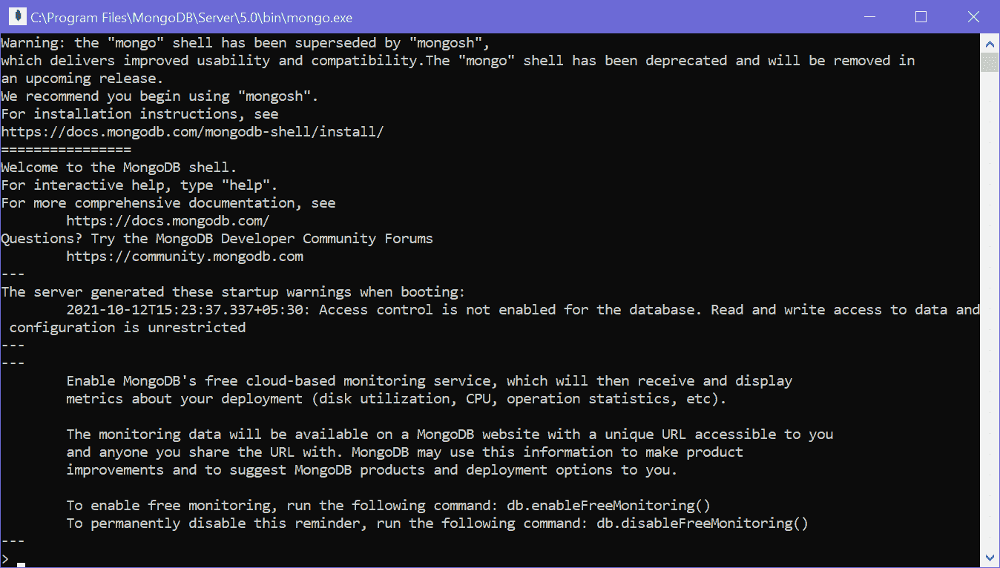](../../Content/images/mongodb/mongo-shell.png)

MongoDB Shell

## 新蒙戈布壳牌-蒙戈什

在安装文件夹中，如果您找到了 mongosh.exe 而不是 mongo.exe，那么您已经有了一个新的 MongoDB shell。如果找不到，那就需要单独安装。

新的 MongoDB Shell mongosh 比旧的 shell mongo 有更多的功能，例如智能自动完成和语法突出显示、易于理解的错误消息、以可读格式呈现输出的格式化功能等。然而，所有的命令都将在 mongosh 和 mongo shell 中执行。

### 安装蒙古人

要安装新的 MongoDB shell (mongosh)，请访问[www.mongodb.com](https://www.mongodb.com/)并点击产品菜单- >工具- >数据库 shell，如下所示。

[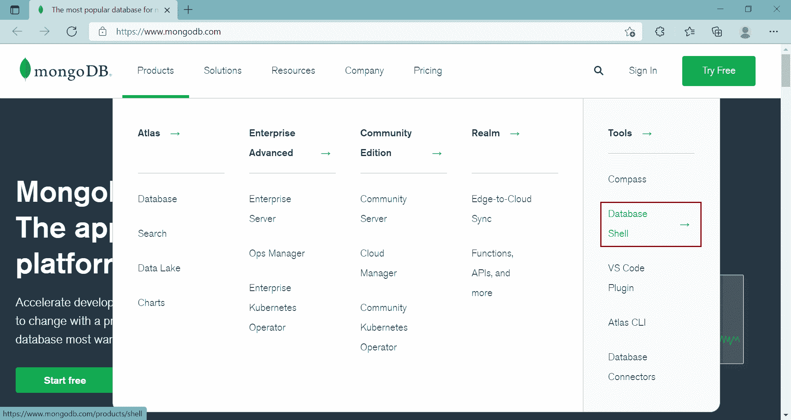](../../Content/images/mongodb/install-mongoshell.png)

Download New MongoDB Shell

在 MongoDB 外壳页面上，单击下载按钮下载外壳。

[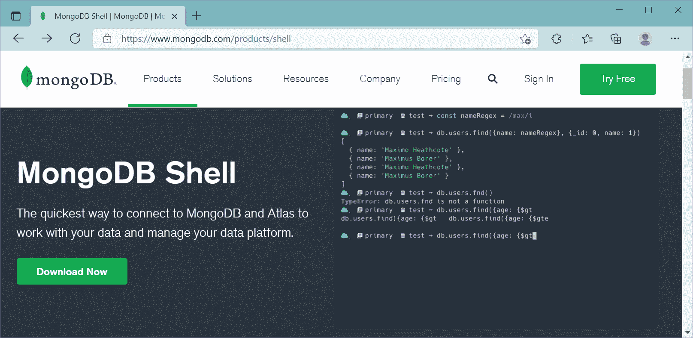](../../Content/images/mongodb/download-shell.png)

Download New MongoDB Shell

这将带您进入一个页面，您可以在其中选择要下载的版本、平台和软件包，如下所示。

[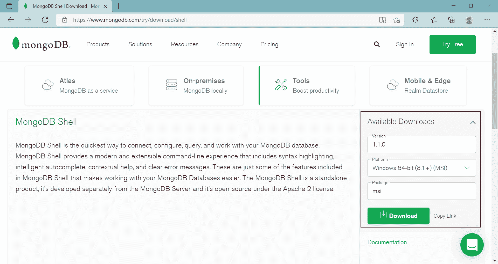](../../Content/images/mongodb/download-shell2.png)

Download New MongoDB Shell

单击下载按钮下载安装程序文件。

现在，单击下载的安装程序文件启动安装向导，如下所示。

[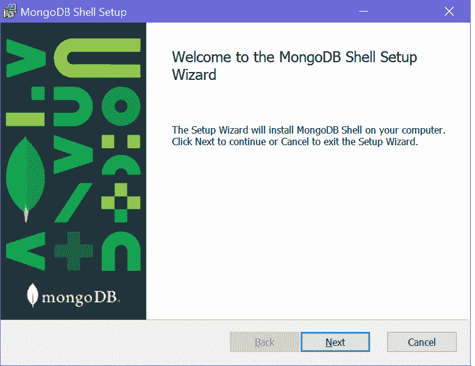](../../Content/images/mongodb/mongo-shell-install.png)

Install New MongoDB Shell - mongosh

单击“下一步”转到下面显示的下一步。

[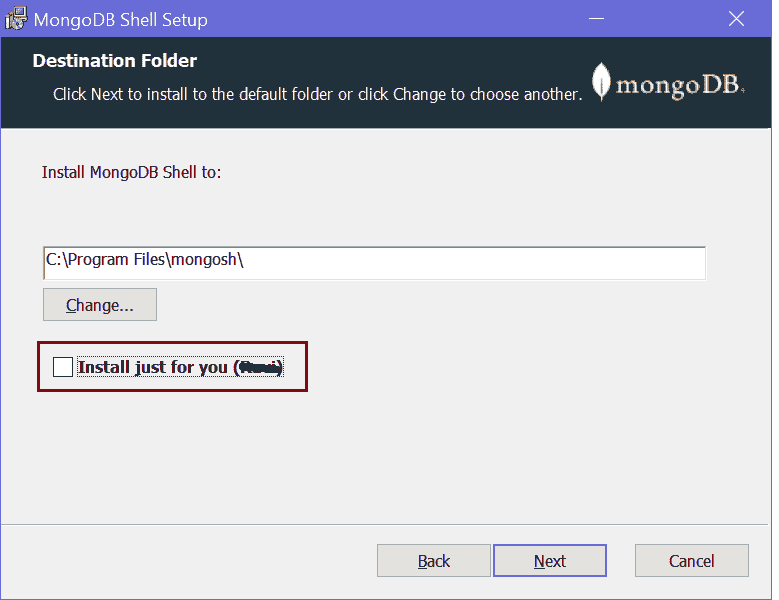](../../Content/images/mongodb/install-mongoshell2.png)

Install New MongoDB Shell - mongosh

如果您想为本地计算机上的所有用户安装 shell，请取消选中该复选框，然后单击“下一步”。

[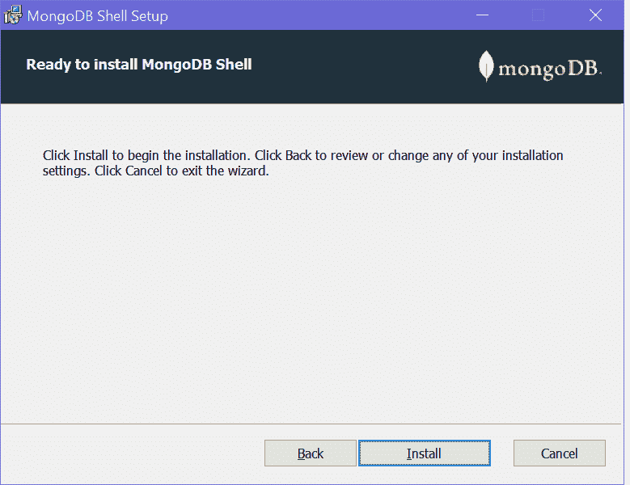](../../Content/images/mongodb/install-mongoshell3.png)

Install New MongoDB Shell - mongosh

单击安装按钮开始安装。它应该会很快安装。

[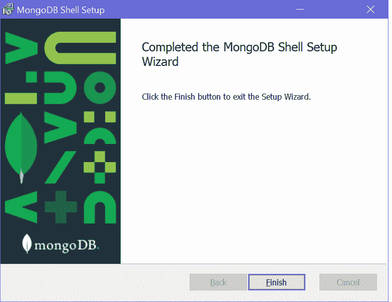](../../Content/images/mongodb/install-mongoshell4.png)

Install New MongoDB Shell - mongosh

安装完成后，单击“完成”按钮关闭向导。

这应该已经在 Windows 的“C:\程序文件\mongosh”文件夹中安装了 mongosh，如下所示。

[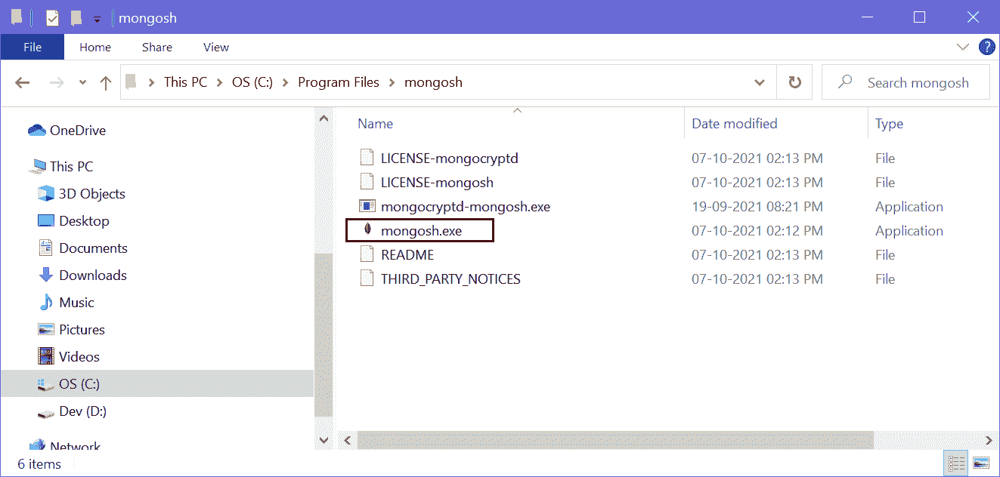](../../Content/images/mongodb/mongosh-file.png)

New MongoDB Shell - mongosh

点击 mongosh.exe 打开一个新的 MongoDB 外壳，如下所示。

[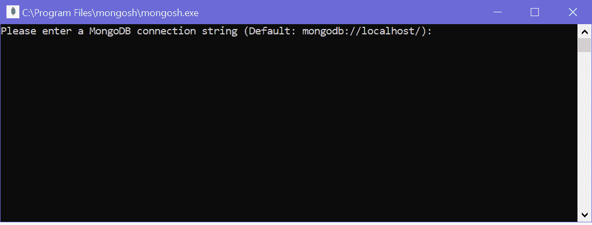](../../Content/images/mongodb/mongosh.png)

New MongoDB Shell - mongosh

按回车键启动外壳，如下所示。

[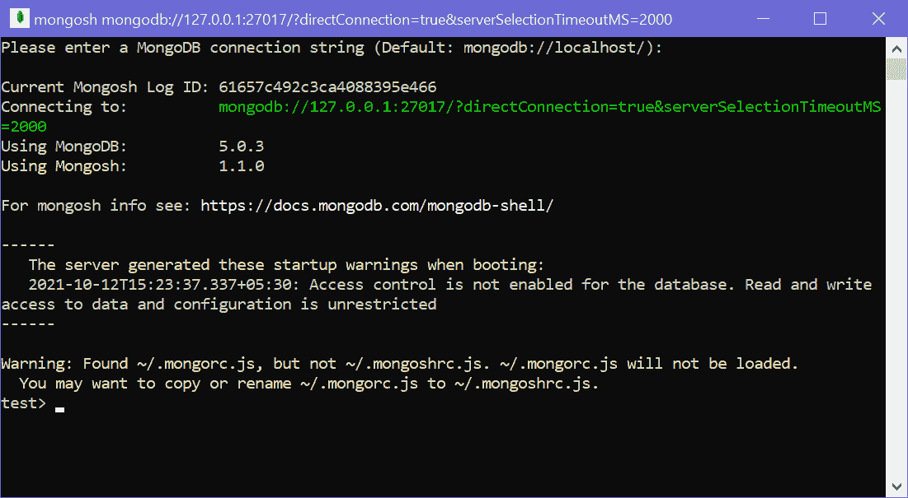](../../Content/images/mongodb/mongosh2.png)

New MongoDB Shell - mongosh

或者，在 Windows 上打开一个新的命令提示符，写 mongosh，然后按回车键。它将打开相同的 MongoDB 外壳。

## 执行蒙古数据库命令

您可以在 mongoDB 外壳(Mongo 或 mongosh)上执行 MongoB 命令进行 CRUD 操作。例如，执行“shows dbs”命令查看连接的 MongoDB 服务器上的所有数据库。

<samp>> show dbs
admin 41 kB
config 111 kB
local 41 kB</samp>

使用“db”命令检查当前数据库。

<samp>> db
test</samp>

运行`.editor`命令执行多行命令。按`Ctrl + d`运行命令或按`Ctrl + c`取消。

MongoDB 的外壳是 JavaScript 和 Node.js REPL，所以你也可以执行有限的 JavaScript 代码。

<samp>> "Hello".length
5</samp>

按两次`Ctrl + c`退出 MongoDB 外壳。