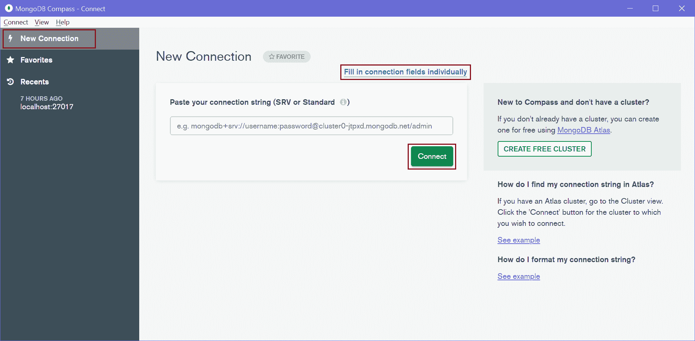
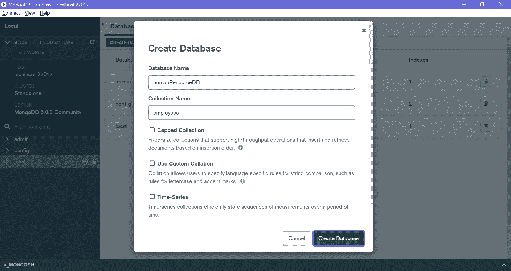
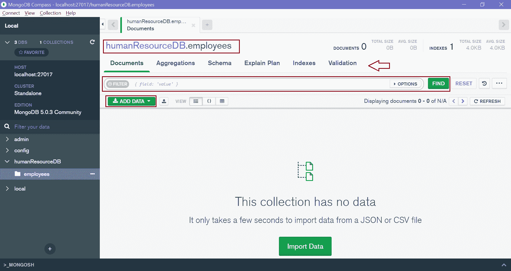

# MongoDB Compass

MongoDB Compass 是一个基于 GUI 的工具(unline MongoDB Shell)，用于与本地或远程 MongoDB 服务器和数据库进行交互。使用 Compass 可视化地浏览您的数据，运行临时查询，执行 CRUD 操作，并查看和优化您的查询性能。它可以安装在 Linux、Mac 或 Windows 上。

如果你还没有用 MongoDB 安装 MongoDB Compass，那就从[这里](https://www.mongodb.com/try/download/compass)下载适合你平台的免费社区版 Compass。

现在，在“mongodb compass”上进行窗口搜索并打开它，如下所示。

MongoDB Compass

在主页面，点击左侧窗格的`New Connection`选项卡，打开如上图所示的`New Connection`页面。 可以粘贴连接字符串或者点击`Fill in connection fields individually`链接。这将打开以下窗口，您可以在其中输入主机名、端口、用户名、密码等。

MongoDB Compass

这已经有了默认参数，只需单击“确定”即可连接到您的本地服务器，如下所示。

MongoDB Compass

如上所述，它将显示连接的 MongoDB 服务器上的所有数据库。在左窗格中，它显示有关连接的服务器的信息。

现在，您可以使用 MongoDB Compass 创建、修改、删除数据库、集合和文档。点击`CREATE DATABASE`按钮创建新的数据库。这将打开`Create Database`弹出窗口，如下所示。

MongoDB Compass - Create Database

输入你的数据库名和收藏名，点击`Create Database`。这将创建一个新的数据库`humanResourceDB`，新的`employees`集合如下所示。

MongoDB Compass - Collections

点击`employees`收藏在里面插入、更新、查找文档。这将打开以下窗口来管理文档。

MongoDB Compass - Manage Documents

因此，您可以使用 MongoDB Compass 用户界面来管理您的 MongoDB 数据库。