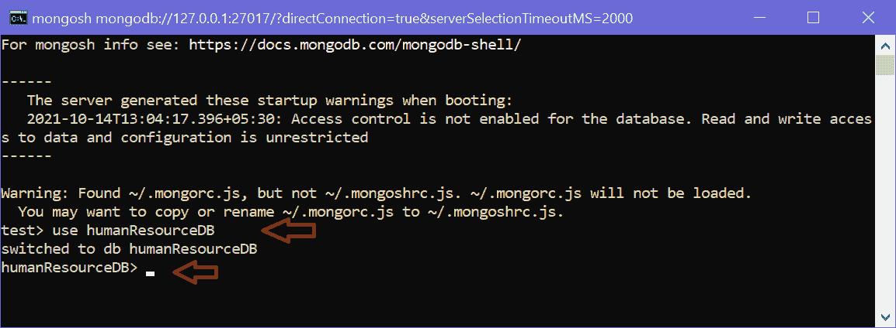
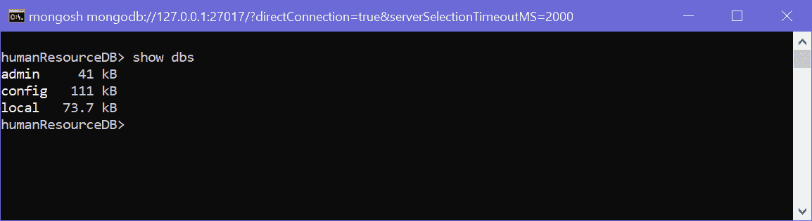
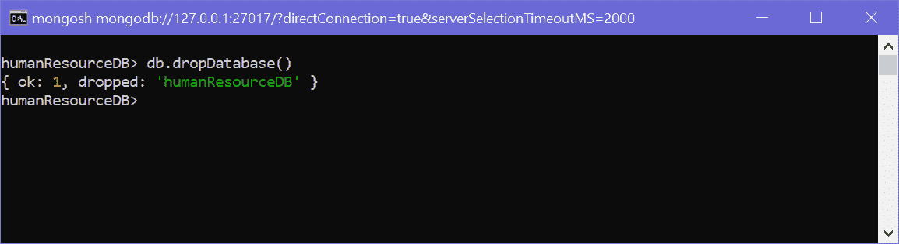

# 切换或创建新的蒙古数据库

> 原文:[https://www . tutorial stearn . com/MongoDB/create-MongoDB-database](https://www.tutorialsteacher.com/mongodb/create-mongodb-database)

MongoDB 是一个面向文档的开源 NoSQL 数据库。它是最受欢迎和使用最广泛的 NoSQL 数据库之一。在本教程中，您将学习如何创建新的 MongoDB 数据库，或者切换到现有的数据库。

数据库是以有组织的方式存储数据的地方。在 MongoDB 中，数据库用于存储集合。一个 MongoDB 服务器可以有多个数据库，一个 MongoDB 数据库可以有多个集合。

您可以使用 [MongoDB Shell](/mongodb/mongodb-shell) 或 [MongoDB Compass](/mongodb/mongodb-compass) 创建一个新的数据库。

MongoDB 提供`use <database-name`命令连接数据库。 如果指定的数据库名称不存在，则创建该数据库并将其设置为当前数据库。

例如，以下命令切换到“humanResouredb”数据库。如果它不存在，那么就创建它。

Example: Switch or Create Database<button class="copy-btn pull-right" title="Copy example code">*Copy*</button> *```
use humanResourceDB 
```

下面展示如何在 MongoDB shell `mongosh`中创建或切换 MongoDB 数据库:

<figure>[](../../Content/images/mongodb/create-db1.png)

<figcaption>Create or Switch Database in MongoDB Shell</figcaption>

</figure>

MongoDB 将自动切换到新创建的数据库。注意，现在提示`humanResourceDB>`。

要检查所有数据库，请使用“show dbs”命令，如下所示。

<figure>[](../../Content/images/mongodb/create-db3.png)

<figcaption>List Databases</figcaption>

</figure>

如上所述，“admin”、“config”和“local”是默认数据库。截至目前，“人力资源数据库”不可见。这是因为里面没有收藏。

要删除数据库，请使用删除当前数据库的`db.dropDatabase()`方法。

<figure>[](../../Content/images/mongodb/create-db4.png)

<figcaption>Delete Database</figcaption>

</figure>

上图，`{ ok: 1, dropped: 'humanResourcedb' }`表示数据库删除成功。

注意:方法名区分大小写。所以，执行`db.dropdatabase()`会抛出一个错误。

## 使用蒙古数据库罗盘创建数据库

您可以使用 MongoDB Compass 创建一个新的数据库。为此，请打开 Compass 并连接到您的本地或远程数据库。一旦它与 MongoDB 服务器连接，点击顶部的“创建数据库”按钮，将打开弹出窗口，如下所示。

<figure>[](../../Content/images/mongodb/compass4.png)

<figcaption>MongoDB Compass - Create Database</figcaption>

</figure>

输入你的数据库名和收藏名，点击`Create Database`。这将创建一个新的数据库`humanResourceDB`，新的`employees`集合如下所示。

<figure>[](../../Content/images/mongodb/compass5.png)

<figcaption>MongoDB Compass - Collections</figcaption>

</figure>

因此，您可以在 MongoDB 中创建新的数据库。*