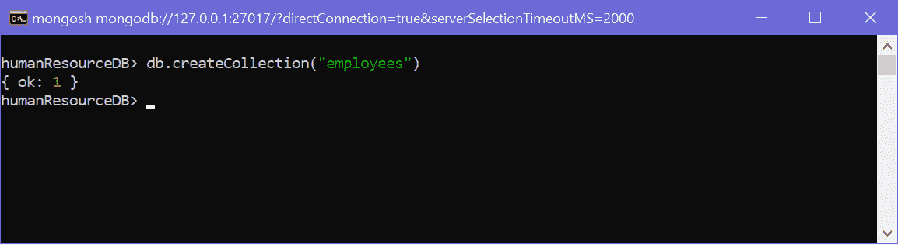
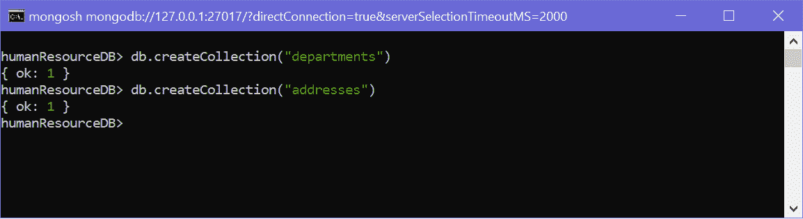
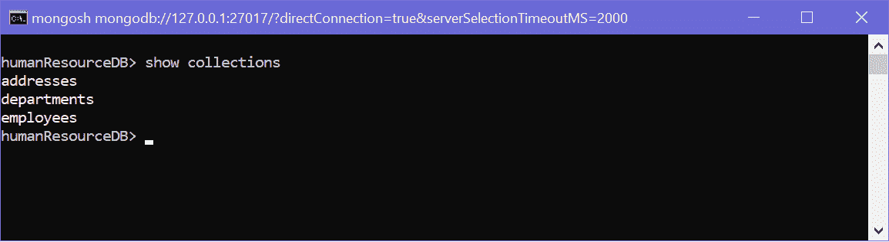
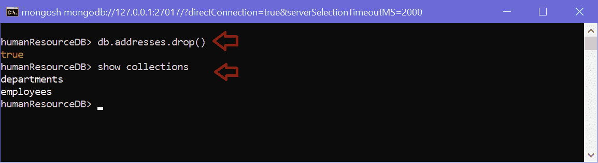
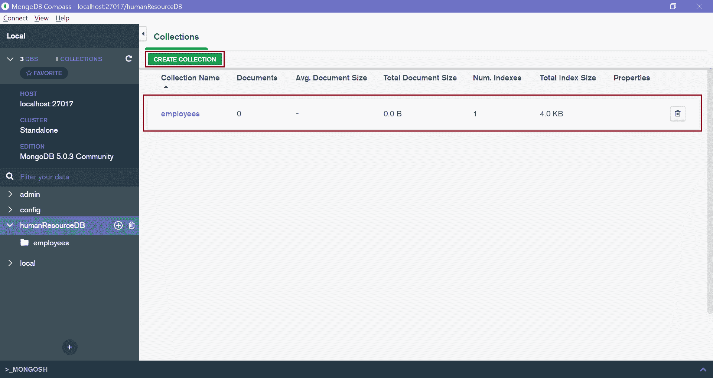
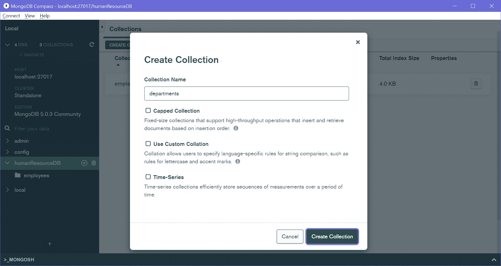

# 蒙戈布收藏品

> 哎哎哎:# t0]https://www . tutorial reacher . com/mong odb/mong odb 集合

MongoDB 中的集合类似于 RDBMS 中的表。MongoDB 集合不强制模式。每个 MongoDB 集合可以有多个文档。在关系数据库管理系统中，文档等同于表格中的行。

要创建集合，请使用`db.createCollection()`命令。 下面在当前数据库中创建新的`employees`集合，也就是上一章创建的`humanResourceDB`数据库。

<figure>

<figcaption>Create Collection</figcaption>

</figure>

以上，`employees`集合是使用`creatCollection()`方法创建的。 返回一个对象`{ ok: 1 }`，表示集合创建成功。

如上所述，单个数据库可以有多个集合。下面创建多个集合。

<figure>

<figcaption>Create Multiple Collections</figcaption>

</figure>

使用`show collections`命令列出数据库中的所有集合。

<figure>

<figcaption>Show Collections</figcaption>

</figure>

要删除集合，请使用`db.<collection-name>.drop()`方法。

<figure>

<figcaption>Delete Collection</figcaption>

</figure>

## 在蒙古数据库罗盘中创建集合

要使用 MongoDB Compass 创建新集合，请将 Compass 连接到服务器并选择数据库。

点击“创建收藏”按钮创建一个新的收藏，如下所示。

<figure>

<figcaption>MongoDB Compass - Collections</figcaption>

</figure>

输入集合的名称，勾选相应的复选框，然后点击`Create Collection`按钮创建集合。

<figure>

<figcaption>MongoDB Compass - Collections</figcaption>

</figure>

因此，您可以使用 MongoDB Shell mongosh 或 MongoDB Compass 创建一个新的集合。