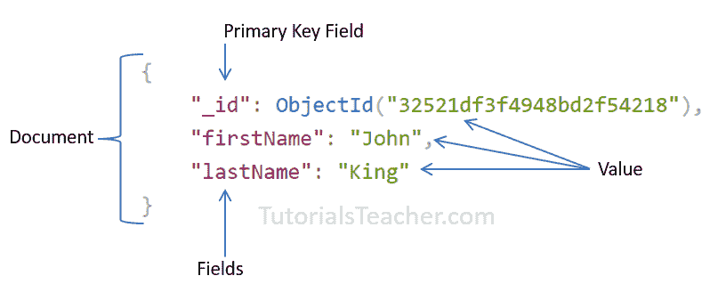
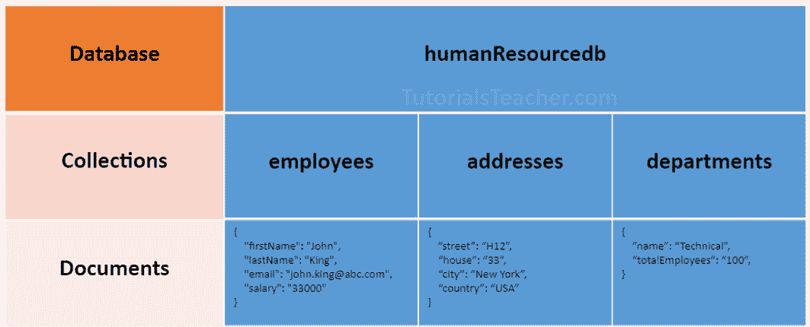
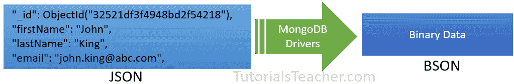

# MongoDB 文档：文档、数组、嵌入文档


在关系数据库管理系统数据库中，一个表可以有多行多列。类似地，在 MongoDB 中，一个集合可以有多个相当于行的文档。每个文档都有多个相当于列的“字段”。所以简单来说，每个 MongoDB 文档都是一条记录，一个集合就是一个可以存储多个文档的表。

下面是一个基于 JSON 的文档示例。

 

MongoDB Document


在上面的例子中，文档包含在大括号中。它包含`"field":"value"`格式的多个字段。上面的 、`"_id"`、`"firstName"`和`"lastName"`是字段名称，它们各自的值位于冒号`:`之后。 字段用逗号分隔。一个集合可以有多个这样的文档，用逗号分隔。

下图说明了数据库、集合和文档之间的关系。

 

MongoDB Database, Collection, and Document


以下是包含数组和嵌入文档的文档示例。

Example: MongoDB Document 

```js
{
    "_id": ObjectId("32521df3f4948bd2f54218"),
    "firstName": "John",
    "lastName": "King",
    "email": "[[email protected]](/cdn-cgi/l/email-protection)",
    "salary": "33000",
    "DoB": new Date('Mar 24, 2011'),
    "skills": [ "Angular", "React", "MongoDB" ],
    "address": { 
                "street":"Upper Street",
                "house":"No 1",
                "city":"New York",
                "country":"USA"
            }
} 
```

MongoDB 文档以 JSON 格式存储数据。在上面的文档中，“名字”、“姓氏”、“电子邮件”和“工资”是具有相应值(例如，一行中一列的值)的字段(像关系数据库中一个表的列)。将`"_id"`字段视为存储唯一 [ObjectId](https://docs.mongodb.com/manual/reference/bson-types/#std-label-objectid) 的主键字段。 `"skills"`是数组，`"address"`保存另一个 JSON 文档。

可以在没有引号的情况下指定字段名，如下所示。

Example: MongoDB Document 

```js
{
    _id: ObjectId("32521df3f4948bd2f54218"),
    firstName: "John",
    lastName: "King",
    email: "[[email protected]](/cdn-cgi/l/email-protection)",
    salary: "33000",
    DoB: new Date('Mar 24, 2011'),
    skills: [ "Angular", "React", "MongoDB" ],
    address: { 
                street:"Upper Street",
                house:"No 1",
                city:"New York",
                country:"USA"
            }
} 
```

MongoDB 将键值对中的数据存储为 BSON 文档。BSON 是 JSON 文档的二进制表示，它支持比 JSON 更多的数据类型。MongoDB 驱动程序将 JSON 文档转换为 BSON 数据。

 

JSON vs BSON


### 要点:

*   MongoDB 保留`_id`名称作为保存 ObjectId 类型的唯一主键字段。 但是，除了数组之外，您可以自由地给任何数据类型起任何您喜欢的名字。
*   文档字段名不能是`null`，但值可以是。
*   大多数 MongoDB 文档不能有重复的字段名。但是，这取决于您在应用中存储文档所使用的驱动程序。
*   如果不包含空格，文档字段可以不带引号`" "`，例如`{ name: "Steve"}`、`{ "first name": "Steve"}`是有效字段。
*   使用点符号来访问数组元素或嵌入文档。
*   MongoDB 支持最大 16mb 的文档大小。使用 [GridFS](https://docs.mongodb.com/manual/core/gridfs/) 存储 16 MB 以上的文档。
*   BSON 文档中的字段是有序的。这意味着在比较两个文档时字段顺序很重要，例如`{x: 1, y: 2}`不等于`{y: 2, x: 1}`
*   MogoDB 保持除`_id`字段以外的字段顺序，该字段始终是第一个字段。
*   MongoDB 集合可以存储不同字段的文档。它不强制任何模式。

## 嵌入的文档:

MongoDB 中的文档可以有保存另一个文档的字段。它也被称为嵌套文档。

下面是一个嵌入文档，其中`department`和`address`字段包含另一个文档。

Example: Embedded Document 

```js
{
    _id: ObjectId("32521df3f4948bd2f54218"),
    firstName: "John",
    lastName: "King",
    department: { 
                _id: ObjectId("55214df3f4948bd2f8753"), 
                name:"Finance"
            },
    address: {
        phone: { type: "Home", number: "111-000-000" }
    }
} 
```

在上面的嵌入文档中，注意`address`字段包含保存二级文档的`phone`字段。

*   一个嵌入的文档最多可以包含 100 层嵌套。
*   支持最大 16 mb 的大小。
*   嵌入的文档可以使用点符号`embedded-document.fieldname`访问，例如使用`address.phone.number`访问电话号码。

## 排列

文档中的字段可以保存数组。数组可以保存任何类型的数据或嵌入的文档。

文档中的数组元素可以使用点符号来访问，索引位置从零开始，用引号括起来。

Example: MongoDB Document with an Array 

```js
{
    _id: ObjectId("32521df3f4948bd2f54218"),
    firstName: "John",
    lastName: "King",
    email: "[[email protected]](/cdn-cgi/l/email-protection)",
    skills: [ "Angular", "React", "MongoDB" ],
} 
```

上面的文档包含保存字符串数组的`skills`字段。 要指定或访问`skills`数组中的第二个元素，请使用`skills.1`。****