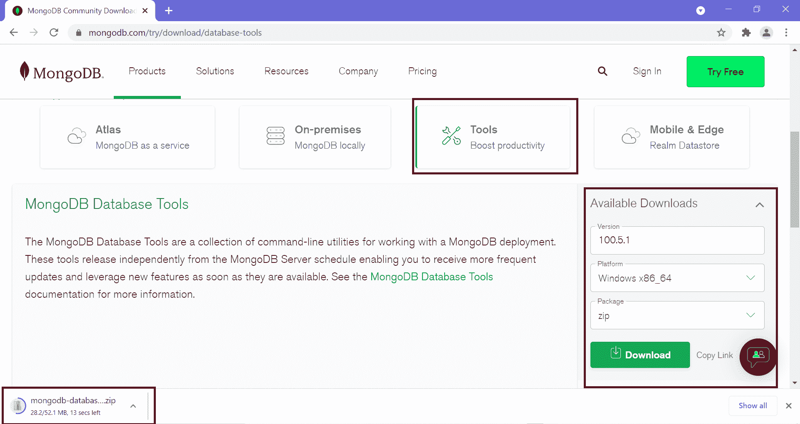
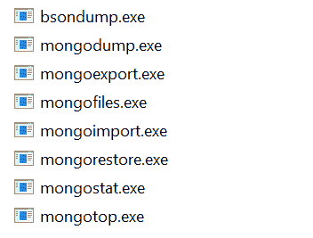

# 使用蒙古导入在蒙古数据库中导入数据

> 原文：<https://www.tutorialsteacher.com/mongodb/import-data-using-mongoimport>

在这里，您将学习如何将 JSON 数据或 CSV 文件导入 MongoDB 中的集合。

使用`mongoimport`命令将数据导入集合。您应该已经安装了 [MongoDB 数据库工具](https://www.mongodb.com/try/download/database-tools)来使用`mongoimport`命令。

要安装数据库工具，请访问[数据库工具](https://www.mongodb.com/try/download/database-tools)并下载适用于您平台的 zip 文件。

[](../../Content/images/mongodb/mongoimport1.png)

现在，提取并复制所有。并将其粘贴到 MongoDB bin 文件夹中。在 Windows 上，是`C:\Program Files\MongoDB\Server\<version>\bin`文件夹。

[](../../Content/images/mongodb/mongoimport2.png)

现在，打开终端或命令提示符，导航到要导入 JSON 文件的位置，这样就不需要指定整个路径。

下面是 mongoimport 命令。

```
mongoimport --db database_name --collection collection_name ^
            --authenticationDatabase admin --username <user> --password <password> ^
            --file file_path 

```

现在，执行以下命令将数据从`D:\MyData\employeesdata.json`文件导入到`employees`集合

<samp>D:\MyData> mongoimport --db test --collection employees --file employeesdata.json --jsonArray</samp>

上述命令将数据导入`test`数据库中的`employees`集合。 注意`--jsonArray`表示文件中的数据包含在数组中。

## 从 CSV 文件导入数据

假设您有`D:\employeesdata.csv`文件，您想要将其导入新的`employee`集合。 执行以下命令从 CSV 文件导入数据。

<samp>D:\MyData> mongoimport --db test --collection employeesdata --type csv --file employees.csv --fields _id,firstName,lastName</samp>

`--fields`选项表示 CSV 文件中每一列要使用的字段名。 如果一个文件包含应该用作字段名的标题行，则使用`--headerline`选项代替`--fields`。 以上命令将所有数据插入`employees`集合，如下图。

```
test> db.employees.find()
[
  { _id: 2, firstName: 'bill', lastName: 'gates' },
  { _id: 1, firstName: 'steve', lastName: 'jobs' },
  { _id: 3, firstName: 'james', lastName: 'bond' }
]

```