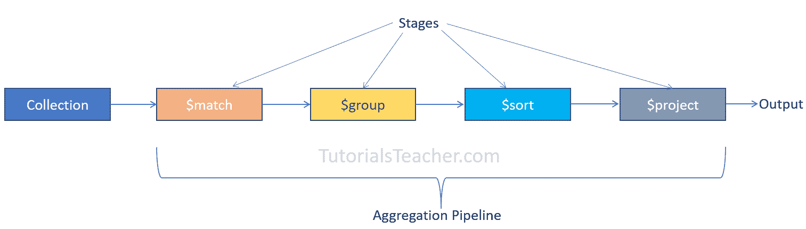

# MongoDB 中的聚合

> 原文:[https://www.tutorialsteacher.com/mongodb/aggregation](https://www.tutorialsteacher.com/mongodb/aggregation)

聚合是从 MongoDB 中的集合中选择数据的过程。它处理多个文档并返回计算结果。

使用聚合对多个文档中的值进行分组，或者对分组的数据执行操作以返回单个结果。

聚合操作可以通过两种方式执行:

1.  使用聚合管道。
2.  使用单目的聚合方法:[db . collection . estimateddocumentcount()](https://docs.mongodb.com/manual/reference/method/db.collection.estimatedDocumentCount/#mongodb-method-db.collection.estimatedDocumentCount)、 T2【db . collection . count()和 [db.collection.distinct()](https://docs.mongodb.com/manual/reference/method/db.collection.distinct/#mongodb-method-db.collection.distinct) 。

## 聚合管道

聚合管道是在`db.aggregate()`或`db.collection.aggregate()`方法中通过的一个或多个阶段的数组。

```
db.collection.aggregate([ {stage1}, {stage2}, {stage3}...])
```

聚合框架处理收集数据的阶段管道，并以您需要的形式提供输出。

每一级接收前一级的输出，进一步处理数据，并将其作为输入数据发送到下一级。在服务器上执行的聚合管道可以利用索引。请参见此处的阶段列表。

[](../../Content/images/mongodb/aggregation1.png)

让我们看看如何在下面的`employees`集合上使用不同的阶段。

Sample Data 

```
db.employees.insertMany([
    { 
        _id:1,
        firstName: "John",
        lastName: "King",
        gender:'male',
        email: "[[email protected]](/cdn-cgi/l/email-protection)",
        salary: 5000,
        department: { 
                    "name":"HR" 
                }
    },
    { 
        _id:2,
        firstName: "Sachin",
        lastName: "T",
        gender:'male',
        email: "[[email protected]](/cdn-cgi/l/email-protection)",
        salary: 8000,
        department: { 
                    "name":"Finance" 
                }
    },
    { 
        _id:3,
        firstName: "James",
        lastName: "Bond",
        gender:'male',
        email: "[[email protected]](/cdn-cgi/l/email-protection)",
        salary: 7500,
        department: { 
                    "name":"Marketing" 
                }
    },
    { 
        _id:4,
        firstName: "Rosy",
        lastName: "Brown",
        gender:'female',
        email: "[[email protected]](/cdn-cgi/l/email-protection)",
        salary: 5000, 
        department: { 
                    "name":"HR" 
                }

    },
    { 
        _id:5,
        firstName: "Kapil",
        lastName: "D",
        gender:'male',
        email: "[[email protected]](/cdn-cgi/l/email-protection)",
        salary: 4500,
        department: { 
                    "name":"Finance" 
                }

    },
    { 
        _id:6,
        firstName: "Amitabh",
        lastName: "B",
        gender:'male',
        email: "[[email protected]](/cdn-cgi/l/email-protection)",
        salary: 7000,
        department: { 
                    "name":"Marketing" 
                }
    }
]) 
```

## $匹配阶段

`$match`阶段通常是从集合中仅选择匹配文档的第一阶段。 相当于[找()](/mongodb/read-documents-using-find)的方法。 以下示例演示了具有单个`$match`阶段的聚合管道。

Example: $match Stage 

```
db.employees.aggregate([ {$match:{ gender: 'female'}} ]) 
```

在上例中，`$match`阶段被指定为数组中的文档`{$match:{ gender: 'female'}}`。 将归还`gender:'female'`备案的所有文件。

Output

```
[
  {
    _id: 4,
    firstName: 'Rosy',
    lastName: 'Brown',
    gender: 'female',
    email: '[[email protected]](/cdn-cgi/l/email-protection)',
    salary: 5000,
    department: { name: 'HR' }
  }
] 
```

`aggregate()`方法中的`$match`阶段给出与`find()`方法相同的输出。 T3 将返回与上面相同的数据。

## $小组舞台

使用`$group`阶段按照指定的`_id`表达式对输入文档进行分组，并返回包含每个不同组的累积值的单个文档。 考虑下面的例子。

Example: $group Stage 

```
db.employees.aggregate([ 
    { $group:{ _id:'$department.name'} }
]) 
```

Output

```
[ { _id: 'Marketing' }, { _id: 'HR' }, { _id: 'Finance' } ] 
```

在上例中，管道数组中只指定了`$group`级。 `$group`使用`_id`字段计算所有输入文档作为一个整体的累积值。 表达方式`{ _id:'$department.name'}`在场上创造了独特的群体`$department.name`。 由于我们不计算任何累计值，它返回`$department.name`的不同值，如下图所示。

现在，让我们计算每个组的累积值。下面计算每个部门的员工人数。

Example: Get Accumulated Values 

```
db.employees.aggregate([ 
    { $group:{ _id:'$department.name', totalEmployees: { $sum:1 } } 
}]) 
```

Output

```
[
  { _id: 'Marketing', totalEmployees: 2 },
  { _id: 'HR', totalEmployees: 2 },
  { _id: 'Finance', totalEmployees: 2 }
] 
```

在上面的例子中，我们使用`_id:'$department.name'`表达式创建不同的组。 在第二个表达式`totalEmployees: { $sum:1 }`中，`totalEmployees`是将包含在输出中的字段，`{ $sum:1 }`是累加器表达式，其中`$sum`是返回数值总和的[累加器运算符](https://docs.mongodb.com/manual/reference/operator/aggregation/group/#accumulator-operator)。 这里，`{ $sum:1 }`为属于同一组的每个文档增加 1。

以下聚合管道包含两个阶段。

Example: $match and $group 

```
db.employees.aggregate([ 
    { $match:{ gender:'male'}}, 
    { $group:{ _id:'$department.name', totalEmployees: { $sum:1 } } 
}]) 
```

Output

```
[
  { _id: 'Marketing', totalEmployees: 2 },
  { _id: 'HR', totalEmployees: 1 },
  { _id: 'Finance', totalEmployees: 2 }
] 
```

在上例中，第一阶段选择所有男性员工，并将其作为输入传递给第二阶段`$group`作为输入。 那么，输出计算所有男性员工的总和。

下面计算同一部门所有男性员工的工资总和。

Example: Get Sum of Fields 

```
db.employees.aggregate([ 
    { $match:{ gender:'male'}}, 
    { $group:{ _id:{ deptName:'$department.name'}, totalSalaries: { $sum:'$salary'} } 
}]) 
```

Output

```
[
  { _id: 'Finance', totalSalaries: 12500 },
  { _id: 'HR', totalSalaries: 10000 },
  { _id: 'Marketing', totalSalaries: 14500 }
] 
```

在上例中，`{ $match:{ gender:'male'}}`返回所有男性员工。 在`$group`阶段，累加器表达式`totalSalaries: { $sum:'$salary'}`对数值字段`salary`求和，并将其作为`totalSalaries`包含在每个组的输出中。

## $排序阶段

`$sort`阶段用于根据指定字段以升序或降序对文档进行排序。 以下对所有男性员工进行分类。

Example: Sort Documents 

```
db.employees.aggregate([
    { $match:{ gender:'male'}}, 
    { $sort:{ firstName:1}}
]) 
```

Output

```
[
  {
    _id: 6,
    firstName: 'Amitabh',
    lastName: 'B',
    gender: 'male',
    email: '[[email protected]](/cdn-cgi/l/email-protection)',
    salary: 7000,
    department: { name: 'Marketing' }
  },
  {
    _id: 3,
    firstName: 'James',
    lastName: 'Bond',
    gender: 'male',
    email: '[[email protected]](/cdn-cgi/l/email-protection)',
    salary: 7500,
    department: { name: 'Marketing' }
  },
  {
    _id: 1,
    firstName: 'John',
    lastName: 'King',
    gender: 'male',
    email: '[[email protected]](/cdn-cgi/l/email-protection)',
    salary: 5000,
    department: { name: 'HR' }
  },
  {
    _id: 5,
    firstName: 'Kapil',
    lastName: 'D',
    gender: 'male',
    email: '[[email protected]](/cdn-cgi/l/email-protection)',
    salary: 4500,
    department: { name: 'Finance' }
  },
  {
    _id: 2,
    firstName: 'Sachin',
    lastName: 'T',
    gender: 'male',
    email: '[[email protected]](/cdn-cgi/l/email-protection)',
    salary: 8000,
    department: { name: 'Finance' }
  }
] 
```

在上例中，`$match`阶段返回所有男性员工，并将其传递到下一阶段`$sort`。 `{ $sort:{ firstName:1}}`表达式按照升序按`firstName`字段对输入文档进行排序。 1 表示升序，-1 表示降序。

以下管道包含对分组文档进行排序的三个阶段。

Example: Sort Groupped Data 

```
 db.employees.aggregate([
    { $match:{ gender:'male'}}, 
    { $group:{ _id:{ deptName:'$department.name'}, totalEmployees: { $sum:1} } },
    { $sort:{ deptName:1}}
]) 
```

Output

```
[
  { _id: { deptName: 'Finance' }, totalEmployees: 2 },
  { _id: { deptName: 'HR' }, totalEmployees: 1 },
  { _id: { deptName: 'Marketing' }, totalEmployees: 2 }
] 
```

因此，您可以使用聚合管道从集合中获取所需的文档。********