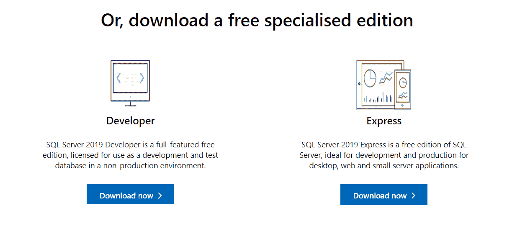
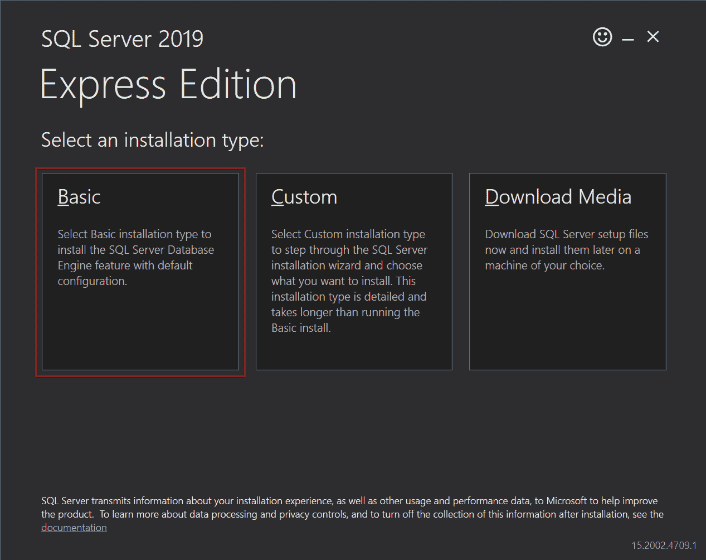
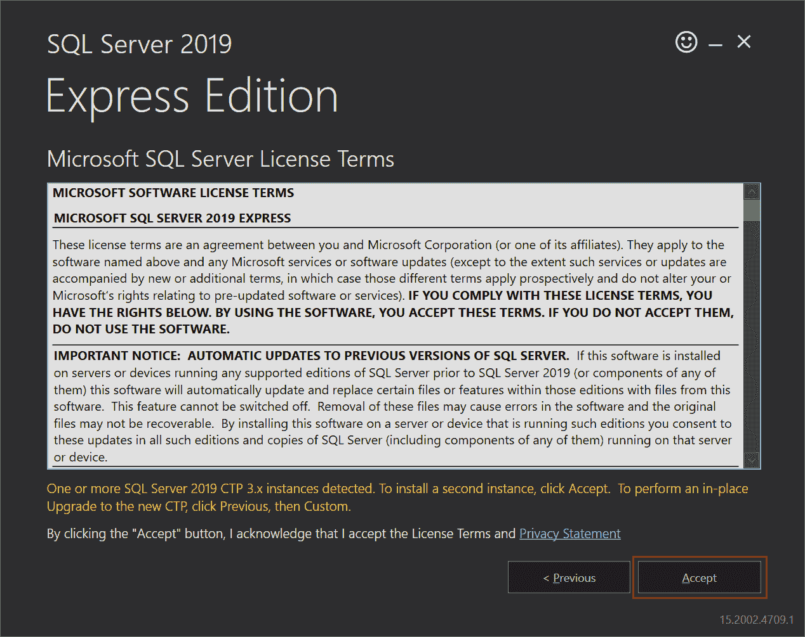
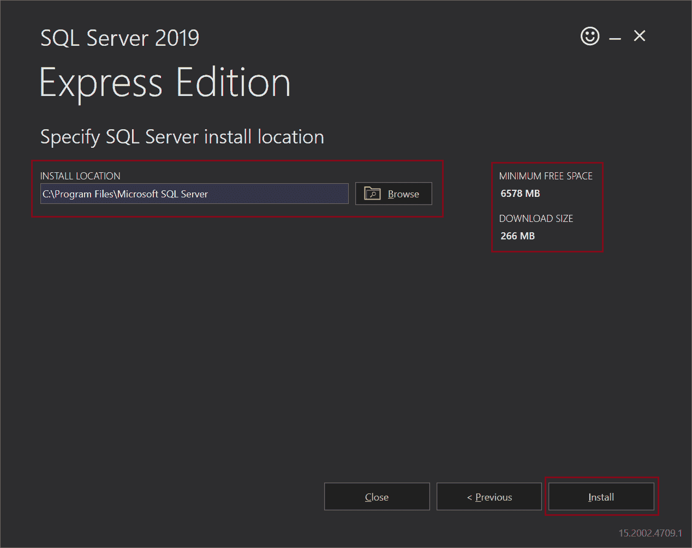
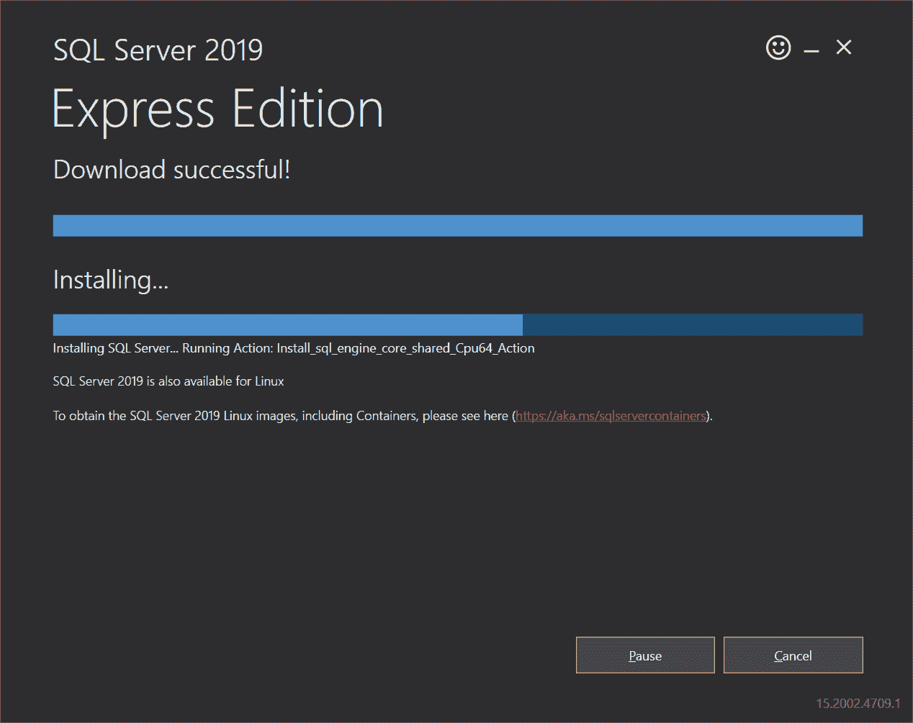
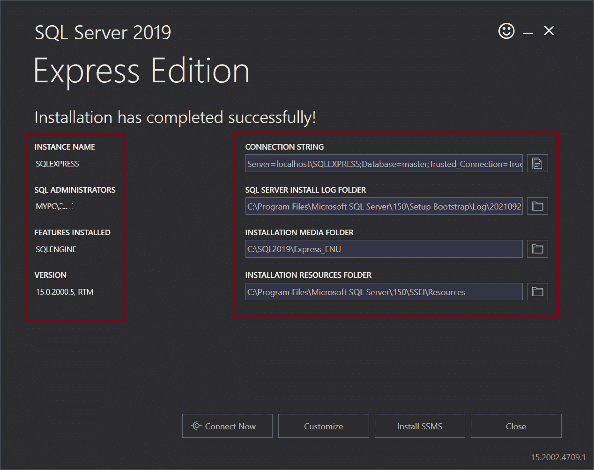
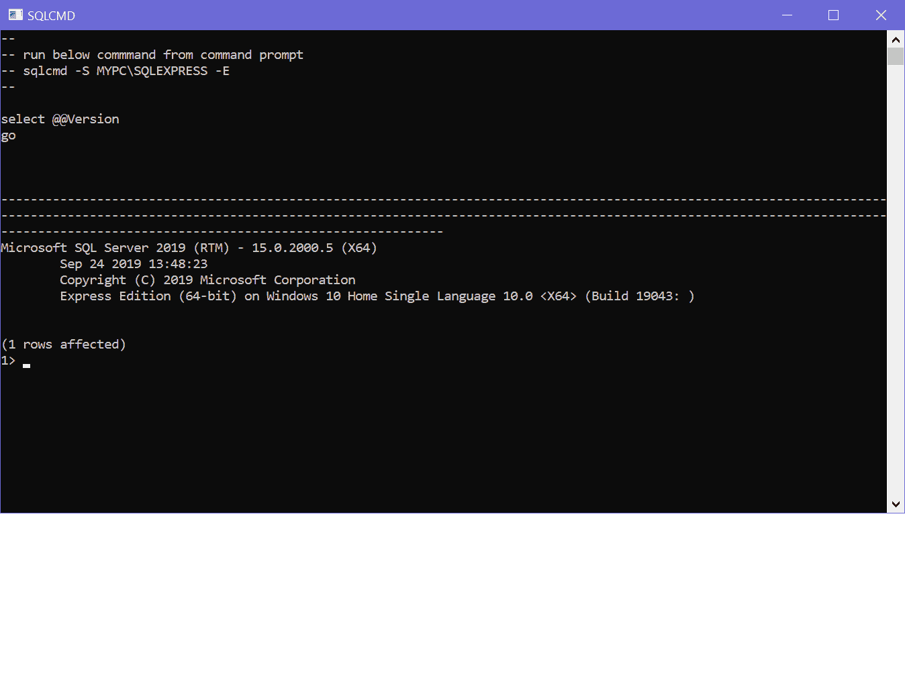
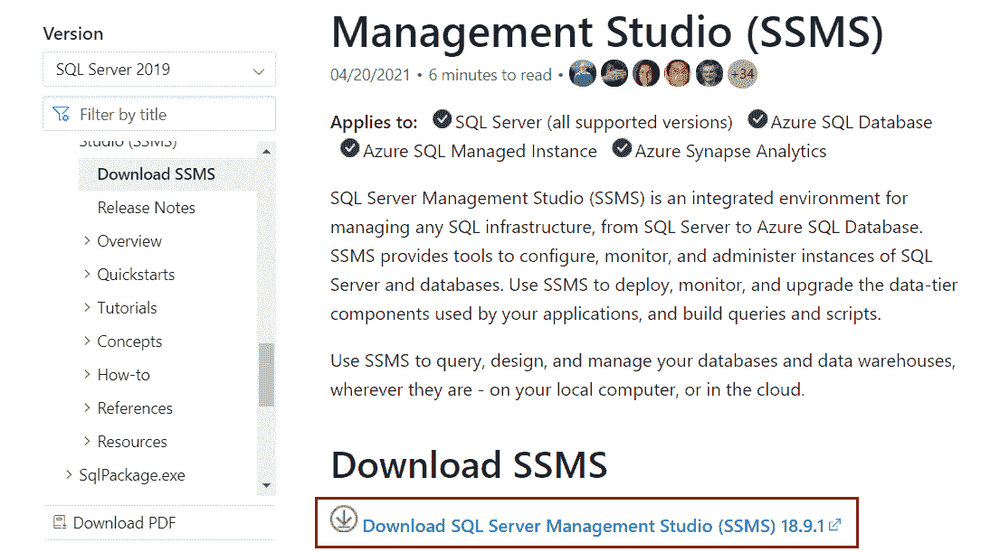
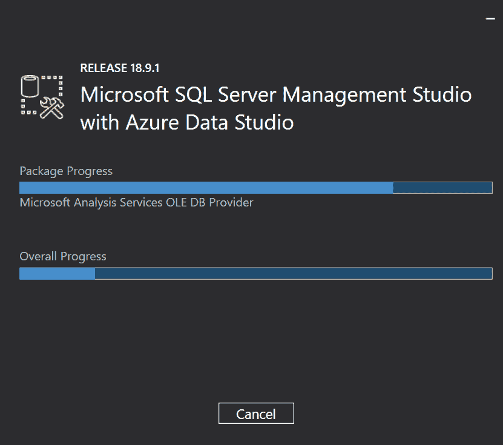
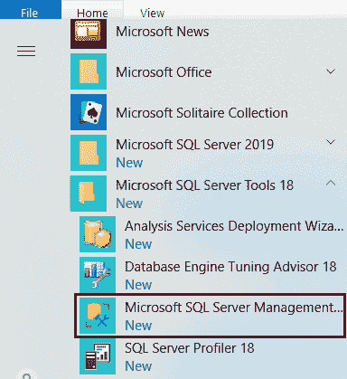

# 安装 SQL Server & SSMS

> 原文：<https://www.tutorialsteacher.com/sqlserver/install-sql-server>

在本文中，您将学习安装 SQL Server 2019 和 SQL Server 管理工作室。

SQL Server 2019 可以安装在 Windows、Linux 或 Docker 上。这里，我们将在 Windows 上安装它。

微软提供了两个免费版本的 SQL Server:开发者版和快速版。

**开发者版**免费，具备企业版的所有功能。除了非生产环境之外，它可以用来创建一个包含所有功能的大型数据库。

**Express edition** 是一个入门级免费数据库，用于构建桌面应用和大小高达 10GB 的小型 web 或数据驱动服务器应用。

在这里，我们将下载并安装免费的快速版，以便您可以学习和测试 SQL Server 基本功能。如果要测试企业级功能，也可以选择要安装的开发人员版本。安装步骤将保持不变。

## 安装 SQL Server 2019 的先决条件:

*   至少 6GB 可用硬盘空间
*   最小 1GB 内存(开发环境中建议至少 4 GB 内存)。
*   Windows 10 TH1 1507 或更高
*   Windows Server 2016 或更高版本

## 安装 SQL Server

首先从[microsoft.com](https://www.microsoft.com/en-in/sql-server/sql-server-downloads)下载最新版本的 SQL Server Express 版。

打开页面后，向下滚动点击**下载**按钮下载安装程序文件。

Download SQL Server 2019 Installer

双击安装程序文件(SQL2019-SSEI-Expr.exe)运行它，或者转到系统的下载文件夹，双击 SQL2019-SSEI-Expr.exe 文件开始安装。

出现一个对话框，询问“是否允许此应用对此设备进行更改”。单击是启动安装向导。

在安装向导中，选择**基本**安装类型，如下图。这将安装默认配置的所有必要功能。

Installation Type

接下来，通读 Microsoft SQL Server 许可条款，然后单击“接受”按钮。

Accept Licence Terms

接受许可条款后，安装向导会要求您选择在系统中安装 SQL Server 的位置。单击浏览按钮并选择一个您选择的位置，或者将该位置设置为默认的“C:\程序文件\微软 SQL Server”。

请注意，在右侧，向导显示了所需的最小可用空间和 SQL Server 的下载大小。

Install SQL Server 2019

点击**安装**按钮。这将开始下载 SQL Server 所需的包。 下载完成后，安装开始，如下所示。

Install SQL Server 2019

安装成功后，会显示重要的配置详细信息，如 SQL Server 实例名(默认为 SQLEXPRESS)、SQL Administrators(默认为 <computer name="">\ <user name="">)、已安装版本、与该实例连接的连接字符串、日志文件位置等。，如下所示。</user></computer>

Install SQL Server 2019

这是安装向导的最后一步，有四个按钮。

**立即连接**按钮将打开一个命令行窗口，并执行`select @Version`命令来测试与该 MSSQLSERVER 实例的连接。

**自定义**按钮将打开 SQL 安装中心，添加默认安装中没有的新功能。

**安装 SSMS** 按钮将安装 SQL Server 管理工作室，可用于管理一个或多个 SQL Server 实例。

**关闭**按钮将关闭安装向导。

您将需要 SQL Server 管理工作室(SSMS)来管理本地或远程 SQL Server 实例上的 SQL Server 数据库。建议下一步安装 SSMS。

## 安装 SQL Server 管理工作室(SSMS)

点击 SQL Server 安装向导最后一步的**安装 SSMS** 按钮，如上图。 会打开一个网页，里面有下载 SQL Server 管理工作室的链接。

点击链接下载最新的 SQL Server 管理工作室(SSMS)链接，如下所示。

Download SQL Server Management Studio Installer

下载完成后，转到系统中的下载文件夹。找到 SSMS-Setup-ENU.exe，双击安装 SSMS。点击对话框中的**是**按钮，上面写着“你想让这个应用对你的设备进行更改吗”。

出现一个 SSMS (SQL Server Management Studio)安装向导，如下图所示。

Install SSMS

点击**安装**按钮开始安装 SSMS，同时保持默认安装位置。 它将下载并安装 SSMS 所需的包。这将需要几分钟时间来完成安装。

Install SQL Server 2019 & SQL Server Management Studio

一旦安装成功完成，它将显示 Seup Completed，如下所示。

Install SSMS

现在，要打开 SSMS，请单击“开始”菜单，并在“微软 SQL Server 工具 18”下找到“微软 SQL Server 管理工作室”。

Install SSMS

现在，您可以使用 SQL Server 管理工作室开始使用 SQL Server 2019 了。

在下一章学习如何使用 SSMS。