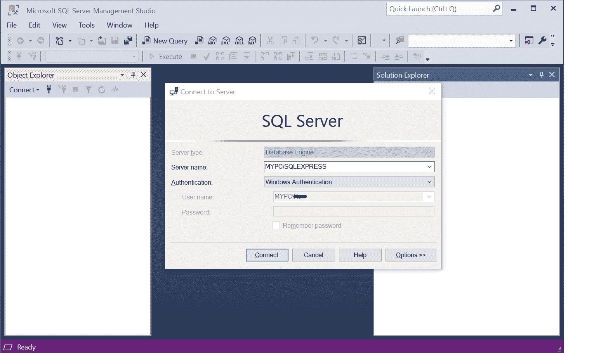
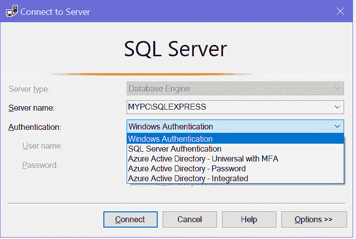
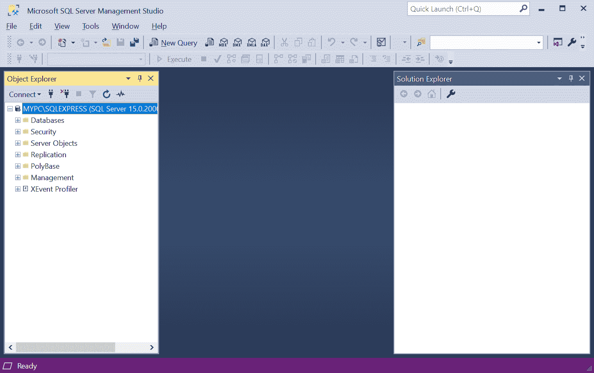
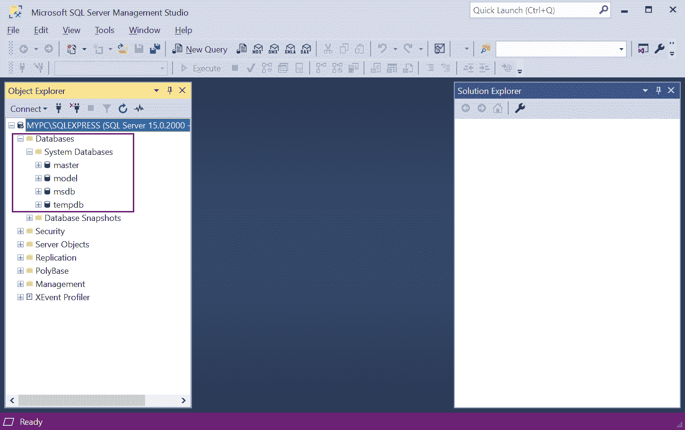
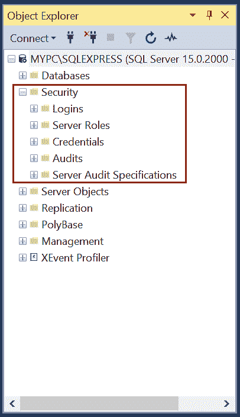
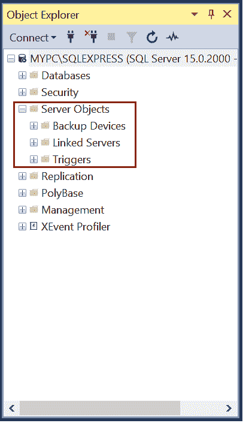
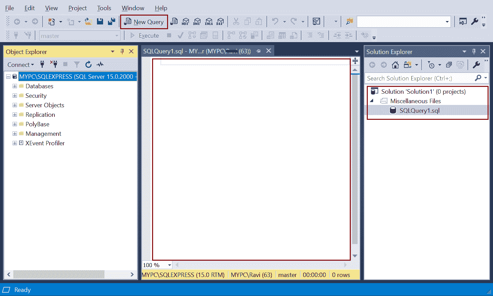
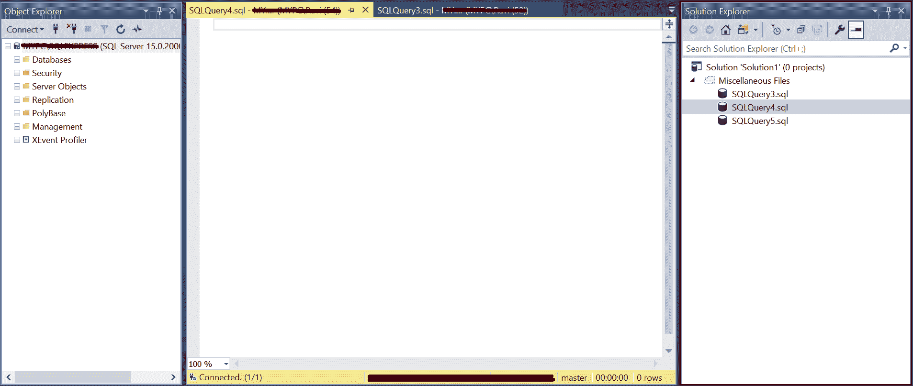

# SQL Server 管理工作室(SSMS)

> 原文：<https://www.tutorialsteacher.com/sqlserver/sql-server-management-studio>

SQL Server 管理工作室是一个免费的多用途集成工具，用于访问、开发、管理和管理 SQL Server 数据库、Azure SQL 数据库和 Azure Synapse Analytics。SSMS 允许您使用图形界面管理 SQL Server。

SSMS 还可用于访问、配置、管理和管理分析服务、报告服务和集成服务。

SSMS 只在 Windows 上运行。使用 [Azure Data Studio](https://docs.microsoft.com/en-us/sql/azure-data-studio/download-azure-data-studio?view=sql-server-ver15) 在您的 macOS 或 Linux(以及 Windows)上运行。 [如果还没有安装的话，安装 SQL Server 管理工作室](/sqlserver/install-sql-server#install-ssms)。

要从“开始”菜单启动 SSMS，请单击“开始”，向下滚动并展开“微软 SQL Server 工具 18”。点击微软服务器管理工作室。

SQL Server Management Studio(SSMS)

点击“微软 SQL Server 管理工作室”将打开以下窗口与服务器连接。

Connect to SQL Server Instance

选择服务器类型、服务器名称和认证模式来连接您的服务器。SSMS 可用于连接数据库引擎、分析服务、报告服务、集成服务等。这里，我们将连接到本地的 SQL Server 数据库，因此选择数据库引擎作为服务器类型。

接下来，选择要连接的服务器名称。它可以是本地或远程数据库服务器。选择合适的服务器名或<browse for="" more..="">浏览服务器名。</browse>

接下来，选择认证模式。最新版本的 SSMS 提供了五种认证模式供选择，如下所示。最常见的是 Windows 认证和 SQL Server 认证。

SQL Server Authentications

选择认证类型并输入用户名和密码(SQL 认证)后，单击连接按钮。

成功登录后，SSMS 将打开以下窗口。

SQL Server Management Studio

## SSMS 组件公司

SQL Server 管理工作室包含以下组件:

*   对象浏览器
*   安全
*   服务器对象
*   查询和文本编辑器
*   模板浏览器
*   解决方案浏览器
*   可视化数据库工具

## 对象浏览器

对象资源管理器以分层方式包含一个或多个 SQL Server 实例的不同组件。您可以查看和管理数据库、安全性、服务器对象、复制、聚合数据库、管理等组件。展开组件节点以查看更多对象。

例如，展开“数据库”文件夹以查看服务器实例中所有可用的数据库。您创建的任何新数据库都将在此处可用。有一个默认的系统数据库文件夹，其中包含四个默认数据库:主数据库、模型数据库、msdb 数据库和 tempdb 数据库。

SQL Server Databases

## 安全

管理数据库服务器的安全性极其重要。安全节点位于对象资源管理器中的数据库节点下方。您可以为任何数据库实例创建登录名并分配服务器角色。此外，您可以为登录名和用户分配基于角色的安全性。您在此创建的服务器角色具有服务器范围。

SQL Server Management Studio(SSMS)

## 服务器对象

SSMS 的“服务器对象”节点有四个子节点:备份设备、端点、链接服务器和触发器。链接服务器是一种方法，通过这种方法，SQL Server 可以使用 T-SQL 语句与另一个 ODBC 数据库进行对话。服务器端点是进入服务器的入口点。它是一个数据库对象，定义了 SQL Server 通过网络进行通信的方式。服务器对象下的所有对象都有服务器范围。

SQL Server Management Studio(SSMS)

## 分身术

复制是一组用于在数据库之间复制和分发数据和数据库对象以及同步数据库的技术。这主要用于维护数据库之间的一致性。

## 聚碱

Polybase 允许您的 SQL Server 通过单独安装使用 T-SQL 的客户端连接软件，直接从其他 SQL Server、Oracle、MongoDB、Hadoop 集群、Teradata、Cosmos DB 进行查询。Polybase 用于数据虚拟化。

## 查询和文本编辑器

点击工具栏上的**新建查询**打开查询编辑器。 查询编辑器允许您创建、编辑&执行 Transact-SQL 语句。它配备了智能感知支持，通过建议变体自动完成脚本。这使得编写&调试代码更加容易和快速。

Query Editor

## 模板浏览器

模板资源管理器提供用于创建各种数据库对象的模板。您可以在模板资源管理器中浏览可用的模板，并将其打开到代码编辑器窗口中。您也可以创建自己的自定义模板。

从“视图”菜单->模板资源管理器打开模板资源管理器。下面显示了创建数据库模板。

Template Explorer

## 解决方案浏览器

解决方案资源管理器用于管理脚本和查询等管理项目。从“视图->解决方案资源管理器”菜单中打开它。

Template Explorer

