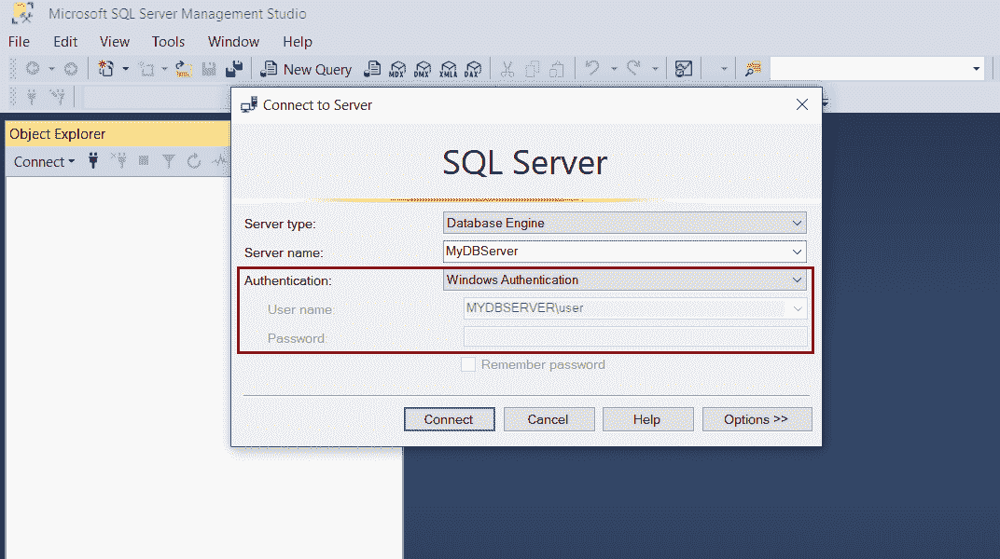
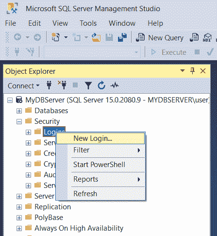
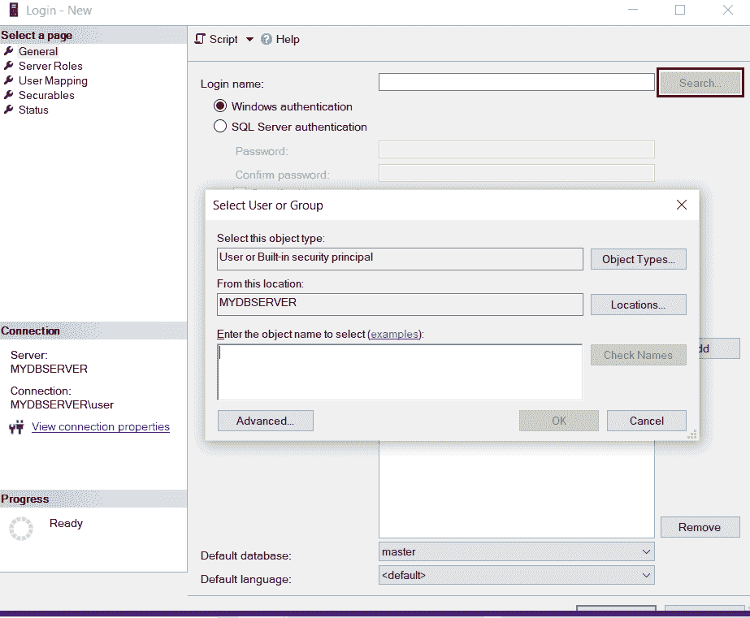
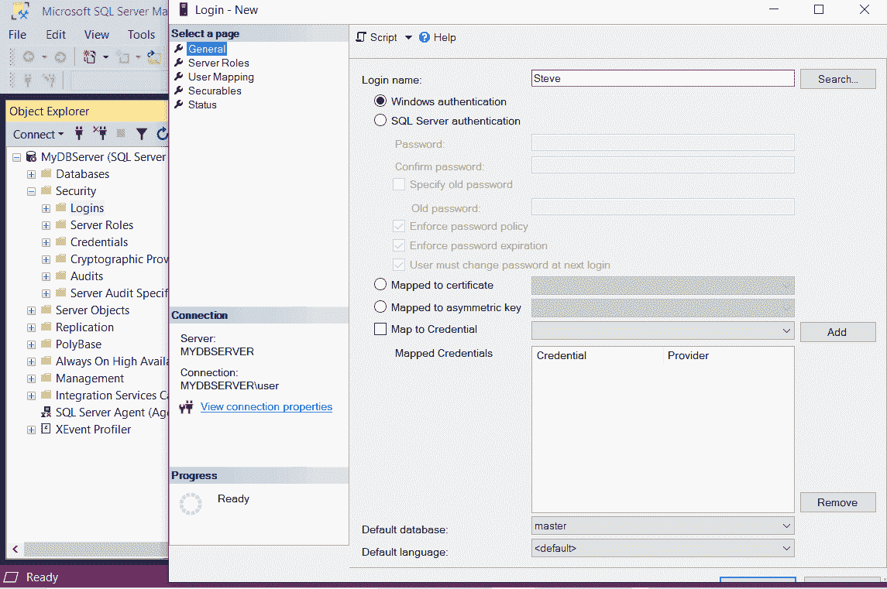
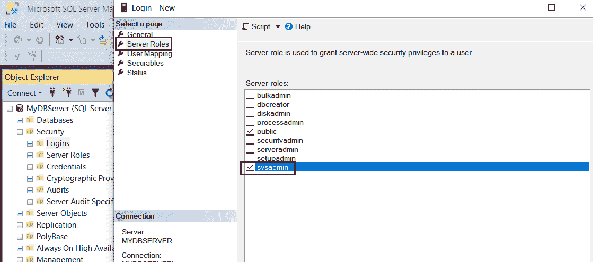
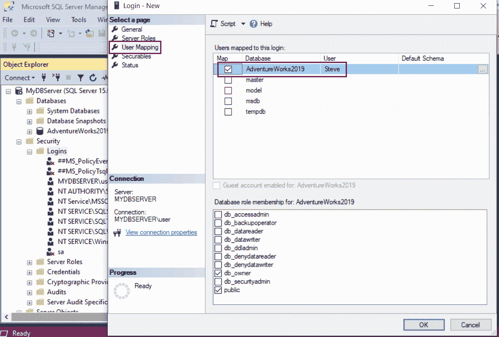
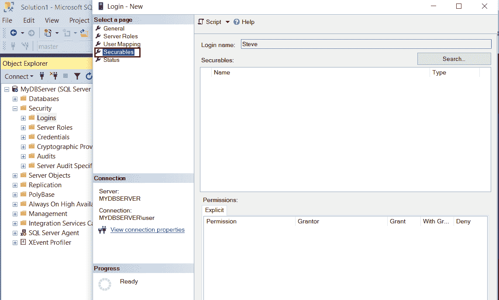

# SQL Server -窗口身份验证

> 原文:[https://www . tutorial stearn . com/SQL server/windows-身份验证](https://www.tutorialsteacher.com/sqlserver/windows-authentication)

在这里，您将学习如何使用您的 Windows 用户帐户向 SQL Server 进行身份验证。

SQL Server 支持两层身份验证:登录和数据库用户。登录是访问和连接到 SQL Server 的第一层安全性。登录与数据库无关。相反，登录被映射到数据库中的用户，以读取或写入特定的数据库。

在 SQL Server 中有两种身份验证模式，您可以使用这两种模式登录并连接到 SQL Server。

*   Windows 身份验证
*   SQL 服务器身份验证

## Windows 身份验证

Windows 身份验证模式使用 SQL Server 启用本地 Windows 身份验证，您可以使用本地 Windows 凭据登录。

例如，下面使用一个 Windows 凭据连接到 SQL Server，其中 MYDBSERVER\user 中的用户是 Windows 上的本地用户帐户，MYDBSERVER 是数据库服务器的名称。单击“确定”以此凭据登录并连接到 MYDBSERVER 数据库服务器。

<figure>

<figcaption>SQL Server Authentication Modes</figcaption>

</figure>

Windows 身份验证是默认身份验证模式，比 SQL Server 身份验证更安全。它也被称为集成安全性，与 Windows 紧密集成。已经通过 Windows 身份验证并且在连接到 SQL Server 时不需要提供任何附加凭据的用户。它也被称为可信连接。该用户帐户由 Windows 确认。

在 Windows 身份验证中，可以在 SQL Server 中为整个 Windows 组创建登录，这简化了帐户管理。

Windows 身份验证使用 Kerberos 安全协议，提供密码策略强制，并支持密码过期。

让我们看看如何创建一个新的登录，使用本地窗口的用户帐户来连接到 SQL Server。

## 使用 Windows 身份验证创建新登录

要创建新的登录，请打开 [SQL Server 管理工作室](/sqlserver/sql-server-management-studio)。

在对象浏览器中，展开**安全**文件夹，右键单击登录文件夹，然后单击**新登录..**，如下图。

<figure>

<figcaption>Create New Login</figcaption>

</figure>

在如下所示的登录-新建窗口中，输入一个 Windows 用户名。如果用户名不是 Windows 用户，那么它将引发一个错误。您可以点击“搜索”按钮来搜索窗口用户，如下所示。

<figure>

<figcaption>Create New Login</figcaption>

</figure>

输入登录名后，您必须选择 Windows 身份验证或 SQL Server 身份验证。选择窗口身份验证。请注意，对于 Windows 身份验证，密码字段和密码策略单选按钮将被禁用，因为我们将在此使用 Windows 凭据。

<figure>

<figcaption>Create New Login</figcaption>

</figure>

现在，要为新登录分配角色和权限，请转到服务器角色选项卡。在“服务器角色”页面上，您可以通过单击角色旁边的复选框将服务器级角色分配给新登录。默认情况下，公共角色被分配给新登录。此外，让我们通过单击 sysadmin 旁边的复选框来分配 sysadmin 角色。使用 sysadmin 服务器角色，用户可以在服务器上执行任何活动，并拥有完全控制权。

<figure>

<figcaption>Server Roles</figcaption>

</figure>

单击用户映射选项卡。在这里，我们将把我们的 Windows 登录映射到一个数据库用户。

它列出了服务器上的所有数据库。要映射您的新登录，只需选中要映射此登录以访问数据库的数据库旁边的复选框。

下图中`AdventureWorks2019`数据库被选中。新的登录信息现在列在 AdventureWorks2019 的“用户”列下。如果希望用户名与您的登录名不同，您可以更改用户名。只需单击该名称，然后为用户重新键入您想要的任何名称。如果您想让更多的数据库与您的登录相关联，那么只需单击数据库旁边的复选框，它就会与登录进行映射。

<figure>

<figcaption>User Mapping</figcaption>

</figure>

现在，单击“安全对象”选项卡。安全对象是您正在创建的登录名可以访问的 SQL server 资源。在“安全对象”选项卡上，单击“搜索”按钮。这将打开一个弹出窗口，如下所示。选择服务器“<your server="" name="">”，然后单击确定。这将列出服务器的所有显式权限。根据您的要求，选择授予、允许或拒绝。</your>

这是一个可选步骤。您可以在创建登录时跳过“安全对象”设置，稍后再进行设置。

<figure>

<figcaption>SQL Server Authentication Modes</figcaption>

</figure>

最后，单击状态选项卡，选择“授予”单选按钮获得连接到数据库引擎的权限，选择“启用”单选按钮获得登录权限，如下所示。

<figure>

<figcaption>SQL Server Authentication Modes</figcaption>

</figure>

单击“确定”创建新登录。这将在登录节点下添加新的登录。

因此，您可以添加本地 Windows 用户帐户，以便使用 Windows 身份验证登录数据库服务器。