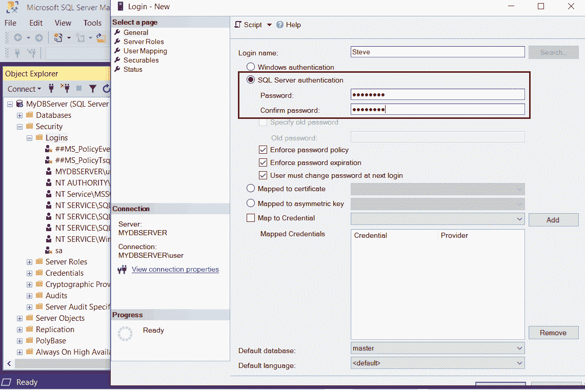
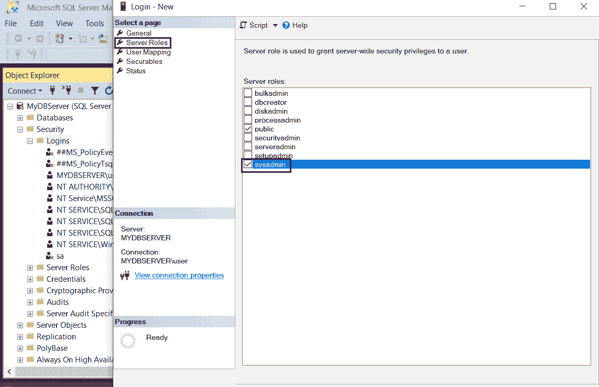
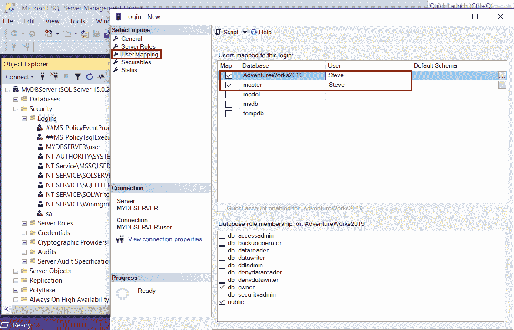
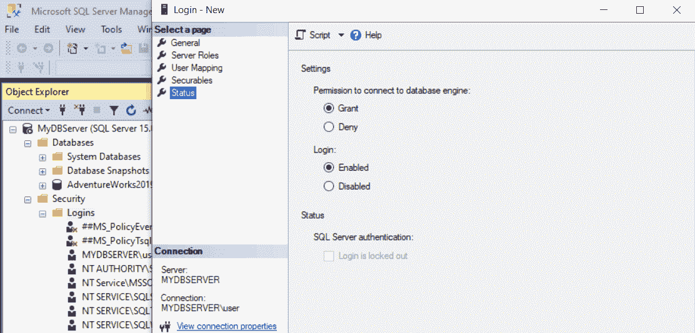
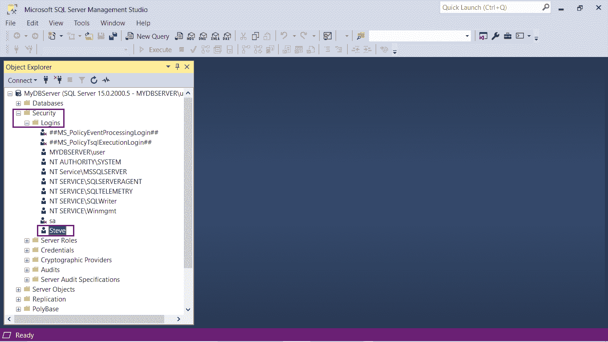
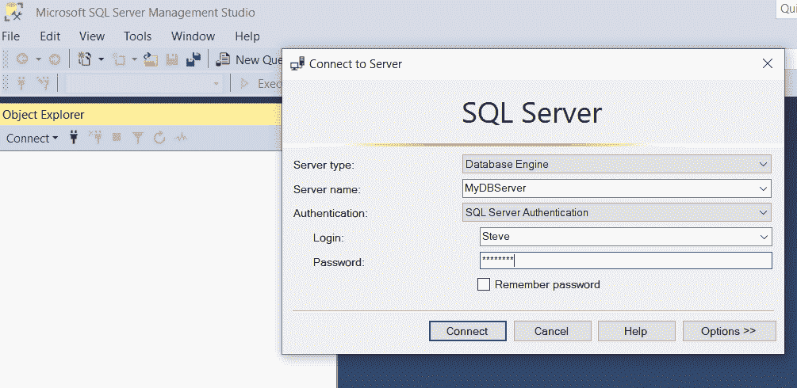
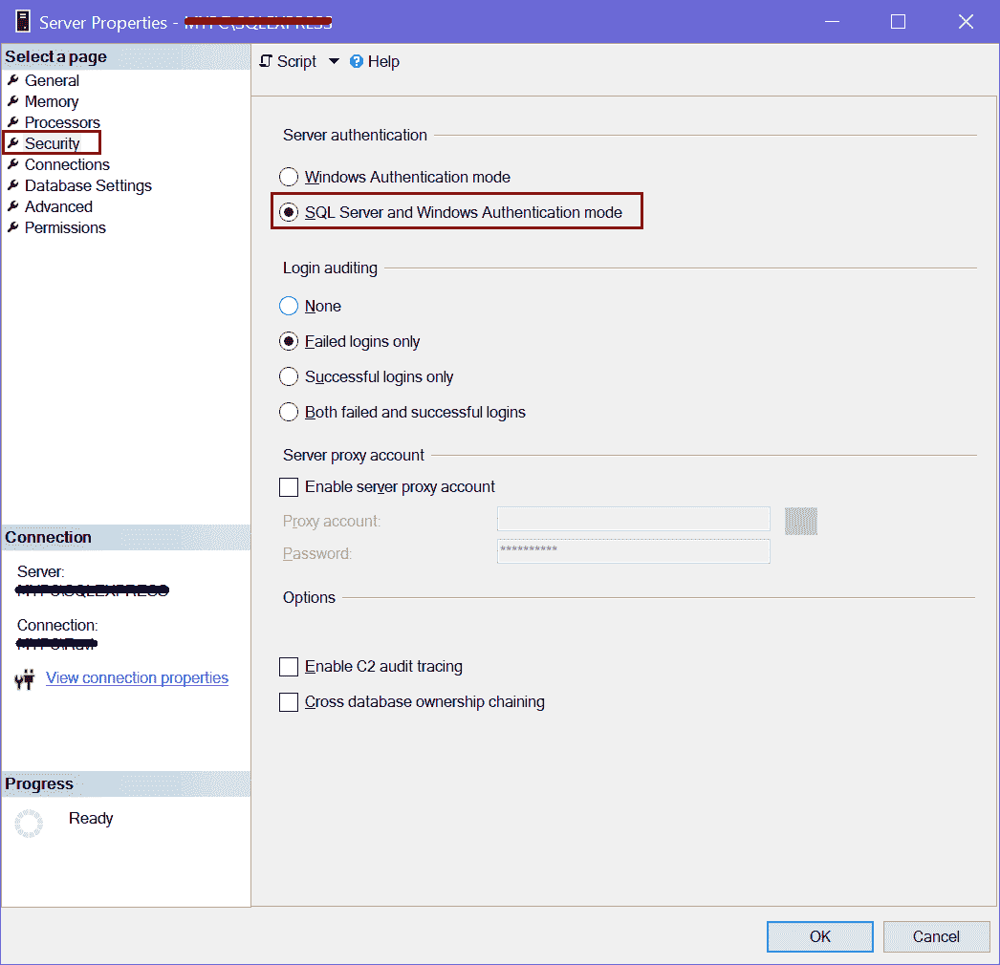

# SQLServer 认证

> 原文：<https://www.tutorialsteacher.com/sqlserver/sql-server-authentication>

在前一章中，您学习了如何使用 Windows 用户帐户创建登录。在这里，您将学习使用 SQL Server 用户创建登录。

在安装 SQL Server 时，如果选择混合模式，则必须为内置系统管理员或 sa 帐户提供密码。强烈建议为 sa 帐户创建一个强密码；否则禁用此帐户，因为它映射到 sysadmin 服务器角色，并且对整个服务器具有管理权限。因此它很容易受到黑客的攻击。

## 使用 SQL Server 认证创建新登录

使用 SQL Server 认证模式创建的登录独立于 Windows 用户帐户。登录名和密码被创建并存储在主数据库的 syslogins 表中。密码不会以纯文本形式存储。

要使用 SQL Server 认证创建新登录，请执行以下步骤:

打开 SQL Server 管理工作室。在对象资源管理器中，展开“安全性”节点。右键单击登录节点并选择新建登录。

SQL Server Authentication

在登录-新建窗口中，输入新的用户名。选择“SQL Server 认证”单选按钮，输入密码，然后在确认密码字段中重新输入相同的密码，如下所示。

SQL Server Authentication

选择三种可选的密码策略:

*   **强制密码策略:**计算机的 Windows 密码策略针对 SQL Server 登录强制执行。
*   **强制密码过期:**强制计算机的最长密码期限策略。
*   **用户下次登录时必须更改密码:**如果选择此选项，则要求用户下次登录时更改其 SQL Server 登录密码。

选择“服务器角色”选项卡。在新窗口中，为正在创建的登录分配一个服务器级角色。默认情况下，选择公共。通过选中角色旁边的复选框，可以将任何角色添加到登录中。在下图中，sysadmin 与 public 一起被选中。使用 sysadmin 服务器角色，用户可以在服务器上执行任何活动，并拥有完全控制权。

SQL Server Authentication Modes

单击用户映射选项卡。在“用户映射”选项卡下创建新登录时，可以创建数据库用户。在新窗口中，将显示服务器实例中所有数据库的列表。选择要映射登录的数据库。您可以选择多个数据库。只需选中数据库名称旁边的复选框。登录名现在显示在选定数据库旁边的用户列中，如下所示。

SQL Server Authentication Modes

单击“安全对象”选项卡。在新窗口中，选择“搜索”按钮。在弹出窗口中，选择服务器“<your server="" name="">”，然后单击确定。这是一个可选步骤。您可以跳过这一步，稍后再设置权限。 T1】</your>

SQL Server Authentication Modes

最后，检查状态屏幕。应选择授予和启用。

SQL Server Authentication Modes

单击“确定”创建新登录。这将在登录节点下添加一个新的 SQL Server 登录，如下所示。

SQL Server Authentication Modes

现在，您可以使用新的登录名登录到 SQL Server SSMS:

SQL Server Authentication Modes

### SQL Server 认证的优势:

*   允许 SQL Server 支持较旧的应用和基于混合操作系统构建的应用。
*   允许访问基于 web 的应用，用户可以在其中创建自己的身份。
*   允许用户从未知域连接。

### SQL Server 认证的缺点

*   使用 Windows 的用户必须提供一组额外的登录/密码才能连接到 SQL Server。
*   SQL Server 认证不能使用 Kerberos 安全协议。
*   Windows 提供了 SQL Server 登录无法使用的其他密码策略。
*   对于许多应用，登录和密码必须在连接到数据库服务器期间通过网络传递。虽然经过加密，但它们很容易受到攻击。
*   一些应用将加密的密码存储在客户端系统中。这是一个额外的安全风险。

### 充当故障检修员

如果在使用新的 SQL Server 登录时出现错误，请检查以下内容:

1.在 SQL Server 实例属性中启用混合模式认证(SQL Server 认证和 Windows 认证)。

打开管理工作室，右键单击 SQL Server 实例，然后单击属性。转到安全选项卡。

在服务器认证下，选中 SQL Server 和 Windows 认证模式单选按钮，如下所示。

2.检查是否启用了 TCP/IP 协议。重新启动 SQL Server。

3.有时，选中密码过期复选框会在您尝试使用新登录名登录时出错。您可以尝试创建未选中密码过期的登录。