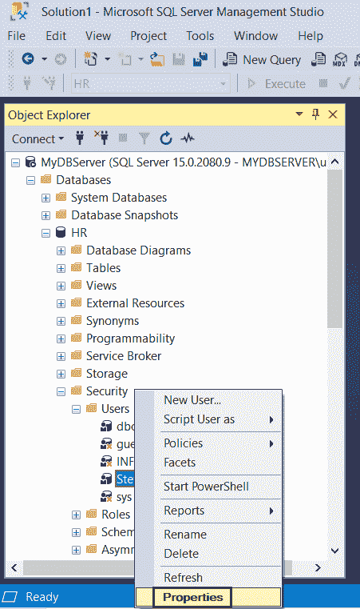
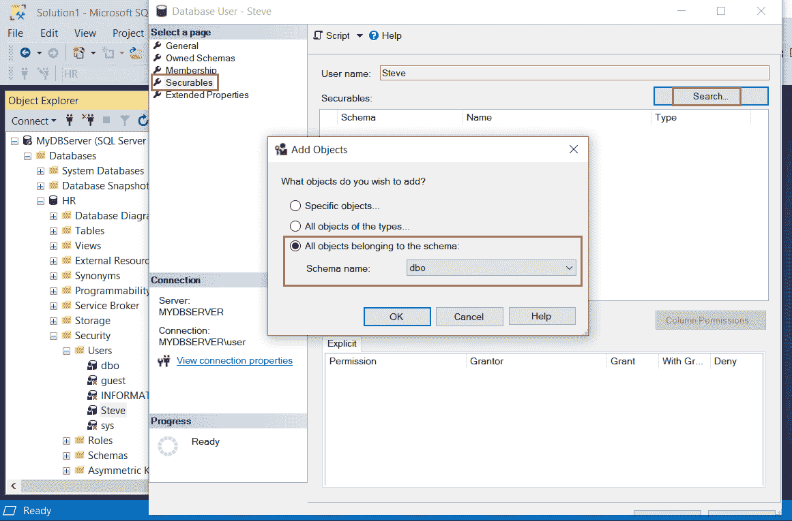
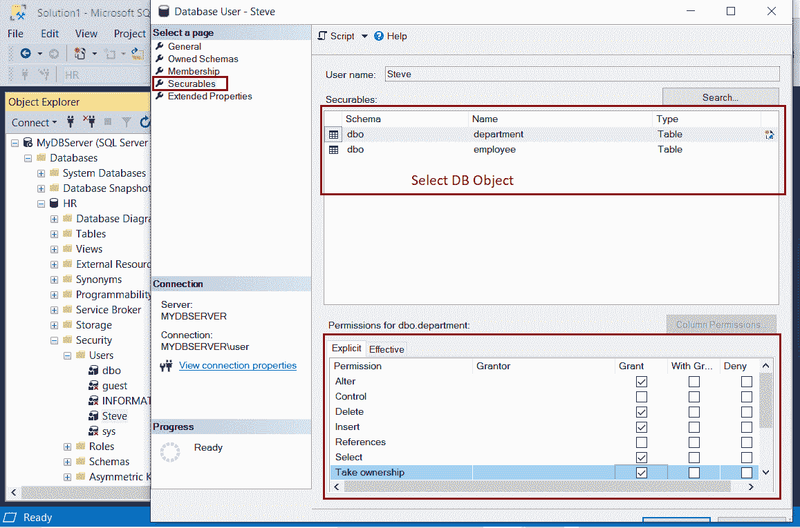

# 在 SQL Server 中为用户分配权限

> 原文：<https://www.tutorialsteacher.com/sqlserver/grant-permissions-to-user>

在前一章中，您学习了在数据库中创建新用户。在这里，您将学习在 SQL Server 中向用户授予权限。

您可以在 SQL Server 中授予和撤销对各种数据库对象的权限。用户权限在数据库级别。

您可以授予以下任何类型的权限或权限组合:

*   **选择:**授予用户对表格执行选择操作的能力。
*   **插入:**授予用户对表执行插入操作的能力。
*   **更新**:授予用户对表执行更新操作的能力。
*   **删除:**授予用户对表执行删除操作的能力。
*   **更改:**授予用户更改表定义的权限。
*   **引用**:在表上创建外键约束需要引用权限。还需要创建一个引用该对象的带有 SCHEMABINDING 子句的函数或视图
*   **控制**:授予用户对表的选择、插入、更新、删除和引用权限。

同样，您可以撤销任何已分配的权限。

您可以通过使用 SSMS 或执行 T-SQL 脚本来授予或撤销权限。

## 使用 T-SQL 授予或撤销权限

Syntax:

```sql
USE <database-name>
--GRANT Permissions Syntax
GRANT <permissions> ON <db-object> TO <user-name, login-name, or group>

--REVOKE Permissions Syntax
REVOKE <permissions> ON <db-object> FROM <user-name, login-name, or group> 
```

以下 SQL 将选择权限授予用户`HR`数据库中`Employee`表的`Steve`。

```sql
USE HR;
GRANT SELECT ON Employee TO Steve; 
```

以下 SQL 向用户`HR`数据库中的`EmployeeAddress`表`Steve`授予选择、插入、更新、删除权限。

```sql
USE HR;
GRANT SELECT, INSERT, UPDATE, DELETE ON EmployeeAddress TO Steve; 
```

下面通过授予公共角色权限，向所有用户授予对`Employee`表的 SELECT 权限。

```sql
USE HR;
GRANT SELECT ON Employee TO public; 
```

下面撤销对`EmployeeAddress`表中`Steve`用户的删除权限。

```sql
USE HR;
REVOKE DELETE ON EmployeeAddress FROM Steve; 
```

了解更多关于[授予权限](https://docs.microsoft.com/en-us/sql/t-sql/statements/grant-transact-sql)和[撤销权限](https://docs.microsoft.com/en-us/sql/t-sql/statements/revoke-transact-sql)的信息。

## 使用 SSMS 授予或撤销权限

让我们使用 SQL Server 管理工作室向用户授予权限。

登录到 SQL Server 管理工作室。在左窗格的对象资源管理器中，展开数据库文件夹，选择相关数据库，并通过展开安全和用户文件夹导航至<user>。右键单击要授予或撤销权限的用户。在这里，我们将授予我们的新用户“史蒂夫”权限。所以右键点击一个用户`Steve`，点击`Properties`，如下图。 T3】</user>

 

Grant Permissions to a User


这将打开数据库用户窗口，如下所示。选择左窗格中的“安全”选项卡，授予或撤销对数据库对象的权限。单击“搜索”按钮添加要授予或撤销权限的数据库对象。这将打开添加对象弹出窗口，如下所示。

 

Grant Permissions to a User


在“添加对象”弹出窗口中，您有三个选项来选择数据库对象(如表、视图、存储过程等)。)要授予权限的。

*   **特定对象..**选项允许您查找和选择特定的数据库对象来授予或撤销权限。
*   **所有类型的对象..**选项允许您查找和选择特定类型的数据库对象来授予或撤销权限，如表、存储过程、视图、内联函数等。 例如，选择表类型将显示数据库中要授予或撤销权限的所有表。
*   **属于模式的所有对象**选项允许您选择一个模式，以向该模式的所有数据库对象授予权限。

在这里，我们将选择“属于模式的所有对象”单选按钮。从下拉列表中选择一个模式，然后单击确定。这将显示该模式下的所有数据库对象，如下所示。

 

Grant Permissions to a User


现在，在上窗格中选择您必须授予权限的表。在底部窗格中，选择`Explicit`选项卡，然后单击选择、更新以及您希望授予用户的任何其他表权限。 点击确定按钮。 所选权限将授予用户。要撤销权限，请取消选中权限复选框。

因此，您可以授予或撤销对 SQL Server 数据库中特定用户的权限。