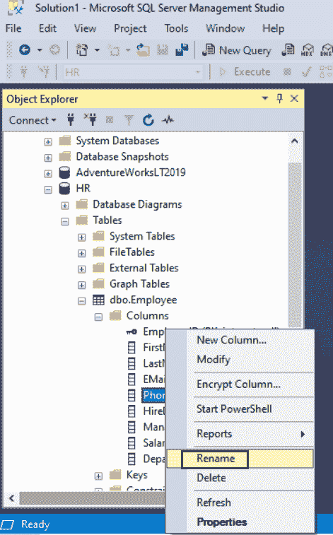

# SQL Server：重命名列或表名

> 原文：<https://www.tutorialsteacher.com/sqlserver/rename-columns>

您可以使用系统存储过程`sp_rename`重命名表名、现有表的列名、索引名。

Syntax:

```sql
EXEC sp_rename 'old_name', 'new_name' [, 'object_type']; 
```

**重命名表:**要重命名表，“old_name”必须是现有的表名或`schema.table`。

**重命名列:**要重命名表中的列，“old_name”必须采用`table.column`或`schema.table.column`的形式。

**重命名索引:**要重命名索引，“old_name”的格式必须为`table.index`或`schema.table.index`。

**重命名约束:**要重命名约束，“old_name”必须采用`schema.constraint`的形式。

以下将`Employee`表重命名为`Consultant`表。

```sql
EXEC sp_rename 'Employee', 'Consultant'; 
```

下面将`Employee`表中的`Address`列重命名为`TempAddress`。

```sql
EXEC sp_rename 'Employee.Address', 'TempAddress'; 
```

您可以指定对象类型来指示它是列、索引、数据库等。

```sql
EXEC sp_rename 'Employee.Address', 'TempAddress', 'COLUMN'; 
```

请注意，新的列名不应放在表名之前。

了解更多关于 [sp_rename 存储过程](https://docs.microsoft.com/en-us/sql/relational-databases/system-stored-procedures/sp-rename-transact-sql)的信息。

### 使用 SSMS 重命名表和列:

打开 SSMS 并展开数据库文件夹。

选择并右键单击要重命名的表或列，然后单击重命名。通过覆盖现有名称来输入新名称。

转到文件菜单，然后单击保存。

[](../../Content/images/sqlserver/alter-table5.png)

Rename Column/Table in SQL Server

