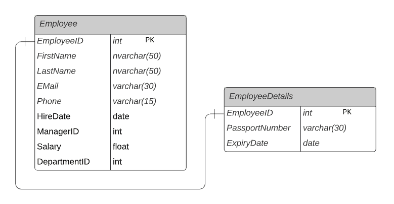
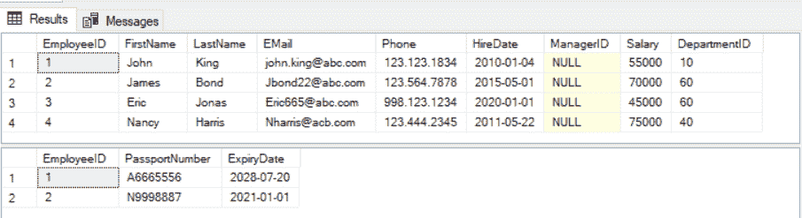
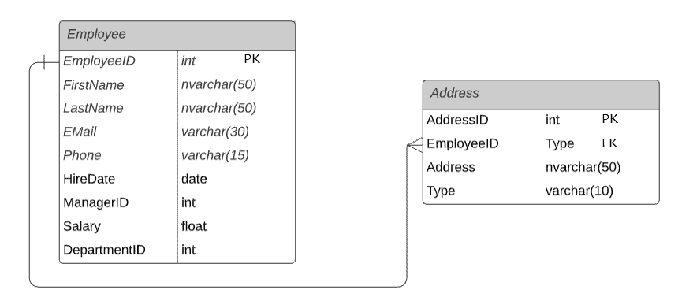
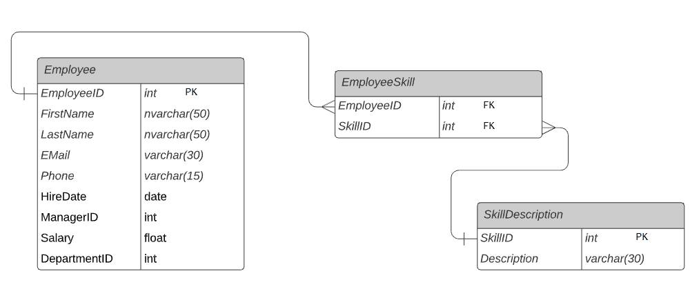
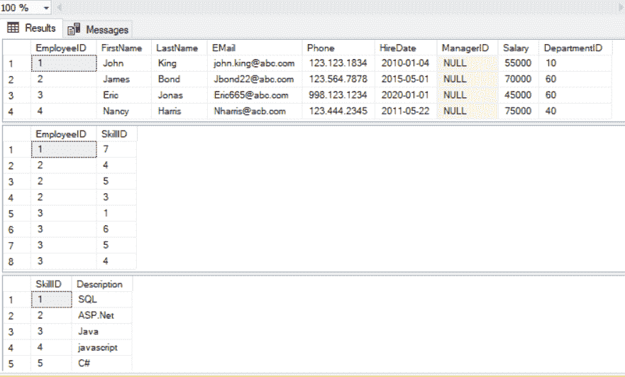

# SQL Server 中的表关系：一对一、一对多、多对多

> 原文：<https://www.tutorialsteacher.com/sqlserver/tables-relations>

理解和设计关系数据库(如 SQL Server)中表之间的关系非常重要。在关系数据库中，每个表都使用主键-外键约束连接到另一个表。

SQL Server 数据库中的表关系有三种类型:

1.  [一对一](#one-to-one-relation)
2.  [一对多](#one-to-many-relation)
3.  [多对多](#many-to-many-relation)T2】

## 一对一关系

在一对一关系中，第一个表的一条记录将链接到另一个表的零条或一条记录。例如，`Employee`表中的每个员工在`EmployeeDetails`表中都有一个对应的行，存储该特定员工的当前护照详细信息。 因此，每个员工在`EmployeeDetails`表中将有零个或一个记录。这被称为零或一对一的关系。

[](../../Content/images/sqlserver/tables-relations5.png)

One-to-One Relationships


上图中，`EmployeeID`列是链接到`Employee`表的`EmployeeID`的`EmployeeDetails`表中的主键和外键列。这形成了零或一对一的关系。

以下查询将显示这两个表中的数据。

```
SELECT * FROM Employee
SELECT * FROM EmployeeDetails
```

以下是上述查询的结果，这些查询演示了每个员工在`EmployeeDetails`表中如何没有或只有一条相应的记录。

[](../../Content/images/sqlserver/tables-relations6.png)

Records in One-to-One Relationships Tables


## 一对多关系

一对多是表之间最常用的关系。一个表中的单个记录可以链接到另一个表中的零行或多行。

让我们以`HR`数据库中的`Employee`和`Address`表为例。 `Employee`表存储员工记录，其中`EmployeeID`是主键。 `Address`表保存员工地址，其中`AddressID`为主键，`EmployeeID`为外键。每个员工在`Employee`表中都有一条记录。每个员工可以有许多地址，如家庭地址、办公室地址、永久地址等。

`Employee`和`Address`表通过`EmployeeID`键列链接。 是`Address`表中的外键，链接到`Employee`表中的主键`EmployeeID`。 因此，`Employee`表中的一条记录可以指向`Address`表中的多条记录。 这是一对多的关系。

[](../../Content/images/sqlserver/tables-relations1.png)

One-to-Many Relationships


以下查询将显示这两个表中的数据。

```
SELECT * FROM Employee
SELECT * FROM Address
```

以下是上述查询的结果，以演示数据是如何以一对多的关系关联的。

[](../../Content/images/sqlserver/tables-relations2.png)

Records in One-to-Many Relationships Tables


在上面的数据中，`Employee`表中的每个记录与`Address`表中的零个或多个记录相关联， 例如`James Bond`具有零个地址，`John King`具有三个地址。

## 多对多关系

多对多关系允许您将一个表中的每一行与另一个表中的多行相关联，反之亦然。例如，`Employee`表中的员工可以拥有`EmployeeSkill`表中的许多技能，并且一项技能可以与一个或多个员工相关联。

下图用连接表`EmployeeSkill`演示了`Employee`和`SkillDescription`表之间的多对多关系。

[](../../Content/images/sqlserver/tables-relations3.png)

Many-to-Many Relationships


`Employee`表中的每个员工都可以拥有一项或多项技能。类似地，`SkillDescription`表中的一项技能可以链接到许多员工。 这就形成了一种多对多的关系。

在上例中，`EmployeeSkill`是包含`EmployeeID`和`SkillID`外键列的连接表，在`Employee`和`SkillDescription`表之间形成多对多关系。 单个来说，`Employee`和`EmployeeSkill`是一对多关系，`SkillDescription`和`EmployeeSkill`表是一对多关系。 但是，它们通过使用连接表`EmployeeSkill`形成多对多关系。

以下查询将显示所有表中的数据。

```
SELECT * FROM Employee
SELECT * FROM EmployeeSkill
SELECT * FROM SkillDescription
```

以下是上述查询的结果，这些查询演示了数据在多对多关系中是如何关联的。

[](../../Content/images/sqlserver/tables-relations4.png)

Records in Many-to-Many Relationships Tables

