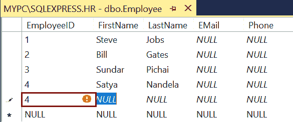
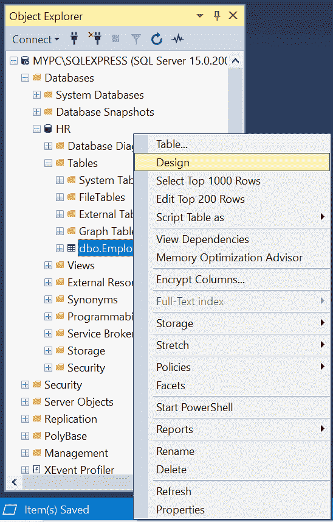
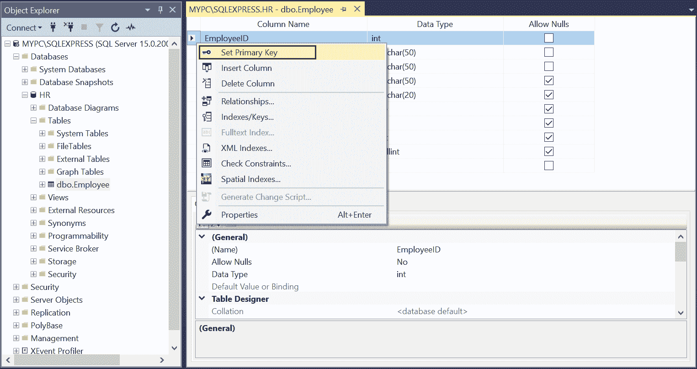
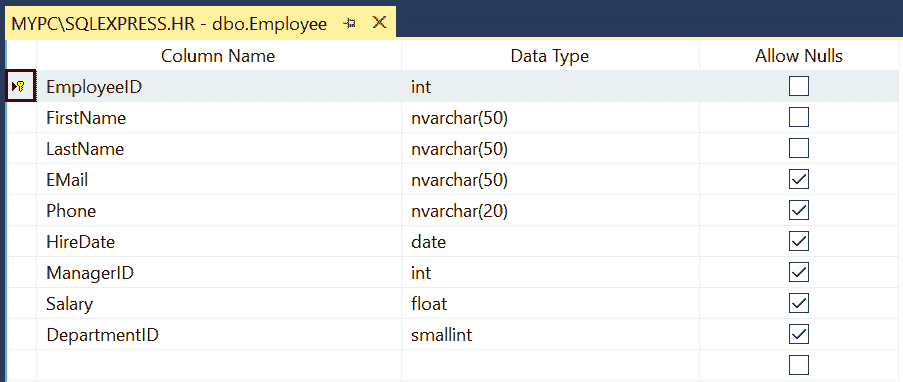
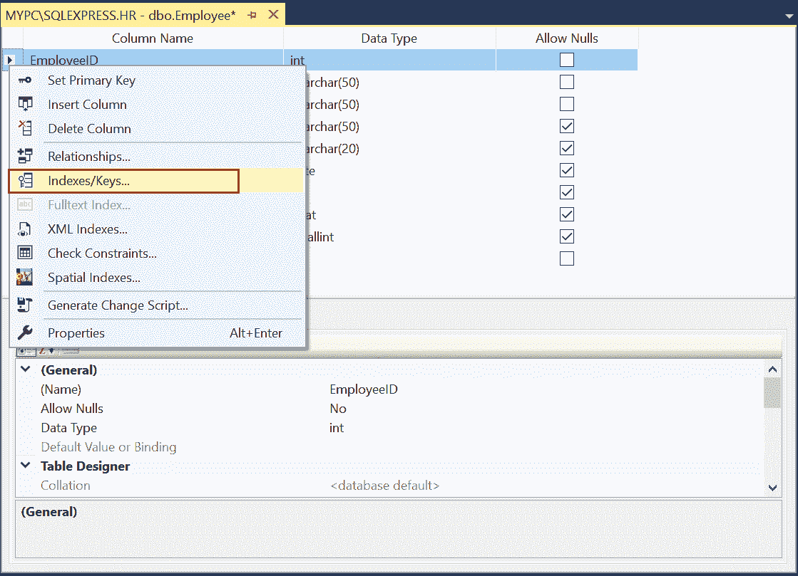
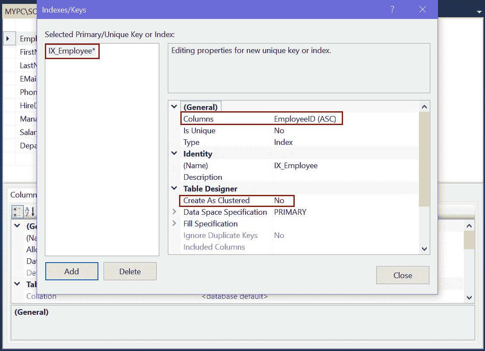

# SQL Server 中的主键

> 原文:[https://www . tutorial stearn . com/SQL server/create-primary-keys](https://www.tutorialsteacher.com/sqlserver/create-primary-keys)

在这里，您将了解什么是主键，以及如何在 SQL Server 数据库的新表或现有表中创建主键。

## 什么是主键？

主键(主键)和外键(FK)是在 SQL Server 表中强制数据完整性的约束。

*   一个表只能有一个主键。
*   主键可以在一列或多列的组合中定义，称为复合主键。
*   主键不能超过 16 列，总键长度不能超过 900 字节。
*   主键唯一标识表中的每一行。它通常在标识列中定义。
*   主键列不允许空值或重复值。如果尝试这样做，将会引发错误。
*   主键约束中定义的所有列都必须定义为非空列。
*   如果未指定聚集或非聚集，则如果表中没有聚集索引，将为主键列创建唯一聚集索引。每当查询中包含主键列时，这使得检索数据更快。

主键列中的值必须唯一。下图显示了`EmployeeID`主键值。如果输入重复的值，将会产生错误。

[](../../Content/images/sqlserver/primarykey.PNG) 

Primary Key Values


在 SQL Server 中，主键可以通过两种方式创建:

*   [使用 T-SQL](#create-pk-using-tsql)
*   [使用 SSMS (SQL Server 管理工作室)](#create-pk-using-ssms)

## 使用丁字裤创建主键

可以在[创建表](/sqlserver/create-table)中配置主键。 在所有列声明的末尾追加`CONSTRAINT`语句。

Syntax: Primary Key 

```
CONSTRAINT <primarykey_name> PRIMARY KEY [CLUSTERED | NONCLUSTERED] (<column_names>) 
```

主键的名称应该是`PK_TableName_ColumnName`格式，以便于识别。

下面的查询创建了一个新的`Employee`表，并在`EmployeeID`列上定义了一个主键。

Example: Create Primary Key 

```
CREATE  TABLE Employee(
EmployeeID int IDENTITY(1,1) NOT NULL,
FirstName nvarchar(50) NOT NULL,
LastName nvarchar(50) NOT NULL,
EMail nvarchar(50) NULL,
Phone nvarchar(20) NULL,
HireDate date NULL,
ManagerID int NULL,
Salary float NULL,
DepartmentID smallint NULL,
CONSTRAINT PK_Employee_EmployeeID PRIMARY KEY (EmployeeID)) 
```

如果要将多列配置为主键，请在括号中指定列名。例如，下面将`EmployeeID`和`ManagerID`配置为主键。

Example: Create Primary Key 

```
CREATE  TABLE Employee(
EmployeeID int IDENTITY(1,1) NOT NULL,
FirstName nvarchar(50) NOT NULL,
LastName nvarchar(50) NOT NULL,
EMail nvarchar(50) NULL,
Phone nvarchar(20) NULL,
HireDate date NULL,
ManagerID int NOT NULL,
Salary float NULL,
DepartmentID smallint NULL,
CONSTRAINT PK_Employee_EmployeeID PRIMARY KEY (EmployeeID, ManagerID)) 
```

如果主键包含多列，则允许一列中有重复值，但主键所有列中的每个值组合都必须是唯一的。

## 在现有表中创建主键

使用 ALTER TABLE 语句在现有表中添加主键。

以下查询为`HR`数据库中的`Employee`表的`EmployeeID`列创建了一个主键。

Example: Create Primary Key in Existing Table 

```
ALTER TABLE Employee
ADD CONSTRAINT PK_Employee_EmployeeID PRIMARY KEY (EmployeeID) 
```

注意:如果使用 ALTER 语句向列添加主键，请确保主键列声明为非空。

## 使用 SSMS 创建主键

打开 SSMS，在对象资源管理器中展开数据库，右键单击要添加主键的表，然后单击设计，如下所示。

[](../../Content/images/sqlserver/primarykey1.PNG) 

这将在查询窗口中打开表设计器。

现在，单击要为其定义主键的列的行选择器。要选择多行作为复合主键，请按住 Ctrl 键并选择其他列。

在这里，我们将`EmployeeID`设置为主键，所以右键点击它，点击上下文菜单中的`Set Primary Key`选项，如下图所示。

[](../../Content/images/sqlserver/primarykey2.PNG) 

Set Primary Keys in SQL Server


最后，通过按 Ctrl + s 键或单击顶部工具栏中的保存图标来保存表格。

设置主键后，您将在将主键设置为列的列前看到主键符号，如下所示。

[](../../Content/images/sqlserver/primarykey8.png) 

Primary Keys in SQL Server


## 使用索引/键创建主键

定义主键的另一种方法是使用 idex/Keys 对话框。在这里，您将获得更多配置选项。

右键点击表格设计器，选择`Indexes/Keys`，如下图。

[](../../Content/images/sqlserver/primarykey9.png) 

Open Indexes/Keys Dialog box


这将打开“索引/键”对话框，您可以在其中添加或删除表中定义的索引或主/外键。单击添加按钮添加密钥。

[](../../Content/images/sqlserver/primarykey11.png) 

Add or Delete Primary Key


在这里，您可以配置主键列、名称、聚集索引等。保存该表，将创建主键。****