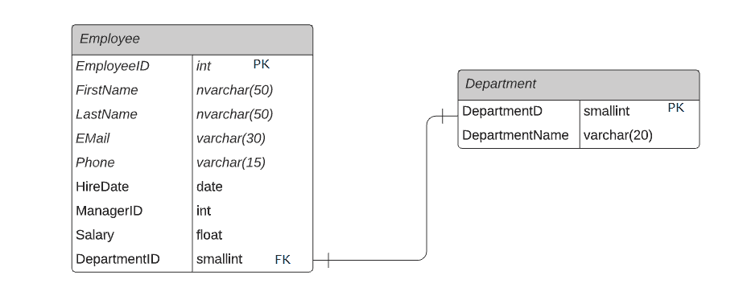
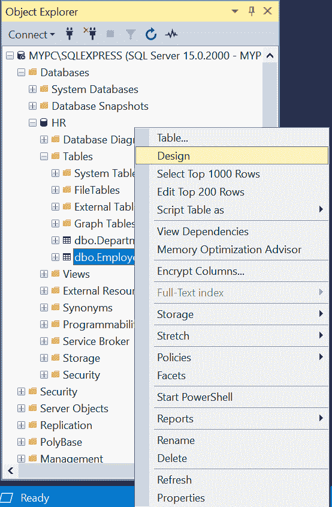
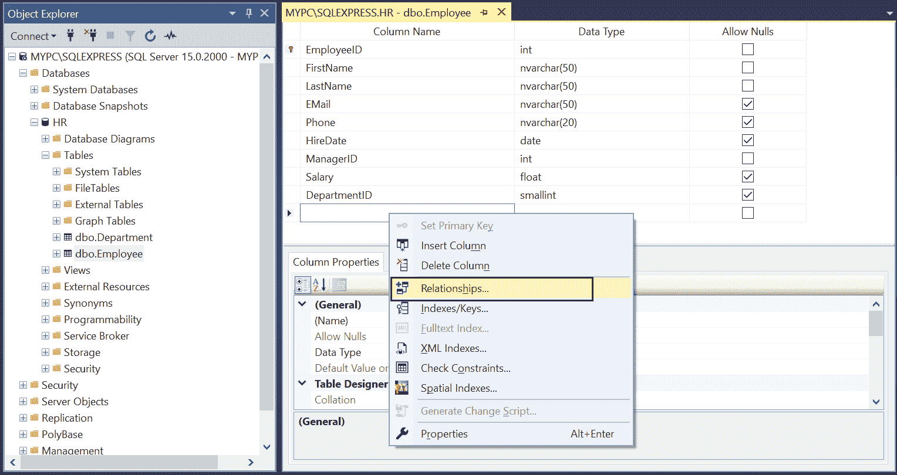
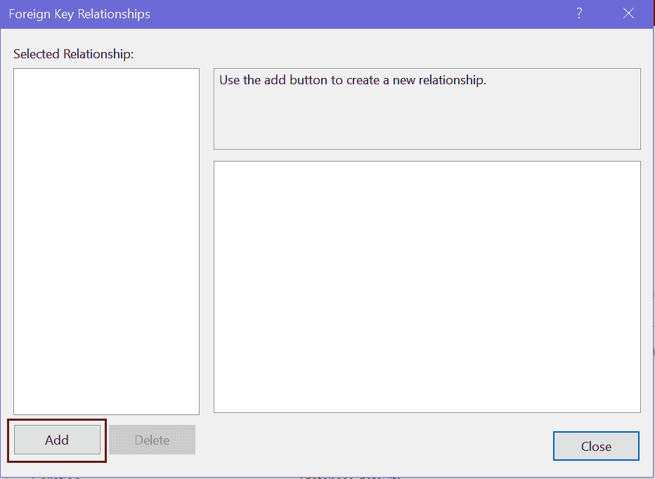
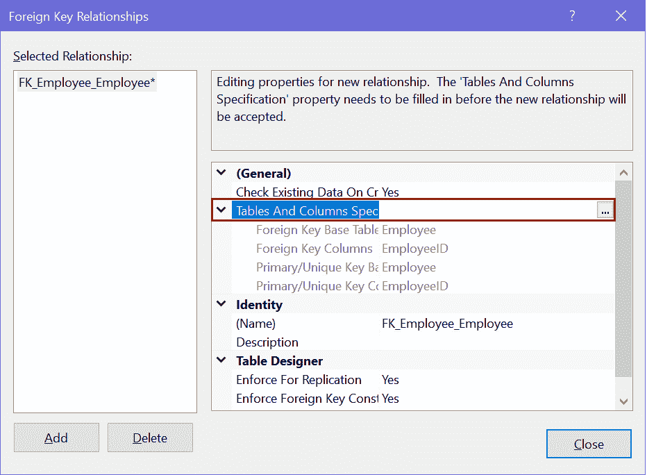
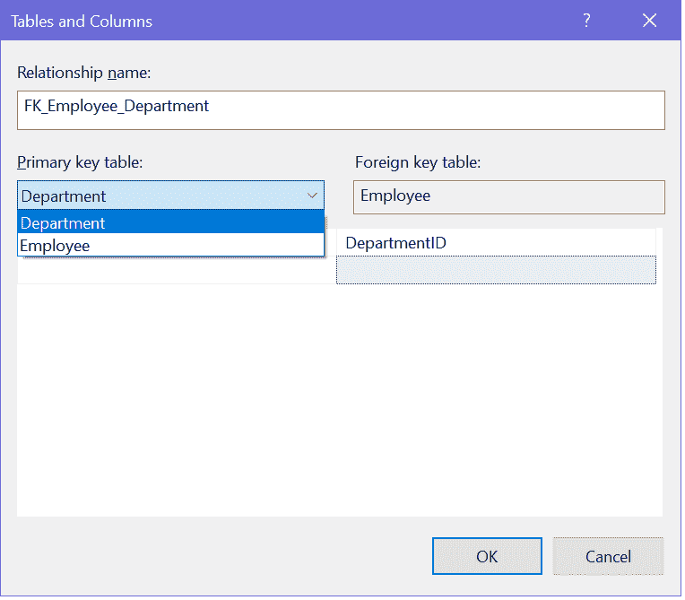
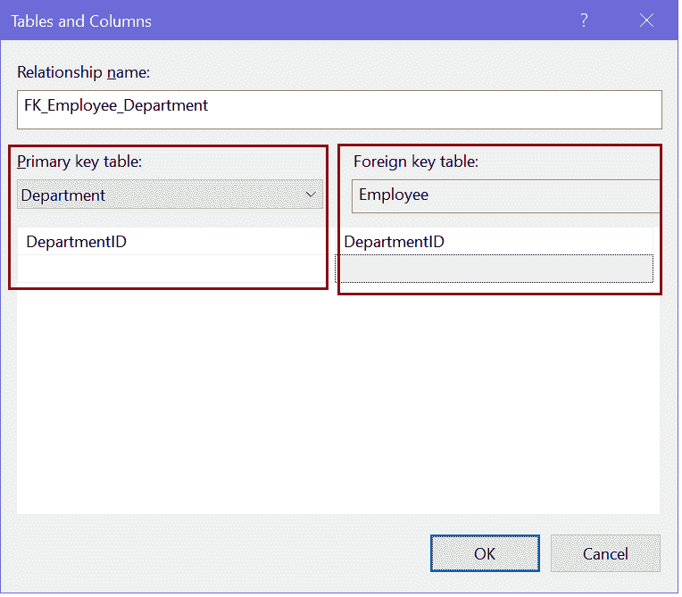

# SQL Server 中的外键:

> 原文：<https://www.tutorialsteacher.com/sqlserver/create-foreign-keys>

在这里，您将了解什么是外键，以及如何在 SQL Server 数据库中使用外键在两个表之间建立关系。

## 什么是外键？

外键建立两个表之间的关系，并在 SQL Server 中实施引用完整性。例如，下面的`Employee`表有一个外键列`DepartmentID`，它链接到`Department`表的主键列。

[](../../Content/images/sqlserver/foreignkey5.png) 

Foreign Key Relationship in SQL Server


*   外键列可以链接到同一表或另一表的主键或唯一键列。
*   具有外键约束的表称为子表，外键引用的表称为父表。例如`Employee`是子表，`Department`是父表。
*   在外键约束的列中输入了非空值，该值必须已经存在于父表的引用列中。否则你会得到一个外键冲突的错误。
*   外键约束可以引用同一服务器中同一数据库内的表。
*   可以定义外键约束来引用同一表中的另一列。这被称为自我参照。
*   单个列上的外键约束(列级约束)只能引用父表中的一列，并且应该与被引用的列具有相同的数据类型。
*   在表级(在列的组合上)定义的外键约束应具有与约束列表中定义的列数相同的引用列数。约束中每列的数据类型必须与列列表中相应的列相同。
*   一个表可以包含的引用其他表的外键约束的数量没有限制。然而，它受到硬件配置和数据库设计的限制。
*   不会对临时表强制外键约束。

## 在 SQL Server 中创建外键约束

可以通过两种方式在 SQL Server 中创建外键约束:

*   [使用 T-SQL](#create-fk-using-tsql)
*   [使用 SQL Server 管理工作室](#create-fk-using-ssms)

## 使用 T-SQL 创建一个外键

可以在[创建表](/sqlserver/create-table)中配置一个外键。 在所有列声明的末尾追加`CONSTRAINT REFERENCES`语句。

Syntax: Foreign Key 

```
CONSTRAINT <foreignkey_name> FOREIGN KEY (<column_name>)
REFERENCES <reference_tablename> (<column_name>)
[ON DELETE CASCADE]
[ON UPDATE CASCADE] 
```

在上面的语法中，<foreignkey_name>是外键的名称，应该采用`FK_TableName_ReferenceTableName`格式，以便于识别。 这会给你一个参考表的概念。 < reference_tablename >是引用列被定义为主键或唯一键的表的名称。</foreignkey_name>

下面的 T-SQL 脚本创建了一个新表`Employee`，并在`DepartmentID`列上配置了一个外键约束`FK_Employee_Department`，该约束引用了`Department`表的`DepartmentID` [主键](/sqlserver/create-primary-keys)。

Example: Create a Foreign Key 

```
CREATE TABLE Employee(
EmployeeID int IDENTITY (1,1) NOT NULL,
FirstName nvarchar (50) NOT NULL,
LastName nvarchar (50) NOT NULL,
DepartmentID int NULL, 
CONSTRAINT PK_EmployeeID PRIMARY KEY (EmployeeID), 
CONSTRAINT FK_Employee_Department FOREIGN KEY (DepartmentID)
REFERENCES Department (DepartmentID)
ON DELETE CASCADE
ON UPDATE CASCADE) 
```

在删除级联时:当我们使用删除级联选项创建外键时，只要父表中具有主键的被引用行被删除，它就会删除子表中的引用列。

更新级联时:当使用更新级联选项创建外键时，只要具有主键的父表中的被引用行被更新，子表中的引用行就会被更新。

## 在现有表中创建外键

使用 ALTET TABLE ADD CONSTRAINT 语句在现有表中创建外键。

Syntax: 

```
ALTER TABLE <table_name>
ADD CONSTRAINT <foreignkey_name> FOREIGN KEY (<column_name>)
REFERENCES <reference_tablename> (<column_name>)
[ON DELETE CASCADE]
[ON UPDATE CASCADE] 
```

以下查询在`DepartmentID`列上添加了一个新的外键约束`FK_Employee_Department`。

Example: Add Foreign Key in an Existing Table 

```
ALTER TABLE Employee    
ADD CONSTRAINT FK_Employee_Department FOREIGN KEY (DepartmentID)     
REFERENCES Department (DepartmentID)     
ON DELETE CASCADE    
ON UPDATE CASCADE 
```

## 使用 SSMS 创建外键

这里，我们将使用[SQL Server Management Studio](/sqlserver/sql-server-management-studio)将`Employee`表中的`DepartmentID`列配置为指向`Department`表的`DepartmentID`主键列的外键。

打开 SSMS，展开`HR`数据库。 右键点击`Employee`表格，点击设计选项，如下图。

[](../../Content/images/sqlserver/foreignkey1.png) 

Create a Foreign Key in SQL Server


这将在设计模式下打开`Employee`表。

现在，右键单击表设计器上的任意位置，然后选择“关系”...，如下所示。

[](../../Content/images/sqlserver/foreignkey2.png) 

Define Relationships


这将打开外键关系对话框，如下所示。

[](../../Content/images/sqlserver/foreignkey9.png) 

Add Foreign Keys in SQL Server


现在，点击添加按钮来配置一个新的外键，如下所示。

[](../../Content/images/sqlserver/foreignkey3.png) 

Configure a Foreign Key in SQL Server


现在，要配置主键和外键关系，请单击表和列规范[...]按钮。这将打开“表和列”对话框，您可以在其中选择主键和外键关系。

这里，我们将`Employee`表中的`DepartmentID`列配置为外键，它指向`Department`表的主键列`DepartmentID`。 那么，在左侧选择主键表和键，在右侧选择外键表和列，如下图所示。

[](../../Content/images/sqlserver/foreignkey10.png) 

Configure a Foreign Keys in SQL Server


下面在`Employee`表中定义一个外键`DepartmentID`。

[](../../Content/images/sqlserver/foreignkey11.png) 

Configure a Foreign Key in SQL Server


单击确定创建关系，然后单击关闭关闭对话框。

现在，保存您的更改。这将通过在`Employee`表的`DepartmentID`列上设置外键，在`Employee`和`Department`表之间创建一对多的关系，如下所示。

[](../../Content/images/sqlserver/foreignkey5.png) 

Foreign Key Relationship in SQL Server

****