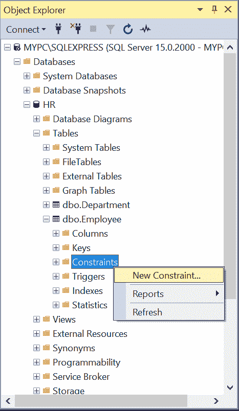
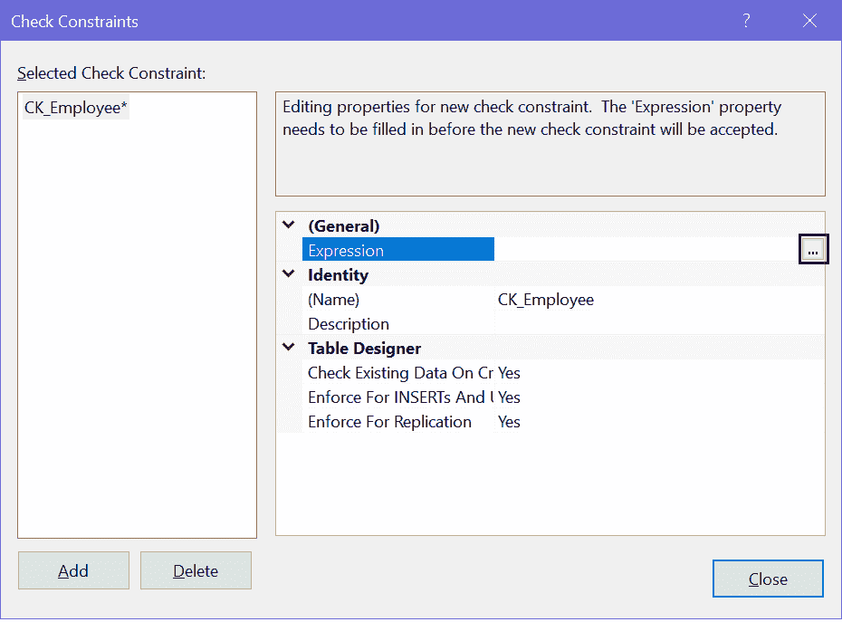
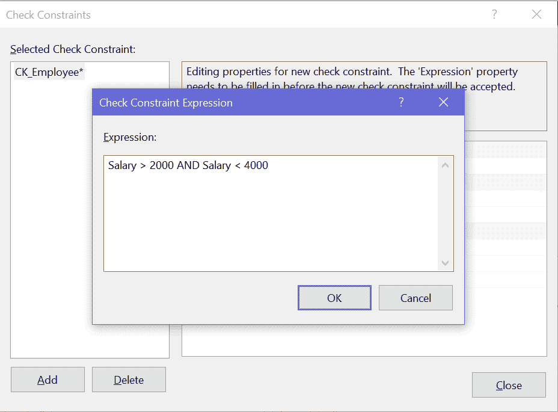
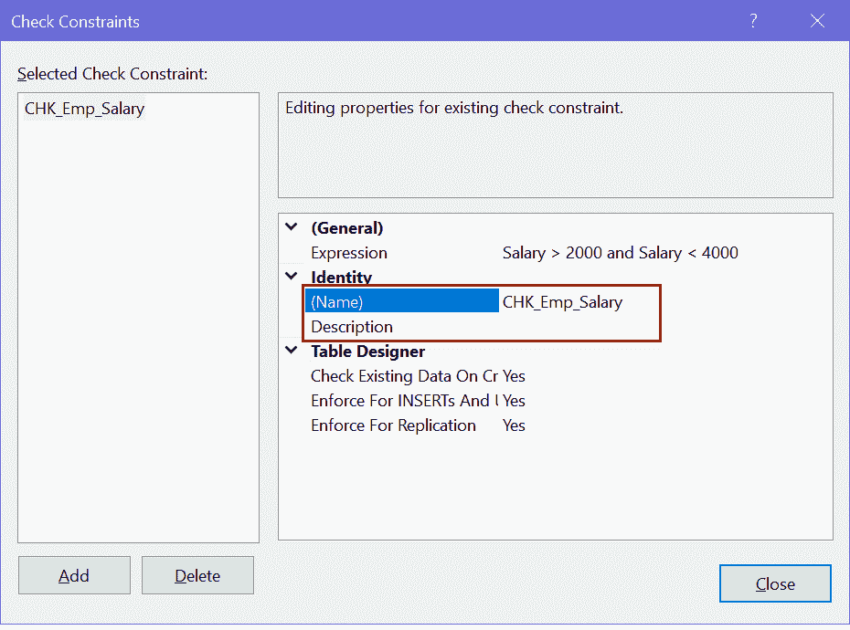
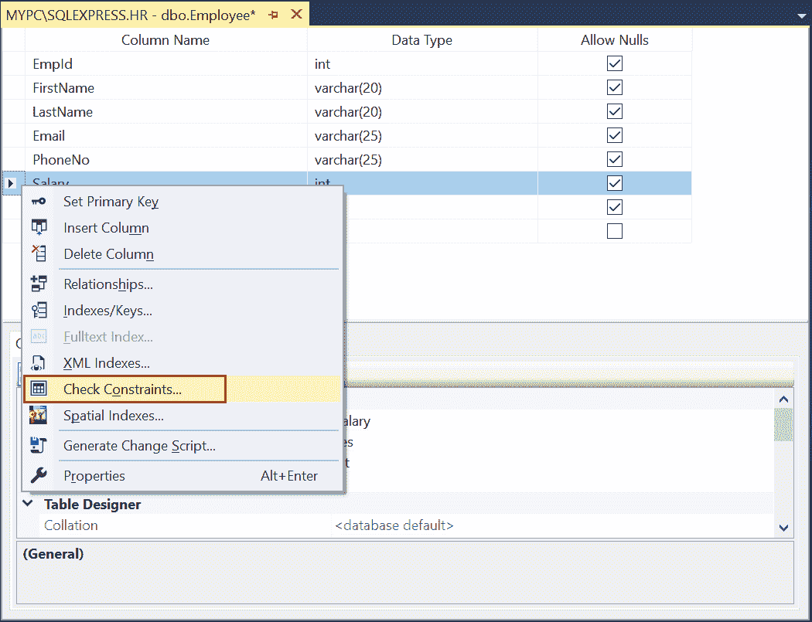
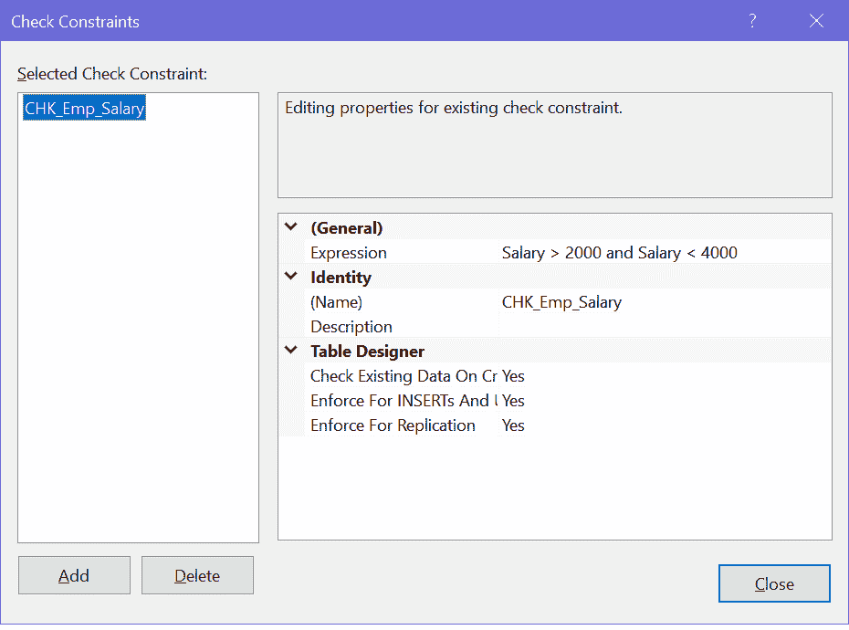
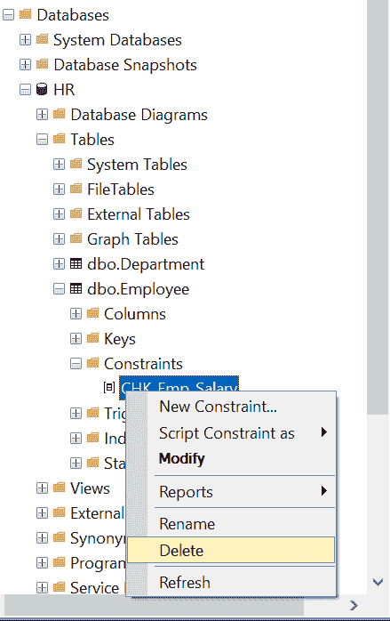
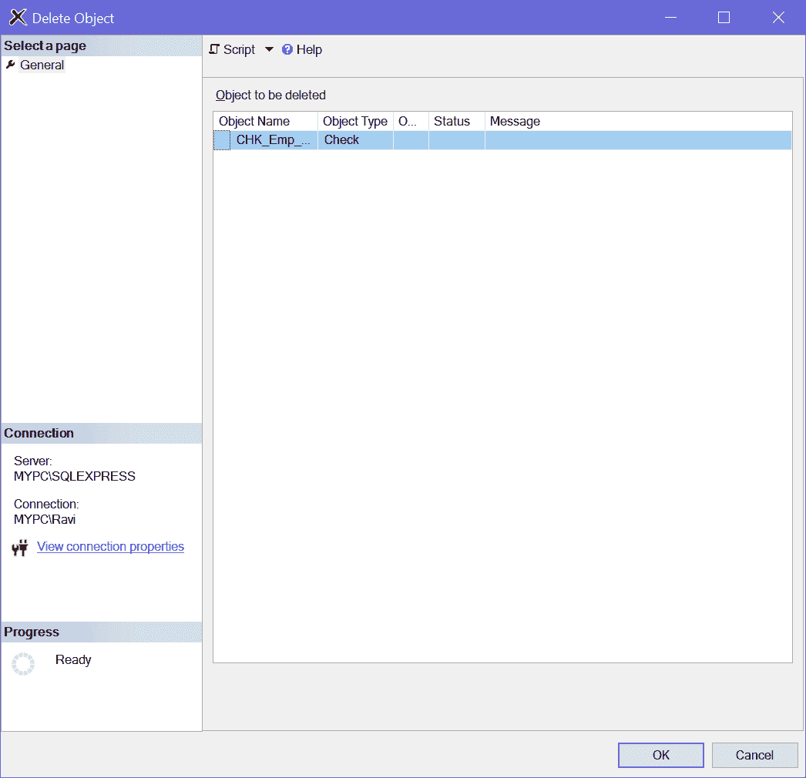

# SQL 服务器:检查约束

> 原文：<https://www.tutorialsteacher.com/sqlserver/check-constraints>

在 SQL Server 中，检查约束用于指定插入或更新时对列值的限制。

例如，如果某列需要特定范围内的日期值，或者某个值必须采用特定的格式，例如邮政编码列中的值必须为 5 位数字，则使用检查约束。

Syntax:

```
CONSTRAINT <constraint_name> CHECK(<boolean_expression>) 
```

检查约束可以用 CREATE 或 ALTER TABLE T-SQL 创建。在 CREATE TABLE 语句中的所有列定义后添加检查约束。

下面的 CREATE TABLE 语句定义了对`Employee`表的`Salary`列的检查约束。

Example: Add Check Constraint 

```
CREATE TABLE Employee(EmployeeID int,
    FirstName nvarchar(50) NOT NULL,  
    LastName nvarchar(50) NOT NULL, 
    EMail nvarchar(50),
    Salary int,
    ADD CONSTRAINT CHK_Emp_Salary CHECK(Salary > 2000 AND Salary < 4000)) 
```

以下 ALTER TABLE 语句在`Employee`表的`Salary`列上添加了一个检查约束，对于布尔表达式`Salary > 2000 AND Salary < 4000`，必须将值计算到`True`。

Example: Add Check Constraint in Existing Table 

```
ALTER TABLE Employee   
ADD CONSTRAINT CHK_Emp_Salary  
CHECK (Salary > 2000 AND Salary < 4000); 
```

现在，如果您试图在`Employee`表中插入或更新一条`Salary`不在指定范围内的记录，那么它将引发以下错误。

`The INSERT statement conflicted with the CHECK constraint "CHK_Emp_Salary". The conflict occurred in database "HR", table "dbo.Employee", column 'Salary'. The statement has been terminated.`

### 要点:

*   可以使用基于逻辑运算符返回`True`或`False`的任何逻辑布尔来创建检查约束。 例如，布尔表达式`Salary > 2000 and Salary < 4000`指定`Salary`列中的值必须大于`2000`且小于`4000`。
*   检查约束的布尔表达式可以使用多列。
*   一列可以有多个检查约束。
*   检查约束拒绝评估为“假”的值。如果您试图插入一个超出检查约束值范围的值，那么 SQL 引擎会抛出一个错误，指出插入语句与检查约束冲突，并且语句被终止。
*   检查约束不计算空值。所以可以无限制地插入 NULL。使用非空约束来限制空值。
*   删除语句期间不会验证检查约束。
*   您可以启用或禁用检查约束，而不是删除它们。

## 使用 SSMS 创建检查约束

第一步:在对象浏览器中，展开表格文件夹，右键点击`Constraints`文件夹，选择`New Constraint`，如下图。

[](../../Content/images/sqlserver/checkconstraint1.png)

SQL Server Check Constraint


步骤 2:打开“检查约束”对话框。选择`Expressions`，点击省略号`...`，如下图。

[](../../Content/images/sqlserver/checkconstraint2.png)

Add Check Constraint Expression


步骤 3:在“检查约束表达式”对话框中，键入检查约束的 SQL 表达式。例如`Employee`表的`Salary`列，输入薪资范围为`Salary > 2000 and Salary < 4000`，点击【确定】。

[](../../Content/images/sqlserver/checkconstraint3.png)

Add Check Constraint Expression


步骤 4:在“标识”类别中，您可以更改约束的名称并添加描述。

[](../../Content/images/sqlserver/checkconstraint9.png)

Add Check Constraint Name


第五步:在`Identity`下方的`Table Designer`部分，启用或禁用检查约束，并指定检查约束何时实施。

第六步:点击关闭。在文件菜单中，点击保存。

因此，您可以对表中的列创建检查约束。

## 使用 SSMS 修改检查约束

打开 SSMS ( [SQL Server 管理工作室](/sqlserver/sql-server-management-studio)，右键单击表名，选择`Design`在表设计器中打开。

现在，右键点击表格设计器，选择`Check Constraints...`，如下图。

[](../../Content/images/sqlserver/checkconstraint5.png)

Modify Check Constraint


这将打开“检查约束”对话框，您可以在其中编辑表达式、重新命名约束或禁用任何更新或插入的约束，如下所示。

[](../../Content/images/sqlserver/checkconstraint10.png)

Modify Check Constraint


修改后，单击关闭并保存更改。

## 启用或禁用检查约束

创建检查约束后，可以将其禁用。禁用检查约束不会在插入或更新时强制执行检查约束。您可以稍后在需要时重新启用它。

Syntax:

```
ALTER TABLE <table_name>
NOCHECK CONSTRAINT <constraint_name>; 
```

以下内容禁用`CHK_Emp_Salary`约束。

Example: Disable Check Constraint 

```
ALTER TABLE Employee   
NOCHECK CONSTRAINT CHK_Emp_Salary; 
```

要在 SSMS 禁用检查约束，请为“创建或重新启用时检查现有数据”选择“否”。选择“是”重新启用，如下所示。

[](../../Content/images/sqlserver/checkconstraint6.png)

Enable/Disable Check Constraint


## 使用 SSMS 删除检查约束

使用 ALTER TABLE 语句中的 DROP CONSTRAINT 语句删除现有的检查约束。

Syntax: 

```
ALTER TABLE <table-name>DROP CONSTRAINT <constraint_name>;</table-name> 
```

以下内容删除了“员工”表中的检查约束“CHK 薪资”。

Example: Delete Check Constraint 

```
ALTER TABLE Employee   
DROP CONSTRAINT CHK_Emp_Salary 
```

要使用 SQL Server Management Studio 删除约束，请展开包含要删除的约束的表。

[](../../Content/images/sqlserver/checkconstraint7.png)

Delete Check Constraint


现在，展开“约束”节点，右键单击要删除的约束，然后单击“删除”。

[](../../Content/images/sqlserver/checkconstraint8.png)

Delete Check Constraint


在“删除对象”对话框中，单击“确定”删除约束。*****