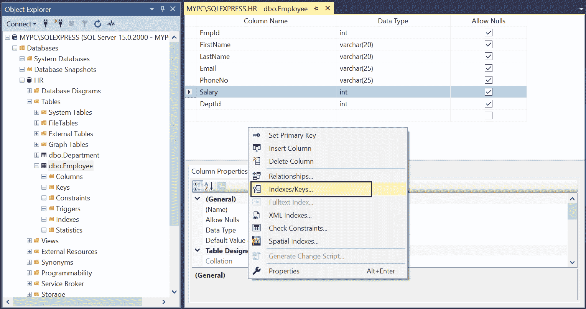
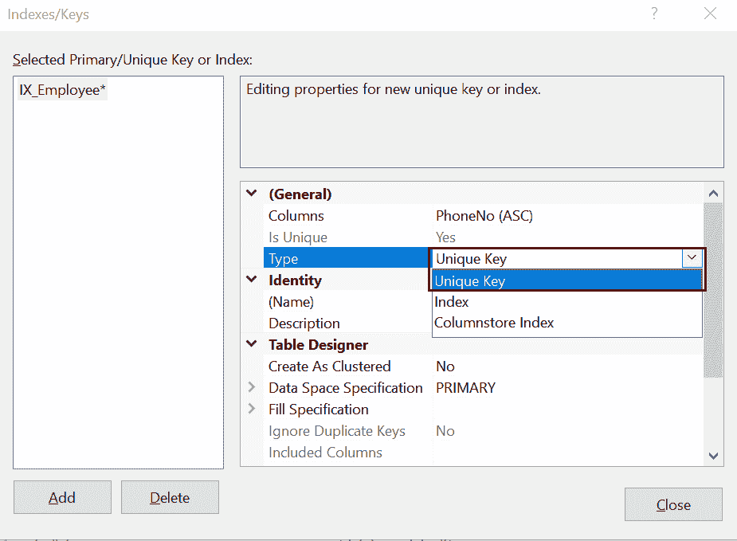
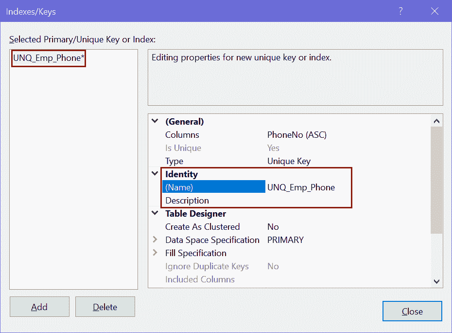
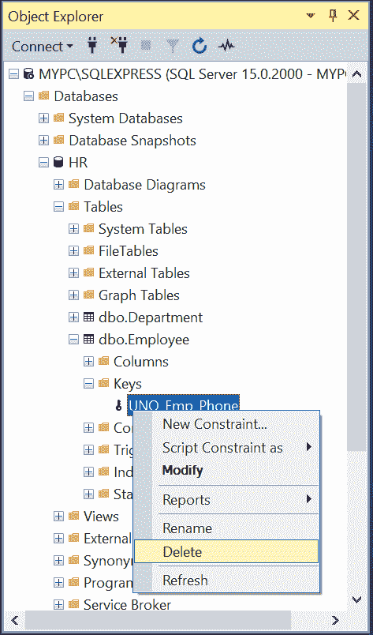
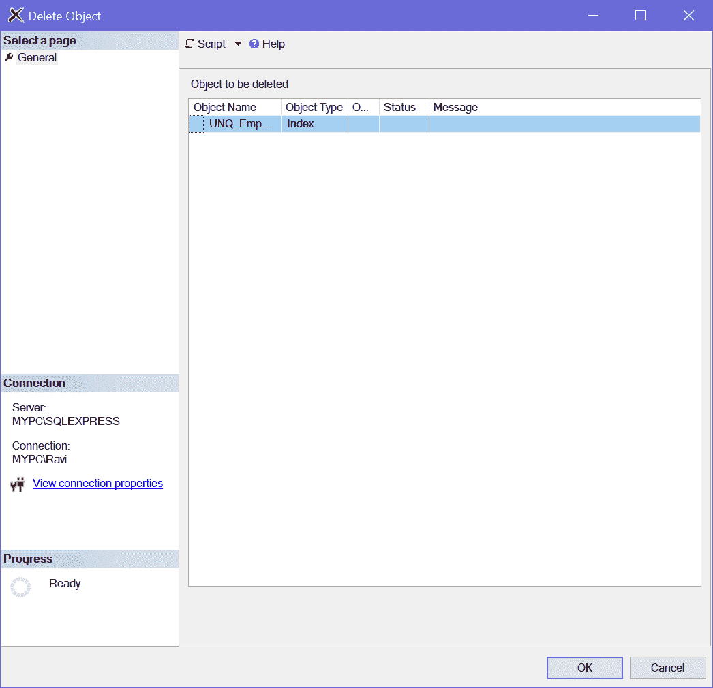

# SQLServer：唯一键约束

> 原文：<https://www.tutorialsteacher.com/sqlserver/unique-key-constraints>

唯一约束确保所有值的唯一性，并且不会在表的列中输入重复的值。

可以使用 CREATE 或 ALTER TABLE T-SQL 创建唯一的约束。在 CREATE TABLE 语句中的列定义后添加唯一约束。

Syntax:

```
CONSTRAINT <constraint_name> UNIQE(<column_name>) 
```

下面的 CREATE TABLE 语句在`Employee`表的`PhoneNo`列上定义了一个唯一的键约束。

Example: Add Unique Constraint in Existing Table 

```
CREATE TABLE Employee(EmployeeID int,
    FirstName nvarchar(50) NOT NULL,  
    LastName nvarchar(50) NOT NULL, 
    EMail nvarchar(50),
    PhoneNo varchar(15),
    ADD CONSTRAINT UNQ_Emp_Phone Unique(PhoneNo)) 
```

下面的 ALTER TABLE 语句在现有的`Employee`表的`PhoneNo`列上添加了一个唯一的约束。

Example: Add Unique Constraint in Existing Table 

```
ALTER TABLE Employee   
ADD CONSTRAINT UNQ_Emp_Phone Unique(PhoneNo) 
```

现在，如果您试图在`Employee`表中插入或更新一条`Phone`不在指定范围内的记录，那么它将引发以下错误。

`Violation of UNIQUE KEY constraint 'UNQ_Emp_Phone'. Cannot insert duplicate key in object 'dbo.Employee'. The duplicate key value is (123.123.1834). The statement has been terminated.`

### 要点:

*   唯一约束和主键约束都强制唯一性。每当您想要在列中强制唯一性时，建议使用唯一约束而不是主键约束。
*   与主键约束不同，唯一约束只允许一个空值。
*   创建唯一键约束时，会自动创建唯一索引。
*   每当插入或更新重复值时，SQL Server 都会引发错误。
*   当向表中的现有列添加唯一索引时，数据库引擎首先检查指定列数据的唯一性。如果发现重复条目，则引擎返回错误，并且不添加约束。
*   表中的唯一键可以被另一个表中的外键引用。

## 使用 SSMS 创建唯一约束

第一步:打开 SSMS，登录一个数据库。在对象资源管理器中，展开表文件夹，右键单击要添加唯一约束的表，然后选择`Design`在表设计器中打开它。

[](../../Content/images/sqlserver/foreignkey1.png) 

现在，右键点击表格设计器，选择`Indexes/Keys`，如下图。

[](../../Content/images/sqlserver/unique1.png) 

SQL Server Unique Key Constraint


第二步:在“索引/键”对话框中，选择`Columns`属性中的`PhoneNo`列。

接下来，选择`Unique Key`类型以在`PhoneNo`列上应用唯一键约束。

[](../../Content/images/sqlserver/unique2.png)

Add Unique Key Constraint


第三步:在`name`属性中给出约束的名称。

[](../../Content/images/sqlserver/unique3.png)

Add Unique Constraint Expression


单击关闭并保存表格。

因此，您可以在表中的列上创建唯一的键约束。

## 删除唯一键约束

使用 ALTER TABLE 语句中的 DROP CONSTRAINT 语句删除现有的唯一约束。

Syntax: 

```
ALTER TABLE <table-name>DROP CONSTRAINT <constraint_name>;</table-name> 
```

下面删除`Employee`表中的唯一键约束`UNQ_Emp_Phone`。

Example: Delete Unique Constraint 

```
ALTER TABLE Employee   
DROP CONSTRAINT UNQ_Emp_Phone; 
```

要使用 SQL Server Management Studio 删除约束，请展开包含要删除的约束的表。

现在，展开`Keys`文件夹，右键单击要删除的约束，然后单击删除。

[](../../Content/images/sqlserver/unique4.png)

Delete Unique Key Constraints


这将打开“删除对象”对话框，如下所示。

[](../../Content/images/sqlserver/unique5.png)

Delete Unique Key Constraint


在“删除对象”对话框中，单击“确定”删除约束。****