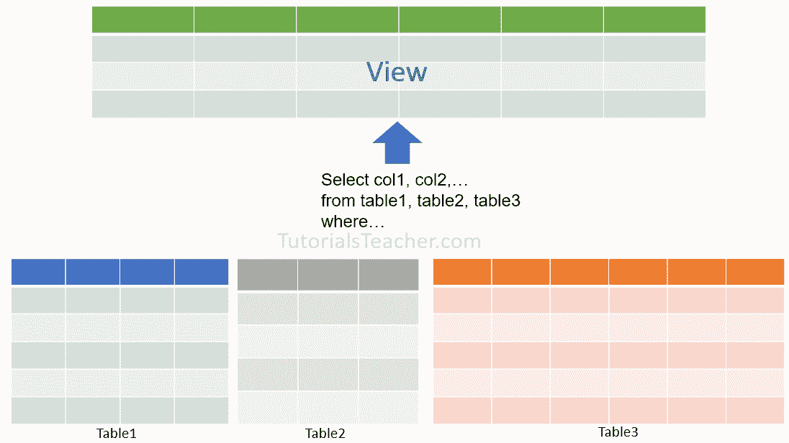
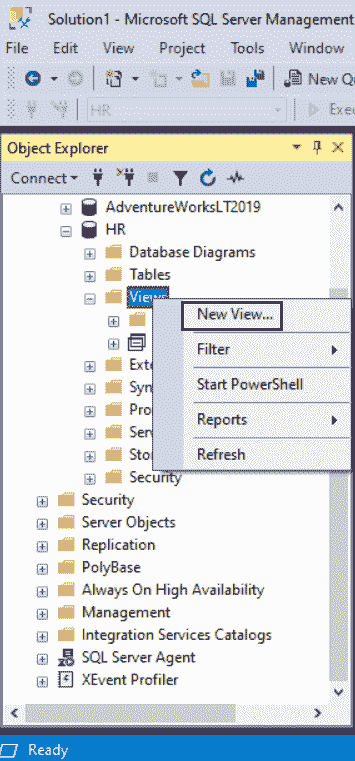
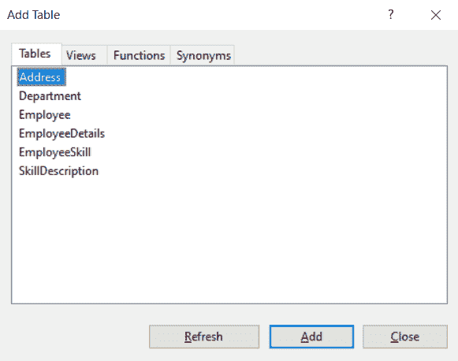
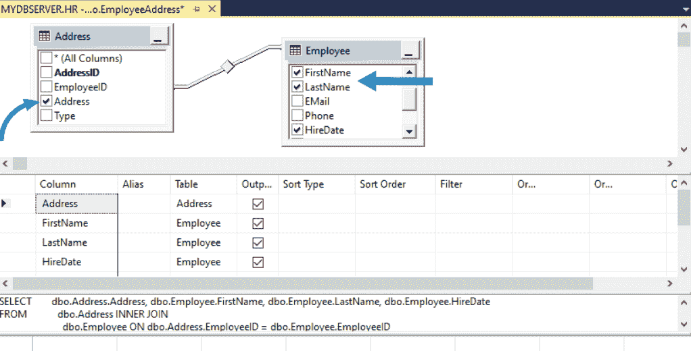
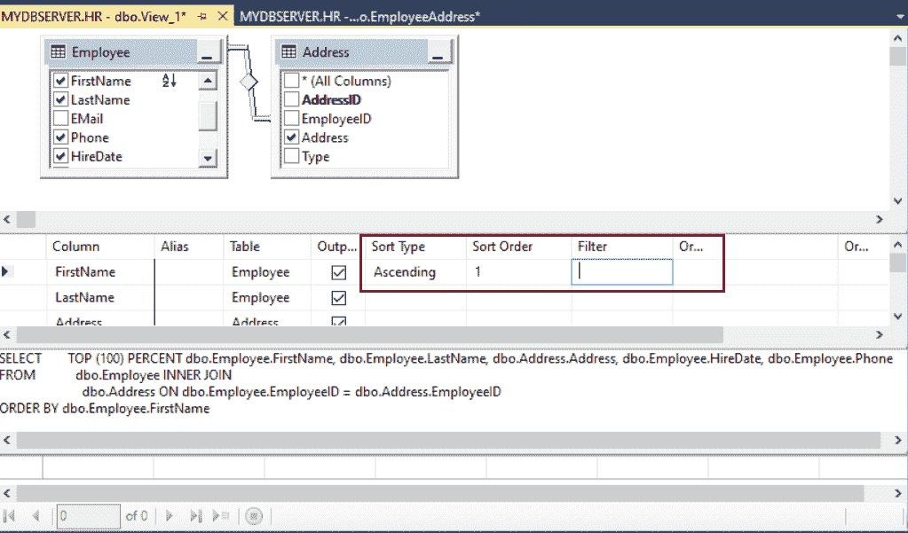
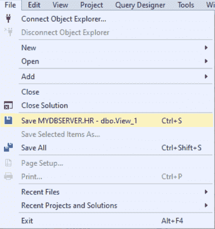
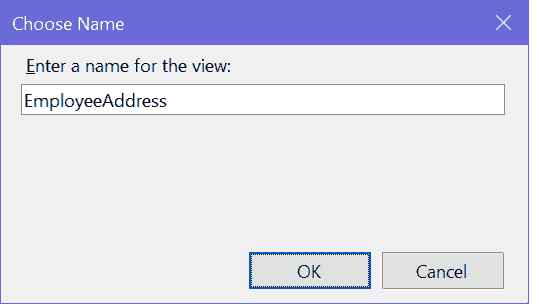
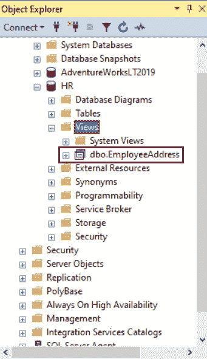

# SQLServer 视图

> 原文：<https://www.tutorialsteacher.com/sqlserver/views>

在 SQL Server 中，视图是一个虚拟表，其值由查询定义。换句话说，视图是一个可以用作表的查询的名称。视图的行和列来自查询引用的表。

下图说明了 SQL Server 中的视图。

[](../../Content/images/sqlserver/view.png) 

## 视图的类型

**用户自定义视图:**顾名思义，这种类型的视图是由数据库用户定义的。 编译后的查询存储在数据库中。

**索引视图:**在用户定义的视图上创建唯一聚集索引时，它将成为索引视图。 它提高了聚合许多行的查询的性能。在数据经常更新的地方，它们并不好。

**分区视图:**分区视图将来自一组成员表的水平分区数据连接到一个或多个服务器。

**系统视图:**系统视图公开数据库中的元数据。它们可用于获取关于 SQL Server 实例或数据库对象的信息，例如`sys.databases`视图返回关于实例中可用的用户定义数据库的信息。

## 要点

*   除非建立索引，否则视图不会作为一组存储的数据值存在于数据库中。
*   可以通过使用当前数据库或其他数据库中的表或其他视图来创建视图。
*   构成视图的 SQL 语句存储在数据库中，而不是结果数据中。
*   引用视图时，视图中的数据会动态生成。
*   视图被用作一种安全机制来屏蔽底层基表，并且只允许用户访问视图。

## 使用丁字裤创建视图

下面是一个创建新视图的 T-SQL 语法。

Syntax: 

```sql
CREATE VIEW <schema_name>.<view_name> 
AS
    SELECT column1, column2, ...
    FROM table1, table2,...
    [WHERE]; 
```

下面的 T-SQL 脚本在数据库中创建了一个名为`EmployeeAddress`的新视图。

Example: Create a View 

```sql
CREATE VIEW dbo.EmployeeAddress  
    AS 
    SELECT emp.FirstName, emp.LastName, emp.HireDate, addr.Address 
    FROM Employee emp JOIN Address addr 
    on emp.EmployeeID = addr.EmployeeID; 
```

在上例中，`EmployeeAddress`视图是用写在`AS`关键字之后的查询创建的。 包含查询返回的记录。

## 使用 SQL Server 管理工作室创建视图

步骤 1:打开 SSMS 并连接到数据库实例。

步骤 2:在对象资源管理器中，展开要创建视图的数据库。

第三步:右键点击视图文件夹，选择`New View...`，如下图。

[](../../Content/images/sqlserver/view1.png) 

Views in SQL Server 2019


第 4 步:在“添加表”对话框中，从“表”、“视图”、“函数”和“同义词”选项卡中选择一个或多个用于创建新视图的表、现有视图、函数或同义词。在这里，我们将添加`Employee`和`Address`表。单击关闭按钮将其关闭。

[](../../Content/images/sqlserver/view2.png)

Add DB Objects


步骤 5:在图表窗格中，选择要添加到新视图中的列或其他元素。

[](../../Content/images/sqlserver/view3.png) 

Views in SQL Server 2019


步骤 7:在“条件”窗格中，选择排序或筛选条件。

[](../../Content/images/sqlserver/view4.png) 

Views in SQL Server 2019


步骤 8:从“文件”菜单中，单击“保存视图名称”。

[](../../Content/images/sqlserver/view5.png) 

Views in SQL Server 2019


步骤 9:在“选择名称”对话框中，输入新视图的名称。单击确定。

[](../../Content/images/sqlserver/view6.png) 

Views in SQL Server 2019


要查看新视图，请在对象资源管理器中刷新数据库实例下的“视图”文件夹。

[](../../Content/images/sqlserver/view7.png) 

Views in SQL Server 2019


在下一章中学习如何修改或删除视图。**