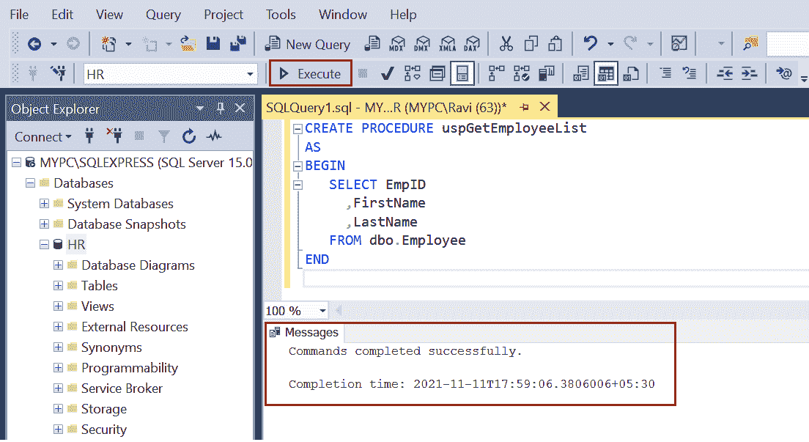
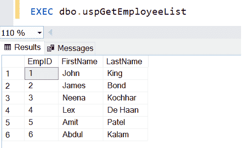
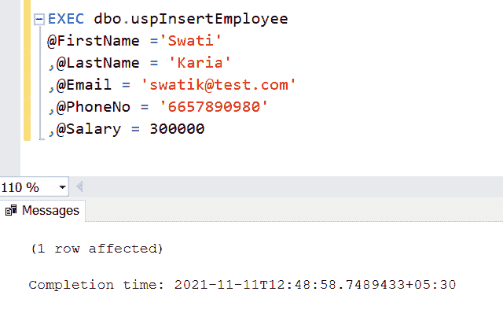
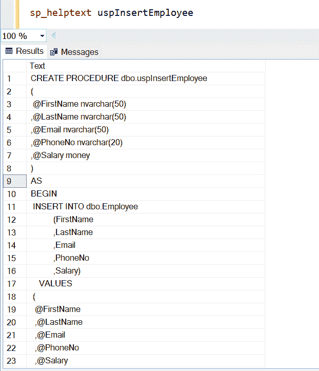
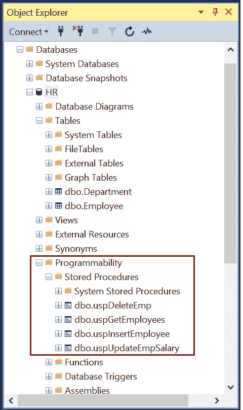

# 存储过程

> 原文:[https://www . tutorial stearner . com/SQL server/存储过程](https://www.tutorialsteacher.com/sqlserver/stored-procedures)

在 SQL Server 中，存储过程是一组编译后存储在数据库中的 T-SQL 语句。存储过程接受输入和输出参数，执行 SQL 语句，并返回结果集(如果有)。

默认情况下，存储过程在第一次执行时编译。它还创建了一个执行计划，该计划可在后续执行中重用，以提高性能。

存储过程有两种类型:

**用户定义的过程:**用户定义的存储过程是由数据库用户在用户定义的数据库或除资源数据库之外的任何系统数据库中创建的。

**系统过程:**系统过程包含在 SQL Server 中，物理存储在内部隐藏的资源数据库中，逻辑上出现在所有数据库的`sys`模式中。 系统存储过程以`sp_`前缀开始。

## 创建存储过程

使用 CREATE 语句创建存储过程。

Syntax:

```
CREATE [OR ALTER] {PROC | PROCEDURE} [schema_name.] procedure_name([@parameter data_type [ OUT | OUTPUT | [READONLY]] 
[ WITH <procedure_option> ]
[ FOR REPLICATION ]
    AS
    BEGIN
        sql_statements 
    END 
```

存储过程可以包含一个或多个 select、insert、update 或 delete 语句。下面是一个简单存储过程的示例，该过程使用[选择查询](/sqlserver/select-query)从`Employee`表中返回记录。

Example: Simple Stored Procedure 

```
CREATE PROCEDURE uspGetEmployeeList
AS
BEGIN
   SELECT EmpID
	 ,FirstName
	 ,LastName
   FROM dbo.Employee
END 
```

在查询编辑器中执行上面的 T-SQL 脚本，在数据库中编译创建，如下图所示。

[](../../Content/images/sqlserver/storedprocedure5.png)

上述存储过程可以使用`EXEC`关键字执行，如下所示。

[](../../Content/images/sqlserver/storedprocedure1.png)

以下存储过程在`Employee`表中插入值。

Example: Stored Procedure for Insert Operation 

```
CREATE PROCEDURE dbo.uspInsertEmployee
(
 @FirstName nvarchar(50)
,@LastName nvarchar(50)
,@Email nvarchar(50)
,@PhoneNo nvarchar(20)
,@Salary money
)
AS
BEGIN
	INSERT INTO dbo.Employee
           (FirstName
           ,LastName
           ,Email
           ,PhoneNo
           ,Salary)
    VALUES
	(
		@FirstName
		,@LastName
		,@Email
		,@PhoneNo
		,@Salary
	)
 END 
```

上述存储过程可用于将值插入到`Employee`表中，而不是 [INSERT 语句](/sqlserver/insert-data)。 值作为参数传递给存储过程。`@`符号用作参数变量的前缀。

您可以使用`EXEC`关键字执行`uspInsertEmployee`存储过程，如下所示。

Example: Execute Stored Procedure 

```
EXEC dbo.uspInsertEmployeeDetails
@FirstName ='Swati'
,@LastName = 'Karia'
,@Email = '[[email protected]](/cdn-cgi/l/email-protection)'
,@PhoneNo = '6657890980'
,@Salary = 300000 
```

在执行存储过程时，指定由命令分隔的每个参数。

[](../../Content/images/sqlserver/storedprocedure2.png)

## 查看存储过程

使用`sp_help`或`sp_helptext`查看现有存储过程的文本，如下所示。

[](../../Content/images/sqlserver/storedprocedure3.png)

所有存储过程都列在数据库下的可编程性>存储过程文件夹下。

[](../../Content/images/sqlserver/storedprocedure4.png)

## 修改存储过程

使用`ALTER PROCEDURE`语句修改存储过程。

Example: Modify Stored Procedure 

```
ALTER PROCEDURE dbo.uspGetEmployees
AS
BEGIN
   SELECT EmpID
	 ,FirstName
	 ,LastName
     ,Salary
   FROM dbo.Employee
END 
```

## 重命名存储过程

使用系统存储过程`sp_rename`重命名现有存储过程。 以下将`uspGetEmployeeList`更名为`uspGetEmployees`。

Example: Rename Stored Procedure 

```
sp_rename 'uspGetEmployeeList','uspGetEmployees' 
```

## 删除存储过程

使用`DROP PROCEDURE`语句删除存储过程。

Example: Delete Stored Procedure 

```
DROP PROCEDURE dbo.uspGetEmployees; 
```

## 处理存储过程中的异常

在 SQL Server 中，尝试..CATCH 块用于优雅地处理异常。一组 T-SQL 语句可以包含在 TRY 块中。如果在 TRY 块中遇到错误，控制将被传递给 CATCH 块，CATCH 块将有另一组 SQL 语句来处理该错误。

在 CATCH 块中，像`ERROR_NUMBER()`、`ERROR_STATE()`、`ERROR_SEVERITY()`这样的系统功能可以用来获取关于错误的信息。

以下示例处理`uspEmpUpdate`存储过程中的错误。

Example: Exception Handling in Stored Procdure 

```
CREATE PROCEDURE uspUpdateEmpSalary
(
     @empId int
     ,@salary float
)
AS
BEGIN TRY
    UPDATE dbo.Employee
    SET Salary = @salary
    WHERE EmployeeID = @empId
END TRY
BEGIN CATCH
    SELECT
     ERROR_NUMBER() AS ErrorNumber  
     ,ERROR_SEVERITY() AS ErrorSeverity  
     ,ERROR_STATE() AS ErrorState  
     ,ERROR_MESSAGE() AS ErrorMessage;
END CATCH 
```

## 存储过程的优点

*   存储过程是可重用的。多个应用程序中的多个用户可以使用同一个存储过程
*   由于 SPs 驻留在数据库中，因此减少了网络流量。应用程序必须对数据库进行一次过程调用，然后它将信息传递给用户。
*   数据库对象被封装在存储过程中，这通过限制对数据库对象的访问来充当安全机制。
*   降低开发成本，易于修改，增加可读性。
*   提高性能。第一次执行存储过程时，数据库处理器会创建一个执行计划，每次执行该服务点时都会重复使用该计划。

了解 SQL Server 中函数和存储过程的[区别是什么。](/articles/functions-vs-stored-procedures-in-sqlserver)*******