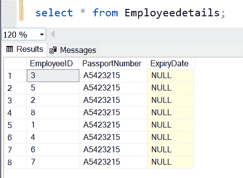
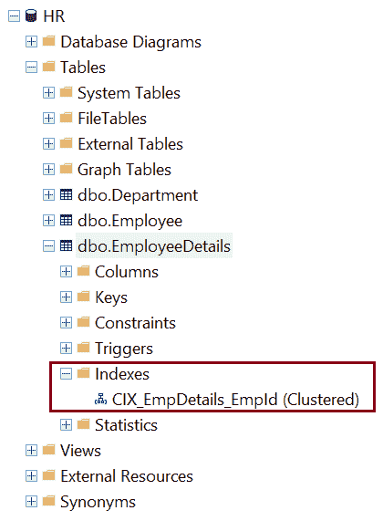
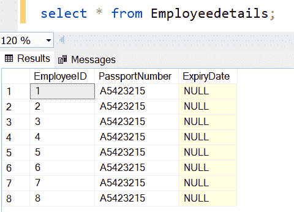
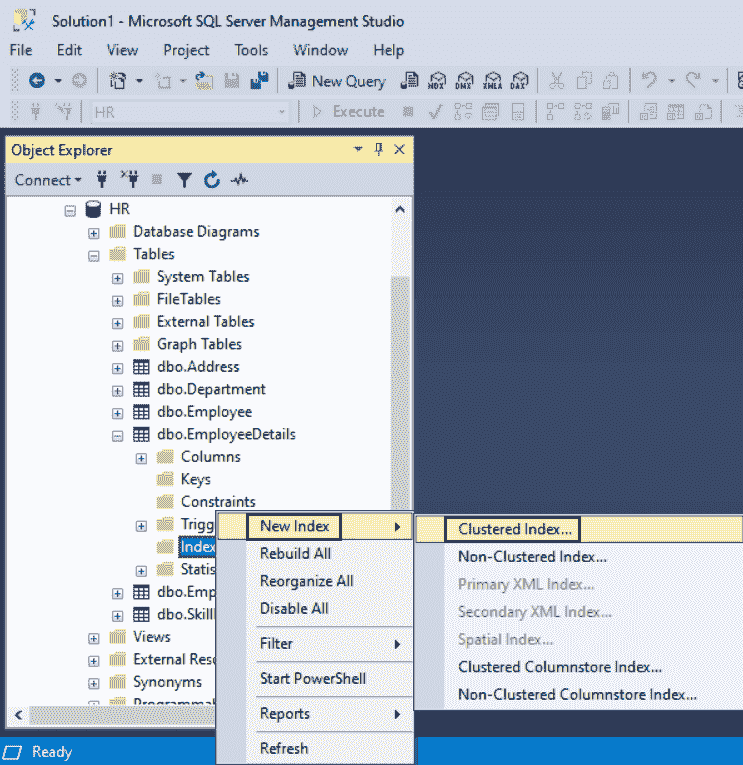
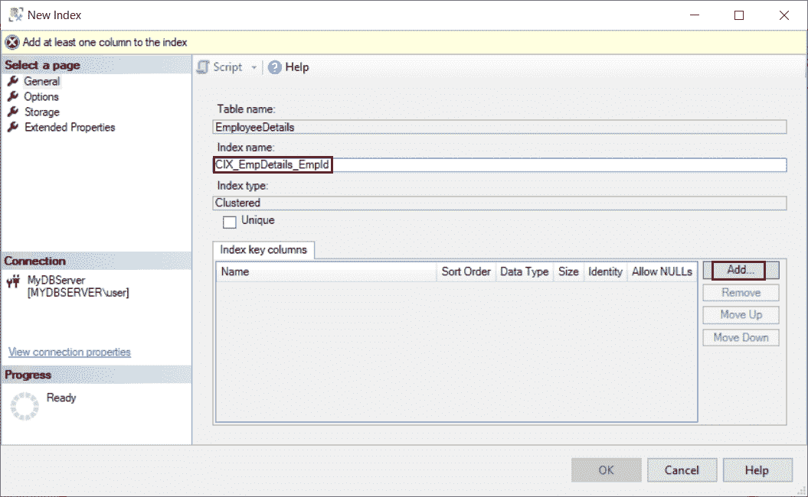
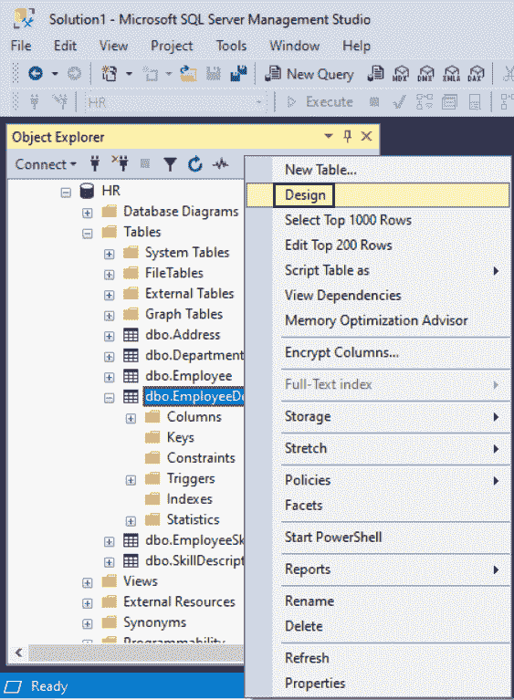
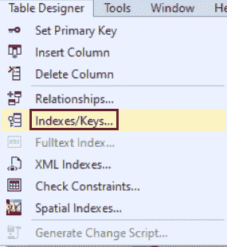
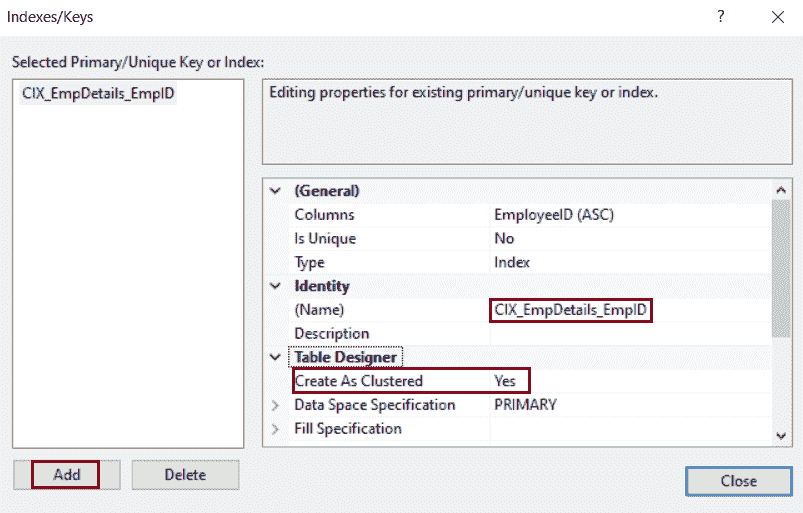

# SQL Server 索引：聚集索引

> 原文：<https://www.tutorialsteacher.com/sqlserver/indexes>

SQL Server 中的索引是一种与表和视图相关联的数据结构，有助于更快地检索行。

表中的数据以一种称为堆的无序结构存储在行中。如果必须从表中获取数据，查询优化器必须扫描整个表来检索所需的行。如果一个表有大量的行，那么 SQL Server 将花费很长时间来检索所需的行。因此，为了加速数据检索，SQL Server 有一种特殊的数据结构，称为索引。

索引主要在一列或多列上创建，这些列通常用于 [SELECT 子句](/sqlserver/select-query)或 [`WHERE`子句](/sqlserver/where-clause)。

在 SQL Server 中有两种类型的索引:

1.  [聚集指数](#clustered-index)
2.  [非聚集索引](/sqlserver/nonclustered-index)

## 聚集索引

聚集索引定义了表数据的排序和存储顺序。如前所述，没有索引的表将存储在无序结构中。当您在列上定义聚集索引时，它将基于该列值对数据进行排序并存储它。因此，它有助于更快地检索数据。

一个表上只能有一个聚集索引，因为数据行只能以一种顺序存储。

在表上创建主键约束时，会自动在表上创建唯一的聚集索引。

例如，创建以下没有主键的`EmployeeDetails`表。

Example: Create Table 

```sql
CREATE TABLE dbo.EmployeeDetails(
	EmployeeID int NOT NULL,
	PassportNumber varchar(50) NULL,
	ExpiryDate date NULL
) 
```

在表格中插入下列行。

Example: Insert Data 

```sql
Insert into EmployeeDetails values(3,'A5423215',null);
Insert into EmployeeDetails values(5,'A5423215',null);
Insert into EmployeeDetails values(2,'A5423215',null);
Insert into EmployeeDetails values(8,'A5423215',null);
Insert into EmployeeDetails values(1,'A5423215',null);
Insert into EmployeeDetails values(4,'A5423215',null);
Insert into EmployeeDetails values(6,'A5423215',null);
Insert into EmployeeDetails values(7,'A5423215',null); 
```

`EmployeeDetails`表中的数据不以任何顺序存储。执行`Select * from EmployeeDetails;`会看到如下结果。



如您所见，数据按照插入的顺序存储。现在，如果您使用 `WHERE`子句过滤掉数据，查询优化器将扫描整个表的行，以获得所需的数据。这是因为数据没有任何顺序。

在`EmployeeID`列上创建一个聚集索引，按照`EmployeeID`对数据进行排序和存储。 表中的数据将根据`EmployeeID`进行排序，执行上述查询会更快地返回行。 这可以用 SQL Server 的执行计划来验证。

## 使用 T-SQL 创建聚集索引

以下是在表上创建聚集索引的语法。

Syntax 

```sql
CREATE CLUSTERED INDEX <index_name>
ON [schema.]<table_name>(column_name [asc|desc]); 
```

下面在`EmployeeDetails`表的`EmployeeID`列上创建一个聚集索引。

Example: Create Clustered Index 

```sql
CREATE CLUSTERED INDEX CIX_EmpDetails_EmpId
ON dbo.EmployeeDetails(EmployeeID) 
```

上面的语句将在 indexes 文件夹中创建一个索引，如下所示。



现在，`Select * from EmployeeDetails;`将返回以下结果。



在聚集索引中，数据是使用称为 B 树或平衡树结构的特殊结构来组织的。在 B 树中，顶部节点称为根节点，底部节点称为叶节点。根节点和叶节点之间的所有索引级别都称为中间级别。叶节点包含数据页。根级和中间级包含保存索引行的索引页，每个索引行包含指向叶节点中的数据行或另一个中间级页的指针。索引的每一级中的页面都在双向链表中链接。

可以在两个排序顺序不同的列上创建聚集索引，如下所示。

Example: Create Clustered Index 

```sql
CREATE CLUSTERED INDEX CIX_EmpDetails_EmpId
ON dbo.EmployeeDetails(EmployeeID ASC, PassportNumber DESC) 
```

## 使用 SSMS 创建聚集索引

步骤 1:打开 SSMS 并连接到数据库。在对象资源管理器中，展开要创建聚集索引的表。

第二步:右键点击`Indexes`文件夹。指向`New Index`，选择`Clustered index..`，如下图。



第三步:在`New Index`对话框中，在【常规】页面的`Index Name`下输入索引名称，点击`Index Key Columns`下的【添加】按钮，如下图。



步骤 5:在“从表名中选择列”对话框中，选中要添加到聚集索引的列的复选框。


第六步:点击确定，保存表格。

## 使用表设计器创建聚集索引

创建聚集索引的另一种方法是使用 SSMS 的表设计器。

步骤 1:在对象资源管理器中，右键单击要创建聚集索引的表，然后单击“设计”。



步骤 2:在表设计器菜单上，单击索引/键。



步骤 3:在“索引/关键字”对话框中，单击“添加”按钮。

第 4 步:对于创建的新索引，从下拉列表中选择是创建为聚集索引。



第五步:点击关闭。

步骤 6:从“文件”菜单中单击“保存表名”。

在下一章中学习如何创建非聚集索引。*****