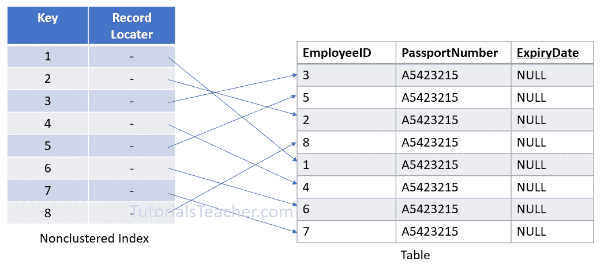
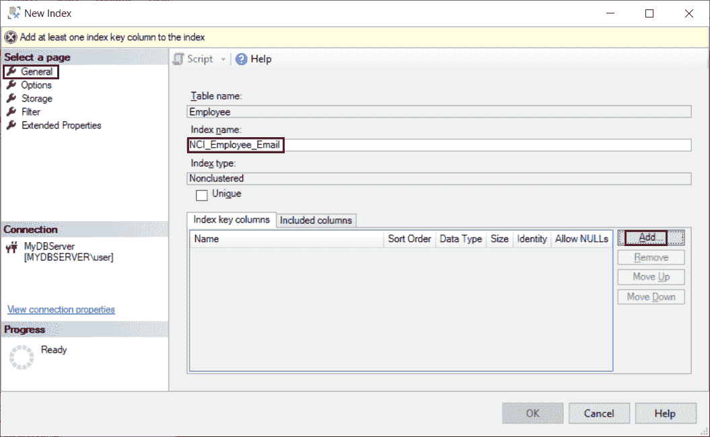

# SQL Server:非聚集索引

> 原文:[https://www . tutorial stearner . com/SQL server/非聚集索引](https://www.tutorialsteacher.com/sqlserver/nonclustered-index)

SQL Server 提供两种类型的索引，聚集索引和非聚集索引。在这里，您将学习非聚集索引。

非聚集索引不会对数据行进行物理排序。它从表数据中创建一个单独的键值结构，其中键包含列值(在列值上声明了非聚集索引)，每个值都包含一个指向包含实际值的数据行的指针。它类似于教科书，在书的后面有一个索引，页码指向实际信息。

<figure>[](../../Content/images/sqlserver/nonclusteredindex.png)</figure>

单个表中可以有 999 个非聚集索引，即 999 个。

创建唯一约束时，会在表上创建唯一的非聚集索引。

创建非聚集索引的语法类似于聚集索引。只需使用关键字“NONCLUSTERED”而不是“CLUSTERED”。以下语法用于在表上创建新的非聚集索引。

Syntax<button class="copy-btn pull-right" title="Copy example code">*Copy*</button> *```
CREATE NONCLUSTERED INDEX <index_name>
ON <table_name>(column) 
```

例如，下面在`Employee`表的`Email`列上创建一个非聚集索引。 请注意，`Employee`表有一个主键`EmployeeID`，这样会自动创建一个聚集索引。

Example: Create Non-clustered Index<button class="copy-btn pull-right" title="Copy example code">*Copy*</button> *```
CREATE NONCLUSTERED INDEX NCI_Employee_Email
ON dbo.Employee(Email); 
```

## 使用 SSMS 创建非聚集索引

您可以使用 SQL Server Management Studio 创建非聚集索引。

第一步:打开 SSMS。连接到数据库。在对象资源管理器中，展开要创建非聚集索引的表。

第二步:右键点击`Indexes`文件夹。指向`New Index`，选择`Non-Clustered index..`，如下图。

<figure>[](../../Content/images/sqlserver/index10.png)</figure>

第三步:在`New Index`对话框的“常规”页面上，在“索引名称”下输入新索引的名称。

第四步:点击索引键列下的添加按钮，如下所示。

<figure>[](../../Content/images/sqlserver/index11.png)</figure>

第五步:在`Select Columns from table`对话框中，选中要创建非聚集索引的列的复选框。

<figure>[](../../Content/images/sqlserver/index12.png)</figure>

第六步:点击确定，保存表格。

因此，您可以创建非聚集索引。**