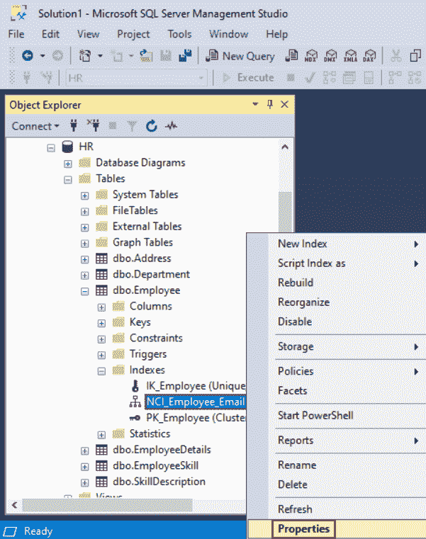
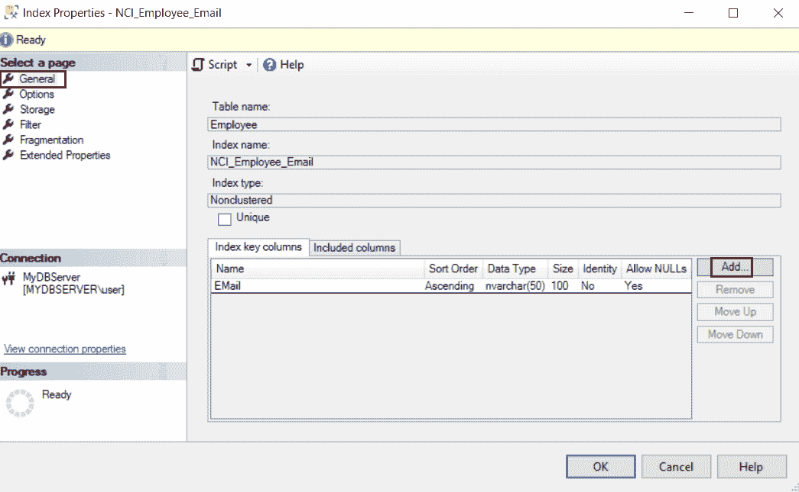
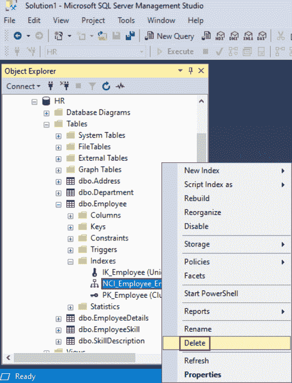
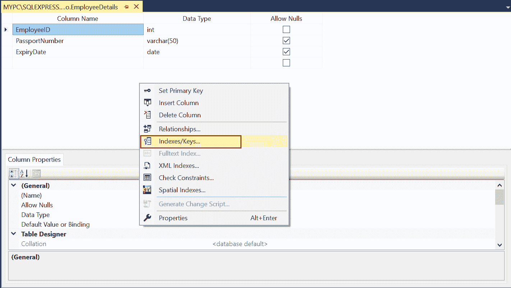
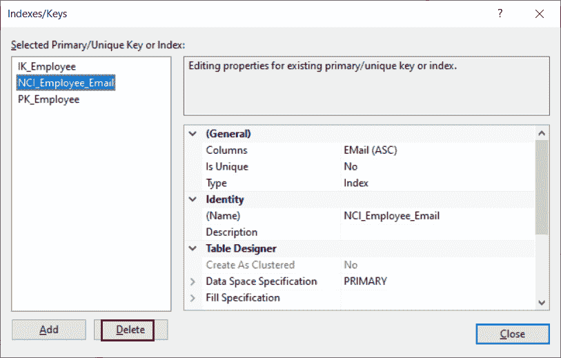

# SQL Server：修改或删除索引

> 原文：<https://www.tutorialsteacher.com/sqlserver/modify-delete-indexes>

在这里，您将学习如何在 SQL Server 中修改或删除索引。

## 修改索引

若要添加、移除或更改索引列的位置，必须删除并重新创建索引。但是，您可以使用 ALTER INDEX 语句在索引上设置几个选项。

以下查询修改了`Employee`表上的`NCI_Employee_Email`索引，将`IGNORE_DUP_KEY`设置为开。 指定在唯一索引中插入重复键值时的错误响应。默认值为关闭。

Example: 

```sql
ALTER INDEX NCI_Employee_Email ON dbo.Employee
SET (IGNORE_DUP_KEY = ON) 
```

## 使用 SSMS 修改 Indix

第一步:打开 SSMS。连接到数据库。

步骤 2:在对象资源管理器中，展开要修改的索引所属的表。

第三步:展开`Indexes`文件夹，右键点击要修改的索引，点击`Properties`。



SQL Server Indexes


步骤 4:在“索引属性”对话框中的“常规”选项卡下，进行所需的更改，如在索引键中添加/删除列，或更改索引选项的设置。



SQL Server Indexes


## 删除索引

使用 DROP INDEX 语句删除现有的聚集索引和非聚集索引。

下面的 SQL 命令删除了`EmployeeDetails`表上的聚集索引`CIX_EmpDetails_EmpId`。

Example: Delete Clustered Index 

```sql
DROP INDEX CIX_EmpDetails_EmpId
ON dbo.EmployeeDetails 
```

以下 SQL 语句删除了`Employee`表上的非聚集索引`NCI_Employee_Email`。

Example: Delete Non-Clustered Index 

```sql
DROP INDEX NCI_Employee_Email
ON dbo.Employee; 
```

注意:由于[主键](/sqlserver/create-primary-keys)或[唯一键](/sqlserver/unique-key-constraints)约束而创建的索引不能使用上述方法删除。 必须删除约束才能删除索引。

## 使用 SSMS 删除索引

第一步:打开 SSMS。连接到数据库。

步骤 2:在对象资源管理器中，展开包含要删除的索引的表。

第三步:展开`Indexes`文件夹，右键点击要删除的索引，在上下文菜单中选择删除。



SQL Server Indexes


步骤 4:在“删除对象”对话框中，验证是否选择了正确的索引，然后单击“确定”。

## 使用表设计器删除对象

步骤 1:在 SSMS 的对象资源管理器中，右键单击要删除索引的表，然后单击设计。

第二步:在表格设计器菜单上，点击`Indexes/Keys`选项。



Select Indexes/Keys


步骤 3:在“索引/键”对话框中，选择要删除的索引。



Delete Indexes


第四步:点击删除。

第五步:点击关闭。

步骤 6:在“文件”菜单上，选择“保存表名”

因此，您可以修改或删除索引。***